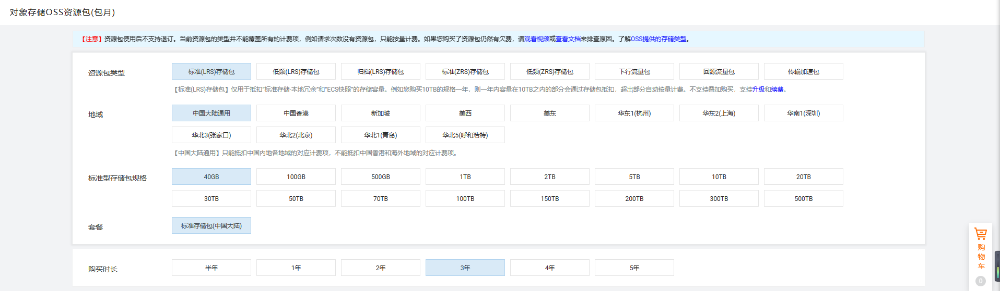
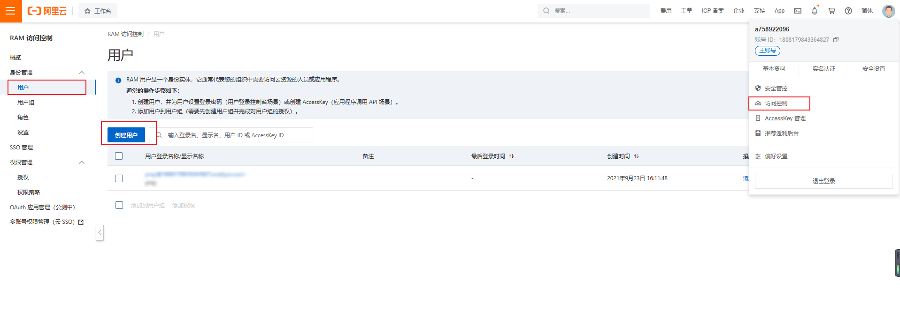
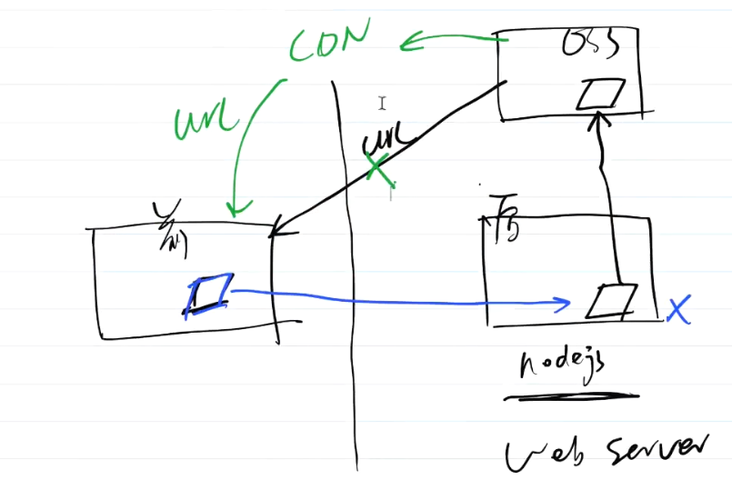

文件存储交给oss，我们只做server的业务逻辑。

主要产出

- 开发上传接口

主要内容

- 配置阿里云 OSS

- 实验 demo

- 代码演示

注意事项

- 阿里云 OSS 要配置 CDN

##  配置阿里云 OSS 

文件存储使用阿里云OSS这是业界的最常见选择，不用再做技术调研。

PS:我还用过腾讯云的COS，不过配置操作和使用细节，跟阿里云OSS肯定不一样。作为参考吧。

###  购买 

寻找折扣套餐

###  配置 OSS 

购买之后，登录进入控制台

- 创建Bucket 。Bucket 就像是你电脑里的硬盘。文档是以Bucket为单位来管理和存储的，可以创建多个Bucket 。外网访问权限:公共读

###  实验 demo 

文档：https://help.aliyun.com/document_detail/32068.html?spm=a2c4g.11186623.6.1382.42de2cc69fJBTZ

###  获取秘钥 

###  demo 

- put

- putStream

- 存储到某个文件夹

- isExist

[aliyun-oss-test.zip](https://lark-assets-prod-aliyun.oss-cn-hangzhou.aliyuncs.com/yuque/0/2021/zip/243804/1632448128839-5b018677-7421-46e2-be4d-22cb61fc62c4.zip?OSSAccessKeyId=LTAI4GGhPJmQ4HWCmhDAn4F5&Expires=1653554490&Signature=Y7WhWv1piCgbbVKuDip4ckXyl4M%3D&response-content-disposition=attachment%3Bfilename*%3DUTF-8%27%27aliyun-oss-test.zip)

##  代码演示 

###  实现思路 

- 上传文件到服务器

- 服务器上传到 OSS

○服务器删除临时文件

##  代码修改 

- routes/utils.js

- controller/utils/uploadlmg.js

- vendor/uploadOSS.js

- __test__ /vendor. test.js OSS部分

PS: config线_上环境和测试环境，两个bucket