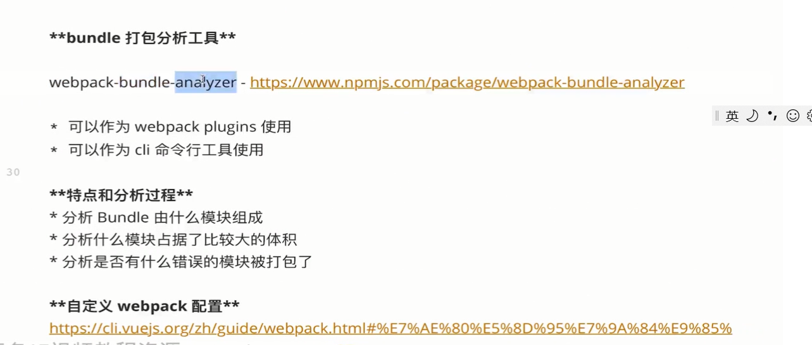

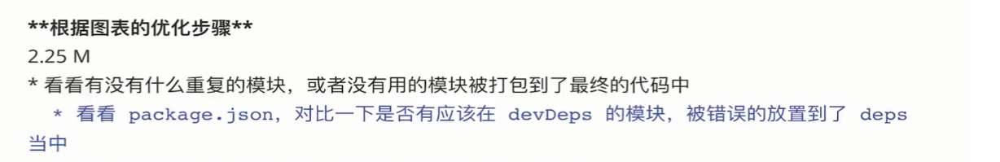

​			

​			比如项目有些页面使用了lodash，有些使用lodash-es。应该统一使用lodash-es

​           比如monent.js有很多不需要的语言包，可以通过IgnorePlugin插件去掉

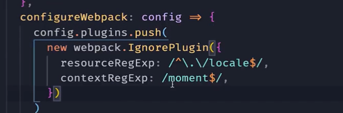

​                   有两种方法，第一种使用babel-plugin-import插件转义代码，第二种在main.js手动引入全部需要的组件。

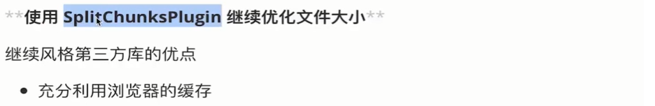

​           比如以下情况，在网站更新的时候，拆分成多个js，这样更新的时候可以利用缓存，减少更新体积

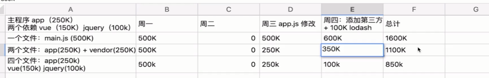

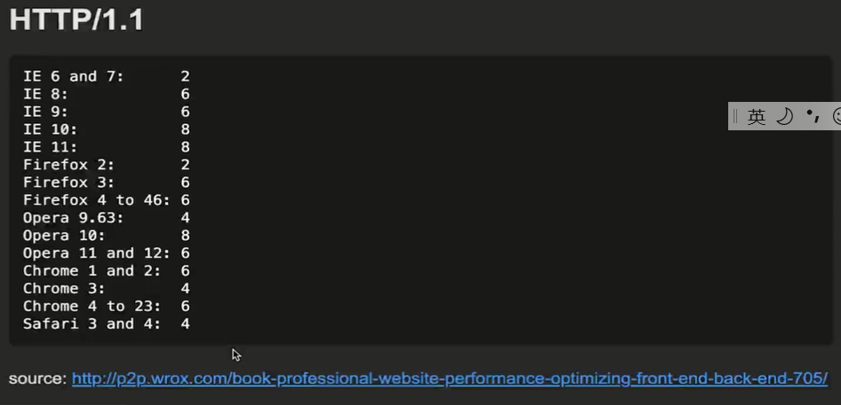

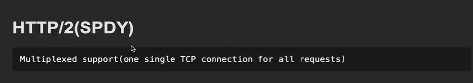

## 手动分割第三方库成多个文件

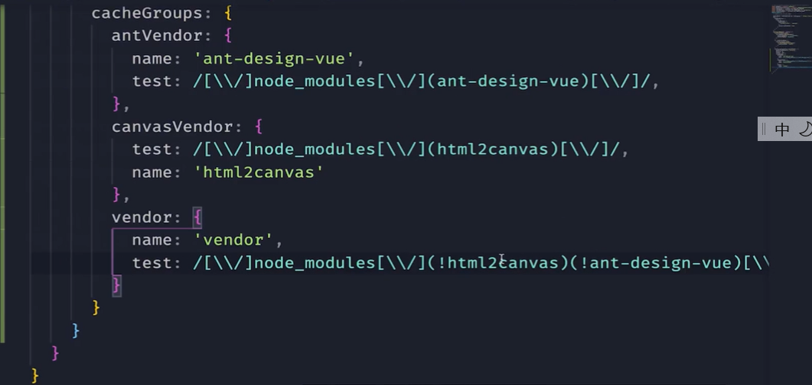

## 按照模块大小自动分割第三方库

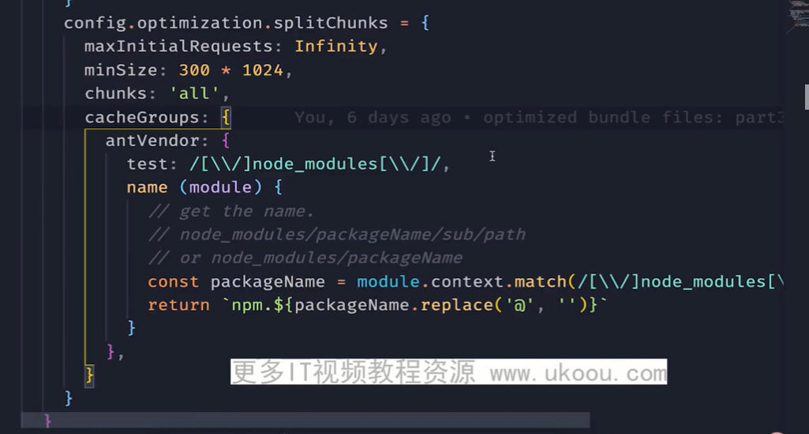

## 实现路由懒加载

在webpack使用import懒加载组件时，bundle的名称是数字，无法分析，可以通过魔法注释，修改名称

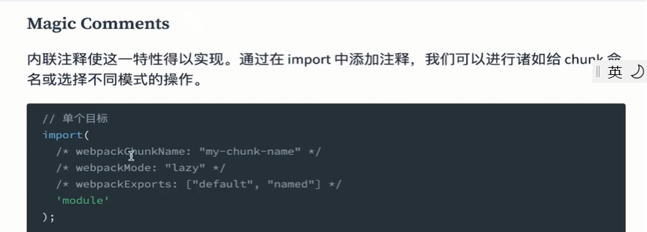

vue-router使用懒路由加载

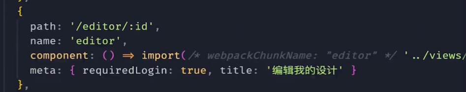

