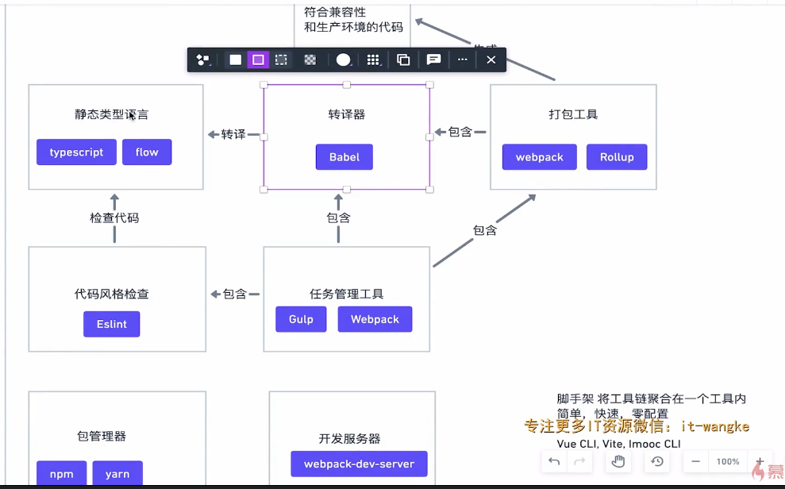

## 前端工具链

## 前端工具链

前端的飞速发展:带来了更复杂的项目

项目的常见需求 - 依赖管理，预编译，构建打包，压缩合并等

随着项目越来越复杂 - 诞生了 **前端工程化**

随着工程化的产生 - 产生了对应的 **前端工具栏链**

### 静态类型语言

动态语言的弊端

- typescript
- flow

### 代码风格检查Linter

多人协作的弊端，风格各异，维护和扩展的困难

- eslint

#### 包管理器

- npm
- yarn - 兼容 npm registry

### 开发服务器

- live reload
- HMR

### 打包工具Bundler

将源代码转换成符合生成环境的代码

- Webpack - Loader，Plugin，大而全的功能
- Rollup - 专注于打包 输出多种格式
- Parcel - 零配置

### 任务管理工具Task Runner

自动执行项目所需的重复任务

- CSS预处理
- 优化图片
- 合并压缩JavaScript
- 文件处理(拷贝，删除)
- 文件监听变化
- Gulp - 流式管道写法组合多个任务
- Webpack - 通过插件的方式
- npm scripts 或者 Shell脚本

### 脚手架 Scaffolding tools

**将工具链聚合在一个工具内** 简单，快速，零配置

- Vue - Vue CLI，Vite
- React - createa-react-app
- Angular - Angular CL

### 静态类型语言

* TypeScript
* flow

### 代码风格检查 linter

* eslint

### 包管理器

* npm
* yarn - 兼容 npm registry

### 转译器 Transpiler

非 js 或者 不同版本的 js 翻译成符合平台要求的等价代码

* Babel

### 开发服务器

功能

* live reload - 自动刷新
* HMR - 热替换

### 打包工具 Bundler

将源代码转换成符合生产环境的代码

* Webpack - Loader, plugin, 大而全的功能
  * 本身只能识别 js 和 json 文件
* Rollup - 专注打包，输出多种格式
* Parcel - 零配置

### 任务管理工具 Task Runner

自动执行项目所需的重复任务

* CSS 预处理器
* 优化图片
* 合并、压缩 JavaScript 代码
* 文件处理（拷贝、删除）
* 监听文件变化

工具

* Gulp - 流式管道写法组合多个任务
* Webpack - 通过插件的方式
* 简单需求 使用 npm script 或者 shell 脚本

### 脚手架 Scaffolding tools

将工具链聚合在一个工具内，简单，快速，零配置

* Vue-cli, vite
* create-react-app
* Angular-cli

