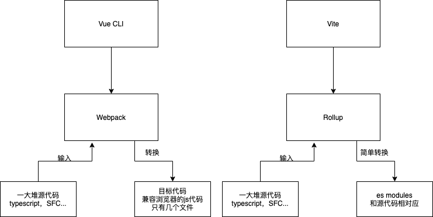

## Vue CLI 和 Vite 对比

### Vue CLI的功能

- 工程脚手架
- 开发服务器
- 插件系统
- 用户UI界面

Vue CLI构建是基于Webpack的。主要耗时都在Webpack的性能上。

### Vite

与Vue CLI类似，Vite也是一个提供基本项目脚手架和开发服务器的构建工具

然后，Vite并不是基于Webpack的，它有自己的开发服务器，利用浏览器中的原生ES模块。这种架构使得Vite比Webpack的开发服务器快了好几个数量级。Vite采用Rollup进行构建，速度也更快。

Vite目前还处于测试阶段，看来Vite项目的目的并不是像Vue CLI那样的一体化工具，而是专注于提供一个快速的开发服务器和基本的构建工具。

### 对比

### Vite的缺点

- 测试阶段
- 只支持新版支持ES modules的浏览器
- 第三方库也需要都支持ES modules
- CommandJS支持有限
- 开发构建属于两套系统，可能导致生产和开发的不一致