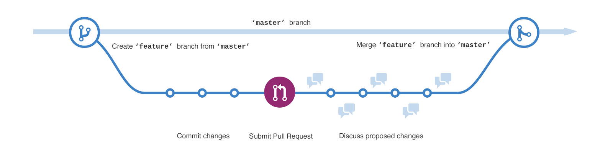

## Git Flow规范

所有的这些规范都是针对特定的 **多人** 设定的，意在让多人协作的过程更顺畅，更简单，减少不必要的冲突和时间的浪费。

### 预设两个分支

- master只能用来包括产品代码。你不能直接工作在这个master分支上
- develop是你进行任何新的开发的基础分支

### 这两个分支被称之为长期分支

- 功能开发feature

  - 整合回到develop
  - 等待更全面的测试
  - 等待和develop一起进行发布

- 管理release

  - 新功能已经添加，bug已经修复
  - 代码已经被测试
  - release分支使用版本号命名的

- bug修复hotfix

  - 针对master分支

优点:清晰可控

缺点:相对复杂，不合适持续发布

### Github Flow

[Github Flow 官方文档](https://guides.github.com/introduction/flow/index.html)

- 根据需求，从master拉出分支
- 激烈的开发阶段，提交commit
- 开发完毕，发起PR(pull request)
- 代码评审
- 部署，并且测试
- 没问题，merge到master

Github Flow的最大有点就是简单，对于"持续发布"的产品，可以说是最合适的流程。

### 两大规则

- branch命名
  - feature开头代表功能开发
  - hotfix开头代码bug修复

- commit信息，必须言之有物，杜绝update, fix bug这类废话

## 自定义Git 规范

规范采用固定双分支 `master and dev`
master 作为主分支
dev 作为开发分支

### 创建分支

开发新功能或者修复 bug 之前，要用**最新**的 dev 分支代码，拉新的分支，然后进行开发。git 分支命名规范如下：

- `master` 主干分支，当前正在运行的代码。**不可**直接往 `master` 提交代码。
- `dev` 开发分支，当前正在开发、但尚未发布的代码。**不可**直接往 `dev` 提交代码，但可以合并其他分支。
- `server` 开发分支，用于部署 server 端功能，**不可**直接往 `server` 提交代码，但可以合并其他分支。
- `feature-xxx` 开发新功能
- `fix-xxx` bug 修复
- `hotfix-xxx` 高优紧急 bug 修复，修复完需紧急上线
- `doc-xxx` 仅修改文档，不修改代码

### 提交 commit

请按照一下步骤提交代码，不要怕麻烦

- `git status` 确认修改的文件，都符合预期
- `git diff` 确认修改的内容，都符合预期
- `git add .`
- `git commit -m "xxx"` 提交代码，此时会自动进行 eslint 和 prettier 的检查和修复，请耐心等待

注意，在执行 `git commit` 时，请务必遵守 commit 规范，程序也会强制按照如下格式提交：

- `feat: xxx` 新功能 —— **【注意】请务必谨慎使用 `feat` ，除非真的是新功能，否则不要乱用。**
- `fix: xxx` bug 修复
- `style: xxx` 修改样式
- `docs: xxx` 修改文档
- `refactor: xxx` 重构某个功能
- `test: xxx` 增加或修改测试用例
- `chore: xxx` 修改辅助功能（如 webpack eslint 等）
- `perf: xxx` 性能优化
- `release: xxx` 发布新版本
- `revert: xxx` 回退

例如，你本次 commit 是修复了一个 bug ，那就执行 `git commit -m "fix: 说明本次修改了哪个 bug"`

Commit 信息，杜绝 update，fix bug 这类废话，每次提交必须言之有物，至少要言简意赅的把一次 commit 完成的任务说清楚。

### 创建 PR（Pull Request）

创建 Pull Request ，将当前分支合并到 **dev** 分支（不是 master 分支），重要！！

然后，一定要自己先看一看 PR 的 **Files Changed** ，看是否符合自己的预期，重要！！如果不符合预期，则把这个 PR 关掉，再重新修改代码，重新提交 PR 。

代码 review 过后即可 `merge` 重要！！
