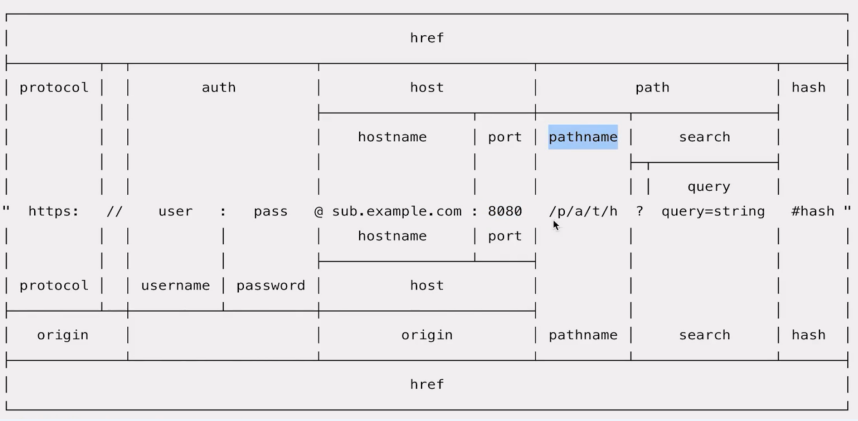

## SPA应用路由的基本原理

### SPA和普通网页应用的区别

- 普通网页

  - 跳转到新网页，每次冲洗加载所有资源
  - HTML内容是后端直接渲染的
- SPA应用

  - 不跳转，JS拦截器，修改URL
  - JS动态渲染DOM内容

### SPA路由的实现方式

History API

[pushState文档地址](https://developer.mozilla.org/zh-CN/docs/Web/API/History_API#%E6%B7%BB%E5%8A%A0%E5%92%8C%E4%BF%AE%E6%94%B9%E5%8E%86%E5%8F%B2%E8%AE%B0%E5%BD%95%E4%B8%AD%E7%9A%84%E6%9D%A1%E7%9B%AE)

[codesanbox演示地址](https://codesandbox.io/s/optimistic-cookies-wgxhc?file=/src/index.js)

URL Hash

### SPA优点

- 速度快
- 体验好
- 为前后端分离提供了实践场所

## URL链接的解析图

