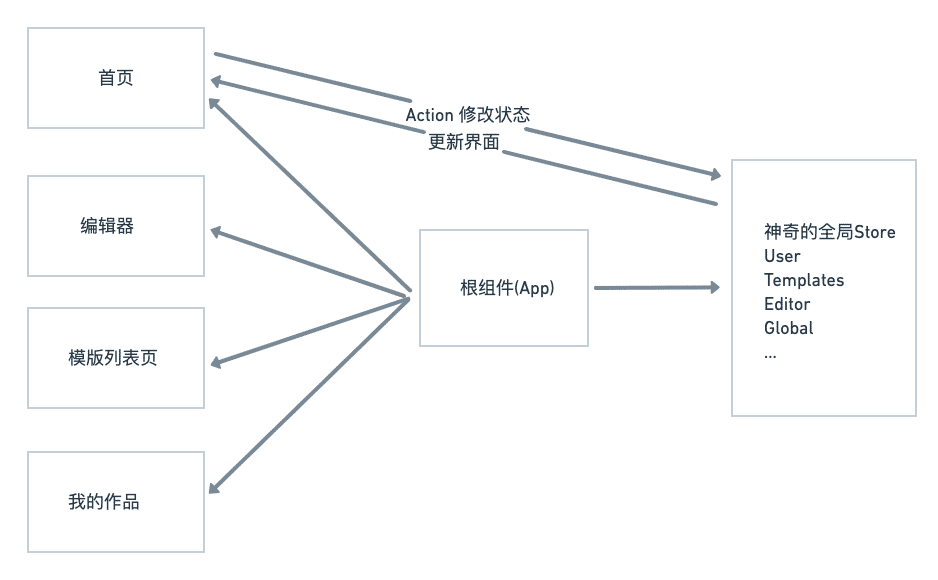
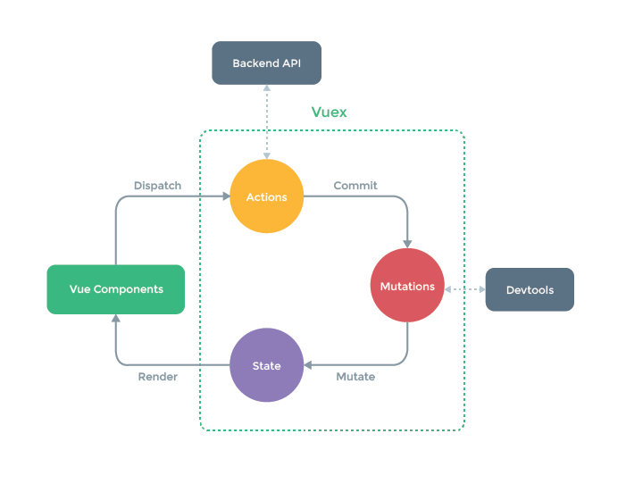

## 什么是状态管理工具

首先搞清楚，是否 **真的** 需要状态管理工具。

它随着SPA的出现，而浮出水面。客户端需要处理复杂的状态数据。

多个组件需要共享的一系列数据，称之为 **全局数据**

### 解决方案

#### 方案一:单向数据流，从父组件传递到子组件


#### 缺点

- 多层传递非常反锁
- 中间传递层有可能根本不需要这个数据
- 根组件压力太大，逻辑代码会非常繁杂

#### 方案二 使用全局对象


#### 缺点

- 数据非响应式
- 修改无法追踪
- 直接从组件获取数据是一种反模式

### 状态管理工具三杰

[Vuex](https://next.vuex.vuejs.org/)

[Redux](https://redux.js.org/)

[Mobx](https://mobx.js.org/README.html)



### 状态管理工具的特点

- store，神奇的全局数据结构:single source of truth
- 不能随意修改，调用特殊的方法来实现数据修改
- 变化可追溯，可预测(predictable)

## Vuex

Vue的数据流

```js
const Counter = {
  // state
  data () {
    return {
      count: 0
    }
  },
  // view
  template: `
    <div>{{ count }}</div>
  `,
  // actions
  methods: {
    increment () {
      this.count++
    }
  }
}

```


### 出现问题:多组件共享状态

- 根组件多层传递的困境
- 多组件同步数据的繁琐

### Vuex的解决方案



### Vuex的特点

- 核心就是一个store
- Vuex的状态是响应式的
- 不能直接改变store中state的值，需要显式的提交Mutation

```js
const store = createStore({
  state: {
    count: 0
  },
  mutations: {
    add (state) {
      state.count++
    }
  }
})
store.commit('add')
console.log(store.state.count)

```

