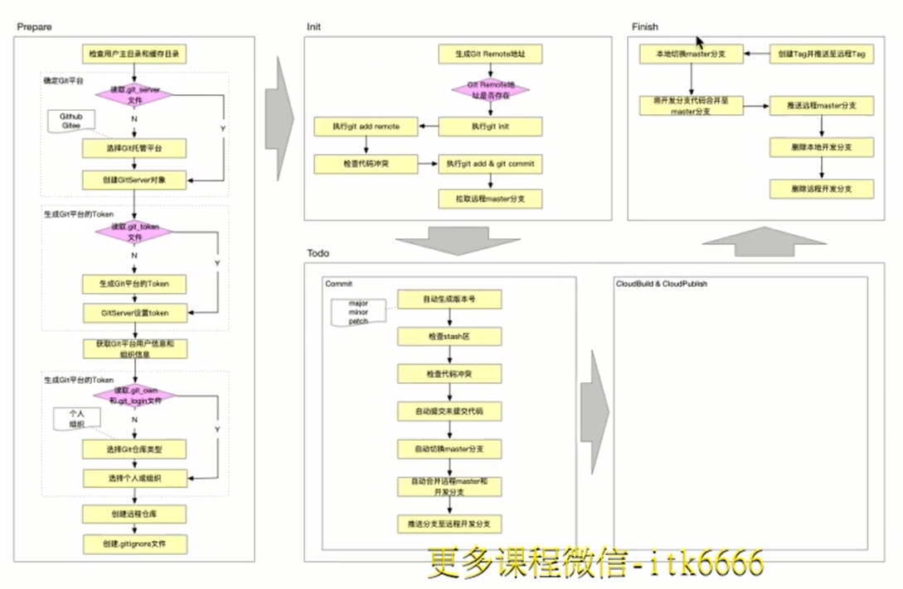
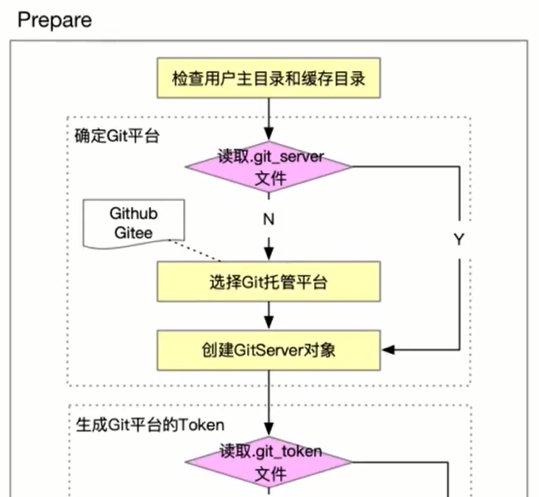
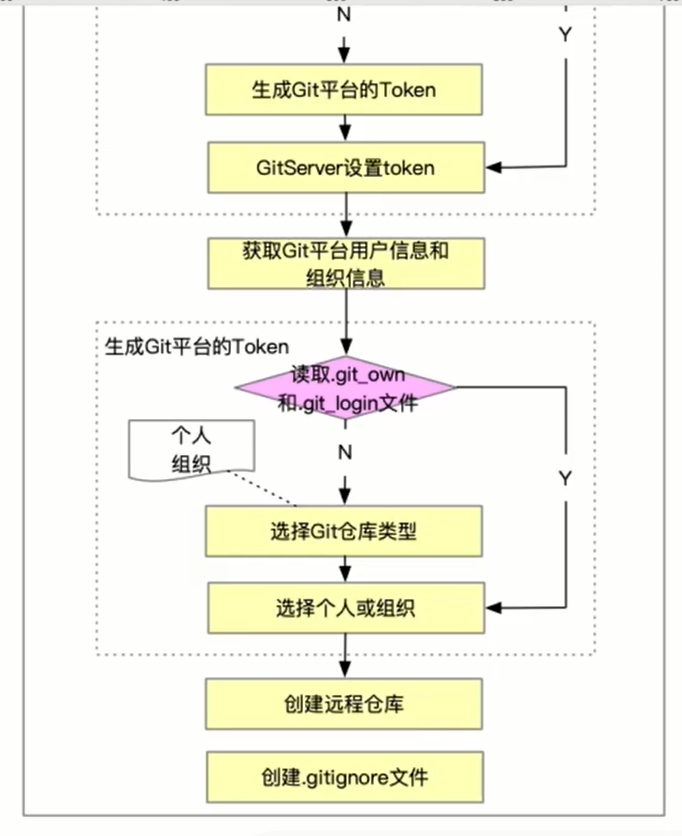
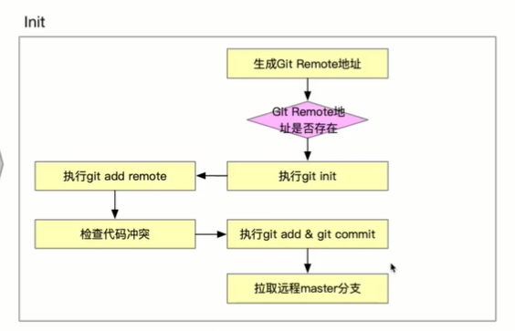
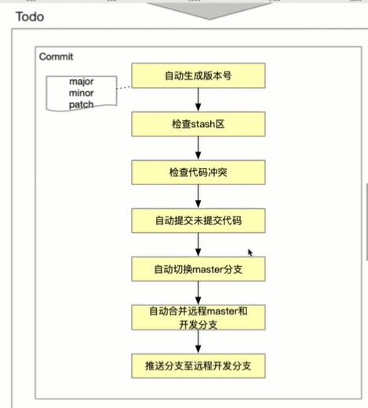
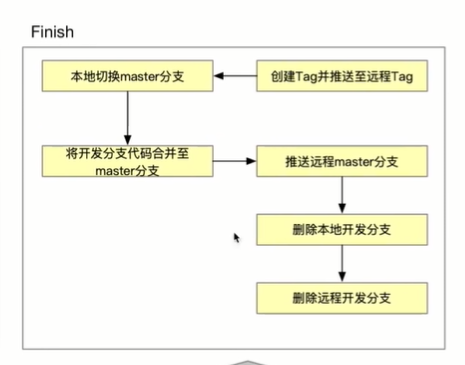

### 第三章：imooc-cli脚手架git flow 自动化架构设计

------

构架设计图：

#### 3-1 git flow 单人基础流程讲解

- git flow是2010年 Vincent Driessen设计出来的。

https://www.processon.com/embed/60f2487c1efad41bbea86894

https://www.processon.com/diagrams

#### 3-2 git flow 多人协作流程讲解（详细讲解大厂git flow流程)

https://www.processon.com/embed/60f250be0e3e7453927475af

https://www.processon.com/diagraming/627b4d855653bb45ea5b4767

#### 3-3 脚手架git flow prepare阶段架构设计

#### 3-4 脚手架git flow 执行阶段架构设计 -Init与todo与finish

init：

todo：

finish

