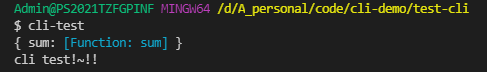

# 一、快速入门

1. 新建一个文件夹

```javascript
mkdir test-cli
```

1. 初始化项目

```javascript
npm init -y
```

1. 创建`bin/index.js`  // 添加如下代码

```javascript
#!/usr/bin/env node

console.log('cli test');
```

1. 在package.js中添加如下命令

```javascript
"bin": {
   "cli-test": "bin/index.js"
},
```

1. 发布npm

- 需要先登陆

```javascript
npm login
npm publish
```

1. 全局安装包

```javascript
npm install -g ynzy-test-cli
```

1. 执行命令

```javascript
cli-test
```


1. 通过which搜索cli-test

```javascript
$ which cli-test
/c/Program Files/nodejs/cli-test
```

# 二、调试本地脚手架

## 安装本地脚手架

修改源码,使之和发布的脚手架代码版本不同

```javascript
#!/usr/bin/env node

console.log('cli test!~!!');
```

目录下有脚手架（开发版）


在此目录下全局安装脚手架，会自动软连接到此目录下


执行脚本命令


移除全局包

```javascript
npm remove -g test-cli
```

## npm link

进入项目目录


使用npm link创建软连接


## 分包调试

在test-cli目录，平行创建一个新的目录 test-cli-lib


在test-cli-lib目录下创建lib目录，创建index文件编写源代码


在test-cli-lib目录下，终端执行`npm link`创建软连接


在test-cli目录下，终端执行`npm link ynzy-test-cli-lib`关联仓库

手动在package下加入此包


test-cli 引入此项目包

```javascript
#!/usr/bin/env node
const lib = require('ynzy-test-cli-lib')
console.log(lib);
console.log('cli test!~!!');
```

执行`cli-test`报错


这是因为在`ynzy-test-cli`项目下，package中的main找不到index.js文件，修改main对应的文件路径


执行命令



移除link

```javascript
npm unlink -g test-cli
```

# 三、脚手架本地link标准流程

脚手架本地link标准流程

链接本地脚手架：

```js
cd your-cli-dir
npm link
```

链接本地库文件：

```js
cd your-lib-dir
npm link
cd your-cli-dir
npm link your-lib
```

取消链接本地库文件：

```js
cd your-lib-dir
npm unlink 
cd your-cli-dir
npm unlink your-lib
```

理解 `npm link`:

- npm link your-lib：将当前项目中的node_modules下指定的库文件链接到node全局node_modules下的库文件
- npm link：将当前项目链接到node全局node_modules中作为一个库文件，并解析bin配置创建可执行文件

理解npm unlink:

- npm unlink：将当前项目从node全局node_modules中移除
- npm unlink your-lib：将当前项目中的库文件依赖移除

# 四、脚手架命令注册和参数解析

## 注册一个命令 test-cli init

通过node默认库`process`下的argv属性可以获取到我们执行的参数

```javascript
// test-cli/bin/index.js

#!/usr/bin/env node
console.log('test-cli');
const argv = require('process').argv;
```

执行

```javascript
test-cli init
```


在lib中定义init方法供执行

```javascript
// test-cli-lib/lib/index.js

module.exports = {
    sum(a, b) {
        return a + b;
    },
    init(){
        console.log('执行init流程');
    }
}
```

修改test-cli解析执行

```javascript
// test-cli/bin/index.js
#!/usr/bin/env node

const lib = require('ynzy-test-cli-lib')
const argv = require('process').argv;

// 注册一个命令 test-cli init
const command = argv[2];

if (command) {
    if (lib[command]) {
        lib[command]()
    } else {
        console.log('无效的命令');
    }
} else {
    console.log('请输入命令');
}
```


## 实现参数解析 --version 和 init --name

### 参数解析 init --name

```javascript
test-cli init --name vue-test
```

打印argv查看参数

```javascript
$ test-cli init --name vue-test
test-cli
[
  'C:\\Program Files\\nodejs\\node.exe',
  'C:\\Program Files\\nodejs\\node_modules\\ynzy-test-cli\\bin\\index.js',
  'init',
  '--name',
  'vue-test'
]
执行init流程
```

我们可以看到第4个参数是选项(option)，第5个参数是选项的参数(param)，解析这两个参数

```javascript
// 实现参数解析 --version 和 init --name
const options = argv.slice(3)
let [option,param] = options
option = option.replace('--','')
console.log(option,param);
```

传入到命令方法中执行

```javascript
#!/usr/bin/env node

const lib = require('ynzy-test-cli-lib')
// console.log(lib.sum(1,2));
console.log('test-cli');
const argv = require('process').argv;
// 注册一个命令 test-cli init
const command = argv[2];

// 实现参数解析 --version 和 init --name
const options = argv.slice(3)
let [option,param] = options
option = option.replace('--','')
console.log(option,param);

if (command) {
    if (lib[command]) {
        lib[command]({option,param})
    } else {
        console.log('无效的命令');
    }
} else {
    console.log('请输入命令');
}
```

修改lib下的init方法

```javascript
module.exports = {
    sum(a, b) {
        return a + b;
    },
    init({option,param}){
        console.log('执行init流程',option,param);
    }
}
```

执行命令传入选项，命令对应的方法就可以获取到选项和参数了

### 参数解析 --version

```javascript
// 实现参数解析 --version
if(command.startsWith('--') || command.startsWith('-')){
    // 全局的option
    const globalOption = command.replace(/--|-/g, '')
    console.log(globalOption);
    if(globalOption === 'version' || globalOption === 'V')
    console.log('1.0.0');
}
```

## 完整示例

// test-cli/bin/index.js

```javascript
#!/usr/bin/env node

const lib = require('ynzy-test-cli-lib')
// console.log(lib.sum(1,2));
console.log('test-cli');
const argv = require('process').argv;
// 注册一个命令 test-cli init
const command = argv[2];

// 实现参数解析 init --name
const options = argv.slice(3)
if(options.length>1){
    let [option,param] = options
    option = option.replace('--','')
    console.log(option,param);

    if (command) {
        if (lib[command]) {
            lib[command]({option,param})
        } else {
            console.log('无效的命令');
        }
    } else {
        console.log('请输入命令');
    }
}
// 实现参数解析 --version
if(command.startsWith('--') || command.startsWith('-')){
    // 全局的option
    const globalOption = command.replace(/--|-/g, '')
    console.log(globalOption);
    if(globalOption === 'version' || globalOption === 'V')
    console.log('1.0.0');
}
```

// test-cli-lib/lib/index.js

```javascript
module.exports = {
    sum(a, b) {
        return a + b;
    },
    init({option,param}){
        console.log('执行init流程',option,param);
    }
}
```

参数解析是比较复杂的，后面会使用第三方库

