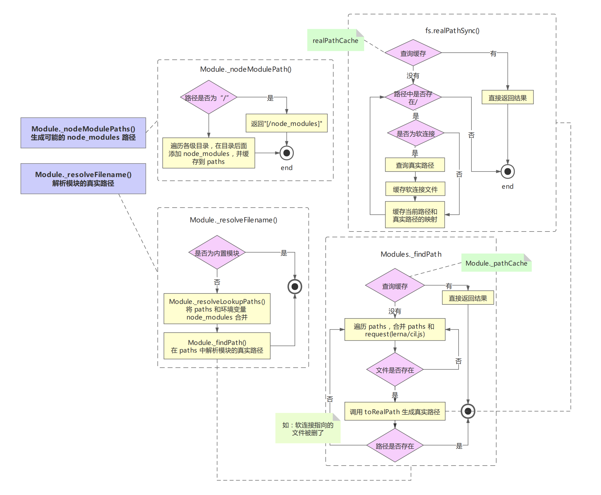
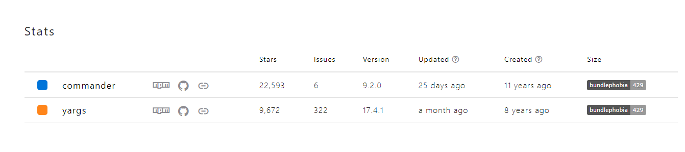

## 知识点

- `__filename`：当前模块(js)的文件名。 这是当前的模块文件的绝对路径（符号链接会被解析）
- 运行 `node` 代码时，默认会注入 `module` `require` `__filename`  `__dirname` `exports` 五个变量
- node.js中使用 `require(".")`相当于 `require("./")`，相当于 `require("./index.js")`，也就是查找本地目录的index.js

## 优秀的文件操作库

**`pkg-dir` **

找到 `npm` 或者 `node.js` 项目的根目录

**`findup` **

通过遍历父级目录查账文件或文件夹

**`locate-path` **

从多个文件中获取第一个存在的路径

**`path-exists`**

检查路径是否存在

**`resolve-cwd` **

从当前工作目录，像 `require.resolve` 一样解析模块路径

**`resolve-from` **

从给定路径，像 `require.resolve` 一样解析模块路径

## **涉及到的 `node.js` 方法**

- `process.cwd()`

  返回 Node.js 进程的当前工作目录(working directory)。

- path.dirname()

- `path.resolve()` 相对路径转换成真实路径

- path.parse()

- `fs.accessSync(filepath)`

  判断文件是否存在（能访问到），不存在会抛出异常

- path.relative()

- path.join()

### `Node.js` 模块路径解析流程

- `Node.js` 项目模块路径解析是通过 `require.resolve`  方法来实现的

- `require.resolve`  就是通过 `Module._resolveFileName` 方法实现的

  - `Module._resolveFileName`  方法核心流程有 3 点：

    - 判断是否为内置模块

      `NativeModule.canBeRequireByUsers()` 判断是否是可以被加载的内置模块

    - 通过 `Module._resolveLookupPaths`  方法生成 `node_modules` 可能存在的路径

      - 如果路径为 `/`（根目录），直接返回 `['/node_modules']`
      - 否则，将路径字符串从后往前遍历，查询到 `/`  时，拆分路径，在后面加上 `node_modules`，并传入一个 `paths` 数组，直至查询不到

    - 通过 `zModule._findPath`   查询模块的真实路径

  - `Module._findPath`  核心流程有 4 点：

    - 查询缓存（将 `request` 和 `paths` 通过 `\x00` 合并成 `cacheKey`）
    - 遍历 `paths`，将 `path` 与 `request` 组成文件路径 `basePath`
    - 如果 basePath 存在则调用 `<code>`fs.realPathSync `</code>` 获取文件真实路径
    - 将文件真实路径缓存到 `<code>`Module._pathCache `</code>`（key 就是前面生成的 cacheKey）

  - `fs.realPathSync` 核心流程有 3 点：

    - 查询缓存（缓存的 key 为 p，即 `Module._findPath` 中生成的文件路径）
    - 从左往右遍历路径字符串，查询到 `/`时，拆分路径，判断该路径是否为软链接，如果是软链接则查询真实链接，并生成新路_径 p，然后继续往后遍历，这里有 1 个细节需要特别注意：
    - 遍历过程中生成的子路径 base 会缓存在 knownHard 和 cache 中，避免重复查询
    - 遍历完成得到模块对应的真实路径，此时会将原始路径 original 作为 key，真实路径作为 value，保存到缓存中

- `require.resolve.paths`  等价于 `Module._resolveLookupPaths` ，该方法用于获取所有 `node_modules` 可能存在的路径

图中知识点列表：

- 通过 `require` 加载模块以后，会向 `Module._pathCache` 对象中添加该模块的路径，key：模块名称加 `\x00` 路径，value：实际路径
- `stat(path)` ：查看文件状态。-2 不存在， 0 文件，1 文件夹
- `realPathCache` 是一个 `Map` 对象
- `linux` `stat` 命令打印文件相关信息 `dev_t` 设备编号、`ino_t` 文件的唯一标识
- `fs.realPathSync` 在拿到软连接指向的真实路径后，还会在遍历，查看指向的路径是否还是一个软连接

### 正则表达式

`Modules._findPath()` 中的正则 `/(?:^|\/)\.?\$/` 匹配 ..、/..。包含知识点

- `?` 匹配0到1个
- `(?:)` 表示非匹配分组，作用是不保存括号中匹配的内容
- `/^/`  匹配的是个空字符串''，任意字符都能匹配成功，任意字符中都有空字符串
- `/[^]/` 表示非

## 为什么选择commander， 而不是yrags

- 两者差不多，都是Nodejs命令行工具，lerna选择的是yargs，

- 但是commander比yargs的热度高

https://www.npmtrends.com/commander-vs-yargs

