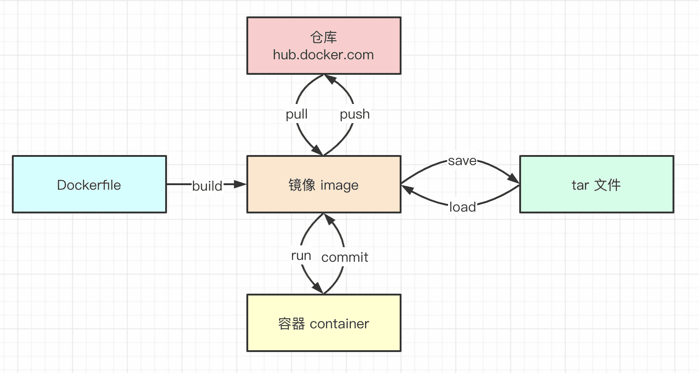
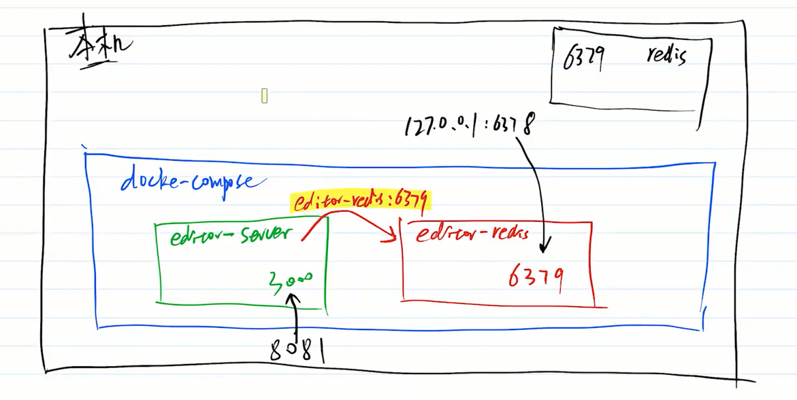

## Docker


### 介绍

Docker就是一种虚拟机技术，比传统虚拟机(如vmware,virtualbox)要更加简单，轻量

- 启动快
- 资源占用少
- 体积小

### 安装

[文档](https://docs.docker.com/get-docker/)

安装完记得镜像加速

安装完，运行`docker version`可查看版本

### 基本概念

使用vmware、virtualbox时，步骤如下

- 下载一个`centos.iso`文件
- 使用vmwaire安装一个系统A
- 使用vmwaire安装一个系统B
- ......

此处的`centos.iso`文件就是一个image镜像，安装出来的系统就是一个一个的container容器。

docker的所有image都可以在https://hub.docker.com/搜索并下载，还可以自定义image上传到这个仓库



### 常用命令

如果没有安装，可以在[play with docker](https://labs.play-with-docker.com/)体验一下。

### image镜像

- 下载镜像`docker pull <image-name>:<tag>`
- 查看所有镜像`docker images`
- 删除镜像`docker rmi <image-id>`
- 上传镜像`docker push <username>/<respository>:<tag>`,要先注册https://hub.docker.com/

如果`docker images`出现REPOSITORY是`<none>`的情况，可以运行`docker image prune`删除。

### container

- 启动容器`docker run -p xxxx:xxxx -v=hostPath:containerPath -d --name <container-name><image-name>`
  - -p端口映射
  - -v数据卷，文件映射
  - -d后台运行
  - --name定义容器名称

- 查看所有容器`docker ps`，加`-a`显示隐藏的容器
- 停止容器`docker stop <container-id>`
- 删除容器`docker rm <container-id>`，加`-f`是强制删除
- 查看容器信息，如IP地址`docker inspect <container-id>`
- 查看容器日志`docker logs <container-id>`
- 进入容器控制台`docker exec -it <container-id> /bin/sh`

### 功能演示

以nginx为例

```js
docker run -p 81:80 -d --name nginx1 nginx
docker ps

# 访问 localhost:81 ，并查看 log

docker exec -it <container-id> /bin/sh
cd /usr/share/nginx/html
echo hello docker world index.html
exit

# 重新访问 localhost:81 ，强制刷新

docker stop <container-id>
docker rm <container-id>

```

单独演示一下`-v`数据卷。

```js
# 1. 新建 /Users/wfp/html/index.html ，内容自定义即可

# 2. 运行
docker run -p 81:80 -v=/Users/wfp/html:/usr/share/nginx/html  -d --name nginx1 nginx

# 3. 访问 重新访问 localhost:81 ，看是否你创建的页面？

```

## Dockerfile

一个简单的配置文件，描述如何构建一个新的image镜像

注意:必须是`Dockerfile`这个文件名，必须在项目的根目录

```js
# node环境
FROM node:14
WORKDIR /app  #容器的工作目录
COPY . /app  #拷贝当前目录下的所有文件到容器的工作目录，如果想忽略一些文件，可以通过.dockerignore文件设置

# 构建镜像时，一般用于做一些系统配置，安装必备的软件。可有多个 RUN
RUN xxx
RUN xxx
RUN xxx

# 启动容器时，只能有一个 CMD
CMD xxx

# 环境变量
ENV K1=v1
ENV K2=v2

```

`RUN`与`CMD`的区别：

	- `RUN`一般用在构建镜像的时候，`CMD`是使用在启动容器的时候
	- 构建镜像一般只有一次，而启动容器可以有多次。所以要区分出来，构建镜像的配置和安装软件放在`RUN`中，启动容器的时候，就会快很多。

### 构建

文件根目录执行

```js
docker build -t <name> . # 最后的 `.` 指 Dockerfile 在当前目录下。
docker images
```

### 代码演示

- .dockerignore文件忽略

```js
.git
node_modules
logs
.docker-volumes
```

- Dockerfile文件

```js
# Dockerfile
FROM node:14
WORKDIR /app
COPY . /app

# 设置时区
RUN ln -sf /usr/share/zoneinfo/Asia/Shanghai /etc/localtime && echo 'Asia/Shanghai' >/etc/timezone

# 安装
RUN npm set registry https://registry.npm.taobao.org
RUN npm install
RUN npm install pm2 -g

# 启动
CMD echo $SERVER_NAME && echo $AUTHOR_NAME &&npm run server && npx pm2 log #一定要是阻塞控制台的程序，使用npx pm2 log阻塞后台程序，不然程序就会退出

# 环境变量
ENV SERVER_NAME="tanchidemao"
ENV AUTHOR_NAME="roy"
```

- 本地安装pm2 `npm i pm2 --save-dev`，或者Dockerfile中全局安装pm2

测试过程:

```js
docker build -t editor-server .  # 构建 image
docker images

docker run -p 8081:3000 -d --name server1 editor-server  # 创建容器，注意端口映射
docker ps
docker logs <container-id>  # 需等待构建完成

# 访问 localhost:8081 ，查看 docker logs

docker stop <container-id>
docker rm <container-id>
docker rmi <image-id>

```

## Docker-compose

软件设计和开发，有单一职责原则。Docker也一样，每个容器都只负责一个服务。

如果开发环境需要多个服务(nodejs mysql mongodb redis),就需要启动多个Docker容器。

要连同这多个Docker容器，就需要Docker-compose。

### 配置文件

新建`docker-compose.yml`文件。先以redis为例，演示多个容器如何关联。

```js
version: '3'
services:
    editor-server:  # service name
        build:
            context: .  # 当前目录
            dockerfile: Dockerfile  # 基于 Dockerfile 构建
        image: editor-server # 依赖于当前 Dockerfile 创建出来的镜像
        container_name: editor-server
        ports:
            - 8081:3000 # 宿主机通过 8081 访问
    editor-redis:  # service name，重要！
        image: redis  # 引用官网 redis 镜像
        container_name: editor-redis
        ports:
            # 宿主机，可以用 127.0.0.1:6378 即可连接容器中的数据库 `redis-cli -h 127.0.0.1 -p 6378`
            # 但是，其他 docker 容器不能，因为此时 127.0.0.1 是 docker 容器本身，而不是宿主机
            - 6378:6379
        environment:
            - TZ=Asia/Shanghai # 设置时区

```

### 容器之间端口的问题



- 如果启动多个容器，而且它们之间需要相互连接。则因为每个容器都是独立的虚拟机，无法在代码中使用`127.0.0.1:<端口>`连接到其他容器。

- 解决：可以在代码中，将`127.0.0.1:<端口>`改成`<容器的名称>:<容器的端口>`，如以上，连接redis服务，可以改成`editor-redis:6379`
- **注意，是改成容器的端口6379，而不是映射到宿主机的端口6378。因为可以直接连接到容器的端口，不需要在通过宿主机了。**

### 命令

- 构建容器`docker-compose build <service-name>`
- 启动所有服务器`docker-compose up -d`，后台启动
- 停止所有服务`docker-compose down`
- 查看服务`docker-compose ps` ，列出docker-compose.yml文件的容器，而不是全部的。而docker ps是全部的容器

```js
docker-compose build editor-server # 配置文件的 service name
docker-compose up -d
docker-compose ps

# 访问 localhost:8081 ，查看 docker logs

docker-compose down

```

## 链接Mysql和Mongodb

成功连接redis之后，要继续连接mysql和mongodb

### 区别

- redis无数据看，而mysql和mongodb需要创建数据库
- redis是缓存，无序数据持久化，而mysql和mongodb需要

### 代码修改

- 修改`docker-compose.yml`,代码如下

```js
version: '3'
services:
    editor-server:  # service name
        build:
            context: .  # 当前目录
            dockerfile: Dockerfile  # 基于 Dockerfile 构建
        image: editor-server # 依赖于当前 Dockerfile 创建出来的镜像
        container_name: editor-server
        ports:
            - 8081:3000 # 宿主机通过 8081 访问
    editor-redis:  # service name，重要！
        image: redis  # 引用官网 redis 镜像
        container_name: editor-redis
        ports:
            # 宿主机，可以用 127.0.0.1:6378 即可连接容器中的数据库 `redis-cli -h 127.0.0.1 -p 6378`
            # 但是，其他 docker 容器不能，因为此时 127.0.0.1 是 docker 容器本身，而不是宿主机
            - 6378:6379
        environment:
            - TZ=Asia/Shanghai # 设置时区
    
    editor-mysql:
        image: mysql # 引用官网 mysql 镜像
        container_name: editor-mysql
        restart: always # 出错则重启
        privileged: true # 高权限，执行下面的 mysql/init
        command: --default-authentication-plugin=mysql_native_password # 远程访问
        ports:
            - 3305:3306 # 宿主机可以用 127.0.0.1:3305 即可连接容器中的数据库，和 redis 一样
        volumes:
            - .docker-volumes/mysql/log:/var/log/mysql  # 记录日志
            - .docker-volumes/mysql/data:/var/lib/mysql # 数据持久化
            - ./mysql/init:/docker-entrypoint-initdb.d/ # 初始化 sql
        environment:
            - MYSQL_DATABASE=imooc_lego_course # 初始化容器时创建数据库
            - MYSQL_ROOT_PASSWORD=Mysql_2019
            - TZ=Asia/Shanghai # 设置时区
    editor-mongo:
        image: mongo # 引用官网 mongo 镜像
        container_name: editor-mongo
        restart: always
        volumes:
            - '.docker-volumes/mongo/data:/data/db' # 数据持久化
        environment:
            - MONGO_INITDB_DATABASE=imooc_lego_course
            - TZ=Asia/Shanghai # 设置时区
        ports:
            - '27016:27017' # 宿主机可以用 127.0.0.1:27016 即可连接容器中的数据库

```

- 增加`mysql/init/init.sql`，初始化mysql

```js
-- docker-compose 启动 mysql 时的初始化代码

select "init start...";

-- 设置 root 用户可外网访问
use mysql;
SET SQL_SAFE_UPDATES=0; -- 解除安全模式，测试环境，没关系
update user set host='%' where user='root';
flush privileges;
ALTER USER 'root'@'localhost' IDENTIFIED WITH mysql_native_password BY 'Mysql_2019'; -- 密码参考 docker-compose.yml
flush privileges;

select "init end...";

```

- 修改`config/envs/prd-dev.js`，增加mysql和mongodb的配置

```js
const devConf = require('./dev');

//修改redis连接配置
Object.assign(devConf.redisConf, {
  //和docker-compose中配置的service名字一致
  //【注意】端口依然是6379，而不是6378，后者是宿主机的端口
  host: 'editor-redis'
});

//修改mongodb连接配置
Object.assign(devConf.mongodbConf,{
  host: 'editor-mongo',//和docler-compose中配置的service名字一致
});

//修改mysql连接配置
Object.assign(devConf.mysqlConf,{
  host: 'editor-mysql',//和docler-compose中配置的service名字一致
});

```

- 修改`.gitignore`文件，增加一行`.docker-volumes`

### 演示

```js
docker-compose build editor-server # 配置文件的 service name
docker-compose up -d
docker-compose ps

# 访问 localhost:8081 ，查看 docker logs

docker-compose down

```

## 