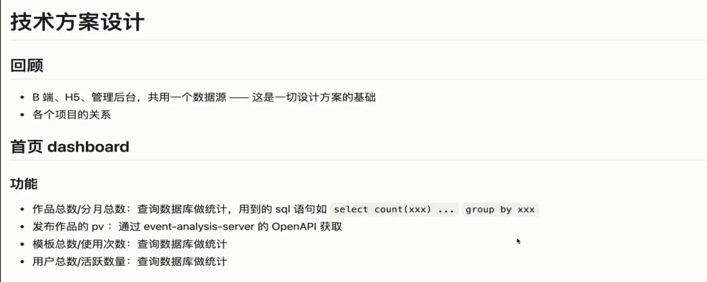

## **管理后台需求V1.0**

### 登录

管理员登录（人数不多），用户名密码即可。

### 首页 dashboard

汇总关键的统计结果，掌握全局信息。

### 用户管理

#### 用户列表

显示所有用户，表格形式。分页展示。

每个用户需要展示：

- id
- 用户名（手机号）
- 昵称
- 注册时间
- 最后登录时间
- 冻结状态

#### 搜索

可根据用户名和 id 进行搜索。

#### 操作

选中一个或多个用户，可进行如下操作。

- 禁用，禁止用户再次登录。
- 解禁，解除禁用。

### 作品管理

#### 作品列表

显示作品列表，表格形式，分页显示。

每一行包括：

- id
- 作品名称
- 缩略图
- 作者用户名
- 状态：发布/未发布/强制下线
- 二维码/链接
- 发布时间

#### 搜索

可通过 id、名称模糊搜索。

#### 操作

选中一个或多个作品，可进行如下操作：

- 强制下线：如作品包含敏感词，需紧急下线。
- 恢复：取消强制下线状态。

### 模板管理

#### 模板列表

展示所有模板，表格形式，分页展示。

每行显示：

- 模板标题
- 模板缩略图
- 模板作者
- 二维码/链接
- 模板使用量

#### 搜索

可通过id、标题、作者模糊搜索。

#### 操作

选中一个或多个模板，可进行如下操作：

- 设置排序 index（0-9，越大排序权重越高）
- 增加/删除 HOT 标签
- 增删/删除 NEW 标签

