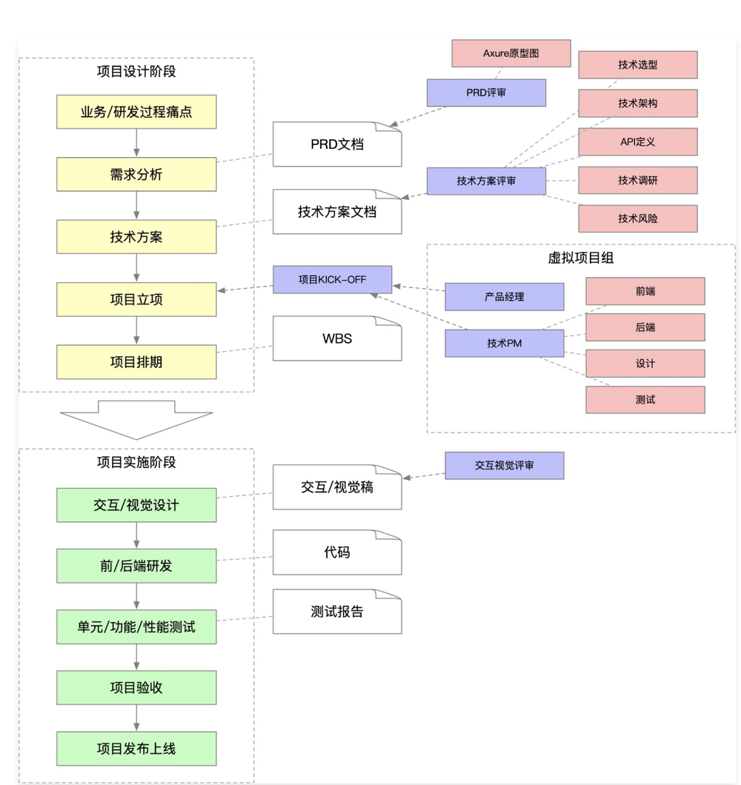

### 大厂是如何做项目的

**设计阶段**

- 搞清楚业务或研发过程中的**痛点** -- 为什么有当前业务
- 由痛点形成需求
  - PD(产品) -> PRD文档（产品需求文档）
    - 原型图
    - 预期目标
  - PRD 评审
    - 原型图评审
- 技术方案设计阶段，产生技术方案文档。确定需求在技术上的实现，及确定技术方案实现成本
  - 技术选型
  - 技术架构 -> 架构设计
  - API定义
  - 技术调研
  - 评估技术风险
- 成本可接受，项目立项
  - kick-off（启动）
    - 确定项目成员：PD、PM(项目经理)、前端、后端、测试人员、设计等
- 项目排期（计划）
  - 时间点
  - WBS 文档（工作分解结构）

**实施阶段**

- 软件类项目，交互/视觉设计，输出设计稿
- 开发，输出代码

  - 前后端开发
  - 联调
- 测试，输出测试报告

  - 单元测试（开发人员）
  - 功能测试（测试人员）
  - 性能测试（测试人员）
- 交给产品或业务人员验收

  - 微调
- 上线



### 涉及技术点

**核心库**

- `import-local` 优先执行本地脚手架
- `commander` 实现命令注册

**用到的工具库**

- `npmlog` 打印日志
- `fs-extra` 文件操作。基于 `fs` 封装的
- `semver` 版本比对。检查当前版本是否为最新版本
- `colors` 控制终端文本颜色
- `user-home` 获取用户主目录
- `dotenv` 获取环境变量
- `root-check` root 账户检查和自动降级

#### `require()` 支持加载的资源类型

- `.js`

  必须使用 `module.exports`/`exports` 输出模块

- `.json`

  使用 `JSON.parse()` 方法对 `json` 文件进行解析，生成一个对象

- `.node`

  `.node` 文件是 `C++` 插件(`C++ AddOns`)，使用 `process.dlopen()` 打开

- `.any`

  当 `.js` 文件处理

  **使用 `require()` 加载一个内容为 `javascript` 代码的 `.txt` 文件，是可以执行成功的**

#### `require()` 支持的路径

- 绝对路径
- 相对路径
- `node` 内置对象
- `node_modules` 中的包

### 最低Node版本检查功能开发

检查Node版本号的原因以及解决办法：

> - 这是因为一些低版本的Node API在低版本是不支持的，因此要设置一个最低的Node版本号。
> - 拿到本地版本号的方法为：process.version
> - 版本号比对：第三方库 semver。
> - 抛出异常颜色输出：第三方库 colors:引用'colors/safe',使用：colors.red('')

### root账号启动检查和自动降级功能开发

> - 如果是使用root权限，一些文件就没有可读或者修改权限，因此需要对用户进行查询与降级处理
> - 通过process.geteuid() 获取登录用户的ID ,501为普通用户，0 为超级管理员(root)。**geteuid在window环境下不支持**
> - 检查第三方库：root-check。使用方法引入一下调用即可降级。（**最新版的root-check为ES模块，得使用import()方法导入**)）
> - root-check实现原理：调用downgrade-root 库 -> 判断是否为root

#### 用户主目录检查功能开发

> - user-home:可以实现跨操作系统获取用户主目录的功能。**(已废弃，使用 require('os')`.homedir()`获取)**
> - path-exists:判断文件目录是否存在**（最新版本为ESM模块）**

> - user-home实现：调用os-homedir库，再调用os库，若os库有homedir直接返回，若没有直接拿process.env.home(),还是没有就拼接 ‘/Users/'+process.env.USER
> - path-exists实现：直接调用fs的accessSync(path)方法。

#### 环境变量检查功能开发

> - 检查环境变量，我们使用第三方库：dotenv。
>
> - 在用户主目录下创建 `.env` 文件存储和读取环境变量
>
> - 用法：require('dotenv').config({ path: '' }) ：若不传参数，我们在当前目录下拿到.env文件中的变量，之后就可以直接在process.env中使用了。支持传入path变量。
>
> - 环境变量其实就是一个全局变量,如果我们有很多的环境变量需要使用，可以直接在.env文件宏进行配置
>
> - `.env` 文件中的配置：`name=value` 。**没有 `.env` 要手动创建**
>
> - ```
>   DB_HOST=localhost
>   DB_USER=root
>   DB_PASS=s1mpl3
>   ```

#### npm包是否为最新版本

> 准备阶段的最后一个功能：检查我们的这个脚手架是否为最新版本

步骤：

> 1. 获取当前版本号与模块名: pkg.version | pkg.name
> 2. 调用npm API获取所有模版号：
>    npm提供了这样一个API: https://registry.npmjs.org/xxx ,可以获得xxx包的所有版本号,要从这里拿到所有版本号，我们需要使用第三方库 axios,同时我们也需要添加一个用来url拼接的库：url-join，可以帮助我们进行多参数的拼接，以及我们进行版本对比的第三方库 semver。
> 3. 获取所有版本号，比对哪些版本号是大于当前版本号
> 4. 获取最新的版本号，提示用户更新到此版本。

