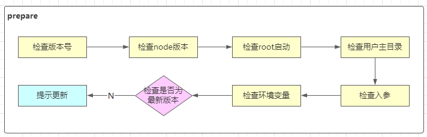

## 第一章：本周导学

### 1-1 本周整体内容介绍和学习方法

**标题**

> - 脚手架需求分析和架构设计，核心流程开发

**收获**

> - 架构设计和技术方案设计全过程
> - 脚手架核心流程和commander框架
> - 如何让Node项目支持ES Module

**主要内容**

> - 脚手架需求分析和架构设计
> - 脚手架模块拆分策略和core模块技术方案
> - 脚手架执行准备过程实现
> - 脚手架命令注册实现(基于commander)

**加餐**

> - Node项目如何支持ES Module

**注意事项**

- 本周前半部分偏架构设计，是架构师日常工作
- **架构师应该把整体和局部想清楚在开始做**
- 将代码实现细节抽象，通过系统论思想构建复杂系统：

  建立子系统，关注子系统的输入和输出是什么。然后由子系统构建较复杂的系统，再由较复杂的系统构建更复杂的系统。

## 第二章：脚手架整体架构设计

---

### 2-1 大厂是如何做项目的

**设计阶段**

- 搞清楚业务或研发过程中的**痛点** -- 为什么有当前业务
- 由痛点形成需求
  - PD(产品) -> PRD文档（产品需求文档）
    - 原型图
    - 预期目标
  - PRD 评审
    - 原型图评审
- 技术方案设计阶段，产生技术方案文档。确定需求在技术上的实现，及确定技术方案实现成本
  - 技术选型
  - 技术架构 -> 架构设计
  - API定义
  - 技术调研
  - 评估技术风险
- 成本可接受，项目立项
  - kick-off（启动）
    - 确定项目成员：PD、PM(项目经理)、前端、后端、测试人员、设计等
- 项目排期（计划）
  - 时间点
  - WBS 文档（工作分解结构）

**实施阶段**

- 软件类项目，交互/视觉设计，输出设计稿
- 开发，输出代码

  - 前后端开发
  - 联调
- 测试，输出测试报告

  - 单元测试（开发人员）
  - 功能测试（测试人员）
  - 性能测试（测试人员）
- 交给产品或业务人员验收

  - 微调
- 上线


### 2-2 前端研发过程中的痛点和需求分析


### 2-3 加餐：大厂的git操作规范是怎样的？

> - clone下来的项目 master分支是不做开发的，我们会新建一个dev分支，上线以后会新建一个release分支。

**分支管理**

- master

  不会再次基础上开发，仅用作代码同步：上线时，将 dev/0.0.1 push到master上，进行 merge 然后打上 release/0.0.1 tag
- dev 开发

  - ~~dev/0.0.1~~
  - dev/0.0.2
- release 发布

  - release/0.0.1 删除 dev/0.0.1


### 2-4 高端操作：脚手架架构设计+绘制架构图

- 脚手架的核心架构
  - 脚手架初始化
  - 完成整个执行流程
    - 命令的执行
    - 异常的监听
    - ......
- 为什么需要后台 API
  - 实现通用能力
  - 接入外部项目
- webSocket 服务
  - 云构建
  - 云发布
- 静态资源
  - 组件构建结果
- 数据体系
  - MySQL 组件相关信息
  - MongoDB 项目模板


## 第三章 脚手架模块拆分策略和core模块技术方案

### 3-1 脚手架模块拆分策略

参考 `lerna` 项目的拆包，根据模块的功能，将脚手架模块分为：

- 核心模块 -- core
- 命令 commands
  - 初始化
  - 发布
  - 清除缓存
- 模型层 models
  - Command 命令
  - Project 项目
  - Component 组件
  - Npm 模块
  - Git 仓库
- 支撑模块 utils
  - Git 操作
  - 云构建
  - 工具方法
  - API 请求
  - Git API

### 3-2 core 模块技术方案

实现命令的执行流程

- 准备阶段

  

  - 检查root启动：避免权限问题。如果是root启动（mac root 用户登录），把权限降级到普通用户
  - 检查用户主目录：要往主目录写入缓存。设计**本地缓存体系**中的**本地文件**
  - 检查环境变量：本地缓存需要
  - 检查是否为最新版本：检查cli版本
  - 提示更新：更新cli
- 命令注册
- 命令执行

### 涉及技术点

**核心库**

- `import-local` 优先执行本地脚手架
- `commander` 实现命令注册

**用到的工具库**

- `npmlog` 打印日志
- `fs-extra` 文件操作。基于 `fs` 封装的
- `semver` 版本比对。检查当前版本是否为最新版本
- `colors` 控制终端文本颜色
- `user-home` 获取用户主目录
- `dotenv` 获取环境变量
- `root-check` root 账户检查和自动降级

## 第四章：脚手架执行准备过程实现

### 4-2 检查版本号功能开发

#### `require()` 支持加载的资源类型

- `.js`

  必须使用 `module.exports`/`exports` 输出模块
- `.json`

  使用 `JSON.parse()` 方法对 `json` 文件进行解析，生成一个对象
- `.node`

  `.node` 文件是 `C++` 插件(`C++ AddOns`)，使用 `process.dlopen()` 打开
- `.any`

  当 `.js` 文件处理

  **使用 `require()` 加载一个内容为 `javascript` 代码的 `.txt` 文件，是可以执行成功的**

#### `require()` 支持的路径

- 绝对路径
- 相对路径
- `node` 内置对象
- `node_modules` 中的包

#### `npmlog`

- 只能调用 `log.addLevel()` 添加的方法，进行日志输出

  ```javascript
  log.addLevel('warn', 4000, { fg: 'black', bg: 'yellow' }, 'WARN')
  ```
- `log.level`
  默认 level 为 info 级(2000)。低于这个级别的日志，不会被打印

  ```javascript
  // default level
  log.level = 'info'
  // ……
  log.addLevel('verbose', 1000, { fg: 'blue', bg: 'black' }, 'verb')
  ```

  `log.verbose('test', 'msg')` 默认下，本调用的也不会打印
- `log.heading`
  在 log 日志之前，添加前缀

  - 通过 `log.headingStyle` 定义样式

### 4-3 最低Node版本检查功能开发

检查Node版本号的原因以及解决办法：

> - 这是因为一些低版本的Node API在低版本是不支持的，因此要设置一个最低的Node版本号。
> - 拿到本地版本号的方法为：process.version
> - 版本号比对：第三方库 semver。
> - 抛出异常颜色输出：第三方库 colors:引用'colors/safe',使用：colors.red('')

### 4-4 root账号启动检查和自动降级功能开发

> - 如果是使用root权限，一些文件就没有可读或者修改权限，因此需要对用户进行查询与降级处理
> - 通过process.geteuid() 获取登录用户的ID ,501为普通用户，0 为超级管理员(root)。**geteuid在window环境下不支持**
> - 检查第三方库：root-check。使用方法引入一下调用即可降级。（**最新版的root-check为ES模块，得使用import()方法导入**)）
> - root-check实现原理：调用downgrade-root 库 -> 判断是否为root

#### 4-5 用户主目录检查功能开发

> - user-home:可以实现跨操作系统获取用户主目录的功能。**(已废弃，使用 require('os')`.homedir()`获取)**
> - path-exists:判断文件目录是否存在**（最新版本为ESM模块）**

> - user-home实现：调用os-homedir库，再调用os库，若os库有homedir直接返回，若没有直接拿process.env.home(),还是没有就拼接 ‘/Users/'+process.env.USER
> - path-exists实现：直接调用fs的accessSync(path)方法。

#### 4-6 入参检查和debug模式开发

> 这里就进行如参检查，是要判断是否进入调试模式，如果带有 --debug参数，我们要进行log的level设置。

> - 实现方式：使用minimist第三方库。
> - 查看是否包含debug参数，直接：require('minimist')(process.argv.slice(2)).debug即可。
> - 若上值为true，直接修改log.level即可。

#### 4-7 环境变量检查功能开发

> - 检查环境变量，我们使用第三方库：dotenv。
> - 在用户主目录下创建 `.env` 文件存储和读取环境变量
> - 用法：require('dotenv').config({ path: '' }) ：若不传参数，我们在当前目录下拿到.env文件中的变量，之后就可以直接在process.env中使用了。支持传入path变量。
> - 环境变量其实就是一个全局变量,如果我们有很多的环境变量需要使用，可以直接在.env文件宏进行配置
> - `.env` 文件中的配置：`name=value` 。**没有 `.env` 要手动创建**
> - ```
>   DB_HOST=localhost
>   DB_USER=root
>   DB_PASS=s1mpl3
>   ```

#### 4-8 通用npm API模块封装 | **4-9 npm全局更新功能开发**

> 准备阶段的最后一个功能：检查我们的这个脚手架是否为最新版本

步骤：

> 1. 获取当前版本号与模块名: pkg.version | pkg.name
> 2. 调用npm API获取所有模版号：
>    npm提供了这样一个API: https://registry.npmjs.org/xxx ,可以获得xxx包的所有版本号,要从这里拿到所有版本号，我们需要使用第三方库 axios,同时我们也需要添加一个用来url拼接的库：url-join，可以帮助我们进行多参数的拼接，以及我们进行版本对比的第三方库 semver。
> 3. 获取所有版本号，比对哪些版本号是大于当前版本号
> 4. 获取最新的版本号，提示用户更新到此版本。


## 5-1 commander 库使用

基本代码

```javascript
#! /usr/bin/env node
const commander = require('commander');
const pkg = require('./package.json');

// 获取 commander 单例
// const { program } = commander;

// 实例化一个 Command 实例
const program = new commander.Command();

program
    .version(pkg.version)
    .parse(process.argv);  // 跟 yargs 不一样的参数传入
```

### 常用方法

- `program.usage('<command> [options]')` 说明脚手架命令的用法，不用像 `yargs` 一样获取命令名字 `$0` ，这个方法自动带上脚手架命令
- `program.name()` 指定命令的名字，会打印在 `usage` 方法输出的信息前
- `program.option()` 定义全局 option。参数是 `option` 名字、描述、默认值。`yargs.option('optName', obj)`

  ```javascript
  program.option('-d --debug', '是否开启调试模式', true); // 直接指定了简写和全称
  program.option('-e, --env <envName>', '获取环境变量') // 配置带参数的option
  ```
- `program.parse(process.argv)` 命令行参数解析
- `program.arguments()` 设置命令参数

### 注册命令的两种方式

- `program.command()` 注册的是命令

  - 返回新的对象：命令对象
  - 参数说明：

    - 第一个参数可以配置命令名称及命令参数，参数支持**必选**（**尖括号表示**）、**可选**（**方括号表示**）及**变长**参数（**点号表示**，如果使用，只能是最后一个参数）
  - 基本用法

    ```javascript
    const clone = program.command('clone');
    clone
    	.description('clone a repository')
    	.action(() => {
    		console.log('do clone');
      });
    ```
- `program.addCommand()` 注册的是子命令。子命令下，又要注册新的命令。所以这个方法相当于分组

  ```javascript
  const service = new commander.Command('service'); // 子命令
  service
    .command('start [port]') // 返回命令对象，不再是 service
    .description('start service at some port')
    .action(port => {
      console.log('do service start', port);
    }); // 回调函数接收的参数：第一个到第n个是命令的参数，n+1位是option，最后是command命令本身
  program.addCommand(service);
  ```
- 两个命令帮助说明上，是有区别的

  - `clone -h`

    ```bash
    % comm-test clone -h
    Usage: comm-test clone [options] <source> [destination]
    
    clone a repository
    
    Options:
      -f, --force  是否强制克隆
      -h, --help   display help for command
    ```
  - `service -h`

    ```bash
    % comm-test service -h
    Usage: comm-test service [options] [command]
    
    Options:
      -h, --help      display help for command
    
    Commands:
      start [port]    start service at some port
      stop            stop service
      help [command]  display help for command
    ```
- 备注：`program.parse(process.argv)` 要放在添加命令逻辑之后

### `commander` 厉害的功能

**自动匹配所有输入的命令**

使用 `program.arguments()`

```javascript
program
  .arguments('<cmd> [options]') // 强制输入一个命令
  .description('test command', {
    cmd: 'command to run',
    options: 'options for command'
  })
  .action((cmd, options) => {
    console.log(cmd, options); // 对任何命令做出行为
  });
```

**`program.command()` 的第二个参数：描述参数**

当 `.command()`带有描述参数时，就意味着使用独立的可执行文件作为子命令。`Commander` 将会尝试在入口脚本（例如 `./examples/pm`）的目录中搜索 `program-command` 形式的可执行文件，例如 `pm-install`, `pm-search `。通过配置选项（第三个参数） `executableFile` 可以自定义名字。可执行文件：`pm.js` `program-command.js`

```javascript
program
  .command('install [name]', 'install package') // 使命令 install 出现在 --help 信息中
  .alias('i')
```

输入 `comm-test i`

```bash
comm-test i s
/Users/jolly/Desktop/imooc/commander-test/node_modules/commander/index.js:925
        throw new Error(executableMissing);
        ^

Error: 'comm-test-install' does not exist
```

**`program.command()` 的第三个参数：配置选项**

多个脚手架之间的串行使用

```javascript
program
  .command('install [name]', 'install package', {
    executableFile: 'npm',
    isDefault: true,
  	hidden: true
  })
  .alias('i')
```

- `executableFile` 使得 `comm-test i` === `npm`，后面输入的 `option`，如果 `npm` 有就执行 `npm option`:  `comm-test i -v` === `npm -v`。如果 `npm` 没有但当前脚手架有，就执行当前脚手架的 `option`。两者都没有，使用 `executableFile` 指定的命令报错，对于 `npm` 只是展示 `npm` 帮助信息，这是 `npm` 自己的逻辑决定的。
- `isDefaul: true` 表示输入的 `option` 没有指定是，默认执行 `executableFile` 指定的命令
- `hidden: true` 表示不再帮助信息中显示

### 高级定制

**自定义help信息**

```javascript
program.helpInformation = function() {
  // return 'your help infomation\n'; // 也可以在这里输出，不是很推荐
  return ''; // 先去掉原来的help
}
program.on('--help', () => {
  console.log('your help infomation');
})
```

**实现debug模式**

```javascript
program.on('option:debug', () => { // 这里，使用 --debug 没有效果
  if (program.opts().debug) { // 6.2.1 中可以用 program.debug 替换
    process.env.LOG_LEVEL = 'verbose';
  }
});
```

上述代码，会在命令执行前进行处理。

**对未知命令监听**

```javascript
program.on('command:*', (obj) => { // 未知命令都会命中这里的监听
  console.error('未知的命令：' + obj[0]);
  const availableCommands = program.commands.map(cmd => cmd.name());
  console.log('可用命令：' + availableCommands.join(','));
});
```

**注意：** 实现该功能，要注释掉 `program.arguments()` ，以及不让串行脚手架默认执行

