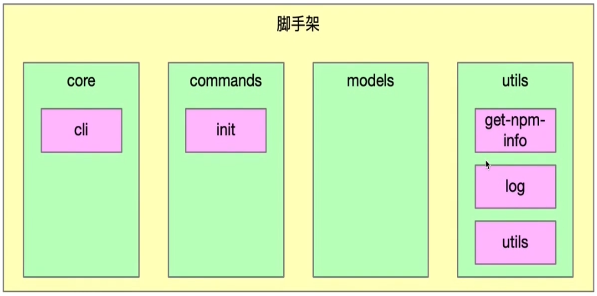
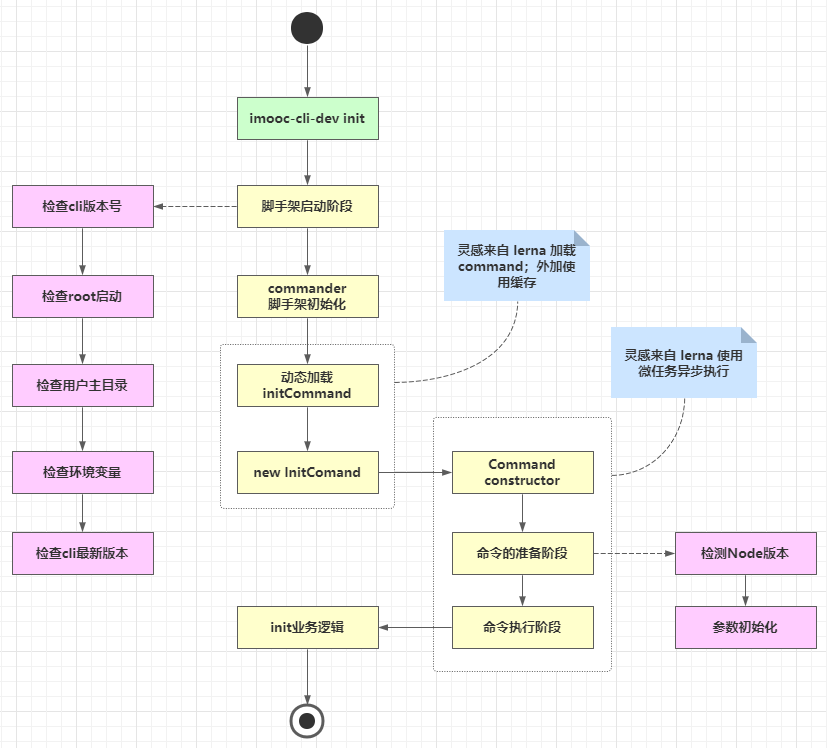
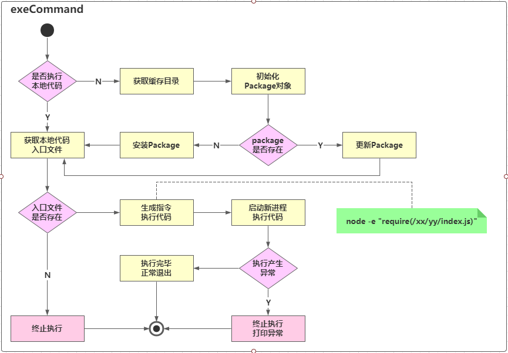

# 架构设计

## 痛点分析

当前脚手架架构图如下图：



这样的架构设计已经可以满足一般脚手架需求，但是有以下两个问题:

1. cli 安装速度慢：所有 package 都集成在 cli 里，因此当命令较多时，会减慢cli的安装速度

当前的cil结构

1. 灵活性差：init 命令只能使用 @imooc-cli-dev/init 包，对于集团公司而言，每个项目组的 init 命令可能都不相同，可能需要实现 init 命令动态化。如

- - 团队A使用 @imooc-cli-dev/init 作为初始化模块
  - 团队B使用自己开发的 @imooc-cli-dev/my-init 作为初始化模块

这时对我们的架构设计就提出挑战，要求我们能够动态加载init模块，这将增加架构的复杂度，但大大提升脚手架的可扩展性，将脚手架框架和业务逻辑解耦

## 脚手架架构优化



## 脚手架命令动态加载功能架构设计



node 命令执行源码

```javascript
node -e "require('./xx/yy/index.js')"
```

# 代码编写

## 1. 脚手架命令本地调试功能支持

通过前面画图了解，我们要实现的第一步是initCommand的动态命令加载。 是否执行本地代码，我们通过一个属性来进行标识：**targetPath**

通过环境变量对业务逻辑进行解耦

```javascript
//core/cli/lib/index.js

program.
.option('-tp, --targetPath <targetPath>','是否指定本地调试文件路径','')

 //指定targetPath
program.on('option:targetPath',function(){
  process.env.CLI_TARGET_PATH = program.opts().targetPath 
})
// commands/init/lib/index.js
'use strict';

function init(projectName,options,command)  {
    console.log('init',projectName,command.opts().force,process.env.CLI_TARGET_PATH)
}

module.exports = init;
```

本节需要注意的一点是如果commander版本低于7.0.0，那么 program.action()中传入的参数为两个。 7.0.0版本以上的传入的参数为三个(name.options,cmd)

另外，访问targetPath这个参数的时候，需要program.opts().targetPath访问。

## 2. 动态执行库exec模块创建

core下新建包文件： lerna create @cloudscope-cli/exec core/ 然后在core/cli/lib/index.js文件中将exec包引入，将action(init)此处改为action(exec)

## 3. 创建npm模块通用类Package

- Package 对象功能

- - 获取入口文件的路径
  - 判断当前package是否存在
  - 安装package
  - 更新package

代码实现：

- 在model文件下创建新的模块Package：lerna create @cloudscope-cli/package
- 在core/exec/lib/index.js文件中引入：const Package = require('@cloudscope-cli/package')

## 4. Package类的属性、方法定义及构造函数逻辑开发

本节主要有三处代码讲解

- core/exec中创建一个Package对象
- model/package中Package类的构造方法
- utils/utils中添加isObject方法：判断一个属性是否为对象

```javascript
'use strict';

// 1.targetPath -> modulePath
// 2. modulePath -> Package(npm模块)
// 3. Package.getRootFile(获取入口文件)
// 4. Package.update

// 封装 -> 复用

const Package = require('@cli-dev-zy/package');
const log = require('@cli-dev-zy/log')

const SETTINGS = {
    init: '@cli-dev-zy/init'
}

function exec(projectName, options, command) {
    const targetPath = process.env.CLI_TARGET_PATH
    const homePath = process.env.CLI_HOME_PATH
    log.verbose('targetPath', targetPath)
    log.verbose('homePath', homePath)
    const cmdObj = arguments[arguments.length - 1];
    const cmdName = cmdObj.name();
    const packageName = SETTINGS[cmdName]
    const packageVersion = 'latest'

    const pkg = new Package({
        targetPath,
        packageName,
        packageVersion
    })
    
    console.log(pkg)
}

module.exports = exec;
//models/package/lib/index.js
'use strict';
const { isObject }  = require('@cli-dev-zy/utils');
class Package {
    constructor(options){
        if( !options){
            throw new Error('Package类的options参数不能为空！')
        }
        if( !isObject(options) ){
            throw new Error('Package类的options参数必须为对象！')
        }
        // package路径
        this.targetPath = options.targetPath
        // package的存储路径
        this.storeDir = options.storeDir
        // package的name
        this.packageName = options.packageName
        // package的version
        this.packageVersion = options.packageVersion;
    }

    // 判断当前Package是否存在
    exists(){}

    // 安装Package
    install(){}
    //更新Package
    update(){}

    //获取入口文件路径
    getRootFilePath(){}
}

module.exports = Package;
//utils/utils/lib/index.js

'use strict';

function isObject(o) {
    return Object.prototype.toString.call(o) === '[object Object]'
}

module.exports = {
    isObject
};
```

## 5. Package类获取入口文件路径功能开发（pkg-dir应用+解决不同操作系统路径兼容问题）

本节主要实现models/package/lib/index.js中获取入口文件路径的方法实现getRootfile()

1. 获取package.json的所在目录--通过安装pkg-dir库
2. 读取package.json
3. 寻找main/lib
4. 路径的兼容macOS/windows --新建包：utils/format-path，且新建路径兼容方法

```javascript
//core/exec/lib/index.js

const path = require('path')
const formatPath = require('@cli-dev-zy/format-path')
const pkgDir = require('pkg-dir').sync

…………
// 获取入口文件的路径
getRootFilePath() {
    // 1. 获取package.json所在目录 - pkg-dir
    const dir = pkgDir(this.targetPath)
    if (dir) {
        // 2. 读取package.json - require()
        const pkgFile = require(path.resolve(dir, 'package.json'))
        // console.log(pkgFile);
        // 3. 寻找main/lib - path
        if (pkgFile && pkgFile.main) {
            // 4. 路径的兼容(mac/windows)
            return formatPath(path.resolve(dir, pkgFile.main))
        }
    } else {
        return null
    }

}
…………
//utils/format-path/lib/index.js

'use strict';

const path = require('path')

function formatPath(p) {
    const sep = path.sep;
    if(p && typeof p === 'string'){
      if(sep !=='/'){
        return p.replace(/\\/g,'/')
      }
    }
    return p
}

module.exports = formatPath;
```

## 6. 利用npminstall库安装npm模块

使用 cnpm 的 npminstall 包安装。在执行 cnpm install 命令安装npm包时，实际用到的就是 npminstall

实例代码如下。npminstall() 返回一个 promise 对象。

```javascript
const npminstall = require('npminstall');
const path = require('path');
const userhome = require('user-home')

npminstall({
  root: path.resolve(userhome, '.imooc-cli-dev'), // 模块路径
  storeDir: path.resolve(userhome, '.imooc-cli-dev', 'node_modules'), // 实际存储位置，root + node_modules
  registry: 'https://registry.npm.taobao.org',
  pkgs: [
    { name: 'foo', version: '~1.0.0' },
  ], // 指定安装的包名和版本
});
```

1. 首先，我们的项目在开发过程中可能会有错误，有的需要去看执行栈，有的不需要，因此我们在core/cli/lib/index中的core方法中，catch语句中加入如下代码(debug模式下显示执行栈错误)

```javascript
if(program.opts().debug){
    console.log(e)
}
```

2.在core/exec/lib/index.js文件中，我们修改代码如下(主要加入了如果不存在targetPath的逻辑梳理)：

```javascript
'use strict';

const path = require('path')   //新添加
const Package = require('@cloudscope-cli/package')
const log = require('@cloudscope-cli/log')

const SETTINGS = {      //新添加
    init: '@imooc-cli/init'
 }

const CATCH_DIR = 'dependencies'  //新添加

async function exec() {
    let targetPath = process.env.CLI_TARGET_PATH
    const homePath = process.env.CLI_HOME_PATH
    let storeDir ='';
    let pkg;
    log.verbose('targetPath', targetPath);
    log.verbose('homePath', homePath);
    const cmdObj = arguments[arguments.length - 1];
    const cmdName = cmdObj.name(); 
    const packageName = SETTINGS[cmdName];
    const packageVersion = 'latest';
    if(!targetPath){
       //生成缓存路径
       targetPath = path.resolve(homePath,CATCH_DIR);  //新添加
       storeDir = path.resolve(targetPath,'node_modules')  //新添加
       log.verbose('targetPath:',targetPath)  //新添加
       log.verbose('storeDir:',storeDir)      //新添加
       pkg = new Package({                                     //新添加
         targetPath,
         storeDir,
         packageName,
         packageVersion
      });
      if(await pkg.exists()){    //新添加
         // 更新package
         log.verbose('更新package')
         await pkg.update();
      }else{
         // 安装package
         await pkg.install();
      }
    }else{
      pkg = new Package({
         targetPath,
         packageName,
         packageVersion
      })
      const rootFile = pkg.getRootFilePath();
      if(rootFile){    //新添加
         require(rootFile).apply(null,arguments);
      }
    }
}

module.exports = exec;
```

1. model/package包中文件主要加入了安装package这个方法,使用了npminstall这个库。

```javascript
//models/package/lib/ibdex.js
async prepare() {
    if (this.storeDir && !pathExists(this.storeDir)) {
        // 创建所有文件目录
        fse.mkdirpSync(this.storeDir)
    }
    if (this.packageVersion === 'latest') {
        this.packageVersion = await getNpmLatestVersion(this.packageName)
    }
}
 async install(){
   await this.prepare()
   return npminstall({
     root: this.targetPath,
     storeDir: this.storeDir,
     registry:getDefaultRegistry(),
     pkg:{
       name:this.packageName,
       version:this.packageVersion
     }
   })
 }
```

## 7. Package类判断模块是否存在方法开发

本节的主要内容是实现package/lib/index.js中的exists方法，代码实现如下：

```javascript
…………

 // package的缓存目录前缀
        this.cacheFilePathPrefix = this.packageName.replace('/', '_')

…………
get cacheFilePath() {
  return path.resolve(this.storeDir,`_${this.cacheFilePathPrefix}@${this.packageVersion}@${this.packageName}`)
}

async prepare(){
  if(this.storeDir && !pathExists(this.storeDir)){
    fse.mkdirpSync(this.storeDir)
  }
  if(this.packageVersion === 'latest'){
    this.packageVersion = await getNpmLatestVersion(this.packageName);
  }
}

async exists(){
  if(this.storeDir){
    await this.prepare() 
    return pathExists(this.cacheFilePath);
  }else{
    return pathExists(this.targetPath);
  }
}
```

## 8. Package类更新模块逻辑开发

本节内容主要为如果Package包有升级，那么需要去更新，主要实现代码为：

```javascript
// models/package/lib/index.js

…………
getSpecificCacheFilePath(packageVersion){
  return path.resolve(this.storeDir,`_${this.cacheFilePathPrefix}@${packageVersion}@${this.packageName}`)
  }

//更新Package
async update(){
  //获取最新的npm模块版本号
  const latestPackageVersion = await getNpmLatestVersion(this.packageName);
  // 查询最新版本号对应的路径是否存在
  const latestFilePath = this.getSpecificCacheFilePath(latestPackageVersion)
  // 如果不存在，则直接安装最新版本
  if(!pathExists(latestFilePath)){
    await npminstall({
      root:this.targetPath,
      storeDir:this.storeDir,
      registry:getDefaultRegistry(),
      pkgs:[{
        name:this.packageName,
        version:latestPackageVersion
      }
           ]
    })
    this.packageVersion = latestPackageVersion
  }else{
    this.packageVersion = latestPackageVersion
  }
  return latestFilePath;
}
```

## 9. Package类获取缓存模块入口文件功能改造

```javascript
//获取入口文件路径
getRootFilePath(){
    function _getRootFile(targetPath) {
        // 1. 获取package.json所在目录
        const dir = pkgDir(targetPath);
        if (dir) {
          // 2. 读取package.json
          const pkgFile = require(path.resolve(dir, 'package.json'));
          // 3. 寻找main/lib
          if (pkgFile && pkgFile.main) {
            // 4. 路径的兼容(macOS/windows)
            return formatPath(path.resolve(dir, pkgFile.main));
          }
        }
        return null;
      }
      if (this.storeDir) {
        return _getRootFile(this.cacheFilePath);
      } else {
        return _getRootFile(this.targetPath);
      }
}
```


若有收获，就点个赞吧