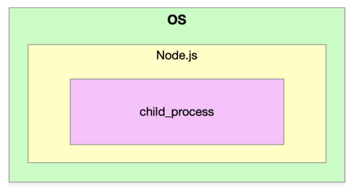
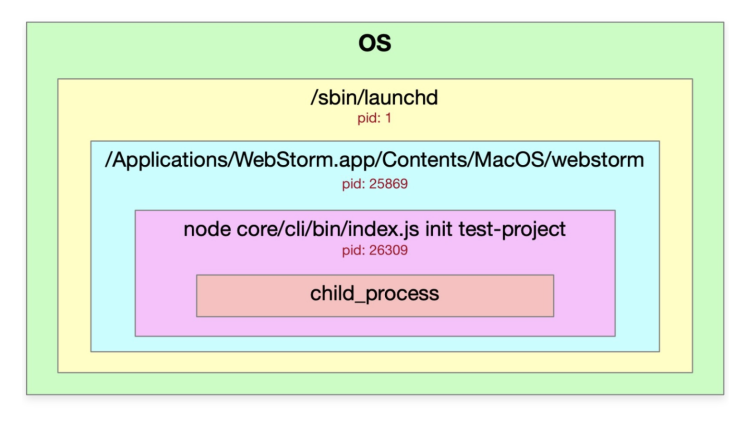

# 进程的基本概念(讲解在操作系统中如何查看进程的嵌套关系)

官方文档中文版： http://nodejs.cn/api/child_process.html

进程：进程(Process)是计算机中的程序关于某数据集合上的一次运行活动，是系统进行资源分配和调度的基本单元，是操作系统结构的基础。 

进程的概念主要两点：

- 第一，进程是一个实体。每一个进程都有它自己的地址空间。
- 第二，进程是一个“执行中的程序”，存在嵌套关系



我们在child_process中创建的进程就是Node.js的子进程

Node进程存在的感知： 终端中输入：ps -ef | grep node 命令。

- UID是当前用户获取权限的ID
- PID是当前进程ID
- PPID是当前进程ID的父ID

使用webstorm调试一个node程序的图示如下：



# 1. child_process异步方法使用教程

## 异步

- exec
- execFile
- fork
- spawn

## 同步

- execSync
- execFileSync
- spawnSync

```javascript
//exec使用方法demo
const cp = require('child_process')

// 执行shell脚本
cp.exec('ls -al',function(err,stdout,stderr){
    console.log(err)
    console.log(stdout)
    console.log(stderr)
})
//execFile使用方法demo
cp.execFile('ls',['-al'],function(err,stdout,stderr){
    console.log(err)
    console.log(stdout)
    console.log(stderr)
})
```

- exec/execFile: 执行开销比较小的任务，一次性返回结果
- exec主要用来执行一个shell命令，本质是execFile，只是参数不同，不支持传入arguments参数。
- execFile只能执行一个文件，且加入一些命令，不能使用管道符。

# 2. child_process spawn用法以及与exec&execFile的区别

exec、execFile、fork底层都是使用的spawn。 spawn使用的时候，没有回调，需要监听获取结果。
新建一个test.shell文件的时候，如果要读取这个文件，那么需要添加权限：chmod +x test.shell

- 耗时任务（比如：npm install），需要不断日志

```javascript
const cp = require('child_process')
const path = require('path')

const child = cp.spawn(path.resolve(__dirname,'test.shell'),['-al','-bl'],{
    cwd:path.resolve('..')
});

// console.log(child.pid,process.pid)
child.stdout.on('data',function(chunk){
    console.log('stdout',chunk.toString())
})

child.stderr.on('data',function(chunk){
    console.log('stderr',chunk.toString())
})
```

# 3. child_process fork用法及父子进程通信机制讲解

fork主要是使用node来执行我们的命令。 fork会执行两个进程 主进程与子进程。 fork的本质也是调用spawn。

- 耗时操作

- 下载文件
- 多线程多进程下载

```javascript
// index.js
const cp = require('child_process')
const path = require('path')

const child = cp.fork(path.resolve(__dirname,'child.js'))
child.send('hello child process！',()=>{
    // child.disconnect()
})
console.log('main pid:',process.pid)

child.on('message',msg =>{
    console.log(msg)
    child.disconnect()
})

//child.js
console.log('child pid：',process.pid)

process.on('message', (msg)=>{
    console.log(msg)
})

process.send('hello main process!')
```

# 4. child_process同步方法使用教程

- execSync
- execFileSync
- spawnSync

```javascript
const cp = require('child_process')

//execSync
const ret = cp.execSync('ls -al | grep index.js')
console.log(ret.toString())

//execFileSync
const ret2 = cp.execFileSync('ls', ['-al'])
console.log(ret2.toString())

//spawnSync
const ret3 = cp.spawnSync('ls',['-al'])
console.log(ret3.stdout.toString())
```

