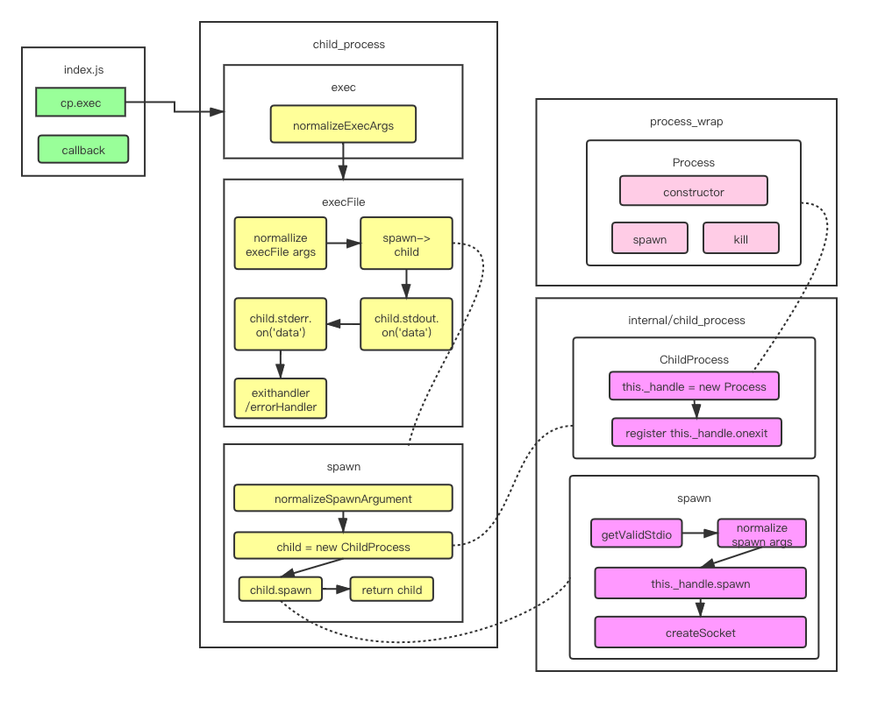

# [加餐] Node 进阶： child_process 源码分析

# 1. Node多进程child_process库exec方法源码执行流程分析

疑问和收获：

- exec和execFile到底有什么区别？ 
- 为什么exec/execFile/fork都是通过spawn实现的，spawn的作用到底是什么？ 
- 为什么spawn调用后没有回调，而exec和execFile能够回调？ 
- 为什么spawn调用后需要手动调用child.stdout.on('data',callback),这里的child.stdout/child.stderr到底是什么？ 
- 为什么有data/error/exit/close这么多种回调，他们的执行顺序到底是怎样的？

## exec 源码深入分析




在未学习exec源码之前，我们先对上面的拓扑图进行一个简单的学习，看到exec内部的执行流程 不难看到exec执行的是execlFile这个方法，且不同的地方就是传入的参数不同，而execFile执行的是spawn这个方法，且spawn这个方法调用的是node内部库的一个child_process方法。

我们在webstorm中打开一个[项目](https://github.com/liugezhou/liugezhou-yargs-demo)

```javascript
// /bin/process/index.js
const cp = require('child_process')
const path = require('path')

cp.exec('ls -al|grep node_modules ',function(err,stdout,stderr){
    console.log(err)
    console.log(stdout)
    console.log(stderr)
})
```

第五行代码打断点，配置webstorm调试设置后，执行命令(我这里是liugezhou-test)，进入到exec源码

```javascript
function exec(command, options, callback) {
 const opts = normalizeExecArgs(command, options, callback);
 return module.exports.execFile(opts.file,
                                opts.options,
                                opts.callback);
}
```

正如上面拓扑图画的那样，首先执行一个normalLizeExecArgs方法，然后调用execFile这个方法

```javascript
function execFile(file /* , args, options, callback */) {
     ………………

  const child = spawn(file, args, {
    cwd: options.cwd,
    env: options.env,
    gid: options.gid,
    uid: options.uid,
    shell: options.shell,
    windowsHide: !!options.windowsHide,
    windowsVerbatimArguments: !!options.windowsVerbatimArguments
  });

     ………………

  function exithandler(code, signal) {
    ………………

    callback(ex, stdout, stderr);
  }

  function errorhandler(e) {
   ………………
    exithandler();
  }


  if (child.stdout) {
    ………………
  }

  if (child.stderr) {
    ………………
  }

  child.addListener('close', exithandler);
  child.addListener('error', errorhandler);

  return child;
}
```

上面代码的4行，我们看到调用了spawn方法。

```javascript
function spawn(file, args, options) {
  const opts = normalizeSpawnArguments(file, args, options);
  const child = new ChildProcess();
……………………

  child.spawn({
    file: opts.file,
    args: opts.args,
    cwd: options.cwd,
    windowsHide: !!options.windowsHide,
    windowsVerbatimArguments: !!options.windowsVerbatimArguments,
    detached: !!options.detached,
    envPairs: opts.envPairs,
    stdio: options.stdio,
    uid: options.uid,
    gid: options.gid,
    serialization: options.serialization,
  });

  return child;
}
```

spawn方法的第2行如拓扑图所示，对参数执行了normalizeSpawnArguments方法，这里通过调试查看参数，发现，opts这个对象的file为 'bin/sh'，这里涉及到一个重要的知识点:


shell的使用

1. 直接执行shell文件： /bin/sh test.shell
2. 直接执行shell语句： /bin/sh -c "ls -al|grep node_modules"

spawn方法的第3行 const child = new ChildProcess 通过分析，我们知道这个ChildProcess调用的是内部库 internal/child_process的this._handler,再进一步如拓扑图所示，调用的是c++文件，不做继续跟踪。 继续往后该方法第6行，spwan方法调用的child.spwan如拓扑图所示，真正调用的是internal/child_process中的spawn-->this._hanlde.spawn方法，该方法执行完毕后，子进程便开启了.

在spwan最后返回child后，我们再返回到execFile中，发现child.stdout与child.stderr方法的输出，以及回调f unction exithandler和errorhandler

上面就是对exec源码的略读过程。

# 2. 高能：child_process库exec源码精度

上一节我们阅读了exec源码的第一遍，对答题流程有了认识，这节开始阅读第二遍，进行细节的解读。

首先进入到exec的normalizeExecArgs方法，逻辑简单。

```javascript
function normalizeExecArgs(command, options, callback) {
  if (typeof options === 'function') {  //判断options是否为function，这一步是对参数的兼容以及参数左移动
    callback = options;
    options = undefined;
  }

  // Make a shallow copy so we don't clobber the user's options object.
  options = { ...options };
  options.shell = typeof options.shell === 'string' ? options.shell : true;

  return {
    file: command,
    options: options,
    callback: callback
  };
}
```

然后我们进入到execFile中，分析流程写入到下面代码之中：

```javascript
// liugehou:此方法只接受了一个参数file，后面的参数通过arguments获取
function execFile(file /* , args, options, callback */) {
  // liugezhou:参数初始化
  let args = [];
  let callback;
  let options;

  // Parse the optional positional parameters.
  let pos = 1;
  //liugezhou:意图为拿到arguments的第一个参数，即options，且需满足options为数组时(显然exec进来不满足这个条件)
  if (pos < arguments.length && ArrayIsArray(arguments[pos])) {
    args = arguments[pos++];
  //liugezhou:对exec来说arguments[1]传入的为 {shell:true},即也不满足这个条件  
  } else if (pos < arguments.length && arguments[pos] == null) {
    pos++;
  }
// liugezhou:如上一注释，这里是满足的，将{shell:true}赋值给optios
  if (pos < arguments.length && typeof arguments[pos] === 'object') {
    options = arguments[pos++];
  } else if (pos < arguments.length && arguments[pos] == null) {
    pos++;
  }
//liugezhou:满足
  if (pos < arguments.length && typeof arguments[pos] === 'function') {
    callback = arguments[pos++];
  }

  if (!callback && pos < arguments.length && arguments[pos] != null) {
    throw new ERR_INVALID_ARG_VALUE('args', arguments[pos]);
  }

  options = {
    encoding: 'utf8',       //liugezhou:编码格式
    timeout: 0,                        //liugezhou：超时时间
    maxBuffer: MAX_BUFFER,//liugezhou：缓存区输出的字符串最多的容量(stdout的时候会用到)
    killSignal: 'SIGTERM',
    cwd: null,
    env: null,
    shell: false,
    ...options
  };

  // Validate the timeout, if present.
  validateTimeout(options.timeout); //liugezhou：判断是否为int，如果不是抛出异常

  // Validate maxBuffer, if present.
  validateMaxBuffer(options.maxBuffer); //liugezhou:判断是否为number，如果不是抛出异常

  options.killSignal = sanitizeKillSignal(options.killSignal);

  const child = spawn(file, args, {
    cwd: options.cwd,
    env: options.env,
    gid: options.gid,
    uid: options.uid,
    shell: options.shell,
    windowsHide: !!options.windowsHide,
    windowsVerbatimArguments: !!options.windowsVerbatimArguments
  });
………………
```

上面代码走到51行后，进入spawn源码

```javascript
function spawn(file, args, options) {
  // liugezhou：继续对进来的参数进行一个解析，主要就是参数的处理解析
  const opts = normalizeSpawnArguments(file, args, options);
  //liugezhou：这里进入到internal/child_process文件下，重点执行this.handle = new Process()
  const child = new ChildProcess();

  options = opts.options;
  debug('spawn', opts.args, options);

  //liugezhou：又一个重点，这里的源码底层实现，分析在下一节
  child.spawn({
    file: opts.file,
    args: opts.args,
    cwd: options.cwd,
    windowsHide: !!options.windowsHide,
    windowsVerbatimArguments: !!options.windowsVerbatimArguments,
    detached: !!options.detached,
    envPairs: opts.envPairs,
    stdio: options.stdio,
    uid: options.uid,
    gid: options.gid,
    serialization: options.serialization,
  });

  return child;
}
```

# 3. 深度分析child_process库spawn底层实现

接着上一节代码块中走到了child.spawn：

- 第一步是通过getValidStdio去生成pipe，创建一个管道实例：第一个是输入，第二个是输出，第三个是error(只是生成了管道，但是还没创建socket的通信)
- 第二步对spawn的一些参数进行处理：下面代码未贴
- 第三步通过this._handle.spawn 子进程被创建出来
- 第四步通过createSocket方法，将之前的pipe和子进程与socket绑定。

```javascript
ChildProcess.prototype.spawn = function(options) {
………………
  //liugezhou:'pipe'管道从这里创建，这里面的代码就不贴了，该代码可以：
  //1. stdio可以传入ignore，静默执行，没有输出
  stdio = getValidStdio(stdio, false);
………………

  //liugezhou:经过这步后，子进程立即被创建出来
  const err = this._handle.spawn(options);

……………

// liugezhou:此循环非常重要，建立起来了父进程与子进程的socket通信
  for (i = 0; i < stdio.length; i++) {
………………

    if (stream.handle) {
      // When i === 0 - we're dealing with stdin
      // (which is the only one writable pipe).
      //liugezhou：createSocket
      stream.socket = createSocket(this.pid !== 0 ?
        stream.handle : null, i > 0);

      //liugezhou:到这里就得到了一个socket事例
      if (i > 0 && this.pid !== 0) {
        this._closesNeeded++;
        stream.socket.on('close', () => {
          maybeClose(this);
        });
      }
    }
  }

………………
  return err;
};
```

然后我们再返回到execFile中，接着往下走：

```javascript
function execFile(file /* , args, options, callback */) {
………………
let encoding;
  //liugezhou：等待输入输出流全部执行完毕后，最后生成内容的数组，这个_stdout是一次性push给我们的，所以这也是我们前面学习说为什么进行耗时任务的时候，不要使用execFile
  const _stdout = [];
  const _stderr = [];
  if (options.encoding !== 'buffer' && Buffer.isEncoding(options.encoding)) {
    encoding = options.encoding;
  } else {
    encoding = null;
  }

  //定义了一些变量
  ………………

  function exithandler(code, signal) {
    if (exited) return;
    exited = true;

    if (timeoutId) {
      clearTimeout(timeoutId);
      timeoutId = null;
    }

    if (!callback) return;

    // merge chunks
    let stdout;
    let stderr;
    if (encoding ||
      (
        child.stdout &&
        child.stdout.readableEncoding
      )) {
      stdout = _stdout.join('');
    } else {
      stdout = Buffer.concat(_stdout);
    }
    if (encoding ||
      (
        child.stderr &&
        child.stderr.readableEncoding
      )) {
      stderr = _stderr.join('');
    } else {
      stderr = Buffer.concat(_stderr);
    }

    if (!ex && code === 0 && signal === null) {
      callback(null, stdout, stderr);
      return;
    }

    if (args.length !== 0)
      cmd += ` ${args.join(' ')}`;

    if (!ex) {
      // eslint-disable-next-line no-restricted-syntax
      ex = new Error('Command failed: ' + cmd + '\n' + stderr);
      ex.killed = child.killed || killed;
      ex.code = code < 0 ? getSystemErrorName(code) : code;
      ex.signal = signal;
    }

    ex.cmd = cmd;
    callback(ex, stdout, stderr);
  }

  function errorhandler(e) {
    ex = e;

    if (child.stdout)
      child.stdout.destroy();

    if (child.stderr)
      child.stderr.destroy();

    exithandler();
  }
………………

  //liugezhou：timeout耗时的操作
  if (options.timeout > 0) {
    ………………
  }

  if (child.stdout) {
    if (encoding)
      child.stdout.setEncoding(encoding);

    child.stdout.on('data', function onChildStdout(chunk) {
      const encoding = child.stdout.readableEncoding;
      const length = encoding ?
        Buffer.byteLength(chunk, encoding) :
        chunk.length;
      stdoutLen += length;

      if (stdoutLen > options.maxBuffer) {
        const truncatedLen = options.maxBuffer - (stdoutLen - length);
        _stdout.push(chunk.slice(0, truncatedLen));

        ex = new ERR_CHILD_PROCESS_STDIO_MAXBUFFER('stdout');
        kill();
      } else {
        _stdout.push(chunk);
      }
    });
  }

  if (child.stderr) {
    if (encoding)
      child.stderr.setEncoding(encoding);

    child.stderr.on('data', function onChildStderr(chunk) {
      const encoding = child.stderr.readableEncoding;
      const length = encoding ?
        Buffer.byteLength(chunk, encoding) :
        chunk.length;
      stderrLen += length;

      if (stderrLen > options.maxBuffer) {
        const truncatedLen = options.maxBuffer - (stderrLen - length);
        _stderr.push(chunk.slice(0, truncatedLen));

        ex = new ERR_CHILD_PROCESS_STDIO_MAXBUFFER('stderr');
        kill();
      } else {
        _stderr.push(chunk);
      }
    });
  } 

  child.addListener('close', exithandler);
  child.addListener('error', errorhandler);

  return child;
}
```

# 4. child_process事件应用方法详解

本节我们进入到child_process源码的第三轮，彻底搞懂process的回调流程，也是child_process中最复杂的部分。同样，我们通过processOn图对流程进行梳理一遍：

在分析了上面流程后，我们先写一些测试代码以理解上面的流程。

```javascript
const cp = require('child_process')
const path = require('path')

const child = cp.exec('ls -al|grep node_modules',function(err,stdout,stderr){
    console.log('callback--------start')
    console.log(stdout)
    console.log('callback--------end')
})

child.stdout.on('data',(chunk)=>{
    console.log('stdout data:',chunk)
})

child.stderr.on('data',(chunk)=>{
    console.log('stderr data:',chunk)
})

child.stderr.on('close',()=>{
    console.log('stderr close')
})
child.on('exit',(exitCode)=>{
    console.log('exit:',exitCode)
})
child.on('close',()=>{
    console.log('close!')
})
```

# 5. 高难度：深度解析child_process库spawn方法回调原理

# 6. child_process库fork执行流程分析

# 7. 精化：Node多进程源码总结

- exec/execFile/spawn/fork的区别

- - exec: 原理是调用/bin/sh -c 执行我们传入的shell脚本，底层调用略execFile
  - execFile：原理是直接执行我们传入的file和args，底层调用spawn创建和执行子进程，并建立略回调，一次性将所有的stdout和stderr结果返回
  - spawn:原理是调用略internal/child_process,实例化略ChildProcess子进程对象，再调用child.spawn创建 子进程并执行命令，底层是调用了child.)handle.spawn执行process_wrap中的spwan方法，执行过程是异步的，执行完毕后再通过PIPE进行单向数据通信，通信结束后子进程发起onexit回调，同时Socket会执行close回调。
  - fork:原理是通过spawn创建子进程和执行命令，采用node执行命令，通过setupchannel创建IPC用于子进程和父进程之间的双向通信。

- data/error/exit/close回调的区别

- - data：用于主进程读取数据过程中通过onStreamRead发起的回调
  - error: 命令执行失败后发起的回调
  - exit: 子进程关闭完成后发起的回调
  - close：子进程所有Socket通信端口全部关闭后发起的回调
  - stdout close/stderr close:特定的PIPE读取完成后调用onReadableStreamEnd关闭Socket时发起的回调。


若有收获，就点个赞吧