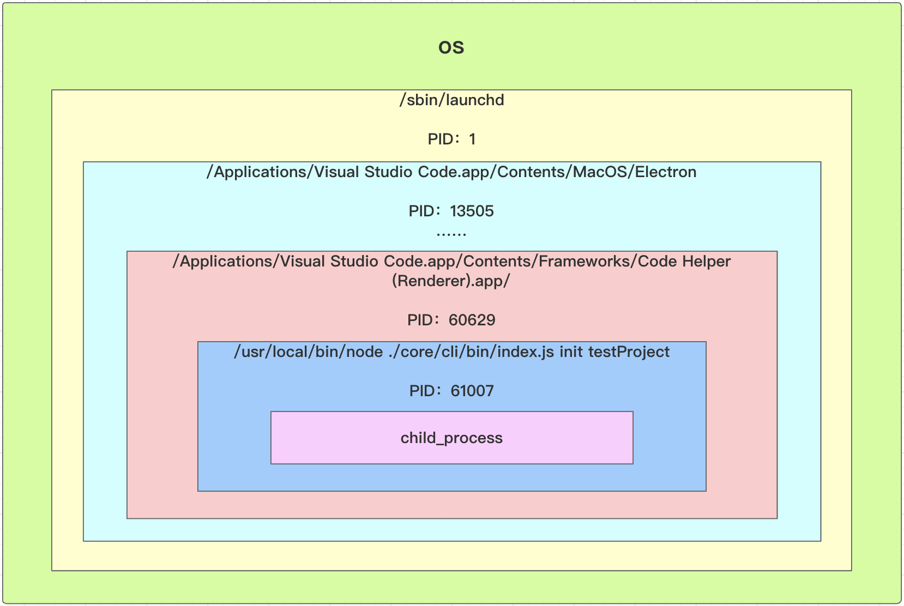

### Node 多进程开发入门

Node多进程核心是创建一个子进程，子进程依附在当前Node进程下面

核心类是 `child_process`

文档路径：http://nodejs.cn/api/child_process.html

子进程概念：是系统进行资源分配和调度的基本单位，是操作系统结构的基础

**进程的概念只要有两点**

- 进程是一个实体。每一个进程都有它的地址空间
- 进程是一个“执行中的程序”，存在嵌套关系

进程开线程，进程和线程的区别？

**查看进程（os）**

`ps -ef` 查看所有进程

```bash
Last login: Sun Feb  7 15:42:44 on ttys002
jolly@JollydeMacBook-Pro jolly-cli-dev % ps -ef
  UID   PID  PPID   C STIME   TTY           TIME CMD
    0     1     0   0 301220  ??        14:35.92 /sbin/launchd
    0   112     1   0 301220  ??         0:56.66 /usr/sbin/syslogd
    0   113     1   0 301220  ??         2:26.60 /usr/libexec/UserEventAgent (System)
    0   116     1   0 301220  ??         0:13.29 /System/Library/PrivateFrameworks/Uninstall.framework/Resources/uninstalld
    0   117     1   0 301220  ??         0:54.79 /usr/libexec/kextd
    0   118     1   0 301220  ??         5:35.10 /System/Library/Frameworks/CoreServices.framework/Versions/A/Frameworks/FSEvents.framework/Versions/A/Support/fseventsd

```

- UID 获得权限的用户的UID
- PID 进程的ID
  - `ps -ef|grep PID` 可帅选出对应进程
- PPID 父进程的ID，体现进程的嵌套关系

vscode 启动 `node` 调试时的父子进程关系图。体现了进程嵌套



#### 5-2 child_process异步方法使用教程（exec&execFile）

```javascript
const cp = require('child_process');
```

child_process用法:

> 异步用法
>
> - exec
> - execFile
> - fork
> - spawn
>
> 同步用法
>
> - execSync
> - execFileSync
> - spawnSync

##### 异步

- `exec` 执行 `shell` 命令

  ```javascript
  cp.exec('ls -la', function(err, stdout, stderr){
    console.log('err: ', err); // 错误
    console.log('stdout: ', stdout); // 正常运行输出的结果，后面会有个换行
    console.log('stderr: ', stderr); // 异常输出的结果
  });
  ```

  ```bash
  jolly@JollydeMacBook-Pro child_process % node index.js 
  err:  null
  stdout:  total 8
  drwxr-xr-x   3 jolly  staff   96  2  7 16:58 .
  drwxr-xr-x  14 jolly  staff  448  2  7 16:58 ..
  -rw-r--r--   1 jolly  staff  189  2  7 16:59 index.js
  
  stderr:  
  ```

  - 第二个参数是一个 option 对象
    - `cwd` 设置执行的目录
    - timeout 设置执行命令超时的时间，默认是0(不超时)
- `execFile` 执行 `shell` 文件

  - 有四个参数

  如果第一个参数不是路径，而是命令，那么通过 `which 命令` 找到对应的文件

  ```javascript
  cp.execFile('ls', ['-la'], function(err, stdout, stderr){
    console.log('err: ', err);
    console.log('stdout: ', stdout);
    console.log('stderr: ', stderr);
  });
  ```

  和上面 `exec` 执行效果一样

  - `execFile` 第二个参数是，传入文件的参数
  - 和 `exec` 的区别

    - `exec` 支持更复杂的 `shell` 命令：`ls -la|grep node_modules`
    - 但 `execFile` 执行 `[-la|grep node_modules]` 会报错，不能执行成功。因为 `grep` 不是 `execFile` 执行文件 `ls` 的参数
    - 可以执行 `.shell` 文件：将 `ls -al|grep node_modules` 写在 `.shell` 文件中

      - `chmod +x test.shell` 添加执行权限

      `test.shell` 文件当中的内容

      ```bash
      ls -la|grep node_modules
      
      echo $1
      ```

      - `$1` 代表 `execFile` 传入的第一个参数
    - `exec` 也能执行指定文件，但是不支持传入参数
- `spwan` 执行 `shell` 文件

  如果第一个参数不是路径，而是命令，那么通过 `which 命令` 找到对应的文件

  ```javascript
  const child = cp.spawn(path.resolve(__dirname, 'test.shell'), ['-la'], {
    cwd: path.resolve('.')
  })
  child.stdout.on('data', function(chunk) {
    console.log('stdout: ', chunk.toString()); //一次输出一个字符串
  });
  child.stderr.on('data', function(chunk) {
    console.log('stderr: ', chunk.toString());
  });
  child.on('error', e => { // 监听错误
    process.exit(1);
  });
  child.on('exit', e => {// 监听执行成功后的退出事件
  
  });
  ```

  option参数

  - `stdio` 选项用于配置在父进程和子进程之间建立的管道。值：
    - `pipe` 默认值，在子进程和父进程之间创建一个管道。
    - `ignore` 静默执行，不会收到反馈
    - `inherit` 将相应的 stdio 流传给父进程或从父进程传入。将输入、输出、错误，绑定到父进程的 `process.stdin`、 `process.stdout` 和 `process.stderr` 上。**直接能看到打印**，还带动画（进度）信息 。
- `fork` 使用 `node` 执行命令

  - 一个参数：模块路径
  - 和 `require()` 的区别
    - `require` 加载的 `js` 模块是在主进程中执行的。`fork` 测试在子进程中的执行的，执行的 `js`文件 `process.pid` 会发生变化。

  ```javascript
  const child = cp.fork(path.resolve(__dirname, 'child.js'));
  ```

  - 适合执行耗时任务。

##### 同步

执行简单 `shell` 命令

- `execSync` 执行 `shell` 命令

  ```javascript
  const stdout = cp.execSync('ls -la|grep node_modules');
  console.log(stdout.toString()); // stdout 是个 buffer
  ```
- `execFileSync` 执行 `shell` 文件

  ```javascript
  const stdout = cp.execFileSync('ls', ['-la']);
  console.log(stdout.toString()); // stdout 是个 buffer
  ```
- `spawnSync` 执行 `shell` 文件

  ```javascript
  const ret = cp.spawnSync('ls', ['-la']);
  console.log(ret.stdout.toString()); // ret 是个 buffer
  ```
- **`exec`、`execFile`、`fork` 底层都是调用 `spawn` 的**
- **何时使用 `spawn`、`exec`、`execFile`**

  - `spawn` 适合耗时任务（比如：`npm install`），需要不断日志。`spawn` 逐条执行命令
  - `exec`/`execFile`：开销比较小的任务。整个执行完后返回
- **使用 `path.resovle('./','shell.js')`时会报错，因为node的执行上下文，不一定是当前目录。要使用 `__dirname`，比如 `path.resovle(__dirname,'shell.js')`**

#### 5-4 child_process fork用法及父子进程通信机制讲解

- fork主要是使用node来执行我们的命令。
- fork会执行两个进程 主进程与子进程。
- fork的本质也是调用spawn。

```javascript
const child = cp.fork(path.resolve(__dirname, 'child.js'));

// 向子进程发送消息
child.send('hello child process', () => {
  // child.disconnect(); // 断开主、子进程直接的连接，否则，命令行将进入等待状态
});

// 接受子进程消息
child.on('mssage', msg => {
  console.log('msg: ', msg);
  child.disconnect();
});

console.log('main pid', process.pid);
```

`child.js`

```javascript
console.log('child process');

console.log('child pid', process.pid);

// 接受主进程消息
process.on('message', msg => {
  console.log('msg: ', msg);
});

// 向主进程发送消息
process.send('hello main process');

```

执行结果

```bash
jolly@JollydeMacBook-Pro child_process % node index.js
main pid 61868
child process
child pid 61869
msg:  hello child process
msg:  hello main process
```

**注意：子进程向主进程发送消息，容易造成死循环**

**windows 子进程执行 `node` 命令**

```javascript
cp.spawn('cmd', ['/c', 'node', '-e', code]); // '/c' 表示静默执行
```

### child_process异步源码解析

#### 源码解读解决的问题

- `exec` 和 `execFile` 到底有什么区别
- 为什么 `exec` / `execFile` / `fork` 都是通过 `spawn` 实现的，`spawn` 的作用到底是什么？
- 为什么 `spawn` 调用后没有回调，而 `exec` / `execFile` 能够回调？
- 为什么 `spawn` 调用后需要手动调用 `child.stdout.on('data', callback)`，这里的 `child.stdio` / `child.stderr` 到底是什么？
- 为什么有 `data` / `error` / `exit` / `close` 这么多种回调，它们的执行顺序到底是什么怎样的？ 

#### exec源码解读


- `exec` 和 `execFile` 的区别就是参数的区别

- 在 `execFile` 中调用 `spawn` 并且监听了 `stderr` 和 `stdout` 的 `data` 事件，执行事件处理函数，`exec` 和 `execFile` 的回调函数就是这个事件处理函数。所以 `exec` 和 `execFile` 有回调函数

- 执行 `exec` 时，最后调用 `spawn` 规范后的参数

  

  - 出现了 `/bin/sh`
  - `envPairs` 是环境变量

- `this._handle` 是实际的进程

- 执行 `child.spawn` 实际执行的是 `this._handle.spawn`，执行后开启新进程

- `exec` 执行后也是可以得到子进程对象的

- 课程中调试源码时， `ls -la|grep node_modules` 报错，而直接在 `bash` 中运行不报错，是因为`node` 有执行的环境，执行的环境不一样(执行时，所在路径不一样)

  - 统一执行环境后(没有node_modules文件夹)，`bash` 中不会报错，但是没有结果。但调试还报错，是因为 `bash` 处理了错误。我们代码中输出了错误而已

#### `shell` 的使用

- 方法一：直接执行shell文件

  ```bash
  /bin/sh test.shell
  ```

- 方法二：直接执行 `shell` 语句

  ```bash
  /bin/sh -c "ls -la"
  ```

  - 所以，没有 `-c` 要指定文件路径

  - `shell` 命令 `ls -la`  === `/bin/sh -c "ls -la"`

#### `exec` 源码精读

- 对象的扩展运算符进行浅拷贝

  ```javascript
  // 等同于 {...Object(true)}
  {...true} // {}
  
  // 等同于 {...Object(undefined)}
  {...undefined} // {}
  
  // 等同于 {...Object(null)}
  {...null} // {}
  
  {...'hello'}
  // {0: "h", 1: "e", 2: "l", 3: "l", 4: "o"}
  
  { ...['a', 'b', 'c'] };
  // {0: "a", 1: "b", 2: "c"}
  ```

  - 浅拷贝和深拷贝

    - 浅拷贝：创建一个新对象，这个对象有着原始对象属性值的一份精确拷贝。如果属性是基本类型，拷贝的就是基本类型的值，如果属性是引用类型，拷贝的就是内存地址 ，所以如果其中一个对象改变了这个地址，就会影响到另一个对象。
    - 深拷贝：将一个对象从内存中完整的拷贝一份出来，包括属性指向的引用类型，从堆内存中开辟一个新的区域存放新对象，且修改新对象不会影响原对象

  - **注意**：第二个参数传任何非 `function` 类型，都会产生获得一个对象。

    ```javascript
    function normalizeExecArgs(command, options, callback) {
      if (typeof options === 'function') {
        callback = options;
        options = undefined;
      }
    
      // 浅拷贝
      options = { ...options }; // 将任意非 function 都将转化为参数
      options.shell = typeof options.shell === 'string' ? options.shell : true; // 得到shell属性。
    
      return {
        file: command,
        options: options, // options 至少有一个属性：shell
        callback: callback
      };
    }
    ```

- `option.shell` 可以是一个字符串，用来执行命令的文件。**默认值:** Unix 上是 `'/bin/sh'`，Windows 上是 `process.env.ComSpec`

- `execFile` 中首先对参数逐个判断，判断逻辑有点意思

  ```javascript
  function execFile(file /* , args, options, callback */) {
    let args = [];
    let callback;
    let options;
  
    // 解析可选参数（第一个参数是 shell 文件路径），使用argument
    let pos = 1;
    if (pos < arguments.length && Array.isArray(arguments[pos])) { // 获得传入shell文件的参数
      args = arguments[pos++];
    } else if (pos < arguments.length && arguments[pos] == null) { // 第二个参数给 null 跳过第二个参数解析
      pos++;
    }
  
    if (pos < arguments.length && typeof arguments[pos] === 'object') { // 参数是 Object 类型，认为是options
      options = arguments[pos++];
    } else if (pos < arguments.length && arguments[pos] == null) { // 参数值是 null，跳过
      pos++;
    }
  
    if (pos < arguments.length && typeof arguments[pos] === 'function') { // 获得回调函数
      callback = arguments[pos++];
    }
  
    if (!callback && pos < arguments.length && arguments[pos] != null) { // 经过以上步骤，传参了但没有解析到回调函数，报错。
      throw new ERR_INVALID_ARG_VALUE('args', arguments[pos]);
    }
    ...
  }
  ```

  - 这样的参数解析，可以**不用固定参数的顺序**

  - 查看 `ERR_INVALID_ARG_VALUE` 的报错

    ```javascript
    const cp = require('child_process');
    
    cp.exec('ls -la', null,'sdds');
    ```

    - 要传入第二个参数时，才能看见第三个参数的报错。原因见”对象的扩展运算符“

      ```bash
      olly@192 child_process % node index.js
      child_process.js:202
          throw new ERR_INVALID_ARG_VALUE('args', arguments[pos]);
          ^
      
      TypeError [ERR_INVALID_ARG_VALUE]: The argument 'args' is invalid. Received 'sdds'
          at Object.execFile (child_process.js:202:11)
          at Object.exec (child_process.js:145:25)
          at Object.<anonymous> (/Users/jolly/Desktop/imooc/child_process/index.js:4:4)
          at Module._compile (internal/modules/cjs/loader.js:959:30)
          at Object.Module._extensions..js (internal/modules/cjs/loader.js:995:10)
          at Module.load (internal/modules/cjs/loader.js:815:32)
          at Function.Module._load (internal/modules/cjs/loader.js:727:14)
          at Function.Module.runMain (internal/modules/cjs/loader.js:1047:10)
          at internal/main/run_main_module.js:17:11 {
        code: 'ERR_INVALID_ARG_VALUE'
      }
      ```

- 数组的浅拷贝

  ```javascript
  //args = args.slice(0)
  var a = [1, 2, 3];
  var b = a.slice(0); // b: [1, 2, 3]
  a === b; // false
  ```

- `spawn` 中的命令拼接部分

  ```javascript
  if (options.shell) {
    const command = [file].concat(args).join(' '); // 拼接命令文件和传入的参数
    // Set the shell, switches, and commands.
    if (process.platform === 'win32') { // windows
      if (typeof options.shell === 'string') // 自定义执行shell的文件
        file = options.shell;
      else
        file = process.env.comspec || 'cmd.exe';
      // '/d /s /c' is used only for cmd.exe.
      if (/^(?:.*\\)?cmd(?:\.exe)?$/i.test(file)) { // 匹配任意路径下的 cmd.exe。这里指定了 cmd.exe 的路径
        args = ['/d', '/s', '/c', `"${command}"`]; // '/d /s /c' 仅用于 cmd.exe.
        options.windowsVerbatimArguments = true; // options 中的 windowsVerbatimArguments 参数
      } else {
        args = ['-c', command];
      }
    } else {
      if (typeof options.shell === 'string')
        file = options.shell;
      else if (process.platform === 'android') // 安卓系统
        file = '/system/bin/sh';
      else
        file = '/bin/sh'; // 默认使用 '/bin/sh'
      args = ['-c', command];
    }
  }
  ```

- `spawn` 中的 `new ChildProcess()` 

  - `EventEmitter.call(this);`  之后，可以分发事件了。

    - `emit` 分发
    - `on` 监听

  - `this._handle.onexit` 进程执行完之后回调

  - `child.spawn `/ `ChildProcess.prototype.spawn`

    - `getValidStdio()` 创建输入输出错误流

      - 输入流，子进程只有读权限
      - 输出流，子进程只有写权限
      - `new Pipe()` 创建 `socket` 通信，调用 `pipe_wrap`

      - `ipc` 建立进程间的双向通信，在 `fork` 时创建

    - 循环建立父子进程 socket 通信

      - socket 对象使用 on('data')监听

#### node_process回调调用流程


- Process 执行命令
  - `child._handle.spawn(options)` 执行命令 
  - `exitCode` 为0，表示执行成功，小于0表示失败
- 命令执行成功后，往”流“中写入信息，回调 `onStreamRead` 方法读取流中信息
- `onStreamRead` 每读取完一条流中信息，调用一次 `onReadableStreamEnd` 
- `maybeClose()` 中，判断所有`socket` 关闭后，关闭子进程
- 两条线：
  - 子进程的执行线
  - 流的读取线

#### 事件处理函数执行顺序

```javascript
const child = cp.execFile('ls -la', function(err, stdout, stderr){
  console.log('callback start-----------');
  console.log('err: ', err);
  console.log('stdout: ', stdout);
  console.log('stderr: ', stderr);
  console.log('callback end-----------');
});

child.on('error', chunk => {
  console.log('error! ', chunk);
})
child.stdout.on('data', chunk => {
  console.log('stdout data: ', chunk);
});

child.stderr.on('data', chunk => {
  console.log('stderr data: ', chunk);
});

child.stdout.on('close', chunk => {
  console.log('stdout close');
});

child.stderr.on('close', chunk => {
  console.log('stderr close');
});

child.on('exit', (exitCode, signalCode) => {
  console.log('exit! ', exitCode, ' ', signalCode);
});

child.on('close', (exitCode, signalCode) => {
  console.log('close! ', exitCode, ' ', signalCode);
});
```

```bash
jolly@192 child_process % node index.js
stdout data:  total 24
drwxr-xr-x   6 jolly  staff   192  2 10 15:11 .
drwxr-xr-x  14 jolly  staff   448  2  7 16:58 ..
drwxr-xr-x   3 jolly  staff    96  2 10 15:11 .vscode
-rw-r--r--   1 jolly  staff   225  2  7 21:10 child.js
-rw-r--r--   1 jolly  staff  1901  2 11 16:50 index.js
-rwxr-xr-x   1 jolly  staff    15  2  7 20:19 test.shell

exit!  0   null
stderr close
callback start-----------
err:  null
stdout:  total 24
drwxr-xr-x   6 jolly  staff   192  2 10 15:11 .
drwxr-xr-x  14 jolly  staff   448  2  7 16:58 ..
drwxr-xr-x   3 jolly  staff    96  2 10 15:11 .vscode
-rw-r--r--   1 jolly  staff   225  2  7 21:10 child.js
-rw-r--r--   1 jolly  staff  1901  2 11 16:50 index.js
-rwxr-xr-x   1 jolly  staff    15  2  7 20:19 test.shell

stderr:  
callback end-----------
close!  0   null
stdout close
```


#### `exec` 执行和回调脑图


颜色说明：

- 黄色：回调执行过程
- 紫色：广播事件
- 绿色：进程 `error` 流程

关于 `stderr` 

- 当命令执行失败，如 `lss -ls` 时
  - `ChildProcess.prototype.spawn()` 中 **`exitCode` 是 0**，并不小于0

#### `Buffer` 对象的字符串解码器

在 `fork` 流程，`setupChannel(child, ipc)` 设置，其中涉及 `Buffer` 对象的字符串解码。

`string_decoder` 模块提供了一个 API，用一种能保护已编码的多字节 UTF-8 和 UTF-16 字符的方式将 `Buffer` 对象解码为字符串。基本用法

```javascript
const { StringDecoder } = require('string_decoder');
const decoder = new StringDecoder('utf8');

const cent = Buffer.from([0xC2, 0xA2]);
console.log(decoder.write(cent));

const euro = Buffer.from([0xE2, 0x82, 0xAC]);
console.log(decoder.write(euro));
```

#### `fork` 源码解读


- 剩余部分见 `exec` 执行脑图
- stdio `ipc` 通信：`[0, 1, 2, 'ipc']`
- `process.execPath` 拿到 `node` 路径
- 重点 `getValidStdio(stdio, false)`
  - 执行`setupChannel(this, ipc)`，增强 `ipc` 功能，在父、子进程之间启动 `ipc`：`channel.readStart()`
    - `new Control(channel)` 创建 `control` 对象，用于执行 `ipc` 的`ref` 和 `unref` 方法
    - 有数据读取时，进入 `channel.onread` 
- `child.send()` 调用 `target.send()` 进行进程通信， 使用 `pipe ` 进行数据传递
- 在执行的 `js` 文件中，`process.send()` 也是使用 `target.send()` 进行通信

#### Node 多进程源码总结

- exec/execFile/spawn/fork的区别
  - `exec` : 原理是调用 `bin/shell -c` 执行我们传入的 `shell` 脚本，调用 `execFile`，但传参做了处理
  - `execFile`：原理是直接执行我们传入的 `file` 和 `args`，底层调用 `spawn` 创建和执行子进程，但通过监听 `spawn ` 中广播的事件，建立了回调，且一次性将所有的 `stdout` 和 `stderr` 结果返回
  - `spawn`：原理是调用 `internal/child_process`，实例化了 `ChildProcess` 子进程对象，再调用 `ChildProcess.prototype.spawn()` 创建子进程并执行命令，底层调用了 `child._handle.spawn()` 执行 `C++ process_wrap` 中的 `spawn` 方法。执行过程是异步的。执行完后，通过 pipe 进行单向数据通信，通信结束后，子进程发起 `child._handle.onexit` 回调，同时 socket 会执行 `close` 回调。
  - `fork`：原理是通过 `spawn` 创建子进程和执行命令。使用 `node` 执行命令，通过 `setupchannel` 创建 `IPC` 用于子进程和父进程之间的双向通信
- data/error/exit/close回调的区别
  - `data`：主进程读取数据过程中，通过 `onStreamRead` 发起回调
  - `error`：命令执行失败后发起的回调
  - `exit`：子进程关闭完成后发起的回调
  - `close`：子进程所有 `Socket` 通信端口全部关闭后发起的回调
  - `stdout close`/`stderr close`：特定的 PIPE 读取完成后调用 `onReadableStreamEnd()` 关闭 `Socket` 时发起的回调。


### child_process同步源码解析

### `execSync`、 `execFileSync` 和 `spawnSync` 执行流程


#### `execSync` 、 `execFileSync` 和 `spawnSync` 的区别

- `execSync` 和 `execFileSync` 底层都是调用 `spawnSync`。但是 `execSync` 和 `execFileSync` 在调用 `spawnSync` 之前的参数规范化逻辑不一样：

  - `execSync ` 和 `exec` 都是调用 `normalizeExecArgs()`
  - `execFileSync` 、 `spawn` 及 `spawnSync` 调用的是 `normalizeSpawnArguments()`

- `spawnSync` 返回的是 `child_process.spawnSync(opts)` 中 `spawn_sync.spawn(options)` (`C++`  代码) 执行返回的结果 ` result`

- `execSync` 和 `execFileSync` 都将 `spawnSync` 的执行结果做了同样的处理

  - 有错误，直接从主进程 `threw` 错误

    - 在 `execFileSync('ls -la')` 找不到文件时

      - `result.error` 

        

      - 错误日志

        ```bash
        child_process.js:642
            throw err;
            ^
        
        Error: spawnSync ls -la ENOENT
            at Object.spawnSync (internal/child_process.js:1041:20)
            at spawnSync (child_process.js:607:24)
            at Object.execFileSync (child_process.js:634:15)
            at Object.<anonymous> (/Users/jolly/Desktop/imooc/child_process/index.js:7:19)
            at Module._compile (internal/modules/cjs/loader.js:959:30)
            at Object.Module._extensions..js (internal/modules/cjs/loader.js:995:10)
            at Module.load (internal/modules/cjs/loader.js:815:32)
            at Function.Module._load (internal/modules/cjs/loader.js:727:14)
            at Function.Module.runMain (internal/modules/cjs/loader.js:1047:10)
            at internal/main/run_main_module.js:17:11 {
          errno: 'ENOENT',
          code: 'ENOENT',
          syscall: 'spawnSync ls -la',
          path: 'ls -la',
          spawnargs: [],
          error: [Circular],
          status: null,
          signal: null,
          output: null,
          pid: 6262,
          stdout: null,
          stderr: null
        }
        ```

      - `result.stdout` 和 `result.stderr` 中是 `null`

    - 在命令本身错误时：`lss -la`

      - `result.error = undefined` 
      - `result.stdout` 中的 `ArrayBuffer` 为空
      - `result.stderr` 中 `ArrayBuffer` 有值。`result.stderr` 中的信息，将通过 `process.stderr.write(ret.stderr)` 打印在主进程的日志中：`/bin/sh: lss: command not found`
      - `result.status !== 0`，打印 `result.stderr` 之后，threw 错误信息

  - 没有错误，返回执行成功的结果输出流 `stdout`

#### 使用示例

```javascript
const cp = require('child_process');
const path = require('path');
```

- `execSync`

  ```javascript
  const stdout = cp.execSync('lss -la');
  console.log('stdout: ', stdout.toString()); // 有异常不会执行
  ```

- `execFileSync`

  ```javascript
  const stdout = cp.execFileSync(path.resolve(__dirname, 'test.shell'));
  console.log('stdout: ', stdout.toString()); // 有异常不会执行
  ```

- `spawnSync`

  ```javascript
  const result = cp.spawnSync(path.resolve(__dirname, 'test.shell'));
  if (result.status === 0) { // 没有异常
    console.log(result.stdout.toString())
  } else {
    console.log(result)
  }
  ```

  

  ### `cluster` 工作原理

  单个 Node.js 实例运行在单个线程中。 为了充分利用多核系统，有时需要启用一组 Node.js 进程去处理负载任务。

  `cluster` 模块可以创建共享服务器端口的子进程。

  工作进程由 `child_process.fork()` 方法创建，因此它们可以使用 IPC 和父进程通信，从而使各进程交替处理连接服务。

  ### `require` 加载内置模块解析

  #### 判断内置模块

  **源码**

  ```javascript
  function NativeModule(id) {
    this.filename = `${id}.js`;
    this.id = id;
    this.exports = {};
    this.module = undefined;
    this.exportKeys = undefined;
    this.loaded = false;
    this.loading = false;
    this.canBeRequiredByUsers = !id.startsWith('internal/');
  }
  
  // ...
  
  const {
    moduleIds,
    compileFunction
  } = internalBinding('native_module');
  
  NativeModule.map = new Map();
  for (let i = 0; i < moduleIds.length; ++i) {
    const id = moduleIds[i];
    const mod = new NativeModule(id);
    NativeModule.map.set(id, mod);
  }
  ```

  - `moduleIds`：内置模块的路径+文件ming。通过 `C++` 代码拿到
  - `this.canBeRequiredByUsers`：是否是内置模块，`moduleIds` 中，`internal/` 文件夹下都是内置模块

  ### `cluster` 执行流程

  

  - `cluter` 对象，是 `EventEmitter` 对象的实例，具有 `event` `emit`、`on` 等方法

  - `cluster.fork([env])`

    - `env` `<object>` 要添加到进程环境变量的键值对。
    - 返回：`cluster.worker`

  - `cluster.setupMaster([settings])`

    - `settings` `<object>`
    - 用于修改默认的 `fork` 行为。 一旦调用，将会按照 `settings` 对 `cluster.settings` 进行设置。
    - 所有的设置只对后来的 `.fork()` 调用有效，对之前的工作进程无影响。

  - `process.execArgv`

    属性返回当·Node.js 进程被启动时，Node.js 特定的命令行选项。 这些选项在 `process.argv` 属性返回的数组中不会出现，并且这些选项中不会包括 `Node.js` 的可执行脚本名称或者任何在脚本名称后面出现的选项。 这些选项在创建子进程时是有用的，因为他们包含了与父进程一样的执行环境信息。

    ```bash
    $ node --harmony script.js --version
    ```

    `process.execArgv` 的结果：

    ```bash
    ['--harmony']
    ```

    `process.argv` 的结果：

    ```bash
    ['/usr/local/bin/node', 'script.js', '--version']
    ```

  - `setup` 事件

    每当 `cluster.setupMaster()` 被调用时触发。

  - `work.process` 是 `child_process.fork()` 创建的进程

  - 在主进程中，访问 `cluster.workers ` 获得工作进程信息。其是一个哈希表，储存了活跃的工作进程对象，使用 `id` 作为键名。只能在主进程中访问

  - `internal/cluster/child.js` 规定了工作进程的行为，这里定义了 `cluster.worker`，保存工作进程对象的引用。 在工程进程中可访问，指向当前工作进程。

  #### 疑问

  - `workerProcess` 由 `child_process.fork()` 创建

    - `'internalMessage'` 事件怎么触发，返回的参数 `message` 和 `handle` 是什么？
    - 其 `send` 方法干了啥？

    见 `child_process` 异步源码解析文章 `fork` 部分，`setupChannel(child, ipc)`

  

