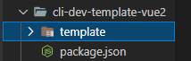

# 项目模板开发

模版项目代码提交至：[liugezhou-cli-dev-template](https://github.com/liugezhou/liugezhou-cli-dev-template)

项目模板建好后，npm publish发布至npm。


模板项目结构

```javascript
--xxx  // 某某模板
--|--template  // 存放项目模板
--|--package.json
```



# 脚手架请求项目模板API开发

- 在utils下创建包： lerna create @cloudscope-cli/request
- cd utils
- npm i -S axios

```javascript
// utils/request/lib.index

const axios = require('axios')
const baseURL = process.env.CLI_URL?process.env.CLI_URL:'https://liugezhou.com:7001'
const request = axios.create({
    baseURL,
  timeout:5000
})

request.interceptors.response.use({
 response =>{
    return response.data
    },
 error =>{
    return Promise.reject(error)
    }
})
module.exports = request
```

commands/init引入@cloudsope-cli/request包 新建 lib/getProjectTemplate

```javascript
const request = require('@cloudscope-cli/request')


modules.exports = function(){
    return    request({
      url:'/project/template'
  })
}
// commands/init/lib/index.js
const getProjectTemplate = require('./getProjectTemplate')
const template = getProjectTemplate()
```

最后在测试项目下测试，打印template，成功。

