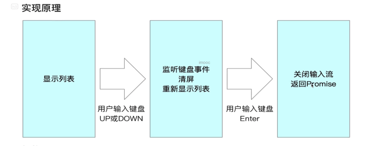
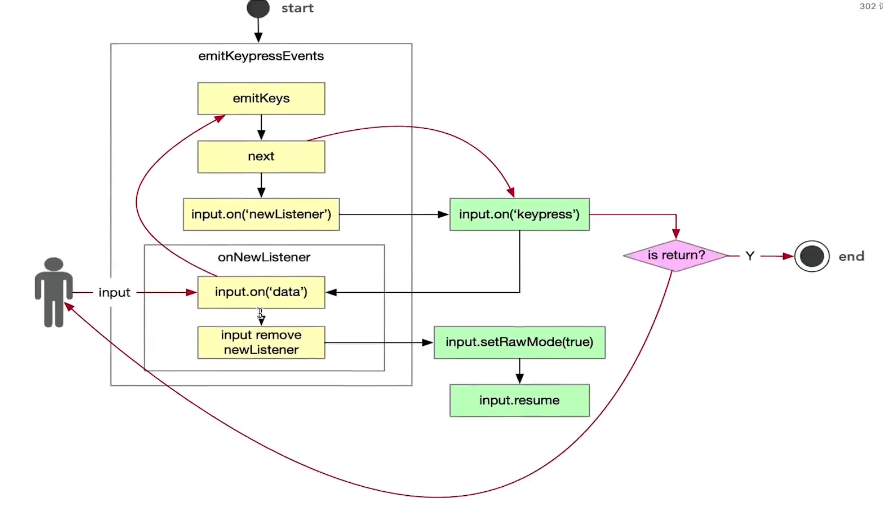

学习目标

- 掌握 readline/events/stream/ansi-escapes/rxjs
- 掌握命令行交互的实现原理，并实现一个可交互的列表
- 分析inquirer源码掌握其中的关键实现

# 如何开发命令行交互列表

# readline的使用方法和实现原理

## 使用

readline是Node.js中的一个内置库，主要是用来管理输入流的

```javascript
const readline = require('readline')

const rl = readline.createInterface({
    input:process.stdin,
    output:process.stdout
})

rl.question('your name:',(answer =>{
    console.log('your name is:'+answer)
    rl.close()
}))
```

# 源码分析

- 强制将函数转为构建函数

```javascript
function Interface(input, output, completer, terminal) {
  if (!(this instanceof Interface)) {
    return new Interface(input, output, completer, terminal);
  }
     ………… 
}
```

- 获得事件驱动能力：EventEmitter.call(this);
- 监听键盘事件：

```javascript
emitKeypressEvents(input, this);

// `input` usually refers to stdin
input.on('keypress', onkeypress);
input.on('end', ontermend);
```

## 深入讲解readline键盘输入监听实现原理







若有收获，就点个赞吧