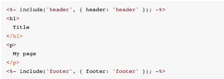
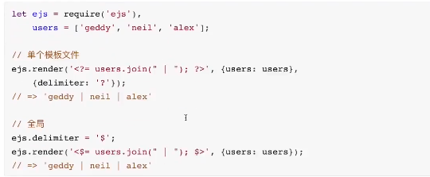

# ejs用法

ejs主要用于模版渲染的。jsp、php是之前模版渲染的代表。ejs的实现与jsp非常类似。

- ejs.compile(html,options)(data)

```javascript
const ejs = require('ejs')
const path = require('path')
//第一种方法
const html ='<div><%= user.name%></div>'
const options = {}
const data ={
    user:{
        name:'liugezhou'
    }
}

const template = ejs.compile(html,options) //// 返回一个用于解析html中模板的 function

const compileTemplate = template(data)

console.log(compileTemplate)   //<div>liugezhou</div>

//第二种用法
const renderTemplate = ejs.render(html,data,options)
console.log(renderTemplate)

//第三种用法
const renderFile = ejs.renderFile(path.resolve(__dirname,'template.html'),data,options)
renderFile.then(file => console.log(file))
```

## 标签含义

```javascript
<% : '脚本'标签，用于流程控制，无输出。
<%= : 输出数据到模版(输出是转义 Html 标签)
<%- : 输出非转义的数据到模版
<%# : 注释标签，不执行、不输出内容，但是会占空间。
<%% 输出字符串 '<%'
%>: 一般结束符
<%_ : 删除前面空格空符
-%>: 删除紧随其后的换行符
_%>: 删除后面空格字符
```

## 包含




## 自定义分隔符

- 自定义分隔符: 我们上面默认使用的是%，我们只需要在options参数中定义 delimiter这个参数即可




## 自定义文件加载器

- 自定义文件加载器: 在使用ejs.renderFile读取文件之前，可以使用ejs.fileLoader做一些操作

```javascript
ejs.fileLoader = function(filePath){
    const content = fs.readFileSync(filePath)
  return '<div><%= user.copyright %></div>' + content
}
```

# glob用法

参考网址：https://www.imooc.com/article/4053

npm仓库：https:// www.npmjs.com/package/glob

glob最早是出现在类Unix系统的命令中的，用来匹配文件路径。

```javascript
const glob = require('glob')

glob('**/*.js',{ignore:['node_modules/**','webpack.config.js']},function(err,file){
    console.log(file)
})
```


若有收获，就点个赞吧
