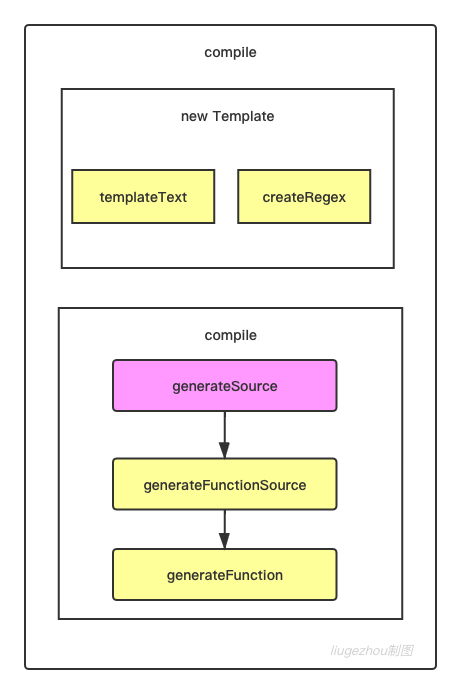

# 1. ejs.compile执行流程分析

ejs核心执行流程



本节内容较简单，我们打开webstore，从下面的代码开始调试（11行 打断点）

```javascript
const ejs = require('ejs')

const html = '<div><%= user.name %></div>'
const options = {}
const data = {
    user:{
    name:'liugezhou'
  }
}

const template = ejs.compile(html,options)
const compiletemplate = template(data)
//ejs.js
exports.compile = function compile(template, opts) {
  var templ;
  if (opts && opts.scope) {   //我们的opts传进来的参数为空，暂不看此判断逻辑
    ……
  }
  templ = new Template(template, opts);
  return templ.compile();
};
```

templ = new Template(template,opts) 我们继续进去源码，重要的有两点

- this.templateText = text
- this.regex = this.createRegex()

下节开始 templ.compile()

```javascript
function Template(text, opts) {
  opts = opts || {};
  var options = {};
  this.templateText = text;    //⭐️⭐️⭐️
  this.mode = null;
  this.truncate = false;
  this.currentLine = 1;
  this.source = '';
  options.client = opts.client || false;
  options.escapeFunction = opts.escape || opts.escapeFunction || utils.escapeXML;
  options.compileDebug = opts.compileDebug !== false;
  options.debug = !!opts.debug;
  options.filename = opts.filename;
  options.openDelimiter = opts.openDelimiter || exports.openDelimiter || _DEFAULT_OPEN_DELIMITER;
  options.closeDelimiter = opts.closeDelimiter || exports.closeDelimiter || _DEFAULT_CLOSE_DELIMITER;
  options.delimiter = opts.delimiter || exports.delimiter || _DEFAULT_DELIMITER;
  options.strict = opts.strict || false;
  options.context = opts.context;
  options.cache = opts.cache || false;
  options.rmWhitespace = opts.rmWhitespace;
  options.root = opts.root;
  options.includer = opts.includer;
  options.outputFunctionName = opts.outputFunctionName;
  options.localsName = opts.localsName || exports.localsName || _DEFAULT_LOCALS_NAME;
  options.views = opts.views;
  options.async = opts.async;
  options.destructuredLocals = opts.destructuredLocals;
  options.legacyInclude = typeof opts.legacyInclude != 'undefined' ? !!opts.legacyInclude : true;

  if (options.strict) {
    options._with = false;
  }
  else {
    options._with = typeof opts._with != 'undefined' ? opts._with : true;
  }

  this.opts = options;

  this.regex = this.createRegex();  // ⭐️⭐️⭐️：该方法是对ejs标识符号%与开始结尾符号<>，进行定制化操作
}
```

# 2. 深入讲解ejs编译原理

上一节我们看到了 return templet.compile()处，源代码如下

```javascript
compile: function () {

    var src;
    var fn;
    var opts = this.opts;
    var prepended = '';
    var appended = '';
    var escapeFn = opts.escapeFunction;
    var ctor;
    var sanitizedFilename = opts.filename ? JSON.stringify(opts.filename) : 'undefined';

    if (!this.source) {
      this.generateSource();   //⭐️⭐️⭐️⭐️⭐️
      prepended +=
        '  var __output = "";\n' +
        '  function __append(s) { if (s !== undefined && s !== null) __output += s }\n';
      if (opts.outputFunctionName) {
        prepended += '  var ' + opts.outputFunctionName + ' = __append;' + '\n';
      }
      if (opts.destructuredLocals && opts.destructuredLocals.length) {
        var destructuring = '  var __locals = (' + opts.localsName + ' || {}),\n';
        for (var i = 0; i < opts.destructuredLocals.length; i++) {
          var name = opts.destructuredLocals[i];
          if (i > 0) {
            destructuring += ',\n  ';
          }
          destructuring += name + ' = __locals.' + name;
        }
        prepended += destructuring + ';\n';
      }
      if (opts._with !== false) {
        prepended +=  '  with (' + opts.localsName + ' || {}) {' + '\n';
        appended += '  }' + '\n';
      }
      appended += '  return __output;' + '\n';
      this.source = prepended + this.source + appended;
    }

    if (opts.compileDebug) {
      src = 'var __line = 1' + '\n'
        + '  , __lines = ' + JSON.stringify(this.templateText) + '\n'
        + '  , __filename = ' + sanitizedFilename + ';' + '\n'
        + 'try {' + '\n'
        + this.source
        + '} catch (e) {' + '\n'
        + '  rethrow(e, __lines, __filename, __line, escapeFn);' + '\n'
        + '}' + '\n';
    }
    else {
      src = this.source;
    }

    if (opts.client) {
      src = 'escapeFn = escapeFn || ' + escapeFn.toString() + ';' + '\n' + src;
      if (opts.compileDebug) {
        src = 'rethrow = rethrow || ' + rethrow.toString() + ';' + '\n' + src;
      }
    }

    if (opts.strict) {
      src = '"use strict";\n' + src;
    }
    if (opts.debug) {
      console.log(src);
    }
    if (opts.compileDebug && opts.filename) {
      src = src + '\n'
        + '//# sourceURL=' + sanitizedFilename + '\n';
    }

    try {
      if (opts.async) {
        try {
          ctor = (new Function('return (async function(){}).constructor;'))();
        }
        catch(e) {
          if (e instanceof SyntaxError) {
            throw new Error('This environment does not support async/await');
          }
          else {
            throw e;
          }
        }
      }
      else {
        ctor = Function;
      }
      fn = new ctor(opts.localsName + ', escapeFn, include, rethrow', src);
    }
    catch(e) {
      // istanbul ignore else
      if (e instanceof SyntaxError) {
        if (opts.filename) {
          e.message += ' in ' + opts.filename;
        }
        e.message += ' while compiling ejs\n\n';
        e.message += 'If the above error is not helpful, you may want to try EJS-Lint:\n';
        e.message += 'https://github.com/RyanZim/EJS-Lint';
        if (!opts.async) {
          e.message += '\n';
          e.message += 'Or, if you meant to create an async function, pass `async: true` as an option.';
        }
      }
      throw e;
    }

    var returnedFn = opts.client ? fn : function anonymous(data) {
      var include = function (path, includeData) {
        var d = utils.shallowCopy({}, data);
        if (includeData) {
          d = utils.shallowCopy(d, includeData);
        }
        return includeFile(path, opts)(d);
      };
      return fn.apply(opts.context, [data || {}, escapeFn, include, rethrow]);
    };
    if (opts.filename && typeof Object.defineProperty === 'function') {
      var filename = opts.filename;
      var basename = path.basename(filename, path.extname(filename));
      try {
        Object.defineProperty(returnedFn, 'name', {
          value: basename,
          writable: false,
          enumerable: false,
          configurable: true
        });
      } catch (e) {/* ignore */}
    }
    return returnedFn;
  },
```

## generateSource：（最终拿到结果this.source）

```javascript
 generateSource: function () {
    var opts = this.opts;


    // Slurp spaces and tabs before <%_ and after _%>
    this.templateText =
      this.templateText.replace(/[ \t]*<%_/gm, '<%_').replace(/_%>[ \t]*/gm, '_%>');

    var self = this;
    var matches = this.parseTemplateText();    //⭐️⭐️⭐️⭐️⭐️
    var d = this.opts.delimiter;
    var o = this.opts.openDelimiter;
    var c = this.opts.closeDelimiter;

    if (matches && matches.length) {
      matches.forEach(function (line, index) {   //⭐️⭐️⭐️⭐️⭐️
        var closing;
        if ( line.indexOf(o + d) === 0        // If it is a tag
          && line.indexOf(o + d + d) !== 0) { // and is not escaped
          closing = matches[index + 2];
          if (!(closing == d + c || closing == '-' + d + c || closing == '_' + d + c)) {
            throw new Error('Could not find matching close tag for "' + line + '".');
          }
        }
        self.scanLine(line); ////⭐️⭐️⭐️⭐️⭐️
      });
    }

  },
```

# 3. 动态生成Function+with用法讲解

上一节代码没有继续追踪，根据自己的源码一步一步调试，生一节调试到的代码为：

```javascript
// ejs.js  line662
fn = new ctor(opts.localsName + ', escapeFn, include, rethrow', src);
```

代码讲解： const ctor = Function; const fn = new ctor('a,b','console.log(a,b)') fn(1,2)

我们回到7-1节中基础代码，在optons加入参数debug为true，控制台输出内容为：

```javascript
var __line = 1
  , __lines = "<div><%= user.name%></div>"
  , __filename = undefined;
try {
  var __output = "";
  function __append(s) { if (s !== undefined && s !== null) __output += s }
  with (locals || {}) {
    ; __append("<div>")
    ; __append(escapeFn( user.name))
    ; __append("</div>")
  }
  return __output;
} catch (e) {
  rethrow(e, __lines, __filename, __line, escapeFn);
}
```

通过代码，我们看到了‘with’，现在前端with的使用已经很不常见且不推荐使用了，这里简单了解下：

```javascript
const ctx = {
    user:{
      name:'liugezhou'
  }
} 

with(ctx){
  console.log(user.name)   
}
```

# 4. ejs compile函数执行流程分析

apply简要解释

```javascript
function test(a,b,c){
    console.log(a,b,c)
  console.log(this.a)
}
test(1,2,3) //通常调用   // 1 2 3

test.apply({a:'applt'},[2,3,4]) // 2 3 4 
test.call({a:'call',2,3,4)    // 2 3 4
```

# ejs.render和renderFile原理讲解

ejs.render的代码执行流程为：

- const renderTemplate = ejs.render(html,data,options)
- exports.render ==> handleCache(opts, template)
- handleCache ==> return exports.compile(template, options);
- handleCache(opts, template)(data)

renderFile的原理讲解

1. const renderFile = ejs.renderFile(**path**.resolve(__dirname,'template.html'),data,options)
2. exports.renderFile
3. tryHandleCache(opts, data, cb)
4. handleCache(options)(data)

#  

