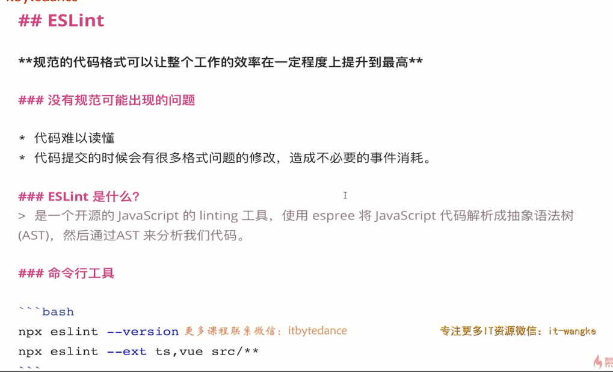
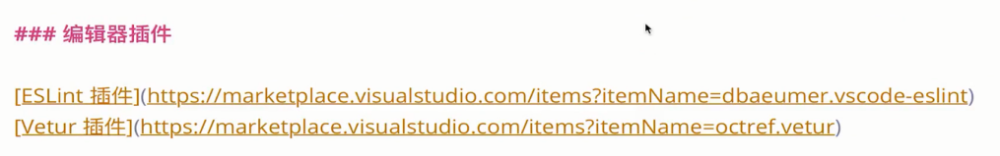
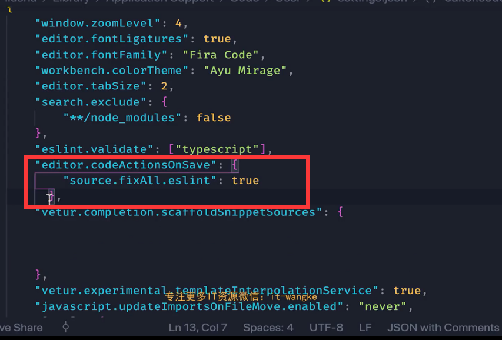

## ESLint 简介





## ESlint配置文件

- rules对应每一条规则的配置，具体可以查看官方文档[https://eslint.org/docs/rules/](https://eslint.org/docs/rules/)
- extends是预先配置好的一组规则，比如 `plugin:vue/vue3-essential`可以查看官方文档具体的规则[https://eslint.vuejs.org/rules/](https://eslint.vuejs.org/rules/)

```javascript
module.exports = {
  root: true,
  env: {
    node: true
  },
  'extends': [
    'plugin:vue/vue3-essential',
    'eslint:recommended',
    '@vue/typescript/recommended'
  ],
  parserOptions: {
    ecmaVersion: 2020
  },
  rules: {
    'no-console': process.env.NODE_ENV === 'production' ? 'warn' : 'off',
    'no-debugger': process.env.NODE_ENV === 'production' ? 'warn' : 'off'
  }
}

```

## VSCODE 的ESlint插件

在vscode安装eslint插件，可以使用自动修复的功能。

也可以在vscode的设置文件中，添加保存自动修复的功能。


