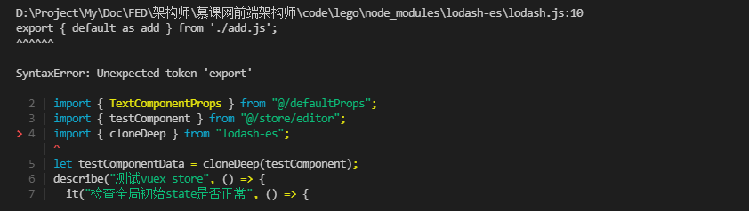
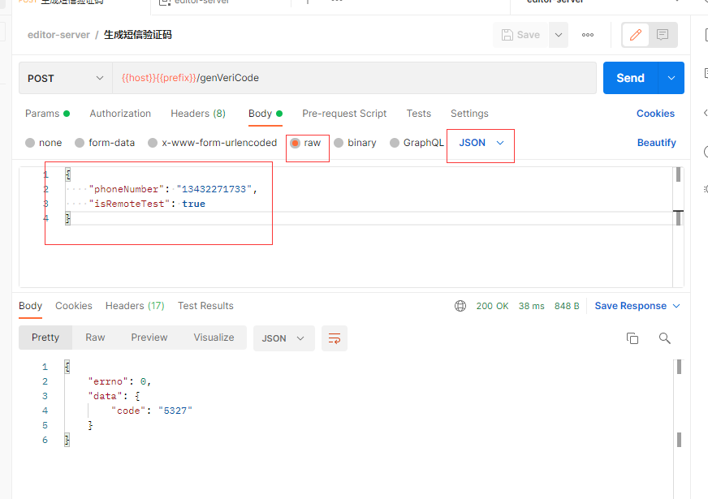
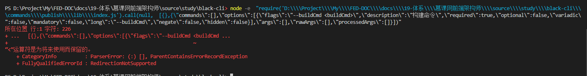

#### package.json在使用bin字段创建指令时，如果在 `bin/vue.js`文件中，顶部没有指定node环境地址，将无法执行。这里将 `#! /usr/bin/env node` 写成 `#! /user/bin/env node`导致，在window环境中生成cmd指令时报错。

正确的cmd指令

```bash
@ECHO off
GOTO start
:find_dp0
SET dp0=%~dp0
EXIT /b
:start
SETLOCAL
CALL :find_dp0

IF EXIST "%dp0%\node.exe" (
  SET "_prog=%dp0%\node.exe"
) ELSE (
  SET "_prog=node"
  SET PATHEXT=%PATHEXT:;.JS;=;%
)

endLocal & goto #_undefined_# 2>NUL || title %COMSPEC% & "%_prog%"  "%dp0%\node_modules\@black-cli\cli\bin\index.js" %*
```

错误的cmd指令

```bash
@ECHO off
GOTO start
:find_dp0
SET dp0=%~dp0
EXIT /b
:start
SETLOCAL
CALL :find_dp0

IF EXIST "%dp0%\/user/bin/env node.exe" (
  SET "_prog=%dp0%\/user/bin/env node.exe"
) ELSE (
  SET "_prog=node"
  SET PATHEXT=%PATHEXT:;.JS;=;%
)

endLocal & goto #_undefined_# 2>NUL || title %COMSPEC% & "%_prog%"  "%dp0%\node_modules\@black-cli\cli\bin\index.js" %*
```

#### 通过 `npm link`将自己链接到全局下，却不能通过 `npm unlink`删除自己在全局的链接

只能通过 `npm remove -g xxx`删除

#### 最新版的root-check为ES模块，得使用import()方法导入

如果在commonjs模块中使用es模块，参考：[Node.js 如何处理 ES6 模块](https://www.ruanyifeng.com/blog/2020/08/how-nodejs-use-es6-module.html)

#### 在package.json中声明 `files`字段，则使用 `npm publish`只会打包上传 `files`字段里的声明的文件夹

```json
{
 "files": [
    "dist"
  ],
}
```

#### 在vue-jest测试中，使用lodash-es会出现以下报错



在jest.config.js添加以下，可以解决

```javascript
module.exports = {
 
  transformIgnorePatterns: [
    '/!node_modules\\/lodash-es/'
  ]
}

```

#### postman请求`x-www-form-urlencoded`类型参数时，传参为Boolean布尔值，会转义成字符串，服务端要求使用boolean，会报错，比如editor-server的`/genVeriCode`接口

解决：不使用x-www-form-urlencoded，使用raw格式的json



### 使用`spawn('node', ['-e', code])`通过子进程执行代码时，在window环境下，如果`code`字符串出现`<`则会报错




### 在nodejs中使用es module时，__dirname未定义，因为__dirname、__filename只有在commonjs 中才有

在ES Module模块中，这些成员全都无法被支持，可以通过如下方式获取`__filename`与`__dirname`

```javascript
import { fileURLToPath } from 'url';
import { dirname } from 'path';

const __filename = fileURLToPath(import.meta.url);
const __dirname = dirname(import.meta.url)
复制代码
```

