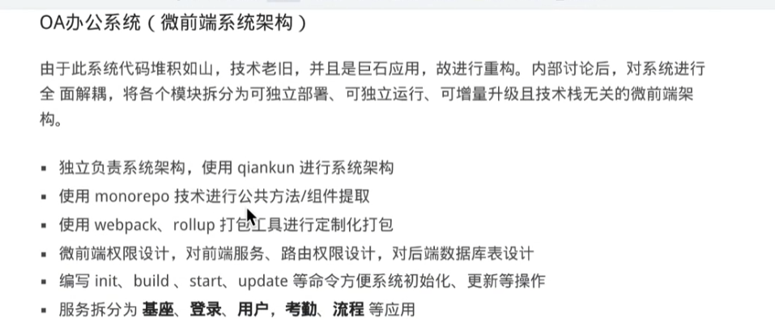

- 没有用户画像
- 一堆名词的堆，不好。

- 工作经历不写太多技术点，工作经历与项目经历分开
- 不要列功能点，要列出产品的特别点
- 不要把项目写成说明书
- 脚手架带来什么。

- 5，6 个不用上微前端，直接负分。
- 微前端主要用于异构，比如一个是vue，一个是react。如果只有5，6个人就用微前端，那就是前端构架有问题。
- 技术场景选错。
- 微前端不是一个正面的使用案例，而是负面的使用案例，一般不要使用。
- 切忌不要过度设计。

