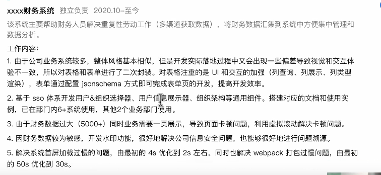
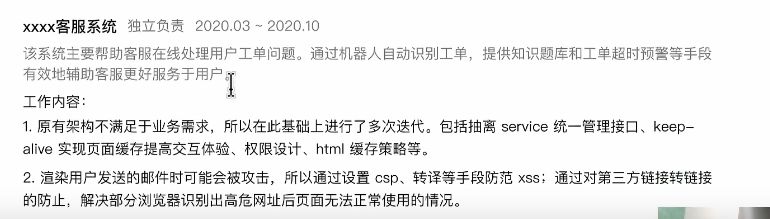
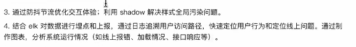
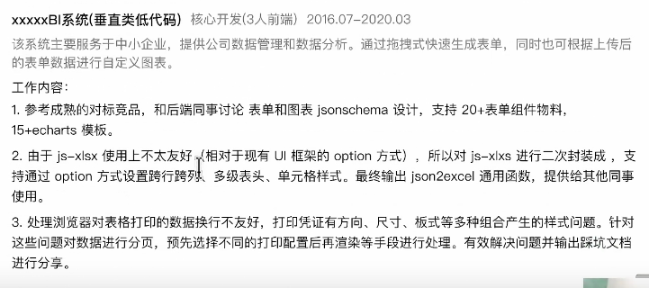
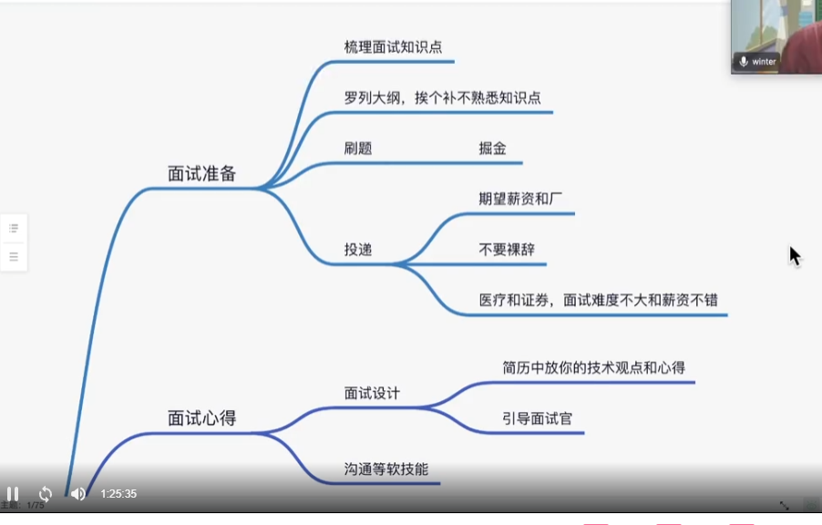
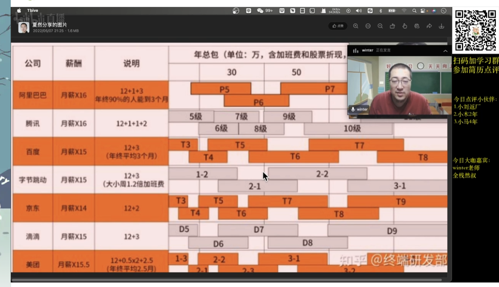

   - 基本信息清楚

     

- 如果是管理者，带上管理人数

- 工作内容，如果有亮点的就写，如果没有的话就不用写。

  

- 6年Vue框架开发经验是重点，可以放前面
- 8个业务系统构架设计与前端团队带队经验是两个维度，可以分开。
- 如果有特殊业务场景，可以写上。
- 

- 系统描述可以不用写，大家都知道的，就不用写了。
- 1 ：这个不错，遇到什么问题，通过怎么解决的，结果怎么样的。
  - 组件库的描述太过于啰嗦，可以改成这样：通过封组件库，统一公司业务系统的整体风格，提升研发效能。

- 2：这个描述有问题，SSO单点登录系统不包含这些。
- 3：这个不错
- 4：少了具体的解决方案
- 提问：
  - jsonchema如何提高表单的开发
  - vue如何通过jsonchema渲染组件的。
  - 虚拟滚动是什么原理的，是怎么实现虚拟滚动的。
  - 自己实现虚拟滚动的话，为什么不选择第三方已经实现的库，得有个前因后果。

提问：

	- elk是什么
	- 前端怎么上报错误，如何埋点
	- 线上是压缩过的代码，怎么知道是哪一个源代码的行数。

- 监控系统是自己独立建立的，这个是比已经有了要好太多了。

- 后台系统可以参加财务系统
- 肯定问虚拟滚动的，为什么自己做。
- 水印，识别： 零宽字符
- 首屏优化，4s加载2s不行，得到1s。
  - 减少体积：分包
  - CDN，HTTP2
    - 拿不到分，没有先分析，再去做。
- 注意第一个项目。

- HR:
  - 不要说公司管理混乱

