## 第一个人

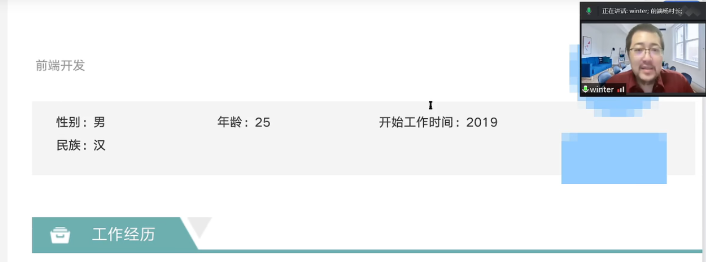

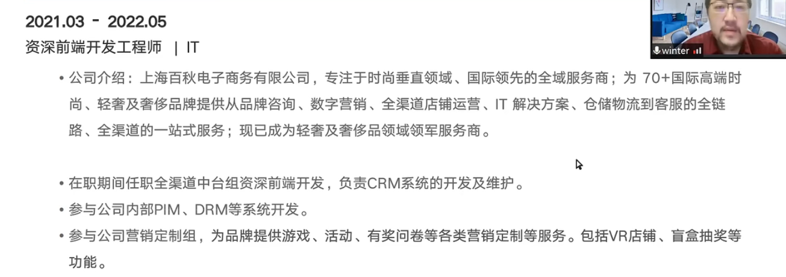

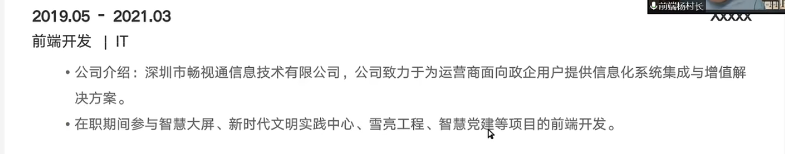

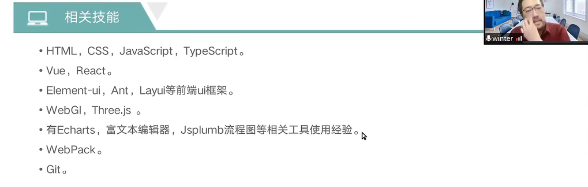

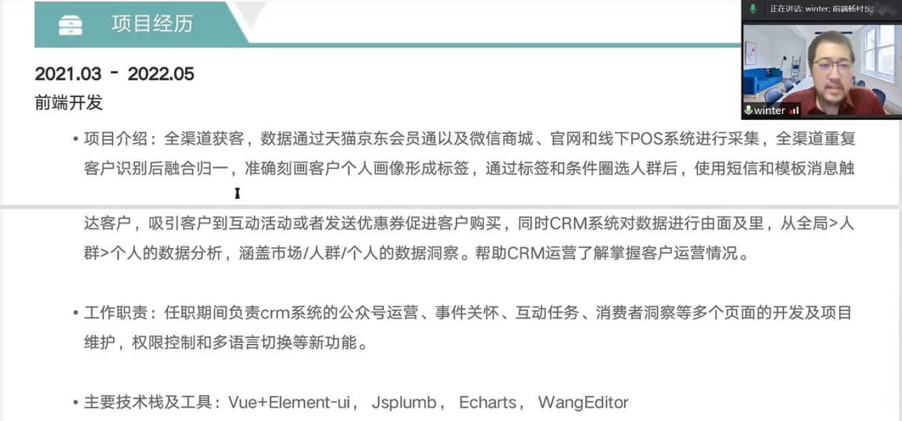

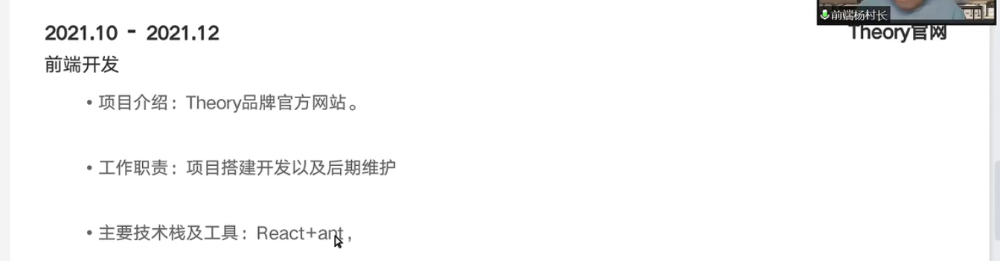

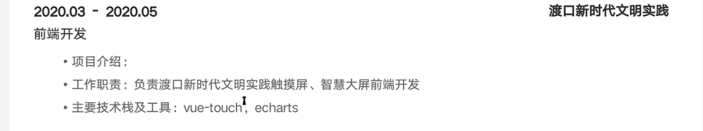

### 点评

面经：
1 面试要敢于提问
2 如果不知道，可以向面试管要点提示
3 不要过早放弃
4 面试过程，可以一边想思路，一边说，不要让面试管不耐烦
5 面试过程中要多和面试管互动

后台管理系统：
1 大数据优化，tree数据多卡顿，地址选择搜索大数据卡顿
2 虚拟滚动
3 大文件续传

## 第二个人

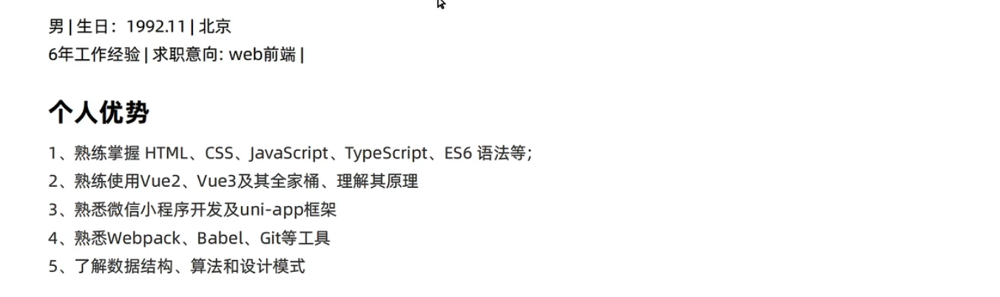

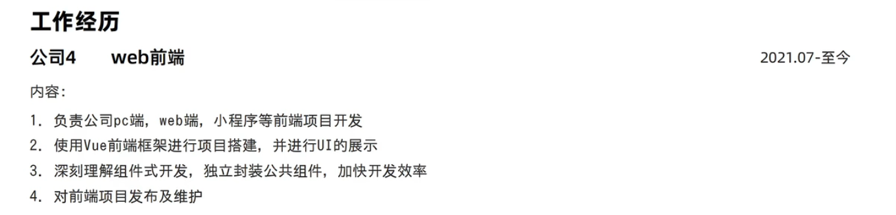

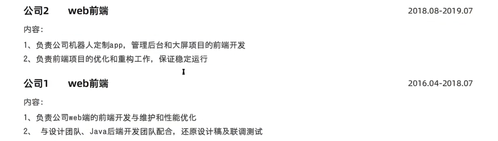

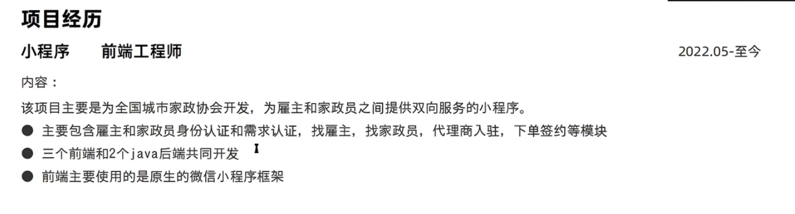

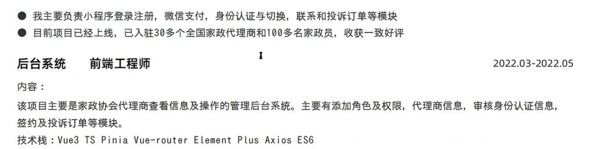

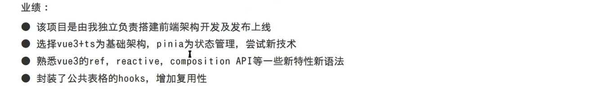

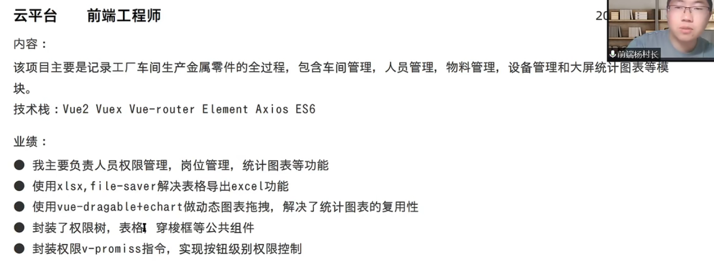

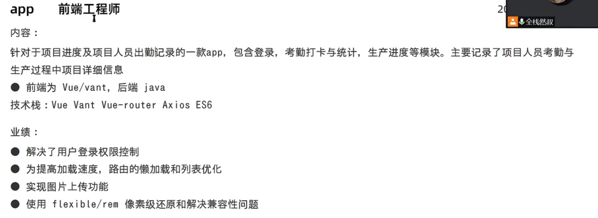

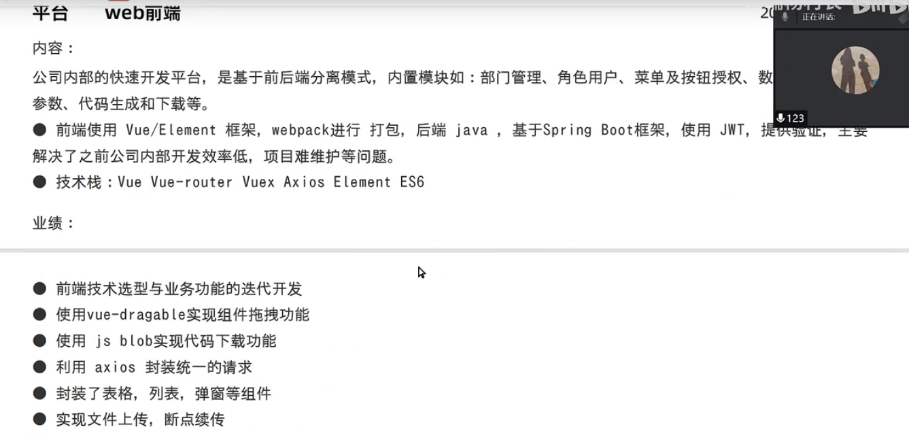

### 点评

1. 在工作经历上，不要写太多没有用的内容，突出职位，公司类型toB还是toC，公司规模，工作时间等
2. 小程序项目：
   1. 不要写包含哪个模块
   2. 写有几个人是确定的。
   3. 可以写负责业务开发或基础框架搭建。
   4. 没有写亮点
      1. 写的小程序和其他人有没有不一样？
      2. 小程序图片上传压缩
   5. 同一个项目多个系统，可以写在一个上，比如小程序与后台写在一起

## 第三个

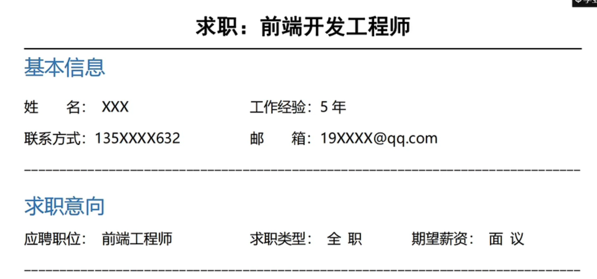

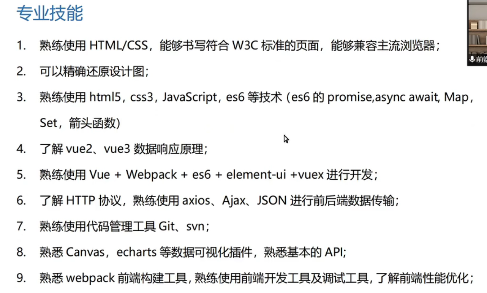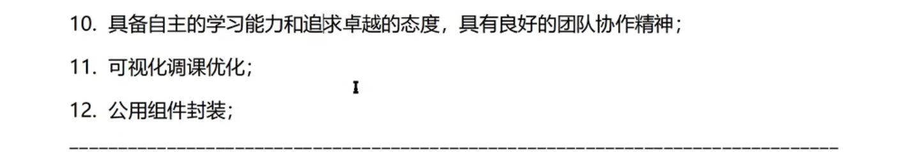

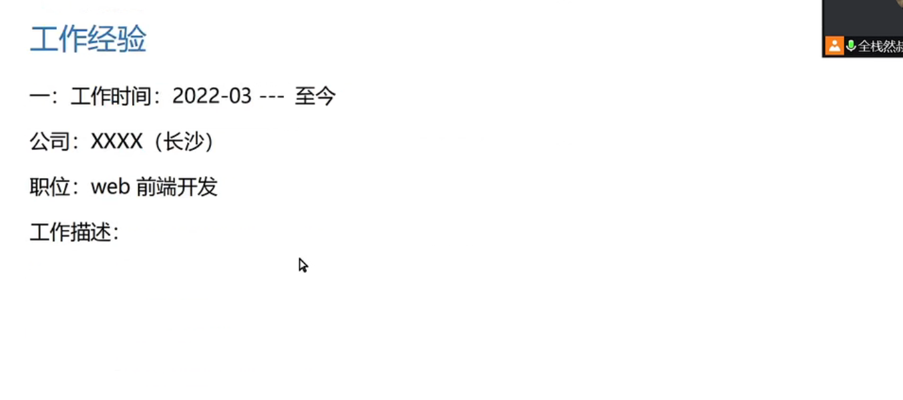

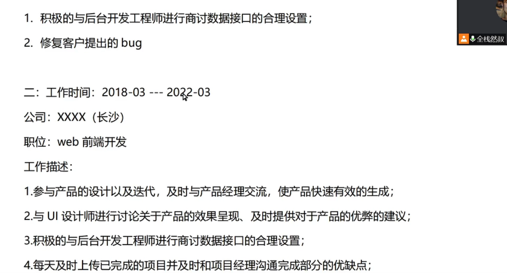

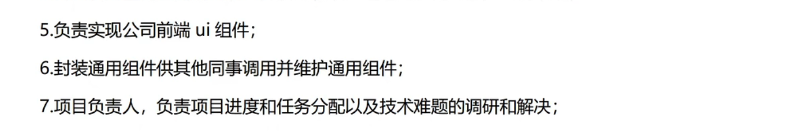

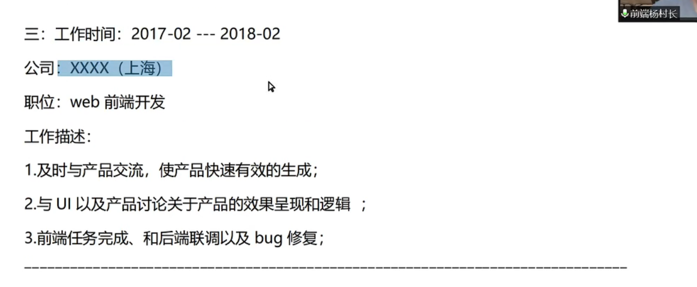

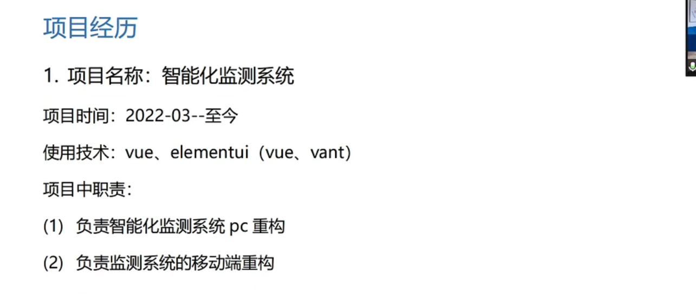

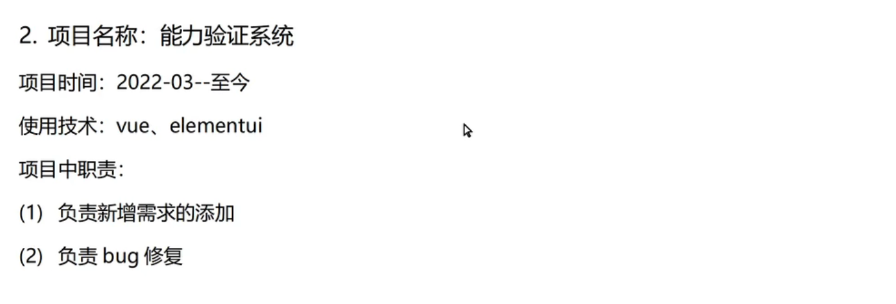

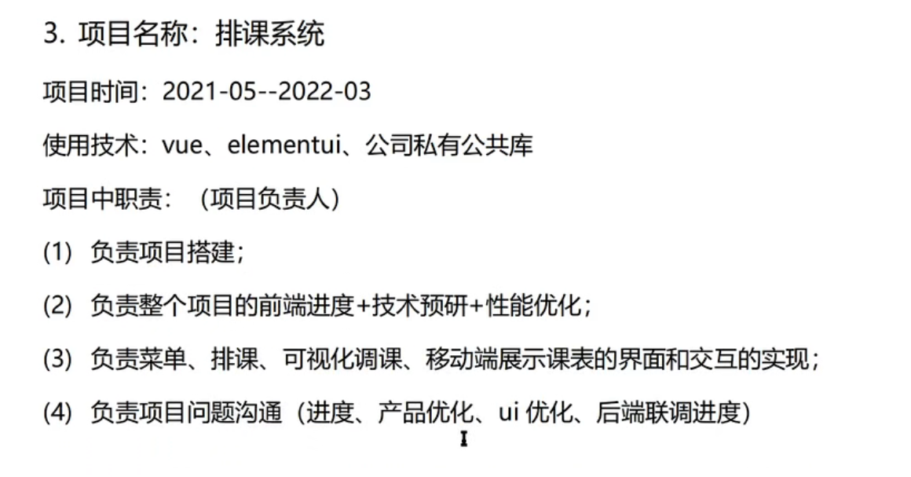

### 点评

- 专业技能写太多，要删除掉一些
  - canvas与echarts不是一个概念，不能放在一起
  - 1到7都可以合在一起
  - 写自己的擅长的技术栈，比如vue技术栈

- 工作描述写得不好，太多于啰嗦
  - 用什么技术栈，遇到什么问题，怎么解决什么问题。
- 如何描述解决一个问题？
  - 排查到一个异常，为什么会发生异常，怎么解决了异常。

