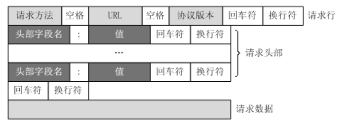

# 13节课上笔记

## 本阶段内容安排

网络的基础知识

net/http标准库

template模板语法

数据库相关(MySQL、Redis)

Web框架——gin框架

实战项目——博客项目

时间周期：4~5周

## 今日内容

### TCP三次握手

目标是：确定Client 和Server的**发送功能** 和 **接收功能** 都是正常的。

### TCP四次挥手

### TCP滑动窗口和流控制

https://mp.weixin.qq.com/s?src=11&timestamp=1587262450&ver=2287&signature=ADQocfiJpiBelWkejCVVvPlxEBnMJ7bggSLCaZin9Gu6jEJ2Xq2P3Z-Npu30CvObc*f-Zg4srw5HckZ8oBtDE99i37J8kpR*79IEhmGtnBdgfHfZdVviudrwPxzbIs*u&new=1

### TCP状态转换

#### 半关闭

#### 2MSL 和TIME_WAIT状态

https://zhuanlan.zhihu.com/p/126688315

### Web工作方式

**一个请求 对应 一个响应。**

**一个请求 对应 一个响应。**

**一个请求 对应 一个响应。**

**思考题：扫码登录是如何实现的？**

### HTTP协议

请求的格式

响应的格式

### HTTP状态码

常用的必须记住

### HTTP请求方法

### HTTPS

加密的HTTP

