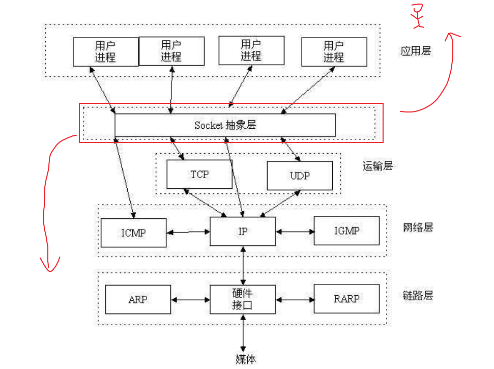
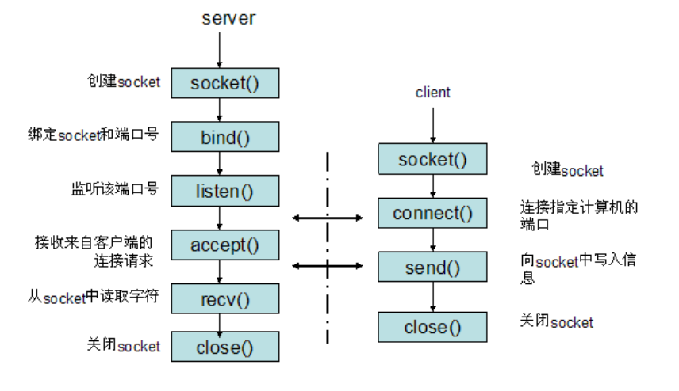
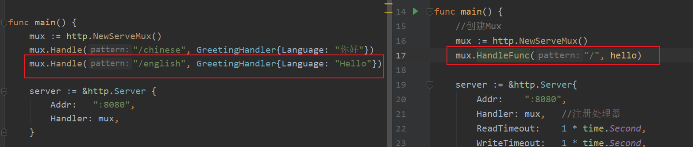
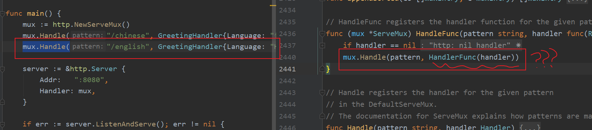
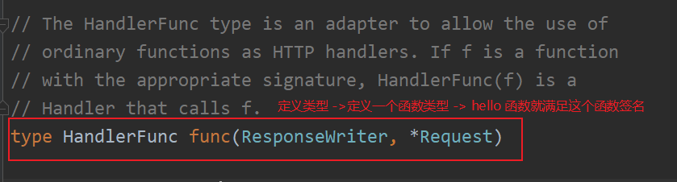
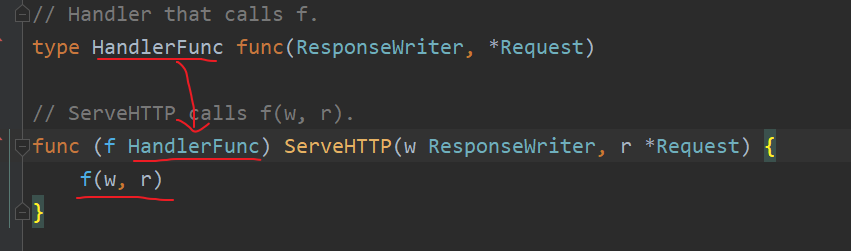

# 14节课上笔记

## 内容回顾

### 网络协议

1. 七层模型——应表会传网数物
2. TCP协议
   1. 三次握手和四次挥手
   2. TCP状态转换
   3. 滑动窗口和流控制
   4. TIME_WAIT和2MSL

### Web协议

目前基于HTTP/1.1的Web开发：一个请求对应一个响应。

1. HTTP协议
   1. 请求的数据格式
   2. 响应的数据格式
   3. HTTP状态码
   4. 请求的方法->用四种请求方法表示URI的四种状态。
      1. GET和POST的区别
2. HTTPS协议
   1. 在HTTP协议的基础上添加了一层SSL(加密)

**20:17 内容回顾完。**

## 今日内容

### Socket




基于TCP的socket开发流程：




### Go Web开发之net/http标准库

#### net/http示例

#### 请求流程梳理


#### 查看net/http源码

梳理整个Socket 流程 与 简单的socket demo 做类比！








类似于：

```go
type Haha int
var x = 10
Haha(x)
```

精髓：




### 本周作业

1. 把课上TCP Socket小例子改写成 client和server互相发消息的模式。
2. 把login_demo 例子修改为 使用一个login函数来处理GET和POST请求


### 建议

Go语言语法简单，没有特别多花里胡哨的语法，所以看源码没有很难！大家要多看优秀的源码！

