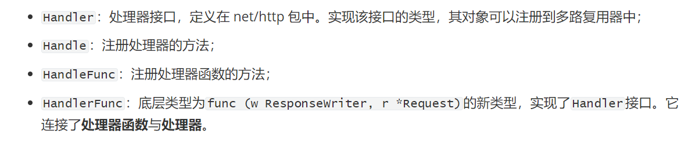
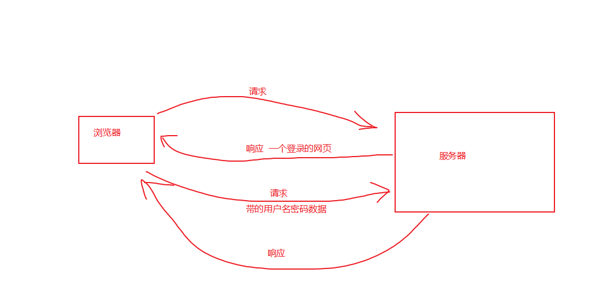
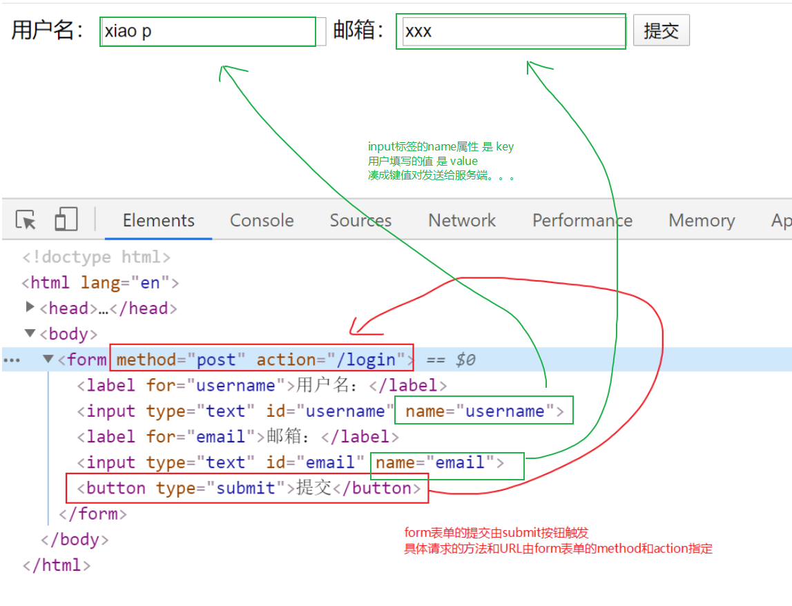
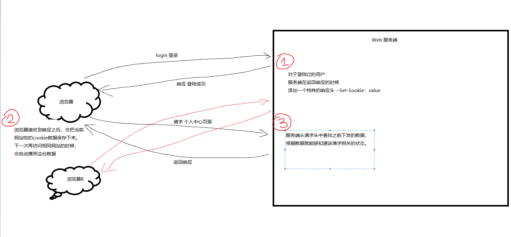
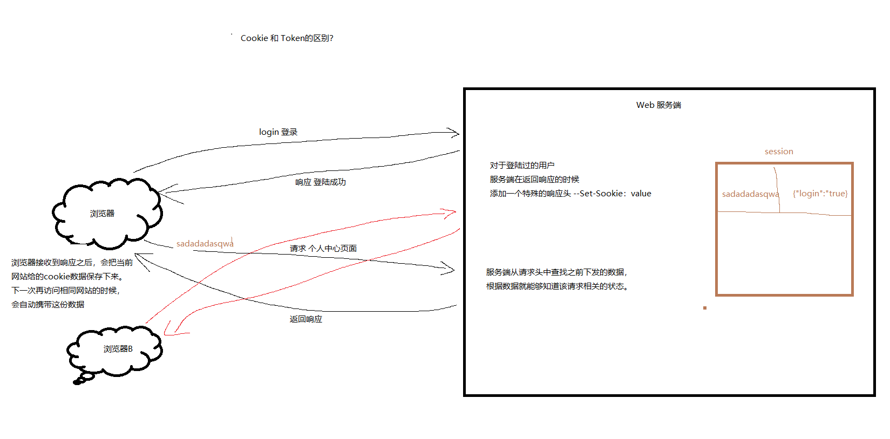

# 第15课课上笔记

## 内容回顾

### web开发协议

- web开发的流程
  - 一个请求（request）对应一个响应（response）
  - DNS 是个啥？

- HTTP协议
  - HTTP/1.1（主流） HTTP/2
  - HTTP请求的格式 / HTTP响应的格式  --> 如何在浏览器的调试窗口查看相关信息
  - HTTP响应的状态码 --> 200/404/301/302/403/503/500/504
- Socket
  - socker是一个抽象层，
  - 一个server/client端互相通信的练习 

- net/http 标准库

  - 我们通常用到的web框架都是基于`net/http`的二次开发

  - 多路复用器 --> 注册处理函数

  - URL的匹配

  - 看源码  --> 学习大牛们写的代码

    

  - 请求相关的数据

    - 请求方法
    - 请求的URL
    - Header
    - 请求的数据
      - JSON
      - 表单

  14:45内容回顾完。

## 今日内容

### net/http 标准库 请求相关

使用同一个处理函数，实现一个登录的示例

form表单注意事项

### 响应

### Cookie

为什么需要Cookie?

Cookie的原理？

Cookie、Token、Session的区别是什么？

net/http中的Cookie

- Cookie的数据结构
- 如何给响应设置Cookie
  - name
  - value
  - MaxAge
  - HttpOnly
- 如何从请求中获取Cookie 

遇事不决，写注释！

