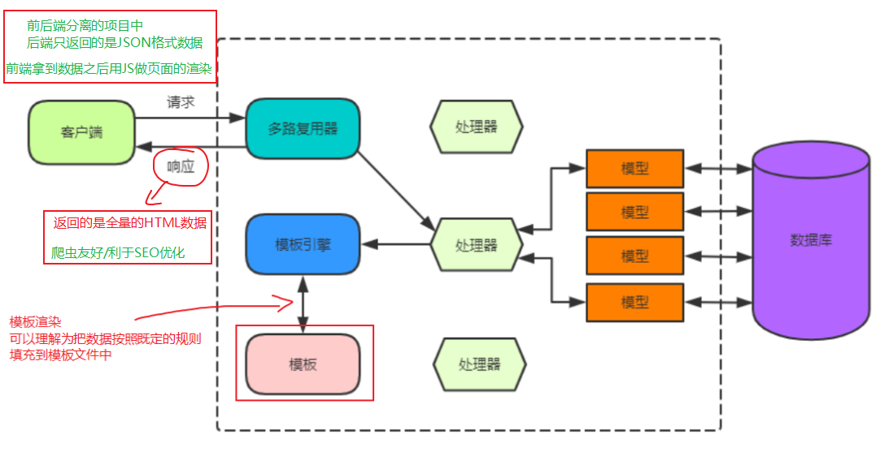
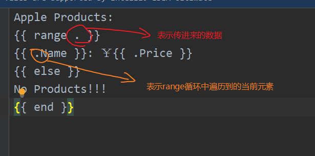
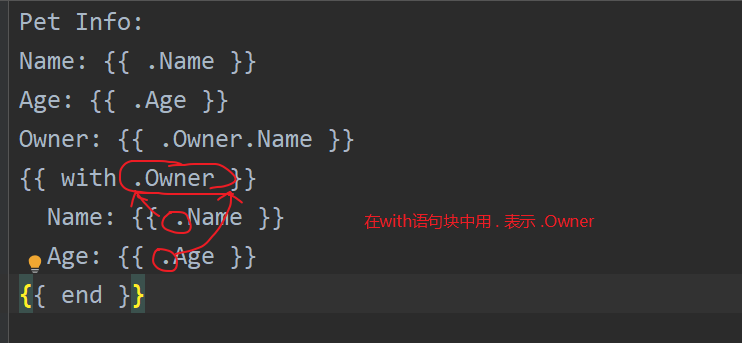

# 第16节课上笔记

## 内容回顾

### 前端相关

- form表单注意事项
  - method/action/enctype属性
  - 获取用户输入的标签需要有name属性
  - submit按钮触发表单提交
- Postman/curl 调试工具

### net/http 标准库中请求相关

- 解析form表单
  - ParseForm/ParseMultiForm
  - FormValue
- 解析JSON格式的数据（作业）
  -  从r.Body读取数据
  -  json.UnMarshal()反序列化

- 上传的文件的例子
  - 注意前端form表单中enctype属性
- http.Method开头的常量

### net/http标准库中响应相关

- 本身是一个接口
  - Write() --> 写响应体
  - Header()  --> Header --> `map[string][]string`（响应头的键值对数据）
    - Header的增删改查 -->  Add/Set/Get/Has/Del
  - WriteHeader(状态码)  
    - http.Status开头的常量

### net/http标准库中Cookie

- 理论知识
  - 为什么要有Cookie
  - Cookie的原理
  - Cookie/Token/Session的概念
- http.Cookie结构体
  - 常用字段 --> Name/Value/MaxAge/HttpOnly
  - 设置Cookie
    - w.Header().Set()
    - w.Header().Add()
    - http.SetCookie(w, &c1)
  - 获取Cookie
    - r.Header.Get("cookie")
    - r.Cookie("name")

- 登录示例 
  - 校验Cookie
  - 跳转  
    - 302状态码
    - 响应头中添加Location属性

20:19内容回顾完

## 今日内容

### 模板语言语法

#### 循环

不要忘记结尾的`{{ end }}`结束语句

### http/template

防止XSS攻击的效果

### gin框架初识

关于Go语言的框架：Beego/gin/echo/iris。。。

框架 ？--> 别人按照别人总结的做某件事的习惯整理的一个套路

gin 框架的优势 --> 社区庞大，框架本身性能也足够，简单易学

#### gin框架路由使用

## 本周作业

1. 把模板语法的例子自己敲一遍

2. 用gin框架实现一个登录的例子，把模板语法也能用上。

