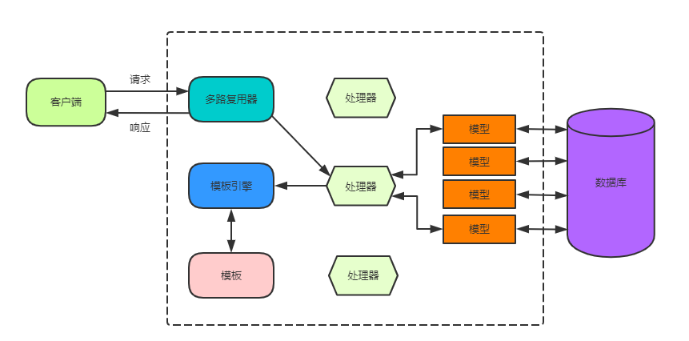

## 一、课前准备

> Web基础知识、HTML
>
> Go 1.10+


## 二、课堂主题

> 说明：


## 三、课堂目标

> 说明：完成本章课程案例


## 四、知识点（2小时40分钟）

> 

### 1. 模板引擎 = 把数据塞到模板里面

**模板引擎**是 Web 编程中必不可少的一个组件。**模板**能分离逻辑和数据，使得逻辑简洁清晰，并且模板可复用。



模板引擎按照功能可以划分为两种类型：

- **无逻辑模板引擎**：此类模板引擎只进行字符串的替换，无其它逻辑；
- **嵌入逻辑模板引擎**：此类模板引擎可以在模板中嵌入逻辑，实现流程控制/循环等。

这两类模板引擎都比较极端。无逻辑模板引擎需要在处理器中额外添加很多逻辑用于生成替换的文本。而嵌入逻辑模板引擎则在模板中混入了大量逻辑，导致维护性较差。常用的模板引擎一般介于这两者之间。

在 Go 标准库中，`text/template`和`html/template`两个库实现模板功能。

模板内容可以是 UTF-8 编码的任何内容。其中用`{{`和`}}`包围的部分称为**动作**，`{{}}`外的其它文本在输出保持不变。模板需要应用到数据，模板中的动作会根据数据生成响应的内容来替换。

模板解析之后可以多次执行，也可以并行执行，但是注意使用同一个`Writer`会导致输出交替出现。


#### 定义模板

使用模板引擎一般有 3 个步骤：

- 定义模板（直接使用字符串字面量或文件）；
- 解析模板（使用`text/template`或`html/template`中的方法解析）；
- 传入数据生成输出。

```go
package main

import (
	"log"
	"os"
	"text/template"
)

type User struct {
	Name string
	Age  int
}

func stringLiteralTemplate() {
	s := "My name is {{ .Name }}. I am {{ .Age }} years old.\n"
	t, err := template.New("test").Parse(s)
	if err != nil {
		log.Fatal("Parse string literal template error:", err)
	}

	u := User{Name: "lianshi", Age: 18}
	err = t.Execute(os.Stdout, u)
	if err != nil {
		log.Fatal("Execute string literal template error:", err)
	}
}

func fileTemplate() {
	t, err := template.ParseFiles("test")
	if err != nil {
		log.Fatal("Parse file template error:", err)
	}

	u := User{Name: "ls", Age: 18}
	err = t.Execute(os.Stdout, u)
	if err != nil {
		log.Fatal("Execute file template error:", err)
	}
}

func main() {
	stringLiteralTemplate()

	fileTemplate()
}
```

在可执行程序目录中新建模板文件`test`，并写入下面的内容：

```html
My name is {{ .Name }}. I am {{ .Age }} years old.
```

首先调用`template.New`创建一个模板，参数为模板名。

然后调用`Template`类型的`Parse`方法，解析模板字符串，生成模板主体。这个方法返回两个值。如果模板语法正确，则返回模板对象本身和一个 nil 值。 如果有语法错误，则返回一个 error 类型的值作为第二个返回值，这时不应该使用第一个返回值。

最后，调用模板对象的`Execute`方法，传入参数。`Execute`执行模板中的动作，将结果输出到`os.Stdout`，即**标准输出**。最终我们看到模板中`{{ .Name }}`被`u`的`Name`字段替换，`{{ .Age }}`被`u`的`Age`字段替换，标准输出中就显示我们填入内容的字符串：

上面代码中，`fileTemplate`函数还演示了如何从文件中加载模板。其中`template.ParseFiles`方法会创建一个模板，并将用户指定的模板文件名用作这个新模板的名字：

```go
t, err := template.ParseFiles("test")
```

相当于：

```go
t := template.New("test")
t, err := t.ParseFiles("test")
```

### 2. 模板动作

Go 模板中的动作就是一些嵌入在模板里面的命令。动作大体上可以分为以下几种类型：

- 点动作
- 条件动作
- 迭代动作
- 设置动作
- 包含动作

#### 点动作

在介绍其它的动作之前，我们先看一个很重要的动作，**点动作**（`{{ . }}`）。它其实代表是传递给模板的数据，其他动作或函数基本上都是对这个数据进行处理，以此来达到格式化和内容展示的目的。

对前面的代码示例稍作修改：

```go
func main() {
	s := "The user is {{ . }}."
	t, err := template.New("test").Parse(s)
	if err != nil {
		log.Fatal("Parse error:", err)
	}

	u := User{Name: "lianshi", Age: 18}
	err = t.Execute(os.Stdout, u)
	if err != nil {
		log.Fatal("Execute error:", err)
	}
}
```

运行程序，标准输出显示：

```
The user is {lianshi 18}.
```

实际上，`{{ . }}`会被替换为传给给模板的数据的字符串表示。这个字符串与以数据为参数调用`fmt.Sprint`函数得到的内容相同。我们可以为`User`结构编写一个方法：

```go
func (u User) String() string {
	return fmt.Sprintf("(name:%s age:%d)", u.Name, u.Age)
}
```

这样替换的字符串就是格式化之后的内容了：

```go
The user is (name:lianshi age:18).
```

注意：为了使用的方便和灵活，在模板中不同的上下文内，`.`的含义可能会改变。

#### 条件动作

Go 标准库中对动作有详细的介绍。 其中`pipeline`表示管道，后面会有详细的介绍，现在可以将它理解为一个值。 `T1/T2`等形式表示**语句块**，里面可以嵌套其它类型的动作。**最简单的语句块就是不包含任何动作的字符串**。

条件动作的语法与编程语言中的`if`语句语法类似，有几种形式：

形式一：

```go
{{ if pipeline }} T1 {{ end }}
```

如果管道计算出来的值不为空，执行`T1`。否则，不生成输出。下面都表示空值：

- `false`、0、空指针或接口；
- 长度为 0 的数组、切片、map或字符串。

形式二：

```
{{ if pipeline }} T1 {{ else }} T2 {{ end }}
```

如果管道计算出来的值不为空，执行`T1`。否则，执行`T2`。

形式三：

```
{{ if pipeline1 }} T1 {{ else if pipeline2 }} T2 {{ else }} T3 {{ end }}
```

如果管道`pipeline1`计算出来的值不为空，则执行`T1`。反之如果管道`pipeline2`的值不为空，执行`T2`。如果都为空，执行`T3`。

举个栗子：

```go
type AgeInfo struct {
	Age           int
	GreaterThan60 bool
	GreaterThan40 bool
}

func main() {
	t, err := template.ParseFiles("test")
	if err != nil {
		log.Fatal("Parse error:", err)
	}

	rand.Seed(time.Now().Unix())
	age := rand.Intn(100)
	info := AgeInfo {
		Age:           age,
		GreaterThan60: age > 60,
		GreaterThan40: age > 40,
	}
	err = t.Execute(os.Stdout, info)
	if err != nil {
		log.Fatal("Execute error:", err)
	}
}
```

在可执行程序的目录下新建模板文件`test`，键入下面的内容：

```go
Your age is: {{ .Age }}
{{ if .GreaterThan60 }}
Old People!
{{ else if .GreaterThan40 }}
Middle Aged!
{{ else }}
Young!
{{ end }}
```

运行程序，会随机一个年龄，然后根据年龄区间选择性输出`Old People!/Middle Age!/Young!`其中一个。下面是我运行两次运行的输出：

```
Your age is: 7

Young!

Your age is: 79

Old People!
```

这个程序有一个问题，会有多余的空格！我们之前说过，除了动作之外的任何文本都会原样保持，包括空格和换行！针对这个问题，有两种解决方案。第一种方案是删除多余的空格和换行，`test`文件修改为：

```go
Your age is: {{ .Age }}
{{ if .GreaterThan60 }}Old People!{{ else if .GreaterThan40 }}Middle Aged!{{ else }}Young!{{ end }}
```

显然，这个方法会导致模板内容很难阅读，不够理想。为此，Go 提供了针对空白符的处理。如果一个动作以`{{-`（注意有一个空格），那么该动作与它前面相邻的非空文本或动作间的空白符将会被全部删除。类似地，如果一个动作以`-}}`结尾，那么该动作与它后面相邻的非空文本或动作间的空白符将会被全部删除。例如：

```
{{23 -}} < {{- 45}}
```

将会生成输出：

```
23<45
```

回到我们的例子中，我们可以将`test`文件稍作修改：

```
Your age is: {{ .Age }}
{{ if .GreaterThan60 -}}
"Old People!"
{{- else if .GreaterThan40 -}}
"Middle Aged!"
{{- else -}}
"Young!"
{{- end }}
```

这样，输出的文本就不会包含多余的空格了。

#### 迭代动作

迭代其实与编程语言中的循环遍历类似。有两种形式：

形式一：

```
{{ range pipeline }} T1 {{ end }}
```

管道的值类型必须是数组、切片、map、channel。如果值的长度为 0，那么无输出。否则，**`.`被设置为当前遍历到的元素，然后执行`T1`，即在`T1`中`.`表示遍历的当前元素，而非传给模板的参数**。如果值是 map 类型，且键是可比较的基本类型，**元素将会以键的顺序访问**。

形式二：

```
{{ range pipeline }} T1 {{ else }} T2 {{ end }}
```

与前一种形式基本一样，如果值的长度为 0，那么执行`T2`。

例如：

```
type Item struct {
	Name	string
	Price	int
}

func main() {
	t, err := template.ParseFiles("test")
	if err != nil {
		log.Fatal("Parse error:", err)
	}

	items := []Item {
		{ "iPhone", 699 },
		{ "iPad", 799 },
		{ "iWatch", 199 },
		{ "MacBook", 999 },
	}

	err = t.Execute(os.Stdout, items)
	if err != nil {
		log.Fatal("Execute error:", err)
	}
}
```

在可执行程序目录下新建模板文件`test`，键入内容：

```
Apple Products:
{{ range . }}
{{ .Name }}: ￥{{ .Price }}
{{ else }}
No Products!!!
{{ end }}
```

运行程序，得到下面的输出：

```
Apple Products:

iPhone: ￥699

iPad: ￥799

iWatch: ￥199

MacBook: ￥999
```

在`range`语句循环体内，`.`被设置为当前遍历的元素，可以直接使用`{{ .Name }}`或`{{ .Price }}`访问产品名称和价格。在程序中，将`nil`传给`Execute`方法会得到下面的输出：

```
Apple Products:

No Products!!!
```

#### 设置动作

设置动作使用`with`关键字重定义`.`。在`with`语句内，`.`会被定义为指定的值。一般用在结构嵌套很深时，能起到简化代码的作用。

形式一：

```
{{ with pipeline }} T1 {{ end }}
```

如果管道值不为空，则将`.`设置为`pipeline`的值，然后执行`T1`。否则，不生成输出。

形式二：

```
{{ with pipeline }} T1 {{ else }} T2 {{ end }}
```

与前一种形式的不同之处在于当管道值为空时，不改变`.`执行`T2`。举个栗子：

```go
type User struct {
	Name string
	Age  int
}

type Pet struct {
	Name  string
	Age   int
	Owner User
}

func main() {
	t, err := template.ParseFiles("test")
	if err != nil {
		log.Fatal("Parse error:", err)
	}

	p := Pet {
		Name:  "Orange",
		Age:   2,
		Owner: User {
			Name: "ls",
			Age:  18,
		},
	}

	err = t.Execute(os.Stdout, p)
	if err != nil {
		log.Fatal("Execute error:", err)
	}
}
```

模板文件内容：

```go
Pet Info:
Name: {{ .Name }}
Age: {{ .Age }}
Owner:
{{ with .Owner }}
  Name: {{ .Name }}
  Age: {{ .Age }}
{{ end }}
```

运行程序，得到下面的输出：

```
Pet Info:
Name: Orange
Age: 2
Owner:

  Name: ls
  Age: 18
```

可见，在`with`语句内，`.`被替换成了`Owner`字段的值。

#### 包含动作

包含动作可以在一个模板中嵌入另一个模板，方便模板的复用。

形式一：

```
{{ template "name" }}
```

形式二：

```
{{ template "name" pipeline }}
```

其中`name`表示嵌入的模板名称。第一种形式，将使用`nil`作为传入内嵌模板的参数。第二种形式，管道`pipeline`的值将会作为参数传给内嵌的模板。举个栗子：

```go
package main

import (
	"log"
	"os"
	"text/template"
)

func main() {
	t, err := template.ParseFiles("test1", "test2")
	if err != nil {
		log.Fatal("Parse error:", err)
	}

	err = t.Execute(os.Stdout, "test data")
	if err != nil {
		log.Fatal("Execute error:", err)
	}
}
```

`ParseFiles`方法接收可变参数，可将任意多个文件名传给该方法。

模板`test1`:

```
This is in test1.
{{ template "test2" }}

{{ template "test2" . }}
```

模板`test2`:

```
This is in test2.
Get: {{ . }}.
```

运行程序得到输出：

```go
This is in test1.
This is in test2.
Get: <no value>.

This is in test2.
Get: test data.
```

前一个嵌入模板，没有传递参数。后一个传入`.`，即传给`test1`模板的参数。


### 检查点

> 说明：Go 提供的模板`text/template`比较简单易用


### 3. 其它元素

#### 注释

注释只有一种语法：

```html
{{ /* 注释 */ }}
```

注释的内容不会呈现在输出中，它就像代码注释一样，是为了让模板更易读。

#### 参数

一个参数就是模板中的一个值。它的取值有多种：

- 布尔值、字符串、字符、整数、浮点数、虚数和复数等**字面量**；
- 结构中的一个字段或 map 中的一个键。**结构的字段名必须是导出的，即大写字母开头，map 的键名则不必**；
- 一个函数或方法。必须只返回一个值，或者只返回一个值和一个错误。如果返回了非空的错误，则`Execute`方法执行终止，返回该错误给调用者；
- 等等等等。

上面几种形式可以结合使用：

```
{{ .Field1.Key1.Method1.Field2.Key2.Method2 }
```

其实，我们已经用过很多次参数了。下面看一个方法调用的栗子：

```go
type User struct {
	FirstName 	string
	LastName	string
}

func (u User) FullName() string {
	return u.FirstName + " " + u.LastName
}

func main() {
	t, err := template.ParseFiles("test")
	if err != nil {
		log.Fatal("Parse error:", err)
	}

	err = t.Execute(os.Stdout, User{FirstName: "ls", LastName: "lianshi"})
	if err != nil {
		log.Fatal("Execute error:", err)
	}
}
```

模板文件`test`：

```
My full name is {{ .FullName }}.
```

模板执行会使用`FullName`方法的返回值替换`{{ .FullName }}`，输出：

```
My full name is ls lianshi.
```

关于参数的几个要点：

- 参数可以是任何类型；
- 如果参数为指针，实现会根据需要取其基础类型；
- 如果参数计算得到一个函数类型，它不会自动调用。例如`{{ .Method1 }}`，如果`Method1`方法返回一个函数，那么返回值函数不会调用。如果要调用它，使用内置的`call`函数。

#### 管道

管道的语法与 Linux 中的管道类似，即**命令**的链式序列：

```
{{ p1 | p2 | p3 }}
```

每个单独的命令（即`p1/p2/p3...`）可以是下面三种类型：

- 参数，见上面；
- 可能带有参数的方法调用；
- 可能带有参数的函数调用。

**在一个链式管道中，每个命令的结果会作为下一个命令的最后一个参数。最后一个命令的结果作为整个管道的值。**

管道必须只返回一个值，或者只返回一个值和一个错误。如果返回了非空的错误，那么`Execute`方法执行终止，并将该错误返回给调用者。

在迭代程序的基础上稍作修改：

```go
type Item struct {
	Name  string
	Price float64
	Num   int
}

func (item Item) Total() float64 {
	return item.Price * float64(item.Num)
}

func main() {
	t, err := template.ParseFiles("test")
	if err != nil {
		log.Fatal("Parse error:", err)
	}

	item := Item {"iPhone", 699.99, 2 }

	err = t.Execute(os.Stdout, item)
	if err != nil {
		log.Fatal("Execute error:", err)
	}
}
```

模板文件`test`：

```
Product: {{ .Name }}
Price: ￥{{ .Price }}
Num: {{ .Num }}
Total: ￥{{ .Total | printf "%.2f" }}
```

先调用`Item.Total`方法计算商品总价，然后使用`printf`格式化，保留两位小数。最终输出：

```
Product: iPhone
Price: ￥699.99
Num: 2
Total: ￥1399.98
```

`printf`是 Go 模板内置的函数，这样的函数还有很多。

#### 变量

在动作中，可以用管道的值定义一个变量。

```
$variable := pipeline
```

`$variable`为变量名，声明变量的动作不生成输出。

类似地，变量也可以重新赋值：

```
$variable = pipeline
```

在`range`动作中可以定义两个变量：

```
range $index, $element := range pipeline
```

这样就可以在循环中通过`$index`和`$element`访问索引和元素了。

变量的作用域持续到定义它的控制结构的`{{ end }}`动作。如果没有这样的控制结构，则持续到模板结束。模板调用不继承变量。

执行开始时，`$`被设置为传入的数据参数，即`.`的值。

#### 函数

Go 模板提供了大量的预定义函数，如果有特殊需求也可以实现自定义函数。模板执行时，遇到函数调用，先从模板自定义函数表中查找，而后查找全局函数表。预定义函数分为以下几类：

- 逻辑运算，`and/or/not`；
- 调用操作，`call`；
- 格式化操作，`print/printf/println`，与用参数直接调用`fmt.Sprint/Sprintf/Sprintln`得到的内容相同；
- 比较运算，`eq/ne/lt/le/gt/ge`。

在上面条件动作的示例代码中，我们在代码中计算出大小关系再传入模板，这样比较繁琐，可以直接使用比较运算简化。

有两点需要注意：

- 由于是函数调用，所有的参数都会被求值，没有**短路求值**； {{if p1 or p2}}
- 比较运算只作用于基本类型，且没有 Go 语法那么严格，例如可以比较有符号和无符号整数。

#### 自定义函数

默认情况下，模板中无自定义函数，可以使用模板的`Funcs`方法添加。下面我们实现一个格式化日期的自定义函数：

```go
package main

import (
	"log"
	"os"
	"text/template"
	"time"
)

func formatDate(t time.Time) string {
	return t.Format("2006-01-02")
}

func main() {
	funcMap := template.FuncMap {
		"fdate": formatDate,
	}
	t := template.New("test").Funcs(funcMap)
	t, err := t.ParseFiles("test")
	if err != nil {
		log.Fatal("Parse errr:", err)
	}

	err = t.Execute(os.Stdout, time.Now())
	if err != nil {
		log.Fatal("Exeute error:", err)
	}
}
```

模板文件`test`：

```
Today is {{ . | fdate }}.
```

模板的`Func`方法接受一个`template.FuncMap`类型变量，键为函数名，值为实际定义的函数。 可以一次设置多个自定义函数。自定义函数要求只返回一个值，或者返回一个值和一个错误。 设置之后就可以在模板中使用`fdate`了，输出：

```
Today is 2016-01-07.
```

这里不能使用`template.ParseFiles`，因为在解析模板文件的时候`fdate`未定义会导致解析失败。**必须先创建模板，调用`Funcs`设置自定义函数，然后再解析模板。**

### 4. 创建模板

模板的创建方式：

- 先调用`template.New`创建模板，然后使用`Parse/ParseFiles`解析模板内容；
- 直接使用`template.ParseFiles`创建并解析模板文件。

第一种方式，调用`template.New`创建模板时需要传入一个模板名字，后续调用`ParseFiles`可以传入一个或多个文件，这些文件中必须有一个**基础名**（即去掉路径部分）与模板名相同。如果没有文件名与模板名相同，则`Execute`调用失败，返回错误。例如：

```go
package main

import (
	"log"
	"os"
	"text/template"
)

func main() {
	t := template.New("test")
	t, err := t.ParseFiles("test1")

	if err != nil {
		log.Fatal("Parse error:", err)
	}

	err = t.Execute(os.Stdout, nil)
	if err != nil {
		log.Fatal("Execute error:", err)
	}
}
```

上面代码先创建模板`test`，然后解析文件`test1`。执行该程序会出现下面的错误：

```
Execute error:template: test: "test" is an incomplete or empty template
```

Why？

我们先来看看模板的结构：

```go
// src/text/template.go
type common struct {
	tmpl   map[string]*Template // Map from name to defined templates.
	option option
	muFuncs    sync.RWMutex // protects parseFuncs and execFuncs
	parseFuncs FuncMap
	execFuncs  map[string]reflect.Value
}

type Template struct {
	name string
	*parse.Tree
	*common
	leftDelim  string
	rightDelim string
}
```

模板结构`Template`中有一个字段`common`，`common`中又有一个字段`tmpl`保存名字到模板的映射。其实，最外层的`Template`结构是**主模板**，我们调用`Execute`方法时执行的就是主模板。 **执行`ParseFiles`方法时，每个文件都会生成一个模板。只有文件基础名与模板名相同时，该文件的内容才会解析到主模板中。这也是上面的程序执行失败的原因——主模板为空。** 其它文件解析生成**关联模板**，存储在字段`tmpl`中。

关联模板可以是在主模板中通过`{{ define }}`动作定义，或者在非主模板文件中定义。关联模板也可以执行，但是需要使用`ExecuteTemplate`方法，显式传入模板名：

```
func main()
    t := template.New("test")
    t, err := t.ParseFiles("test1")
    
    if err != nil {
    	log.Fatal("in associatedTemplate Parse error:", err)
    }
    
    err = t.ExecuteTemplate(os.Stdout, "test1", nil)
    if err != nil {
    	log.Fatal("in associatedTemplate Execute error:", err)
    }
}

```

第二种方式将创建和解析两步合并在一起了。`template.ParseFiles`方法将传入的第一个文件名作为模板名称，其余的文件（如果有的话）解析后存放在`tmpl`中。

```
t, err := template.ParseFiles("file1", "file2", "file3")
```

其实就等价于：

```
t := template.New("file1")
t, err := t.ParseFiles("file1", "file2", "file3")
```

少了不一致的可能性，所以调用`Execute`方法时不会出现上面的错误。

还有一种创建方式，使用`ParseGlob`函数。`ParseGlob`会对匹配给定模式的所有文件进行语法分析。

```go
func main() {
    t, err := template.ParseGlob("tmpl*.glob")
	if err != nil {
		log.Fatal("in globTemplate parse error:", err)
	}

	err = t.Execute(os.Stdout, nil)
	if err != nil {
		log.Fatal(err)
	}

	for i := 1; i <= 3; i++ {
		err = t.ExecuteTemplate(os.Stdout, fmt.Sprintf("tmpl%d.glob", i), nil)
		if err != nil {
			log.Fatal(err)
		}
	}
}
```

`ParseGlob`返回的模板以匹配的第一个文件基础名作为名称。`ParseGlob`解析时会对同一个目录下的文件进行排序，所以第一个文件总是固定的。

我们创建三个模板文件，`tmpl1.glob`：

```
In glob template file1.
```

`tmpl2.glob`：

```
In glob template file2.
```

`tmpl3.glob`：

```
In glob template file3.
```

最终输出为：

```
In glob template file1.
In glob template file1.
In glob template file2.
In glob template file3.
```

注意，**如果多个不同路径下的文件名相同，那么后解析的会覆盖之前的。**


#### 嵌套模板

在一个模板文件中还可以通过`{{ define }}`动作定义其它的模板，这些模板就是**嵌套模板**。模板定义必须在模板内容的最顶层，像 Go 程序中的全局变量一样。

嵌套模板一般用于**布局（layout）**。很多文本的结构其实非常固定，例如邮件有标题和正文，网页有首部、正文和尾部等。 我们可以为这些固定结构的每部分定义一个模板。

定义模板文件`layout.tmpl`：

```
{{ define "layout" }}
This is body.
{{ template "content" . }}
{{ end }}

{{ define "content" }}
This is {{ . }} content.
{{ end }}
```

上面定义了两个模板`layout`和`content`，`layout`中使用了`content`。执行这种方式定义的模板必须使用`ExecuteTemplate`方法：

```
func main() {
	t, err := template.ParseFiles("layout.tmpl")
	if err != nil {
		log.Fatal("Parse error:", err)
	}

	err = t.ExecuteTemplate(os.Stdout, "layout", "amazing")
	if err != nil {
		log.Fatal("Execute error:", err)
	}
}
```


#### 块动作

块动作其实就是定义一个默认模板，语法如下：

```
{{ block "name" arg }}
T1
{{ end }}
```

其实它就等价于定义一个模板，然后立即使用它：

```
{{ define "name" }}
T1
{{ end }}

{{ template "name" arg }}
```

如果后面定义了模板`content`，那么使用后面的定义，否则使用默认模板。

例如上面的示例中，我们将模板修改如下：

```
{{ define "layout" }}
This is body.
{{ block "content" . }}
This is default content.
{{ end }}
{{ end }}
```

去掉后面的`content`模板定义，执行`layout`时，`content`部分会显示默认值。


### 5. HTML模板

`text/template`库用于生成文本输出。在 Web 开发中，涉及到很多安全方面的问题。有些数据是用户输入的，不能直接替换到模板中，否则可能导致注入攻击。 Go 提供了`html/template`库处理这些问题。`html/template`提供了与`text/template`一样的接口。 我们通常使用`html/template`生成 HTML 输出。

#### HTML模板

`html/template`库的使用与`text/template`基本一样：

```go
package main

import (
	"fmt"
	"html/template"
	"log"
	"net/http"
)

func indexHandler(w http.ResponseWriter, r *http.Request) {
	t, err := template.ParseFiles("hello.html")
	if err != nil {
		w.WriteHeader(500)
		fmt.Fprint(w, err)
		return
	}

	t.Execute(w, "Hello World")
}

func main() {
	mux := http.NewServeMux()
	mux.HandleFunc("/", indexHandler)

	server := &http.Server {
		Addr:    ":8080",
		Handler: mux,
	}
	if err := server.ListenAndServe(); err != nil {
		log.Fatal(err)
	}
}
```

模板文件`hello.html`：

```html
<!DOCTYPE html>
<html lang="en">
<head>
	<meta charset="UTF-8">
	<meta name="viewport" content="width=device-width, initial-scale=1.0">
	<meta http-equiv="X-UA-Compatible" content="ie=edge">
	<title>Go Web</title>
</head>
<body>
	{{ . }}
</body>
</html>
```

模板中的`{{ . }}`会被替换为传入的数据"Hello World"，程序将模板执行后生成的文本通过`ResponseWriter`传回客户端。

打开浏览器，输入`localhost:8080`，即可看到"Hello World"页面。


为了编写示例代码的便利，在解析时不进行错误处理，`html/template`库提供了`Must`方法。 它接受两个参数，一个模板对象指针，一个错误。如果错误参数不为`nil`，直接 panic，否则返回模板对象指针。 使用`Must`方法简化上面的处理器：

```go
func indexHandler(w http.ResponseWriter, r *http.Request) {
    t := template.Must(template.ParseFiles("hello.html"))
    t.Execute(w, "Hello World")
}
```

html模板也有对应的动作：

**条件动作**

```go
func conditionHandler(w http.ResponseWriter, r *http.Request) {
	age, err := strconv.ParseInt(r.URL.Query().Get("age"), 10, 64)
	if err != nil {
		fmt.Fprint(w, err)
		return
	}

	t := template.Must(template.ParseFiles("condition.html"))
	t.Execute(w, age)
}

mux.HandleFunc("/condition", conditionHandler)
```

模板文件 condition.html 只有 body 部分不同：

```html
<p>Your age is: {{ . }}</p>
{{ if gt . 60 }}
<p>Old People!</p>
{{ else if gt . 40 }}
<p>Middle Aged!</p>
{{ else }}
<p>Young!</p>
{{ end }}
```

模板逻辑很简单，使用内置函数`gt`判断传入的年龄处于哪个区间，显示对应的文本。

编译、运行程序，打开浏览器，输入`localhost:8080/condition?age=10`。

#### 迭代动作

迭代动作一般用于生成一个列表。

```
type Item struct {
	Name	string
	Price	int
}

func iterateHandler(w http.ResponseWriter, r *http.Request) {
	t := template.Must(template.ParseFiles("iterate.html"))

	items := []Item {
		{ "iPhone", 5499 },
		{ "iPad", 6331 },
		{ "iWatch", 1499 },
		{ "MacBook", 8250 },
	}
	t.Execute(w, items)
}

mux.HandleFunc("/iterate", iterateHandler)
```

模板文件`iterate.html`：

```
<h1>Apple Products</h1>
<ul>
{{ range . }}
<li>{{ .Name }}: ￥{{ .Price }}</li>
{{ end }}
</ul>
```

再次提醒，在`{{ range }}`中，`.`会被替换为当前遍历的元素值。

#### 设置动作

设置动作允许用户在指定范围内为`.`设置值。

```go
type User struct {
	Name	string
	Age		int
}

type Pet struct {
	Name	string
	Age		int
	Owner	User
}

func setHandler(w http.ResponseWriter, r *http.Request) {
	t := template.Must(template.ParseFiles("set.html"))

	pet := Pet {
		Name:	"Orange",
		Age:	2,
		Owner:	User {
			Name:	"ls",
			Age:	18,
		},
	}
	t.Execute(w, pet)
}

mux.HandleFunc("/set", setHandler)
```

模板文件`set.html`：

```html
<h1>Pet Info</h1>
<p>Name: {{ .Name }}</p>
<p>Age: {{ .Age }}</p>
<p>Owner:</p>
{{ with .Owner }}
<p>Name: {{ .Name }}</p>
<p>Age: {{ .Age }}</p>
{{ end }}
```

在`{{ with .Owner }}`和`{{ end }}`之间，可以直接通过`{{ .Name }}`和`{{ .Age }}`访问宠物主人的信息。

#### 包含动作

包含动作允许用户在一个模板里面包含另一个模板，从而构造出嵌套的模板。

```go
func includeHandler(w http.ResponseWriter, r *http.Request) {
	t := template.Must(template.ParseFiles("include1.html", "include2.html"))
	t.Execute(w, "Hello World!")
}
```

模板`include1.html`：

```html
<!DOCTYPE html>
<html lang="en">
<head>
	<meta charset="UTF-8">
	<meta name="viewport" content="width=device-width, initial-scale=1.0">
	<meta http-equiv="X-UA-Compatible" content="ie=edge">
	<title>Go Web</title>
</head>
<body>
	<div>This is in template include1.html</div>
	<p>The value of dot is {{ . }}</p>
	<hr/>
	<p>Don't pass argument to include2.html:</p>
	{{ template "include2.html" }}
	<hr/>
	<p>Pass dot to include2.html</p>
	{{ template "include2.html" . }}
	<hr/>
</body>
</html>
```

模板`include2.html`：

```html
<p>Get dot of value [{{ . }}]</p>
```

`{{ template "include2.html" }}`未传入参数给模板`include2.html`，`{{ template "include2.html" . }}`将模板`include1.html`的参数传给了`include2.html`。

#### 管道

管道我们可以理解为数据的流向，在数据流向输出的每个阶段进行特定的处理。

```go
func pipelineHandler(w http.ResponseWriter, r *http.Request) {
	t := template.Must(template.ParseFiles("pipeline.html"))
	t.Execute(w, rand.Float64())
}

mux.HandleFunc("/pipeline", pipelineHandler)
```

模板文件`pipeline.html`：

```html
<p>{{ . | printf "%.2f" }}</p>
```

该程序实现的功能非常简单，将传入的浮点数格式化为只保留小数点后两位。`|`是管道符号，前面的输出将作为后面的输入（如果是函数或方法调用，前面的输出将作为最后一个参数）。 实际上，`{{ . | printf "%.2f" }}`的输出`fmt.Sprintf("%.2f", .表示的数据)`的返回字符串相同。

#### 函数

Go 模板库内置了一些基础的函数，如果要实现更为复杂的功能，可以自定义函数。

```go
func formateDate(t time.Time) string {
	return t.Format("2006-01-02")
}

func funcsHandler(w http.ResponseWriter, r *http.Request) {
	funcMap := template.FuncMap{ "fdate": formateDate }
	t := template.Must(template.New("funcs.html").Funcs(funcMap).ParseFiles("funcs.html"))
	t.Execute(w, time.Now())
}

mux.HandleFunc("/funcs", funcsHandler)
```

模板文件`funcs.html`：

```html
<div>Today is {{ . | fdate }}</div>
```

自定义函数可以接受任意多个参数，但是只能返回一个值，或者返回一个值和一个错误。 上面代码中，我们必须先通过`template.New`创建模板，然后调用`Funcs`设置自定义函数，最后再解析模板文件。 因为模板文件中使用了`fdate`，未设置之前会解析失败。

#### 上下文感知

上下文感知是`html/template`库的一个非常有趣的特性。根据需要替换的文本在文档中所处的位置，模板在显示这些内容的时候会对其进行相应的修改。 

上下文感知的一个常见用途就是对内容进行转义。如果需要显示的是 HTML 的内容，那么进行 HTML 转义。如果显示的是 JavaScript 内容，那么进行 JavaScript 转义。 Go 模板引擎还能识别出内容中的 URL 或 CSS，可以对它们实施正确的转义。

```go
func contextAwareHandler(w http.ResponseWriter, r *http.Request) {
	t := template.Must(template.ParseFiles("context-aware.html"))
	t.Execute(w, `He saied: <i>"She's alone?"</i>`)
}

mux.HandleFunc("/contextAware", contextAwareHandler)
```

模板文件`context-aware.html`：

```html
<div>{{ . }}</div>
<div><a href="/{{ . }}">Path</a></div>
<div><a href="/?q={{ . }}">Query</a></div>
<div><a onclick="f('{{ . }}')">JavaScript</a></div>
```

编译、运行程序，使用 curl 访问`localhost:8080/contextAware`，得到下面的内容：

```html
<!DOCTYPE html>
<html lang="en">
<head>
  <meta charset="UTF-8">
  <meta name="viewport" content="width=device-width, initial-scale=1.0">
  <meta http-equiv="X-UA-Compatible" content="ie=edge">
  <title>Go Web</title>
</head>
<body>
  <div>He saied: &lt;i&gt;&#34;She&#39;s alone?&#34;&lt;/i&gt;</div>
  <div><a href="/He%20saied:%20%3ci%3e%22She%27s%20alone?%22%3c/i%3e">Path</a></div>
  <div><a href="/?q=He%20saied%3a%20%3ci%3e%22She%27s%20alone%3f%22%3c%2fi%3e">Query</a></div>
  <div><a onclick="f('He saied: \x3ci\x3e\x22She\x27s alone?\x22\x3c\/i\x3e')">JavaScript</a></div>
</body>
</html>
```

我们依次来看，需要呈现的数据是`He saied: "She's alone?"`：

- 第一个`div`中，直接在页面中显示，其中 HTML 标签``和单、双引号都被转义了；
- 第二个`div`中，数据出现在 URL 的路径中，所有非法的路径字符都被转义了，包括空格、尖括号、单双引号；
- 第三个`div`中，数据出现在查询字符串中，除了 URL 路径中非法的字符，还有冒号（`:`）、问号（`?`）和斜杠也被转义了；
- 第四个`div`中，数据出现在 OnClick 代码中，单双引号和斜杠都被转义了。

这四种转义方式又有所不同，第一种转义为 HTML 字符实体，第二、三种转义为 URL 转义字符（`%`后跟字符编码的十六进制表示） ，第四种转义为 Go 中的十六进制字符表示。

### 6. 防御 XSS 攻击

XSS 是一种常见的攻击形式。在论坛之类的可以接受用户输入的网站，攻击者可以内容中添加`<script>` 标签。如果网站未对输入的内容进行处理， 其他用户浏览该页面时，`<script>` 标签中的内容就会被执行，泄露用户的私密信息或利用用户的权限做破坏。

```go
func xssHandler(w http.ResponseWriter, r *http.Request) {
	if r.Method == "POST" {
		t := template.Must(template.ParseFiles("xss-display.html"))
		t.Execute(w, r.FormValue("comment"))
	} else {
		t := template.Must(template.ParseFiles("xss-form.html"))
		t.Execute(w, nil)
	}
}

mux.HandleFunc("/xss", xssHandler)
```

模板文件`xss-form.html`：

```
<form action="/xss" method="post">
	Comment: <input name="comment" type="text">
	<hr/>
	<button id="submit">Submit</button>
</form>
```

模板文件`xss-display.html`：

```
{{ . }}
```

处理器中我们根据请求方法的不同进行不同的处理。GET 请求返回一个表单页面，POST 请求显示用户输入的评论信息。

正常的思路会触发我们插入的代码，但是`alert`代码并没有执行，为什么？

因为 Go 模板有上下文感知的功能，它检测到在 HTML 页面中，所以输入数据会被转义。查看网页源码可以看到转义后的结果。转义之后的代码就不会执行了。


那么如何才能不转义呢？`html/template`提供了`HTML`类型，Go 模板不会对该类型的变量进行转义。如果我们把上面的处理器修改为：

```go
func xssHandler(w http.ResponseWriter, r *http.Request) {
	if r.Method == "POST" {
		t := template.Must(template.ParseFiles("xss-display.html"))
		t.Execute(w, template.HTML(r.FormValue("comment")))
	} else {
		t := template.Must(template.ParseFiles("xss-form.html"))
		t.Execute(w, nil)
	}
}
```

再运行就能看到弹出的警告框。

### 检查点

> 说明：问题


## 五、拓展点

> 


## 六、总结

> 说明：
>
> 回顾本堂课所有知识点；


