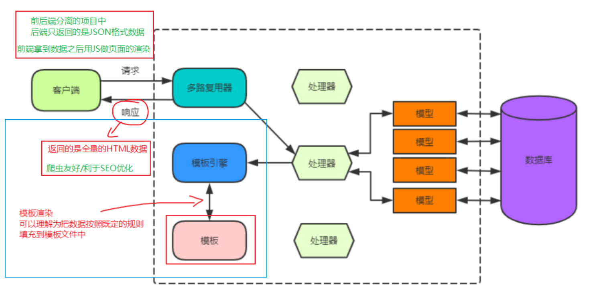
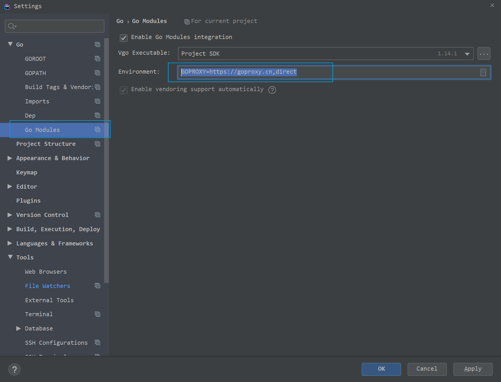
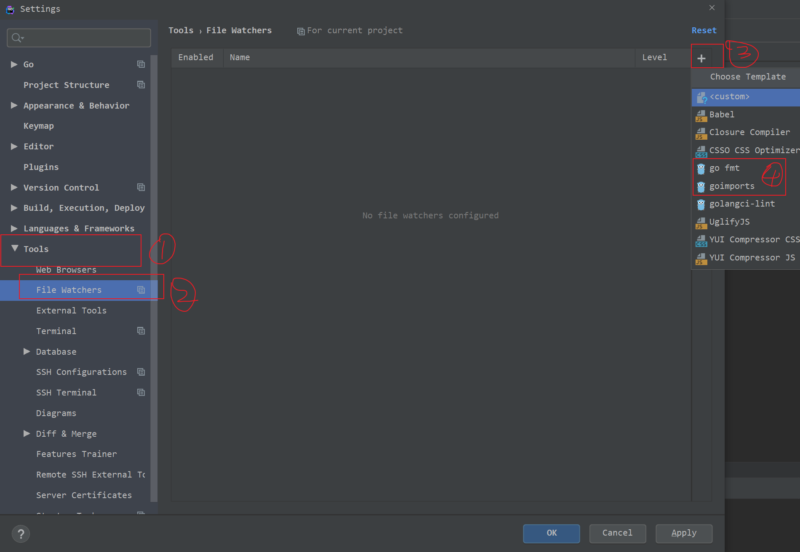
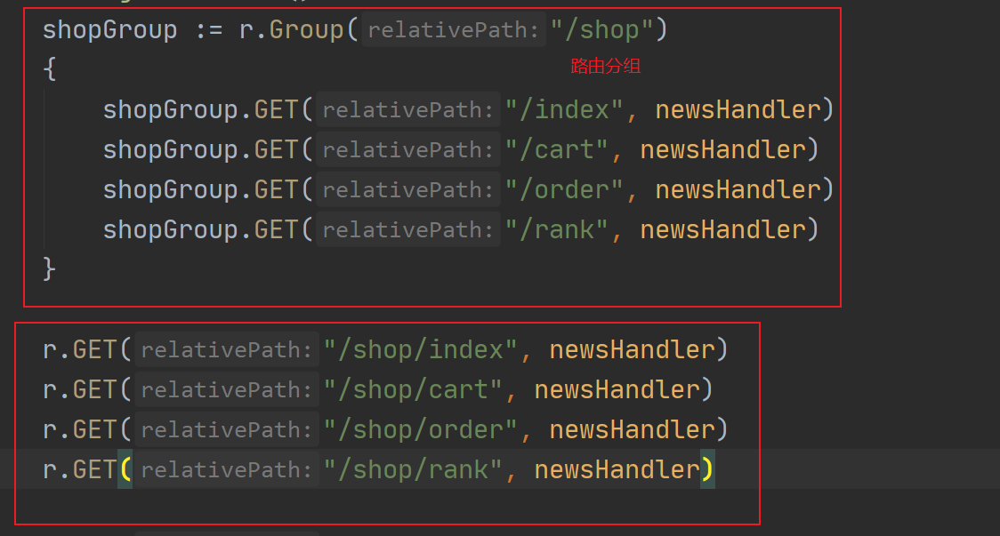
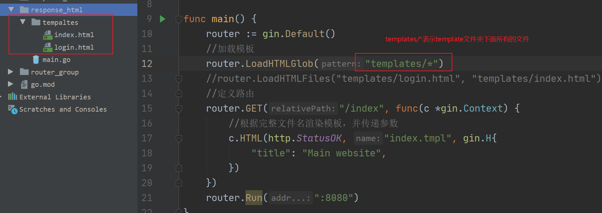
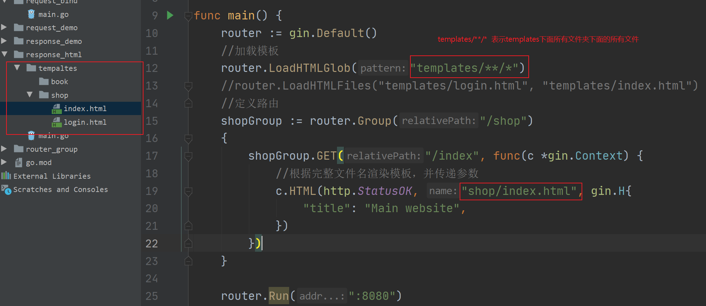
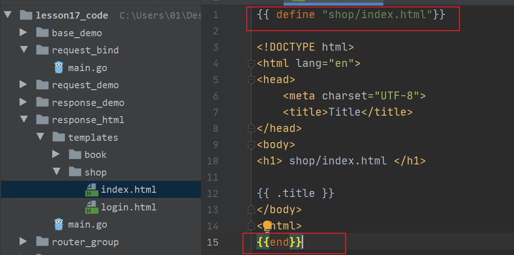
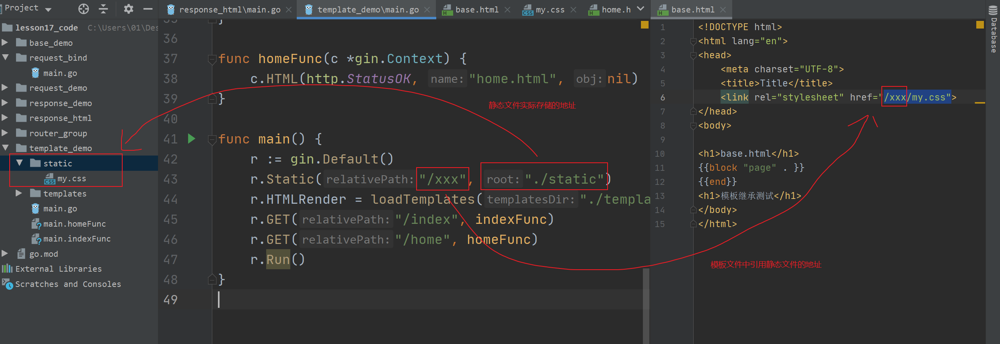

# 第17节课上笔记

## 内容回顾

### 前端渲染 VS 后端渲染

后端渲染：后端返回完整的HTML页面作为响应

前端渲染：浏览器端做渲染，后端只需要返回数据

前后端分离的架构好处：前后端解耦，分工更明确，而且解放了前端（前端可以做一些更复杂的交互逻辑）



### Go中的模板语法

- text/template 和 html/template
- html/template 针对HTML页面做了一些安全性的措施，对在HTML页面中有特殊含义的字符做了转义

### 模板语法的使用

- 定义模板
- 解析模板
- 模板渲染

### 模板语法

- 变量 `.`

- `{{}}`

- 条件语句

- range 循环

- with

- 管道符`|`

- 模板定义和模板嵌套

- 函数和自定义函数

  

14:52回顾完。

## 本节内容

### gin框架

gin中文文档：https://gin-gonic.com/zh-cn/docs/

Go社区的Web框架基本分为以下两种路子：

- net/http
- fasthttp

#### 基本示例

```go
package main
import (
	"github.com/gin-gonic/gin"
	"net/http"
)
func main() {
	router := gin.Default()

	// 添加 Get 请求路由
	router.GET("/", func(c *gin.Context) {
		c.String(http.StatusOK, "hello gin")
	})

	router.Run()
}
```

#### server

gin底层用的就是`net/http`,server有以下三种模式：

```go
//router.Run()
//http.ListenAndServe(":8080", router)
s := &http.Server{
	Addr:           ":8080",
	Handler:        router,
	ReadTimeout:    10 * time.Second,
	WriteTimeout:   10 * time.Second,
	MaxHeaderBytes: 1 << 20,
}
s.ListenAndServe()
```

#### 路由

路由对象

```go
router := gin.Default()  // 1. 比下面New()多了两个中间件，Logger()和Recovery()
//router := gin.New()  // 2.
```

##### 注册路由

```go
router.GET("/someGet", getting)
router.POST("/somePost", posting)
router.PUT("/somePut", putting)
router.DELETE("/someDelete", deleting)
router.PATCH("/somePatch", patching)
router.HEAD("/someHead", head)
router.OPTIONS("/someOptions", options)

router.Any("/", handler)

router.NoRoute(handler404)
```





#### 单元测试

单元测试是什么？

程序员自己写程序测试自己的程序。

文件名以`_test.go`

测试函数以`Test`开头

```go
import (
	"net/http"
	"net/http/httptest"
	"testing"

	"github.com/stretchr/testify/assert"
)

func TestSomeGetHandler(t *testing.T) {
	router := SetupRoute()
	w := httptest.NewRecorder()
	// 利用net/http发请求给我的gin server
	req, _ := http.NewRequest(http.MethodGet, "/someGet", nil)
	router.ServeHTTP(w, req) // 模拟我们写的程序处理上面的测试请求，把得到的响应结果写入w
	// 判断得到的响应是否与与预期的结果一致
	assert.Equal(t, http.StatusOK, w.Code)
	assert.Equal(t, "hello gin", w.Body.String())
}
```

#### 请求参数

param参数

`http://127.0.0.1:8080/news/2020`

`http://127.0.0.1:8080/news/2019`

Querystring参数

`http://127.0.0.1:8080/news/2020?page=1&pagesize=25`


##### form表单


##### 上传文件


#### 路由组

为了方便管理项目中注册的路由



#### 参数绑定

`c.ShouldBind()`  --> JSON格式/form表单的

`c.ShouldBindUri()` -->URL参数

#### 响应

##### JSON格式

```go
	// gin.H is a shortcut for map[string]interface{}
	r.GET("/someJSON", func(c *gin.Context) {
		c.JSON(http.StatusOK, gin.H{"message": "hey", "status": http.StatusOK})
	})

	r.GET("/moreJSON", func(c *gin.Context) {
		// You also can use a struct
		var msg struct {
			Name    string `json:"user"`
			Message string
			Number  int
		}
		msg.Name = "ls"
		msg.Message = "hey"
		msg.Number = 123
		// 注意 msg.Name 变成了 "user" 字段
		// 以下方式都会输出 :   {"user": "ls", "Message": "hey", "Number": 123}
		//b, _ := json.Marshal(msg)
		c.JSON(http.StatusOK, msg)
	})
```

##### HTML

加载模板文件的方式：





当不同文件夹下面有重名的模板文件时，需要使用它`define`关键字给模板起名字：



##### 加载静态文件




## 本节分享

不要自己拼命防守自己！


