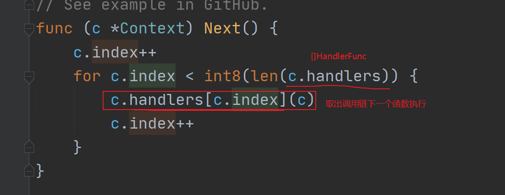

# 第18节课上笔记

## 内容回顾

### gin框架

- gin框架基本示例

  - 底层是基于`net/http`
  - gin本身主要实现了一套路由注册与匹配，剩下的功能是以扩展的方式存在https://github.com/gin-gonic/contrib

- server

- 创建路由对象

- 请求相关

  - 请求参数
    - param  --> `/news/:year`
    - QueryString --> `/news/2020?page=1`
    - form表单
    - JSON格式的
    - 上传文件
  - 参数绑定
    - `ShouldBind()`

- 路由注册

  - GET/POST/PUT/DELETE/PATCH/OPTION/HEAD
  - ANY
  - NOROUTE

- 路由组

- 返回响应

  - HTML --> `c.HTML(状态码, 模板名, 数据)`
  - JSON --> `c.JSON(状态码, 支持JSON序列化的数据)`
    - gin.H 
    - 自定义数据
  - 静态文件处理 --> `c.Static(模板文件中用的路径, 静态文件实际存储的目录)`

- 模板继承 --> multitemplate

  20:23回顾完

## 本节内容

### gin静态文件处理

`c.Static`

### 重定向

http重定向

内部重定向处理函数

### gin表单提交示例

详见课上代码

### gin上传文件示例

详见课上代码

### gin中间件 

#### 什么是中间件？

1. 需要对所有或者部分请求做某种处理的时候简化代码量


**gin框架中只要满足`type HandlerFunc func(*Context)`的都可以当成中间件函数注册到路由中！**

#### 中间件的写法

直接定义

或者用闭包

```go
// 利用闭包实现的中间件，注意注册的时候的写法
func xxx(ok bool) gin.HandlerFunc {
	return func(c *gin.Context) {
		if ok {
			// 登录校验
			fmt.Println("进行登录校验")
		} else {
			fmt.Println("不用登录校验")
		}
	}

```

#### 中间件的注册方式

##### 全局注册

```go
r.Use(中间件函数)
```

##### 局部注册

```go
r.GET("/index", m1, indexHandler, m1)
r.GET("/home", m2, homeHandler)
```

##### 路由组注册

```go
	shopGroup := r.Group("/shop", m1, m2)
	{
		shopGroup.GET("/index", func(c *gin.Context) {
			c.String(http.StatusOK, "/shop/index")
		})
	}
```

```go
	shopGroup := r.Group("/shop")
	shopGroup.Use(m1, m2)
	{
		shopGroup.GET("/index", func(c *gin.Context) {
			c.String(http.StatusOK, "/shop/index")
		})
	}
```

```go
	shopGroup := r.Group("/shop")
	{
		shopGroup.GET("/index", m1, m2, func(c *gin.Context) {
			c.String(http.StatusOK, "/shop/index")
		})
	}
```

##### 三个方法

###### c.Next()




###### c.Abort()


###### c.Set/c.Get

跨中间件传递数据

c是贯穿整个请求流程的一个上下文


### httprouter原理

**前缀树！！！**

最开始gin用的就是httprouter

详见另一个课件httprouter源码分析。


## 本节分享

查资料时最好以官方文档为主。

看英文文档就靠坚持。


## 本周作业

1. 把课上中间件的示例自己写一遍，理解`c.Next()`和`c.Abort()`
2. 利用中间件实现一个基于cookie认证的中间件
   1. 其中`/login`和`/register`两个URL不需要使用认证中间件
   2. 网站其他路由需要使用认证中间件
   3. 没有登录就访问我网站`/index`页面的就跳转到`/login`
   4. 登录的用户就继续访问不受影响
3. 下周上课前准备好MySQL和Redis环境

