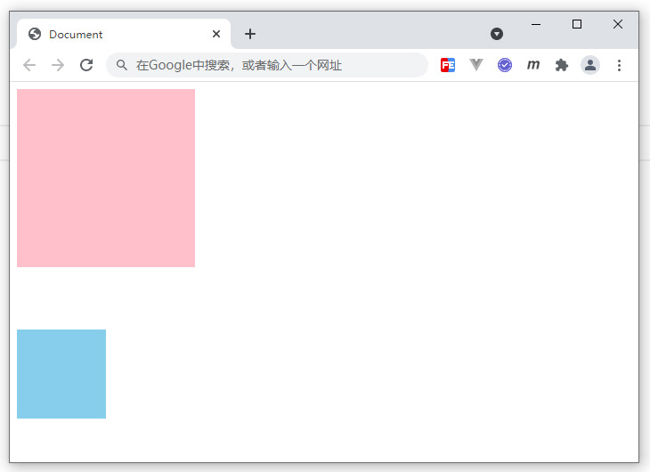
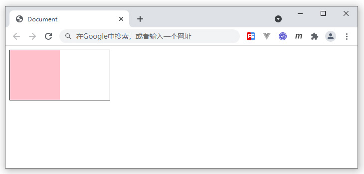

# BFC块级格式化上下文

## BFC概念

&emsp;&emsp;BFC即Block Formatting Contexts(块级格式化上下文)，它是W3C CSS2.1 规范中的一个概念。它是页面中的一块渲染区域，并且有一套渲染规则，它决定了其子元素将如何定位，以及和其他元素的关系和相互作用。

&emsp;&emsp;具有BFC特性的元素可以看作是隔离了的独立容器，容器里面的元素不会在布局上影响到外面的元素，并且BFC具有普通容器所没有的一些特性。

&emsp;&emsp;通俗一点来讲，可以把BFC理解为一个封闭的大箱子，箱子内部的元素无论如何翻江倒海，都不会影响到外部。

## BFC触发条件

&emsp;&emsp;满足以下条件之一，即可触发BFC：

- float的值不是none
- position的值不是static或者relative
- display的值是inline-block、table-cell、flex、table-caption或者inline-flex
- overflow的值不是visible

&emsp;&emsp;下面的box盒子就是一个BFC独立容器：

```css
.box{
    width: 100px;
    height: 100px;
    overflow: hidden;   /* 触发了BFC，形成独立盒子 */
}
```

## BFC的应用

&emsp;&emsp;在前面介绍盒模型的margin时，出现了传递和叠加的问题，这里可以采用BFC规范来解决，原理就是让盒子形成一个独立的容器，无论里面的子元素如何折腾，都不影响到外面的元素。

```html
<style>
.box1 {
    width: 200px;
    height: 200px;
    background: pink;
    overflow: hidden;    /* 触发了BFC，形成独立盒子 */
}
.box2{
    width: 100px;
    height: 100px;
    background: skyblue;
    margin-top: 30px;
}
</style>
<div class="box1">
    <div class="box2"></div>
</div>


 
 
```


```html
<style>
section{
    overflow: hidden;    /* 触发了BFC，形成独立盒子 */
}
.box1 {
    width: 200px;
    height: 200px;
    background: pink;
    margin-bottom: 40px;
}

.box2 {
    width: 100px;
    height: 100px;
    background: skyblue;
    margin-top: 30px;
}
</style>
<section>
    <div class="box1"></div>
</section>
<section>
    <div class="box2"></div>
</section>


 
```

 
&emsp;&emsp;BFC还可以解决前面浮动遇到了父容器高度塌陷的问题，也就是不管里面子元素是否浮动，都不会因为脱离文档流对容器高度造成影响。

```html
<style>
.box1 {
    width: 200px;
    border: 1px black solid;
    overflow: hidden;     /* 触发了BFC，形成独立盒子 */
}
.box2 {
    width: 100px;
    height: 100px;
    background: pink;
    float: left;
}
</style>
<div class="box1">
    <div class="box2"></div>
</div>


```



&emsp;&emsp;在现代布局flex和grid中，是默认自带BFC规范的，所以可以解决非BFC盒子的一些问题，这就是为什么flex和grid能成为更好的布局方式原因之一。
