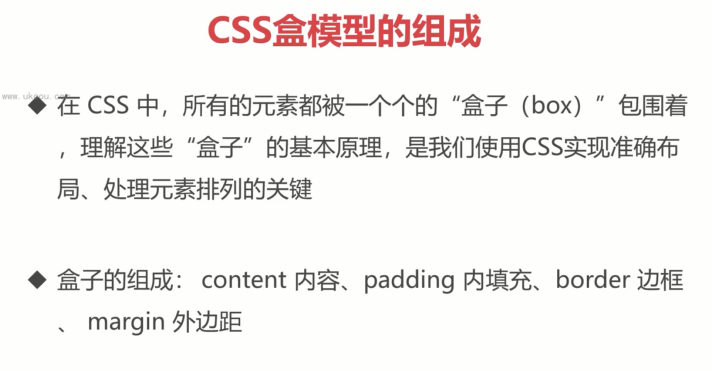
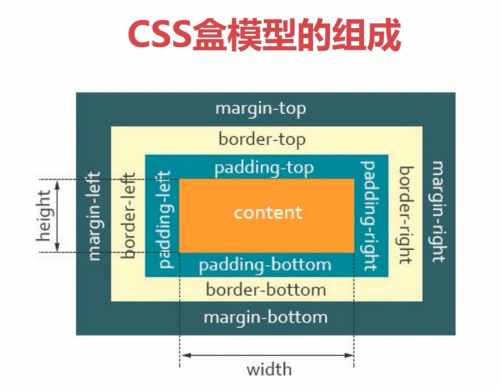
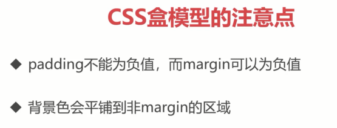
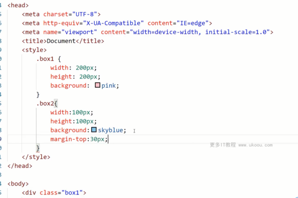
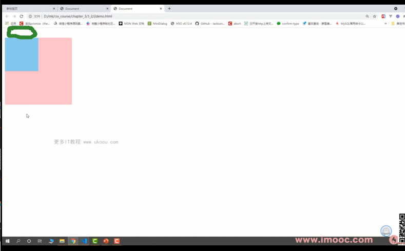
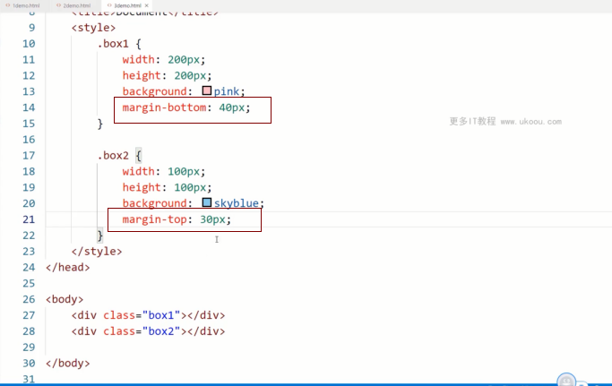
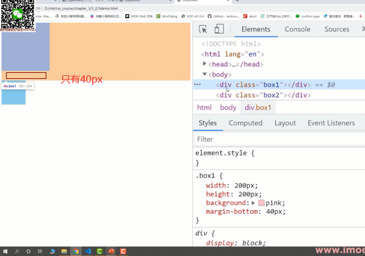

- 给border设置颜色，只是会盖住背景色

- 在子元素添加margin-top时，会直接传递到父元素上去。

  - 
  - 
- 解决方法

  - 使用padding-top，不使用margin-top
  - 给父元素添加border
  - 使用BFC
  - 使用弹性布局和网格布局

- 上下元素使用margin-bottom和margin-top，会取一个比较大的值，而不是两者合并

  - 
  - 
- 解决方法

  - 使用margin-right和margin-left不会出现这个问题
  - 只给一元素加margin，不给第二个元素
  - 使用BFC
  - 使用弹性布局和网格布局
