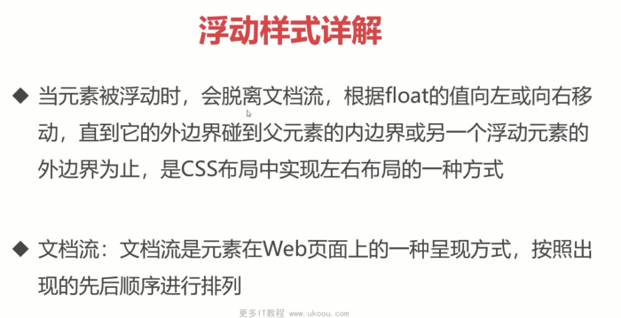
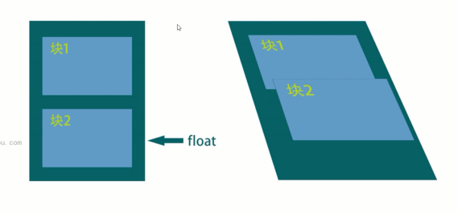

- `clear:both`

  - 使用 `clear:both`；
  - 只能用于同一层级的元素
- BFC
- 空标签

  - 在父子层级中，可以在父元素中添加一个空标签，再添加clear:both样式。
- `.clearfix::after{}`

  - `.clearfix::after{  content:'';clear:both;display:block;  }`
  - 使用空标签，会浪费一个元素，可以使用伪类的方法，添加
  - 但是伪类添加的元素是内联元素，`clear:both`只能对块级元素有效，所以需要转化一下。
