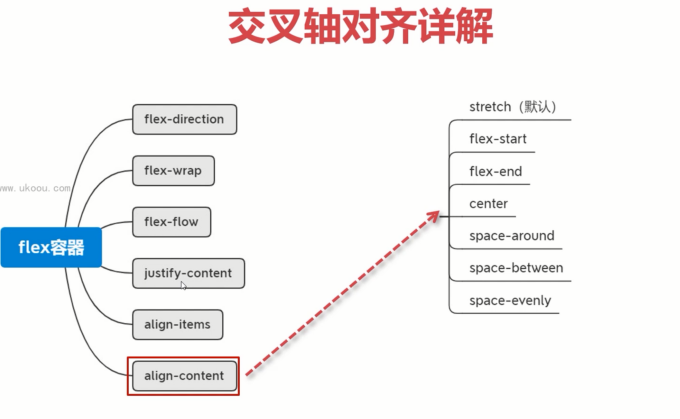
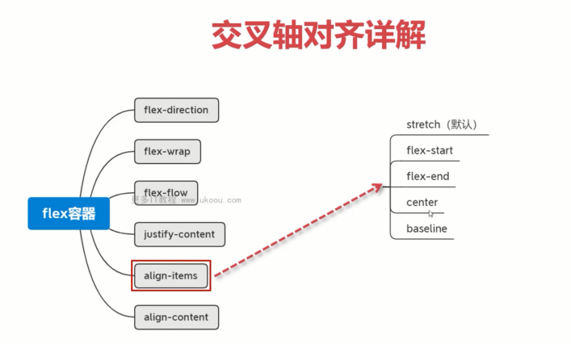

- align-content：此属性主要是针对多行的情况下生效

  - 当不换行的情况下，align-content是不生效的。
  - 当加上了 `flex-wrap:wrap`，就算没有换行，align-content也是生效的。
  - align-content默认值是strectch，也就是拉伸的。

  
- align-items：此属性主要是针对每一行属性的，而align-content主要是针对整体的。

