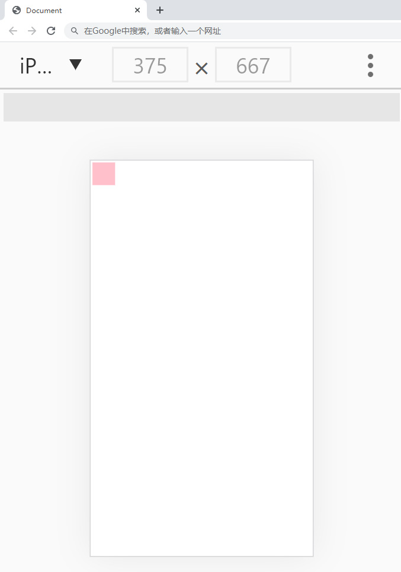
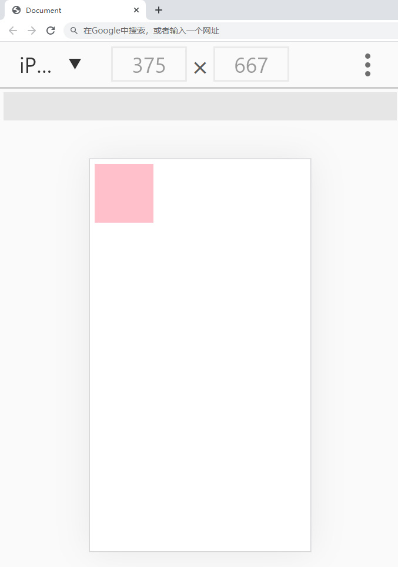
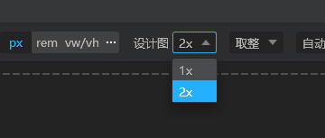

# 移动端概念及UI设计稿尺寸

## 逻辑像素与物理像素

&emsp;&emsp;逻辑像素，也叫“设备独立像素”，对于前端来说就是css中的像素，举例：iphone6下的逻辑像素为375px。

&emsp;&emsp;物理像素，即设备屏幕实际拥有的像素点，一个设备生产出来，他们的像素就已经确定了，举例：iphone6下的物理像素为750px。

&emsp;&emsp;可以发现iphone6下，其物理像素是逻辑像素的2倍，可用“设备像素比”来表示这个比值（即物理像素除以逻辑像素的值），可通过JavaScript代码`window.devicePixelRatio`来获取设备像素比。

&emsp;&emsp;那究竟逻辑像素与物理像素的关系是什么呢？这里首先先确定什么是相对单位，什么又是绝对单位。像m这种绝对单位，定义是什么：米的长度等于氪－86原子的2P10和5d1能级之间跃迁的辐射在真空中波长的1650763.73倍。查到的m的定义如上，也就是说在现实世界中，m是一个固定的长度。

&emsp;&emsp;px全称为pixel，像素长度，像素长度，那么就请问了，一个超大屏幕的像素和你笔记本或者手机屏幕的像素大小相同吗？也就是说1px在你手机屏幕上显示出来的长度可能为0.1mm，在露天演出的电子屏幕上长度为5cm，那么0.1mm和5cm相等吗？

&emsp;&emsp;感觉px好像是一个相对单位，但是如果放在网页或者设计人眼中，可能就不一定了，上面举得那个例子是物理像素，在物理像素的背景下，px确实是一个相对单位，但是在逻辑像素上就不同了，css中1px指的是逻辑像素，浏览器会将你的逻辑像素转化成物理像素，每个设备之间虽然物理像素点大小不一样，但是用例逻辑像素的单位后，显示的长度就会一样了。

&emsp;&emsp;在开发网页的时候，写了10px，在你的设备上，逻辑1px为真实的1.2个像素大小，实际看上去为10cm，没问题，换一个设备，逻辑1px为真实的2.4个像素大小，也就是说另外一个设备像素大小是你的设备一半，那么对于他来说10px就是24个像素了，但是实际大小仍然为10cm，所以说，在有逻辑像素的概念的前提下，px是一个绝对长度单位。(引自：[知乎](https://www.zhihu.com/question/48166345/answer/1631677955))

总结如下：
    - **逻辑像素：CSS中的像素，绝对单位，保证不同设备下元素的尺寸是相同的**。
    - **物理像素：设备屏幕实际拥有的像素点，相对单位，不同设备下物理像素大小不同**。

## viewport视口

&emsp;&emsp;一般移动设备的浏览器都默认设置了一个viewport元标签，定义一个虚拟的布局视口（layout viewport），用于解决早期的页面在手机上显示的问题。iOS, Android 基本都将这个视口分辨率设置为 980px，所以PC上的网页基本能在手机上呈现，只不过元素看上去很小，一般默认可以通过手动缩放网页。



&emsp;&emsp;上面截图中的方块为100px，但是在iphone6设备的默认视口下显示的非常小，因为默认视口为980px。为了解决这个问题，可通过meta标签来修改视口的尺寸大小（vsCode工具初始创建HTML代码时，自动添加）。

```html
<meta name="viewport" content="width=device-width, initial-scale=1.0">
```

&emsp;&emsp; `width=device-width`表示视口宽度为设备的宽，也就是逻辑像素的大小。`initial-scale=1.0`表示初始缩放比例为1，即正常大小。下面是设置了viewport视口后的样子。



&emsp;&emsp; viewport可选的值有：

|  属性  |   值   |    描述   |
|  ----  | ----  |  ----     |
| width  |  正整数或devive-width  |   定义视口的宽度，单位为像素 |
| height  | 正整数 |  定义视口的高度，单位为像素，不常用 |
| initial-scale  | 比例值 |  定义初始缩放值 |
| minimum-scale  | 比例值 |  定义缩小最小比例 |
| maximum-scale  | 比例值 |  定义放大最大比例 |
| user-scalable  | yes/on |  定义是否允许用户手动缩放页面，默认值yes |

总结如下：
    - **在移动端布局中，一定要提前设置好视口大小，即vsCode默认添加形式，`<meta name="viewport" content="width=device-width, initial-scale=1.0">`，这样可以保证CSS逻辑像素不会受到缩放处理。**

## 750px的设计稿

&emsp;&emsp;通常移动端UI设计稿会按照iphone6的物理像素尺寸大小进行设计，即750px。当然也可以按照逻辑像素进行设计，即375px，但是一般设计师不会这么干，主要为了设计稿更加清晰。

&emsp;&emsp;所以前端在量取尺寸的时候，需要除以2，才能适配页面中的CSS逻辑像素值。好在现代UI工具如：蓝湖、PxCook等都具备自动除以2的标注信息方式，后面视频有详细介绍。



&emsp;&emsp;那么如何让唯一的一种设计稿尺寸，去适配不同设备的像素呢？让页面元素能够等比进行放大缩小呢？可通过rem和vw这两种相对单位来进行实现，这也是本章的重点学习内容。

总结如下：
    - **移动端UI设计稿尺寸大小为750px，即设备的物理像素，可使效果展示更加清晰。**
    - **移动端需要实现像素换算和设备适配，以及页面元素等比缩放布局等。**
