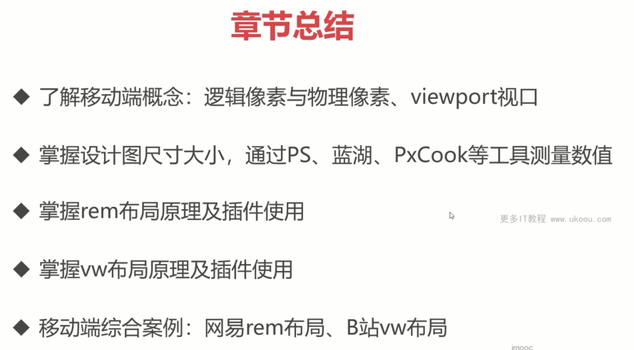

[JS检测CSS属性浏览器是否支持的多种方法](https://www.zhangxinxu.com/wordpress/2019/11/js-css-supports-detect/)

[浏览器亚像素渲染与小数位的取舍](https://www.chengrang.com/subpixel-rendering-and-percentage-calculations.html)

[怎么画一条0.5px的边](https://juejin.cn/post/6844903582370643975)
