`<!--StartFragment-->`

**vue源码解析**

# **第一章：准备工作**

## 介绍

###  介绍了 Flow、Vue.js 的源码目录设计、Vue.js 的源码构建方式，以及从入口开始分析了 Vue.js 的初始化过程

## 认识Flow

###  Flow 是 facebook 出品的 JavaScript 静态类型检查工具。Vue.js 的源码利用了 Flow 做了静态类型检查，所以了解 Flow 有助于我们阅读源码

###  通常类型检查分成 2 种方式

- 类型推断：通过变量的使用上下文来推断出变量类型，然后根据这些推断来检查类型。

- 类型推断：通过变量的使用上下文来推断出变量类型，然后根据这些推断来检查类型。

###  使用

- 文件开头使用/*@flow*/

## VUE.js源码目录设计

###  src  

├── compiler        # 编译相关  
├── core            # 核心代码  
├── platforms       # 不同平台的支持  
├── server          # 服务端渲染  
├── sfc             # .vue 文件解析  
├── shared          # 共享代码

###  compiler

- compiler 目录包含 Vue.js 所有编译相关的代码。它包括把模板解析成 ast 语法树，ast 语法树优化，代码生成等功能。

- 编译的工作可以在构建时做（借助 webpack、vue-loader 等辅助插件）；也可以在运行时做，使用包含构建功能的 Vue.js。显然，编译是一项耗性能的工作，所以更推荐前者——离线编译。

### core

- core 目录包含了 Vue.js 的核心代码，包括内置组件、全局 API 封装，Vue 实例化、观察者、虚拟 DOM、工具函数等等。

###  platform

- Vue.js 是一个跨平台的 MVVM 框架，它可以跑在 web 上，也可以配合 weex 跑在 natvie 客户端上。

- platform 是 Vue.js 的入口

- 2 个目录代表 2 个主要入口，分别打包成运行在 web 上和 weex 上的 Vue.js。

###  server

- Vue.js 2.0 支持了服务端渲染，所有服务端渲染相关的逻辑都在这个目录下。注意：这部分代码是跑在服务端的 Node.js，不要和跑在浏览器端的 Vue.js 混为一谈。

- 服务端渲染主要的工作是把组件渲染为服务器端的 HTML 字符串，将它们直接发送到浏览器，最后将静态标记"混合"为客户端上完全交互的应用程序。

###  sfc

- 通常我们开发 Vue.js 都会借助 webpack 构建， 然后通过 .vue 单文件的编写组件。  
这个目录下的代码逻辑会把 .vue 文件内容解析成一个 JavaScript 的对象。

###  shared

- Vue.js 会定义一些工具方法，这里定义的工具方法都是会被浏览器端的 Vue.js 和服务端的 Vue.js 所共享的。

## VUE.js源码构建

###  scripts/config.js

- 'web-runtime-cjs': {  
    entry: resolve('web/entry-runtime.js'),  
    dest: resolve('dist/vue.runtime.common.js'),  
    format: 'cjs',  
    banner  
  },

- 其中 entry 属性表示构建的入口 JS 文件地址

- dest 属性表示构建后的 JS 文件地址

- format 属性表示构建的格式

- cjs 表示构建出来的文件遵循 CommonJS 规范

- es 表示构建出来的文件遵循 ES Module 规范

- umd 表示构建出来的文件遵循 UMD 规范。

###  Runtime Only 和 Runtime+Compiler

- Runtime Only

- 我们在使用 Runtime Only 版本的 Vue.js 的时候，通常需要借助如 webpack 的 vue-loader 工具把 .vue 文件编译成 JavaScript，因为是在编译阶段做的，所以它只包含运行时的 Vue.js 代码，因此代码体积也会更轻量。

- Runtime+Compiler

- 我们如果没有对代码做预编译，但又使用了 Vue 的 template 属性并传入一个字符串，则需要在客户端编译模板，如下所示：

- // 需要编译器的版本  
new Vue({  
  template: '`
`{{ hi }}`
`'  
})  
  
// 这种情况不需要  
new Vue({  
  render (h) {  
    return h('div', this.hi)  
  }  
})

- 因为在 Vue.js 2.0 中，最终渲染都是通过 render 函数，如果写 template 属性，则需要编译成 render 函数，那么这个编译过程会发生运行时，所以需要带有编译器的版本。

## 从入口开始

###  Vue 的定义

- src/core/instance/index.js

- 它实际上就是一个用 Function 实现的类，我们只能通过 new Vue 去实例化它

-  

- 为何 Vue 不用 ES6 的 Class 去实现呢？

- 我们往后看这里有很多 xxxMixin 的函数调用，并把 Vue 当参数传入，它们的功能都是给 Vue 的 prototype 上扩展一些方法（这里具体的细节会在之后的文章介绍，这里不展开），Vue 按功能把这些扩展分散到多个模块中去实现，而不是在一个模块里实现所有，这种方式是用 Class 难以实现的。这么做的好处是非常方便代码的维护和管理，这种编程技巧也非常值得我们去学习

###  initGlobalAPI

- src/core/global-api/index.js

- Vue.js 在整个初始化过程中，除了给它的原型 prototype 上扩展方法，还会给 Vue 这个对象本身扩展全局的静态方法

-  

# **第二章：数据驱动**

## 介绍

### 详细讲解了模板数据到 DOM 渲染的过程，从 new Vue 开始，分析了 mount、render、update、patch 等流程

## new VUE发生了什么

###  src/core/instance/init.js

-

###  Vue 只能通过 new 关键字初始化，然后会调用 this._init 方法

###  Vue 初始化主要就干了几件事情

- 合并配置

- 初始化

- 初始化生命周期

- 初始化事件中心

- 初始化渲染

- 初始化state

- data、props、computed、watcher

- 为什么可以通过this.msg访问data中的数据？

-  

- 通defineProperty，代理this.的数据访问到this._data数据

-  

-  

- props，computed等的原理也是一样。

- 挂载

- 在初始化的最后，检测到如果有 el 属性，则调用 vm.$mount 方法挂载 vm，挂载的目标就是把模板渲染成最终的 DOM

## Vue 实例挂载的实现

### Vue 中我们是通过 $mount 实例方法去挂载 vm 的

###  $mount 这个方法的实现是和平台、构建方式都相关的，所以$mount 方法在多个文件中都有定义

- src/platform/web/runtime/index.js

- 第一个是 el，它表示挂载的元素，可以是字符串，也可以是 DOM 对象，第二个参数是和服务端渲染相关，在浏览器环境下我们不需要传第二个参数。

-  

- $mount 方法实际上会去调用 mountComponent 方法

- src/core/instance/lifecycle.js

- 代码

-  

- 先实例化一个渲染Watcher，在它的回调函数中会调用 updateComponent 方法

- updateComponent方法中调用 vm._render 方法先生成虚拟 Node

- 最终调用 vm._update 更新 DOM

- Watcher 在这里起到两个作用

- 一个是初始化的时候会执行回调函数

- 另一个是当 vm 实例中的监测的数据发生变化的时候执行回调函数

- 函数最后判断为根节点的时候设置 vm._isMounted 为 true， 表示这个实例已经挂载了，同时执行 mounted 钩子函数。

- 这里注意 vm.$vnode 表示 Vue 实例的父虚拟 Node，所以它为 Null 则表示当前是根 Vue 的实例。

- src/platform/web/entry-runtime-with-compiler.js

- 首先缓存了原型上(上面 src/platform/web/runtime/index.js)的 $mount 方法，再重新定义该方法

- 如果没有定义 render 方法，则会把 el 或者 template 字符串转换成 render 方法

-  

## render

###  Vue 的 _render 方法是实例的一个私有方法，它用来把实例渲染成一个虚拟 Node

### src/core/instance/render.js

- 代码

-  

- 最关键的是 render 方法的调用，传入vm._renderProxy, vm.$createElement

- 1.vm._renderProxy是定义在_init方法中。  
2.在开发环境中，判断如果浏览器支持Proxy对象，则劫持整个vm对象，然后做一些警告。  
3. 比如访问没有定义的数据，则报一些警告。

-  

-  

- vm.$createElement 方法定义是在执行 initRender 方法的时候

-  

- 还有一个 vm._c 方法，它是被模板编译成的 render 函数使用

- vm.$createElement 是用户手写 render 方法使用的

- 这俩个方法支持的参数相同，并且内部都调用了 createElement 方法。

## Virtual DOM

###  其实 VNode 是对真实 DOM 的一种抽象描述，它的核心定义无非就几个关键属性，标签名、数据、子节点、键值等，其它属性都是用来扩展 VNode 的灵活性以及实现一些特殊 feature 的

###  由于 VNode 只是用来映射到真实 DOM 的渲染，不需要包含操作 DOM 的方法，因此它是非常轻量和简单的

###  Virtual DOM 除了它的数据结构的定义，映射到真实的 DOM 实际上要经历 VNode 的 create、diff、patch 等过程

###  实际上 Vue.js 中 Virtual DOM 是借鉴了一个开源库 snabbdom 的实现，然后加入了一些 Vue.js 特色的东西

###  src/core/vdom/vnode.js

-

-

## createElement

###  src/core/vdom/create-element.js

- createElement 方法实际上是对 _createElement 方法的封装，它允许传入的参数更加灵活，在处理这些参数后，调用真正创建 VNode 的函数 _createElement

-  

- _createElement

- 1. normalizationType 表示子节点规范的类型  
2.ALWAYS_NORMALIZE 表示是用户手写的render  
3. SIMPLE_NORMALIZE表示是编译生成的redner

-  

###  children 的规范化  

- src/core/vdom/helpers/normalzie-children.js

-  

- simpleNormalizeChildren

- 方法调用场景是 render 函数是编译生成的

- 理论上编译生成的 children 都已经是 VNode 类型的

- 但这里有一个例外，就是 functional component 函数式组件返回的是一个数组而不是一个根节点，所以会通过 Array.prototype.concat 方法把整个 children 数组打平，

- 让它的深度只有一层。

- normalizeChildren

- 一个场景是 render 函数是用户手写的

- 当 children 只有一个节点的时候，Vue.js 从接口层面允许用户把 children 写成基础类型用来创建单个简单的文本节点，这种情况会调用 createTextVNode 创建一个文本节点的 VNode；

- 另一个场景是当编译 slot、v-for 的时候会产生嵌套数组的情况，会调用 normalizeArrayChildren 方法

- 这个方法会将嵌套的数组变成一维的Vnode数组

- 经过对 children 的规范化，children 变成了一个类型为 VNode 的一维 Array。

###  VNode 的创建  

- 代码

-  

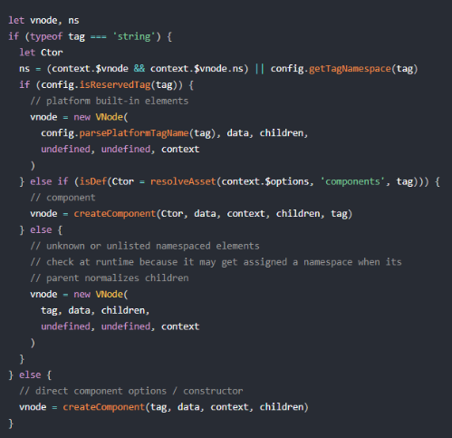

- 先对 tag 做判断

- string 类型

- 如果是内置的一些节点，则直接创建一个普通 VNode

- 如果是为已注册的组件名，则通过 createComponent 创建一个组件类型的 VNode

- 否则创建一个未知的标签的 VNode。

- Component 类型

- 直接调用 createComponent 创建一个组件类型的 VNode 节点

###  总结

- 经过 createElement 创建了一个VNode 树实例

## update

###  _update 方法的作用是把 VNode 渲染成真实的 DOM

- src/core/instance/lifecycle.js

-  

###  vm.__patch__ 方法，这个方法实际上在不同的平台，比如 web 和 weex 上的定义是不一样的

- web 平台

- src/platforms/web/runtime/index.js

- 因为在服务端渲染中，没有真实的浏览器 DOM 环境，所以不需要把 VNode 最终转换成 DOM，因此是一个空函数，而在浏览器端渲染中，它指向了 patch 方法

-  

###  patch

- src/platforms/web/runtime/patch.js

-  

- 调用 createPatchFunction 方法的返回值，这里传入了一个对象，包含 nodeOps 参数和 modules 参数。

- nodeOps 封装了一系列 DOM 操作的方法

- modules 定义了一些模块的钩子函数的实现

###  createPatchFunction

- src/core/vdom/patch.js

- createPatchFunction 内部定义了一系列的辅助方法，最终返回了一个 patch 方法，这个方法就赋值给了 vm._update 函数里调用的 vm.__patch__

- 为何 Vue.js 源码绕了这么一大圈，把相关代码分散到各个目录。

- patch 是平台相关的，在 Web 和 Weex 环境，它们把虚拟 DOM 映射到 “平台 DOM” 的方法是不同的，并且对 “DOM” 包括的属性模块创建和更新也不尽相同。因此每个平台都有各自的 nodeOps 和 modules，它们的代码需要托管在 src/platforms 这个大目录下。

- 而不同平台的 patch 的主要逻辑部分是相同的，所以这部分公共的部分托管在 core 这个大目录下。差异化部分只需要通过参数来区别，这里用到了一个函数柯里化的技巧，通过 createPatchFunction 把差异化参数提前固化，这样不用每次调用 patch 的时候都传递 nodeOps 和 modules 了，这种编程技巧也非常值得学习

- patch

- 它接收 4个参数

- oldVnode 表示旧的 VNode 节点，它也可以不存在或者是一个 DOM 对象；

- vnode 表示执行 _render 后返回的 VNode 的节点

- hydrating 表示是否是服务端渲染

- removeOnly 是给 transition-group 用的，之后会介绍。

- 执行过程

- 代码

•

- 场景是首次渲染

- 通过 emptyNodeAt 方法把#app  
转换成 VNode 对象

-  

- 调用createElm，createElm 的作用是通过虚拟节点创建真实的 DOM 并插入到它的父节点中。

-  

- 调用 createChildren 方法去创建子元素

- createChildren 的逻辑很简单，实际上是遍历子虚拟节点，递归调用 createElm，这是一种常用的深度优先的遍历算法，这里要注意的一点是在遍历过程中会把 vnode.elm 作为父容器的 DOM 节点占位符传入。

- 接着再调用 invokeCreateHooks 方法执行所有的 create 的钩子并把 vnode push 到 insertedVnodeQueue 中。

- 最后调用 insert 方法把 DOM 插入到父节点中，因为是递归调用，子元素会优先调用 insert，所以整个 vnode 树节点的插入顺序是先子后父。来看一下 insert 方法，它的定义在 src/core/vdom/patch.js 上。

## 总结

### VUE的整个渲染过程

-

# **第三章：组件化**

## 介绍

### 分析了组件化的实现原理，并且分析了组件周边的原理实现，包括合并配置、生命周期、组件注册、异步组件

## createCompoent

### _createElement 方法

- 如果是一个普通的 html 标签，像上一章的例子那样是一个普通的 div，则会实例化一个普通 VNode 节点，否则通过 createComponent 方法创建一个组件 VNode

###  src/core/vdom/create-component.js

- 构造子类构造函数

-  

- 在了解了 baseCtor 指向了 Vue 之后，我们来看一下 Vue.extend 函数的定义，在 src/core/global-api/extend.js 中

- Vue.extend 的作用就是构造一个 Vue 的子类，它使用一种非常经典的原型继承的方式把一个纯对象转换一个继承于 Vue 的构造器 Sub 并返回，然后对 Sub 这个对象本身扩展了一些属性

- 安装组件钩子函数

-  

- 我们之前提到 Vue.js 使用的 Virtual DOM 参考的是开源库 snabbdom，它的一个特点是在 VNode 的 patch 流程中对外暴露了各种时机的钩子函数，方便我们做一些额外的事情，Vue.js 也是充分利用这一点，在初始化一个 Component 类型的 VNode 的过程中实现了几个钩子函数：

-  

-  

-  

- 整个 installComponentHooks 的过程就是把 componentVNodeHooks 的钩子函数合并到 data.hook 中，在 VNode 执行 patch 的过程中执行相关的钩子函数，具体的执行我们稍后在介绍 patch 过程中会详细介绍。这里要注意的是合并策略，在合并过程中，如果某个时机的钩子已经存在 data.hook 中，那么通过执行 mergeHook 函数做合并，这个逻辑很简单，就是在最终执行的时候，依次执行这两个钩子函数即可。  

- 实例化 VNode

-  

- 最后一步非常简单，通过 new VNode 实例化一个 vnode 并返回。需要注意的是和普通元素节点的 vnode 不同，组件的 vnode 是没有 children 的，这点很关键，在之后的 patch 过程中我们会再提。

###  总结  

- 这一节我们分析了 createComponent 的实现，了解到它在渲染一个组件的时候的 3 个关键逻辑：构造子类构造函数，安装组件钩子函数和实例化 vnode。createComponent 后返回的是组件 vnode，它也一样走到 vm._update 方法，进而执行了 patch 函数，我们在上一章对 patch 函数做了简单的分析，那么下一节我们会对它做进一步的分析。

## patch

###  通过前一章的分析我们知道，当我们通过 createComponent 创建了组件 VNode

- 接下来会走到 vm._update，执行 vm.__patch__ 去把 VNode 转换成真正的 DOM 节点。

- patch 的过程会调用 createElm 创建元素节点

- src/core/vdom/patch.js

-  

###  createComponent

- 代码

-  

- 如果 vnode 是一个组件 VNode，那么条件会满足，并且得到 i 就是 init 钩子函数

- 回顾上节我们在创建组件 VNode 的时候合并钩子函数中就包含 init 钩子函数

- 定义在 src/core/vdom/create-component.js

-  

- init 钩子函数执行也很简单，我们先不考虑 keepAlive 的情况，它是通过 createComponentInstanceForVnode 创建一个 Vue 的实例，然后调用 $mount 方法挂载子组件

- createComponentInstanceForVnode 的实现

-  

- 这里的 vnode.componentOptions.Ctor 对应的就是子组件的构造函数，我们上一节分析了它实际上是继承于 Vue 的一个构造器 Sub，相当于 new Sub(options) 这里有几个关键参数要注意几个点，_isComponent 为 true 表示它是一个组件，parent 表示当前激活的组件实例

- 所以子组件的实例化实际上就是在这个时机执行的，并且它会执行实例的 _init 方法

- src/core/instance/init.js

-  

- 由于组件初始化的时候是不传 el 的，因此在这里不会执行挂载方法，组件是自己接管了 $mount 的过程

- 回到组件 init 的过程，componentVNodeHooks 的 init 钩子函数，在完成实例化的 _init 后，接着会执行 child.$mount(hydrating ? vnode.elm : undefined, hydrating) 。

###  在完成组件的整个 patch 过程后，最后执行 insert(parentElm, vnode.elm, refElm) 完成组件的 DOM 插入，如果组件 patch 过程中又创建了子组件，那么DOM 的插入顺序是先子后父  

-

## 合并配置

###  new Vue 的过程通常有 2 种场景，一种是外部我们的代码主动调用 new Vue(options) 的方式实例化一个 Vue 对象；另一种是我们上一节分析的组件过程中内部通过 new Vue(options) 实例化子组件

###  不同场景对于 options 的合并逻辑是不一样的，并且传入的 options 值也有非常大的不同，接下来我会分开介绍 2 种场景的 options 合并过程

###  外部调用场景

- 执行 new Vue 的时候，在执行 this._init(options) 的时候，就会执行如下逻辑去合并 options

-  

###  组件场景

-

###  总结

- 那么至此，Vue 初始化阶段对于 options 的合并过程就介绍完了，我们需要知道对于 options 的合并有 2 种方式，子组件初始化过程通过 initInternalComponent 方式要比外部初始化 Vue 通过 mergeOptions 的过程要快，合并完的结果保留在 vm.$options 中。

## 生命周期

### 生命周期图

-

###  源码中最终执行生命周期的函数都是调用 callHook 方法

- src/core/instance/lifecycle

-  

###  beforeCreate & created

- beforeCreate 和 created 函数都是在实例化 Vue 的阶段，在 _init 方法中执行的

- src/core/instance/init.js

-  

- beforeCreate 和 created 的钩子调用是在 initState 的前后

- initState 的作用是初始化 props、data、methods、watch、computed 等属性

- beforeCreate 的钩子函数中就不能获取到 props、data 中定义的值，也不能调用 methods 中定义的函数。

- 在这俩个钩子函数执行的时候，并没有渲染 DOM，所以我们也不能够访问 DOM，一般来说，如果组件在加载的时候需要和后端有交互，放在这俩个钩子函数执行都可以，如果是需要访问 props、data 等数据的话，就需要使用 created 钩子函数。

- 之后我们会介绍 vue-router 和 vuex 的时候会发现它们都混合了 beforeCreate 钩子函数。

###  beforeMount & mounted

- beforeMount 钩子函数发生在 mount，也就是 DOM 挂载之前，它的调用时机是在 mountComponent 函数中

- 定义在 src/core/instance/lifecycle.js

-  

- 在执行 vm._render() 函数渲染 VNode 之前，执行了 beforeMount 钩子函数

- 在执行完 vm._update() 把 VNode patch 到真实 DOM 后，执行 mounted 钩子

- 注意，这里对 mounted 钩子函数执行有一个判断逻辑，vm.$vnode 如果为 null，则表明这不是一次组件的初始化过程，而是我们通过外部 new Vue 初始化过程。

- 那么对于组件，它的 mounted 时机在哪儿呢？

- 之前我们提到过，组件的 VNode patch 到 DOM 后，会执行 invokeInsertHook 函数，把 insertedVnodeQueue 里保存的钩子函数依次执行一遍，

- 它的定义在 src/core/vdom/patch.js 中：

-  

- 对于组件而言，insert 钩子函数的定义在 src/core/vdom/create-component.js 中的 componentVNodeHooks

-  

- 我们可以看到，每个子组件都是在这个钩子函数中执行 mounted 钩子函数，并且我们之前分析过，insertedVnodeQueue 的添加顺序是先子后父，所以对于同步渲染的子组件而言，mounted 钩子函数的执行顺序也是先子后父。

###  beforeUpdate & updated

- beforeUpdate 的执行时机是在渲染 Watcher 的 before 函数中

-  

- update 的执行时机是在flushSchedulerQueue 函数调用的时候

- src/core/observer/scheduler.js

-  

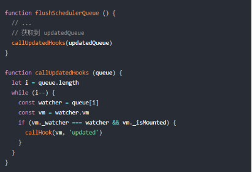

- updatedQueue 是更新了的 wathcer 数组，那么在 callUpdatedHooks 函数中，它对这些数组做遍历，只有满足当前 watcher 为 vm._watcher 以及组件已经 mounted 这两个条件，才会执行 updated 钩子函数。

- 我们之前提过，在组件 mount 的过程中，会实例化一个渲染的 Watcher 去监听 vm 上的数据变化重新渲染，这段逻辑发生在 mountComponent 函数执行的时候：

-  

- 那么在实例化 Watcher 的过程中，在它的构造函数里会判断 isRenderWatcher，接着把当前 watcher 的实例赋值给 vm._watcher，定义在 src/core/observer/watcher.js 中：

-  

- 同时，还把当前 wathcer 实例 push 到 vm._watchers 中，vm._watcher 是专门用来监听 vm 上数据变化然后重新渲染的，所以它是一个渲染相关的 watcher，因此在 callUpdatedHooks 函数中，只有 vm._watcher 的回调执行完毕后，才会执行 updated 钩子函数。

###  beforeDestroy & destroyed

- beforeDestroy 和 destroyed 钩子函数的执行时机在组件销毁的阶段，组件的销毁过程之后会详细介绍，最终会调用 $destroy 方法

- src/core/instance/lifecycle.js

-  

- beforeDestroy 钩子函数的执行时机是在 $destroy 函数执行最开始的地方

- 接着执行了一系列的销毁动作，包括从 parent 的 $children 中删掉自身，删除 watcher，当前渲染的 VNode 执行销毁钩子函数等，执行完毕后再调用 destroy 钩子函数。

- 在 $destroy 的执行过程中，它又会执行 vm.__patch__(vm._vnode, null) 触发它子组件的销毁钩子函数，这样一层层的递归调用，所以 destroy 钩子函数执行顺序是先子后父，和 mounted 过程一样。

###  总结

- 这一节主要介绍了 Vue 生命周期中各个钩子函数的执行时机以及顺序，通过分析，我们知道了如在 created 钩子函数中可以访问到数据，在 mounted 钩子函数中可以访问到 DOM，在 destroy 钩子函数中可以做一些定时器销毁工作，了解它们有利于我们在合适的生命周期去做不同的事情。

## 组件注册

###  全局注册

- 要注册一个全局组件，可以使用 Vue.component(tagName, options)

- src/core/global-api/assets.js

-  

- 函数首先遍历 ASSET_TYPES，得到 type 后挂载到 Vue 上 。

- src/shared/constants.js

-  

- 如果 type 是 component 且 definition 是一个对象的话，通过 this.opitons._base.extend， 相当于 Vue.extend 把这个对象转换成一个继承于 Vue 的构造函数，最后通过 this.options[type + 's'][id] = definition 把它挂载到 Vue.options.components 上。

###  局部注册

- 在组件的 Vue 的实例化阶段有一个合并 option 的逻辑，之前我们也分析过，所以就把 components 合并到 vm.$options.components 上，这样我们就可以在 resolveAsset 的时候拿到这个组件的构造函数，并作为 createComponent 的钩子的参数。

### 局部注册和全局注册不同的是，只有该类型的组件才可以访问局部注册的子组件，而全局注册是扩展到 Vue.options 下，所以在所有组件创建的过程中，都会从全局的 Vue.options.components 扩展到当前组件的 vm.$options.components 下，这就是全局注册的组件能被任意使用的原因

## 异步组件

###  Vue 也原生支持了异步组件的能力

-

- Vue 注册的组件不再是一个对象，而是一个工厂函数，函数有两个参数 resolve 和 reject，函数内部用 setTimout 模拟了异步，实际使用可能是通过动态请求异步组件的 JS 地址，最终通过执行 resolve 方法，它的参数就是我们的异步组件对象。

- 由于组件的定义并不是一个普通对象，所以不会执行 Vue.extend 的逻辑把它变成一个组件的构造函数，但是它仍然可以执行到 createComponent 函数，我们再来对这个函数做回顾

- 的定义在 src/core/vdom/create-component/js 中

-  

- 由于我们这个时候传入的 Ctor 是一个函数，那么它也并不会执行 Vue.extend 逻辑，因此它的 cid 是 undefiend，进入了异步组件创建的逻辑。这里首先执行了 Ctor = resolveAsyncComponent(asyncFactory, baseCtor, context) 方法

- 定义在 src/core/vdom/helpers/resolve-async-component.js

- resolveAsyncComponent 函数的逻辑略复杂，因为它实际上处理了 3 种异步组件的创建方式，除了刚才示例的组件注册方式，还支持 2 种

- 一种是支持 Promise 创建组件的方式

-  

- 另一种是高级异步组件

-  

###  普通函数异步组件

- 针对普通函数的情况，前面几个 if 判断可以忽略，它们是为高级组件所用

- 于 factory.contexts 的判断，是考虑到多个地方同时初始化一个异步组件，那么它的实际加载应该只有一次。

- 接着进入实际加载逻辑，定义了 forceRender、resolve 和 reject 函数

- 注意 resolve 和 reject 函数用 once 函数做了一层包装，它的定义在 src/shared/util.js 中：

-  

- once 逻辑非常简单，传入一个函数，并返回一个新函数，它非常巧妙地利用闭包和一个标志位保证了它包装的函数只会执行一次，也就是确保 resolve 和 reject 函数只执行一次。

- 接下来执行 const res = factory(resolve, reject) 逻辑，这块儿就是执行我们组件的工厂函数，同时把 resolve 和 reject 函数作为参数传入，

- 组件的工厂函数通常会先发送请求去加载我们的异步组件的 JS 文件，拿到组件定义的对象 res 后，执行 resolve(res) 逻辑

- 它会先执行 factory.resolved = ensureCtor(res, baseCtor)：

-  

- 这个函数目的是为了保证能找到异步组件 JS 定义的组件对象，并且如果它是一个普通对象，则调用 Vue.extend 把它转换成一个组件的构造函数。

- resolve 逻辑最后判断了 sync，显然我们这个场景下 sync 为 false，那么就会执行 forceRender 函数，它会遍历 factory.contexts，拿到每一个调用异步组件的实例 vm，执行 vm.$forceUpdate() 方法

- 它的定义在 src/core/instance/lifecycle.js

-  

- $forceUpdate 的逻辑非常简单，就是调用渲染 watcher 的 update 方法，让渲染 watcher 对应的回调函数执行，也就是触发了组件的重新渲染。

- 之所以这么做是因为 Vue 通常是数据驱动视图重新渲染，但是在整个异步组件加载过程中是没有数据发生变化的，所以通过执行 $forceUpdate 可以强制组件重新渲染一次。

###  Promise 异步组件

-

- webpack 2+ 支持了异步加载的语法糖：() => import('./my-async-component')

- 当执行完 res = factory(resolve, reject)，返回的值就是 import('./my-async-component') 的返回值，它是一个 Promise 对象。

- 接着进入 if 条件，又判断了 typeof res.then === 'function')，条件满足，执行：

-  

- 当组件异步加载成功后，执行 resolve，加载失败则执行 reject，这样就非常巧妙地实现了配合 webpack 2+ 的异步加载组件的方式（Promise）加载异步组件。

###  高级异步组件

-

- 由于异步加载组件需要动态加载 JS，有一定网络延时，而且有加载失败的情况，所以通常我们在开发异步组件相关逻辑的时候需要设计 loading 组件和 error 组件，并在适当的时机渲染它们。

- Vue.js 2.3+ 支持了一种高级异步组件的方式，它通过一个简单的对象配置，帮你搞定 loading 组件和 error 组件的渲染时机，你完全不用关心细节，非常方便。

- 高级异步组件的初始化逻辑和普通异步组件一样，也是执行 resolveAsyncComponent，当执行完 res = factory(resolve, reject)，返回值就是定义的组件对象

- 显然满足 else if (isDef(res.component) && typeof res.component.then === 'function') 的逻辑

- 接着执行 res.component.then(resolve, reject)，当异步组件加载成功后，执行 resolve，失败执行 reject。

- 因为异步组件加载是一个异步过程，它接着又同步执行了如下逻辑：

-  

- 先判断 res.error 是否定义了 error 组件，如果有的话则赋值给 factory.errorComp。

- 着判断 res.loading 是否定义了 loading 组件，如果有的话则赋值给 factory.loadingComp

- 如果设置了 res.delay 且为 0，则设置 factory.loading = true，否则延时 delay 的时间执行：

-  

- 最后判断 res.timeout，如果配置了该项，则在 res.timout 时间后，如果组件没有成功加载，执行 reject。

- 在 resolveAsyncComponent 的最后有一段逻辑：

-  

- 如果 delay 配置为 0，则这次直接渲染 loading 组件，否则则延时 delay 执行 forceRender，那么又会再一次执行到 resolveAsyncComponent。

- 那么这时候我们有几种情况，按逻辑的执行顺序，对不同的情况做判断。

- 异步组件加载失败

-  

- 这个时候会把 factory.error 设置为 true，同时执行 forceRender() 再次执行到 resolveAsyncComponent：

-  

- 那么这个时候就返回 factory.errorComp，直接渲染 error 组件。

- 异步组件加载成功

- 当异步组件加载成功，会执行 resolve 函数：

-  

- 首先把加载结果缓存到 factory.resolved 中，这个时候因为 sync 已经为 false，则执行 forceRender() 再次执行到 resolveAsyncComponent：

-  

- 那么这个时候直接返回 factory.resolved，渲染成功加载的组件。

- 异步组件加载中

- 如果异步组件加载中并未返回，这时候会走到这个逻辑：

-  

- 那么则会返回 factory.loadingComp，渲染 loading 组件。

- 异步组件加载超时

- 如果超时，则走到了 reject 逻辑，之后逻辑和加载失败一样，渲染 error 组件。

###  异步组件 patch

- 回到 createComponent 的逻辑：

-  

- 如果是第一次执行 resolveAsyncComponent，除非使用高级异步组件 0 delay 去创建了一个 loading 组件，

- 否则返回是 undefiend，接着通过 createAsyncPlaceholder 创建一个注释节点作为占位符

- 它的定义在 src/core/vdom/helpers/resolve-async-components.js

-  

- 实际上就是就是创建了一个占位的注释 VNode，同时把 asyncFactory 和 asyncMeta 赋值给当前 vnode。

- 当执行 forceRender 的时候，会触发组件的重新渲染，那么会再一次执行 resolveAsyncComponent，这时候就会根据不同的情况，可能返回 loading、error 或成功加载的异步组件，返回值不为 undefined，因此就走正常的组件 render、patch 过程，与组件第一次渲染流程不一样，这个时候是存在新旧 vnode 的

### 总结

- 我们对 Vue 的异步组件的实现有了深入的了解，知道了 3 种异步组件的实现方式，并且看到高级异步组件的实现是非常巧妙的，它实现了 loading、resolve、reject、timeout 4 种状态

- 异步组件实现的本质是 2 次渲染，除了 0 delay 的高级异步组件第一次直接渲染成 loading 组件外

- 其它都是第一次渲染生成一个注释节点，当异步获取组件成功后，再通过 forceRender 强制重新渲染，这样就能正确渲染出我们异步加载的组件了。

# **第四章：深入响应式原理**

## 介绍

### 详细讲解了数据的变化如何驱动视图的变化，分析了响应式对象的创建，依赖收集、派发更新的实现过程，一些特殊情况的处理，并对比了计算属性和侦听属性的实现，最后分析了组件更新的过程

## 响应式对象

###  Object.defineProperty

- 方法会直接在一个对象上定义一个新属性，或者修改一个对象的现有属性，并返回此对象。

- Object.defineProperty不能支持IE8及以下浏览器，所以VUE不能兼容以下浏览器的原因

- 语法

- Object.defineProperty(obj, prop, descriptor)

- obj

- 要定义属性的对象。

- prop

- 要定义或修改的属性的名称或 Symbol 。

- descriptor

- 要定义或修改的属性描述符。

- 数据描述符

- value

- 该属性对应的值。可以是任何有效的 JavaScript 值（数值，对象，函数等）。

- 默认为 undefined。

- writable

- 当且仅当该属性的 writable 键值为 true 时，属性的值，也就是上面的 value，才能被赋值运算符改变。

- 默认为 false。

- 存取描述符

- get

- 属性的 getter 函数，如果没有 getter，则为 undefined。当访问该属性时，会调用此函数。执行时不传入任何参数，但是会传入 this 对象（由于继承关系，这里的this并不一定是定义该属性的对象）。该函数的返回值会被用作属性的值。

- 默认为 undefined。

- set

- 属性的 setter 函数，如果没有 setter，则为 undefined。当属性值被修改时，会调用此函数。该方法接受一个参数（也就是被赋予的新值），会传入赋值时的 this 对象。

- 默认为 undefined。

- 共享选键值

- configurable

- 当且仅当该属性的 configurable 键值为 true 时，该属性的描述符才能够被改变，同时该属性也能从对应的对象上被删除。

- 默认为 false。

- enumerable

- 当且仅当该属性的 enumerable 键值为 true 时，该属性才会出现在对象的枚举属性中。

- 默认为 false。

- 描述符只能选择，数据描述符或存取描述符，其中一个，不能两个同时选择，但是他们有共同的选分键值，configurable和enumerable

- 总结

- 拥有布尔值的键 configurable、enumerable 和 writable 的默认值都是 false。

- 属性值和函数的键 value、get 和 set 字段的默认值为 undefined。

-  

- 这些选项不一定是自身属性，也要考虑继承来的属性。

- 为了确认保留这些默认值，在设置之前，可能要冻结 Object.prototype，明确指定所有的选项，或者通过 Object.create(null) 将 __proto__ (en-US) 属性指向 null。

- 返回值

- 被传递给函数的对象。

###  initState

- 在 Vue 的初始化阶段，_init 方法执行的时候，会执行 initState(vm) 方法，它的定义在 src/core/instance/state.js

-  

- initProps

- 代码

-  

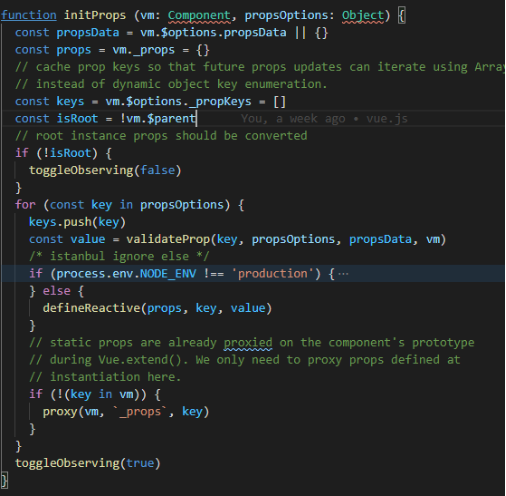

- props 的初始化主要过程，就是遍历定义的 props 配置。遍历的过程主要做两件事情：

- 一个是调用 defineReactive 方法把每个 prop 对应的值变成响应式，可以通过 vm._props.xxx 访问到定义 props 中对应的属性。

- 另一个是通过 proxy 把 vm._props.xxx 的访问代理到 vm.xxx 上

- initData

- 代码

-  

- data 的初始化主要过程也是做两件事

- 一个是对定义 data 函数返回对象的遍历，通过 proxy 把每一个值 vm._data.xxx 都代理到 vm.xxx 上

- 另一个是调用 observe 方法观测整个 data 的变化，把 data 也变成响应式，可以通过 vm._data.xxx 访问到定义 data 返回函数中对应的属性，

###  proxy

- 代理的作用是把 props 和 data 上的属性代理到 vm 实例上，这也就是为什么比如我们定义了如下 props，却可以通过 vm 实例访问到它。

-  

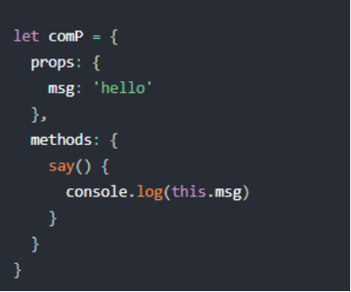

- 我们可以在 say 函数中通过 this.msg 访问到我们定义在 props 中的 msg，这个过程发生在 proxy 阶段

-  

- 通过 Object.defineProperty 把 target[sourceKey][key] 的读写变成了对 target[key] 的读写。

###  observe方法

- observe 的功能就是用来监测数据的变化，它的定义在 src/core/observer/index.js 中：

-  

- observe 方法的作用就是给非 VNode 的对象类型数据添加一个 Observer类，

- 如果已经添加过则直接返回，否则在满足一定条件下去实例化一个 Observer 对象实例。

###  Observer类

- Observer 是一个类，它的作用是给对象的属性添加 getter 和 setter，用于依赖收集和派发更新

-  

- 首先实例化 Dep 对象，接着通过执行 def 函数把自身实例添加到数据对象 value 的 __ob__ 属性上

- 对 value 做判断，对于数组会调用 observeArray 方法，否则对纯对象调用 walk 方法。

- 可以看到 observeArray 是遍历数组再次调用 observe 方法，而 walk 方法是遍历对象的 key 调用 defineReactive 方法

###  defineReactive

- defineReactive 的功能就是定义一个响应式对象，给对象动态添加 getter 和 setter，它的定义在 src/core/observer/index.js 中：

-  

- defineReactive 函数最开始初始化 Dep 对象的实例，接着拿到 obj 的属性描述符

- 然后对子对象递归调用 observe 方法，这样就保证了无论 obj 的结构多复杂，它的所有子属性也能变成响应式的对象，这样我们访问或修改 obj 中一个嵌套较深的属性，也能触发 getter 和 setter。

- 最后利用 Object.defineProperty 去给 obj 的属性 key 添加 getter 和 setter。

###  总结

- 核心就是利用 Object.defineProperty 给数据添加了 getter 和 setter，目的就是为了在我们访问数据以及写数据的时候能自动执行一些逻辑

- getter 做的事情是依赖收集

- setter 做的事情是派发更新

-

## 依赖收集

###  依赖收集

- 响应式对象 getter 相关的逻辑就是做依赖收集

-  

- 关注 2 个地方

- 一个是 const dep = new Dep() 实例化一个 Dep 的实例

- 另一个是在 get 函数中通过 dep.depend 做依赖收集

###  Dep

- Dep 是整个 getter 依赖收集的核心，它的定义在 src/core/observer/dep.js

-  

- 它有一个静态属性 target，这是一个全局唯一 Watcher，因为在同一时间只能有一个全局的 Watcher 被计算

- 另外它的自身属性 subs 也是 Watcher 的数组。

- Dep 实际上就是对 Watcher 的一种管理，Dep 脱离 Watcher 单独存在是没有意义的

###  Watcher

- 它定义在src/core/observer/watcher.js

- Watcher 是一个 Class，在它的构造函数中，定义了一些和 Dep 相关的属性：

-  

- this.deps 和 this.newDeps 表示 Watcher 实例持有的 Dep 实例的数组

- 而 this.depIds 和 this.newDepIds 分别代表 this.deps 和 this.newDeps 的 id Set

- Watcher 还定义了一些原型的方法，和依赖收集相关的有 get、addDep 和 cleanupDeps 方法

###  过程分析

- 当对数据对象的访问会触发他们的 getter 方法，那么这些对象什么时候被访问呢？

- Vue 的 mount 过程是通过mountComponent 函数，其中有一段比较重要的逻辑

-  

- 当我们去实例化一个渲染 watcher 的时候，首先进入 watcher 的构造函数逻辑，然后会执行它的 this.get() 方法，进入 get 函数，首先会执行：

-  

- pushTarget 实际上就是把 Dep.target 赋值为当前的渲染 watcher 并压栈（为了恢复用）。接着又执行了：

-  

- this.getter 对应就是 updateComponent 函数，这实际上就是在执行：

-  

- 它会先执行 vm._render() 方法，因为之前分析过这个方法会生成 渲染 VNode，并且在这个过程中会对 vm 上的数据访问，这个时候就触发了数据对象的 getter。

- 那么每个对象值的 getter 都持有一个 dep，在触发 getter 的时候会调用 dep.depend() 方法，也就会执行 Dep.target.addDep(this)。

- 刚才我们提到这个时候 Dep.target 已经被赋值为渲染 watcher，那么就执行到 addDep 方法：

-  

- 这时候会做一些逻辑判断（保证同一数据不会被添加多次）后执行 dep.addSub(this)，那么就会执行 this.subs.push(sub)，也就是说把当前的 watcher 订阅到这个数据持有的 dep 的 subs 中，这个目的是为后续数据变化时候能通知到哪些 subs 做准备。

- 所以在 vm._render() 过程中，会触发所有数据的 getter，这样实际上已经完成了一个依赖收集的过程。

- 那么到这里就结束了么，其实并没有，在完成依赖收集后，还有几个逻辑要执行

- 首先是：

-  

- 这个是要递归去访问 value，触发它所有子项的 getter，这个之后会详细讲。

- 接下来执行：

-  

- popTarget 的定义在 src/core/observer/dep.js 中：

-  

- 实际上就是把 Dep.target 恢复成上一个状态，因为当前 vm 的数据依赖收集已经完成，那么对应的渲染Dep.target 也需要改变。

- 最后执行：

-  

- 依赖清空

-  

- 考虑到 Vue 是数据驱动的，所以每次数据变化都会重新 render，那么 vm._render() 方法又会再次执行，并再次触发数据的 getters，所以 Watcher 在构造函数中会初始化 2 个 Dep 实例数组，newDeps 表示新添加的 Dep 实例数组，而 deps 表示上一次添加的 Dep 实例数组。

- 在执行 cleanupDeps 函数的时候，会首先遍历 deps，移除对 dep.subs 数组中 Wathcer 的订阅，然后把 newDepIds 和 depIds 交换，newDeps 和 deps 交换，并把 newDepIds 和 newDeps 清空。

- 那么为什么需要做 deps 订阅的移除呢，在添加 deps 的订阅过程，已经能通过 id 去重避免重复订阅了。

- 考虑到一种场景，我们的模板会根据 v-if 去渲染不同子模板 a 和 b，当我们满足某种条件的时候渲染 a 的时候，会访问到 a 中的数据，这时候我们对 a 使用的数据添加了 getter，做了依赖收集，那么当我们去修改 a 的数据的时候，理应通知到这些订阅者。那么如果我们一旦改变了条件渲染了 b 模板，又会对 b 使用的数据添加了 getter，如果我们没有依赖移除的过程，那么这时候我去修改 a 模板的数据，会通知 a 数据的订阅的回调，这显然是有浪费的。

- 因此 Vue 设计了在每次添加完新的订阅，会移除掉旧的订阅，这样就保证了在我们刚才的场景中，如果渲染 b 模板的时候去修改 a 模板的数据，a 数据订阅回调已经被移除了，所以不会有任何浪费，真的是非常赞叹 Vue 对一些细节上的处理。  
  
### 总结

- 实例化组件的时候，会生成一个渲染watcher，负责组件的更新。

- 当组件渲染的时候，会执行render函数，render函数中如果有访问响应式对象，则触发get函数，进行依赖收集

- 会将当前的渲染watcher添加到响应式对象的Dep中，其实就是将渲染watcher订阅到响应式对象的Dep中，等待setter发布。

- 同时也会将响应式对象添加到渲染watcher的Dep中

## 派发更新

###  派发更新

- 通过上一节分析我们了解了响应式数据依赖收集过程，收集的目的就是为了当我们修改数据的时候，可以对相关的依赖派发更新

-  

- setter 的逻辑有 2 个关键的点

- 一个是 childOb = !shallow && observe(newVal)，如果 shallow 为 false 的情况，会对新设置的值变成一个响应式对象；

- 另一个是 dep.notify()，通知所有的订阅者

###  过程分析

- 当我们在组件中对响应的数据做了修改，就会触发 setter 的逻辑，最后调用 dep.notify() 方法， 它是 Dep 的一个实例方法，定义在 src/core/observer/dep.js 中：

-  

- 遍历所有的 subs，也就是 Watcher 的实例数组，然后调用每一个 watcher 的 update 方法，它的定义在 src/core/observer/watcher.js 中：

-  

- 在一般组件数据更新的场景，会走到最后一个 queueWatcher(this) 的逻辑，queueWatcher 的定义在 src/core/observer/scheduler.js 中：

-  

- 这里引入了一个队列的概念，这也是 Vue 在做派发更新的时候的一个优化的点，它并不会每次数据改变都触发 watcher 的回调，而是把这些 watcher 先添加到一个队列里，然后在 nextTick 后执行 flushSchedulerQueue。

- 这里有几个细节要注意一下

- 首先用 has 对象保证同一个 Watcher 只添加一次；

- 接着对 flushing 的判断，else 部分的逻辑稍后我会讲；

- 最后通过 waiting 保证对 nextTick(flushSchedulerQueue) 的调用逻辑只有一次，

- 接下来我们来看 flushSchedulerQueue 的实现，它的定义在 src/core/observer/scheduler.js 中

-  

- 这里有几个重要的逻辑要梳理一下

- 队列排序

- queue.sort((a, b) => a.id - b.id) 对队列做了从小到大的排序，这么做主要有以下要确保以下几点：

- 1.组件的更新由父到子；因为父组件的创建过程是先于子的，所以 watcher 的创建也是先父后子，执行顺序也应该保持先父后子。

- 2.用户的自定义 watcher 要优先于渲染 watcher 执行；因为用户自定义 watcher 是在渲染 watcher 之前创建的。

- 3.如果一个组件在父组件的 watcher 执行期间被销毁，那么它对应的 watcher 执行都可以被跳过，所以父组件的 watcher 应该先执行。

- 队列遍历

- 在对 queue 排序后，接着就是要对它做遍历，拿到对应的 watcher，执行 watcher.run()。

- 这里需要注意一个细节，在遍历的时候每次都会对 queue.length 求值，因为在 watcher.run() 的时候，很可能用户会再次添加新的 watcher，这样会再次执行到 queueWatcher

-  

- 可以看到，这时候 flushing 为 true，就会执行到 else 的逻辑，然后就会从后往前找，找到第一个待插入 watcher 的 id 比当前队列中 watcher 的 id 大的位置。把 watcher 按照 id的插入到队列中，因此 queue 的长度发生了变化。

- 状态恢复

- 这个过程就是执行 resetSchedulerState 函数，它的定义在 src/core/observer/scheduler.js 中。

-  

- 逻辑非常简单，就是把这些控制流程状态的一些变量恢复到初始值，把 watcher 队列清空。

- 接下来我们继续分析 watcher.run() 的逻辑，它的定义在 src/core/observer/watcher.js 中。

-  

- run 函数实际上就是执行 this.getAndInvoke 方法，并传入 watcher 的回调函数。

- getAndInvoke 函数逻辑也很简单，先通过 this.get() 得到它当前的值，然后做判断，如果满足新旧值不等、新值是对象类型、deep 模式任何一个条件，则执行 watcher 的回调

- 注意回调函数执行的时候会把第一个和第二个参数传入新值 value 和旧值 oldValue，这就是当我们添加自定义 watcher 的时候能在回调函数的参数中拿到新旧值的原因。

- 那么对于渲染 watcher 而言，它在执行 this.get() 方法求值的时候，会执行 getter 方法：

-  

- 所以这就是当我们去修改组件相关的响应式数据的时候，会触发组件重新渲染的原因，接着就会重新执行 patch 的过程

###  总结

- 当数据发生变化时，会触发set函数，在set函数里触发在依赖收集中的渲染watcher，然后执行watcher的update函数，重新渲染组件

- 多次修改数据，只会触发一次更新，是因为vue使用nextTick将更新队列放到异步队列中，在主线程无论修改多次数据，都只会添加一个wathcer到队列中。

- 用户定义的watch，如果在watch里面修改自身监听的字段，会导致重复触发更新。

- 如果是同步函数修改数据，VUE可以监听到报错。

- [Vue warn]: You may have an infinite update loop in watcher with expression "msg"

- 如果是异步函数修改数据，则无法监听到，陷入死循环。

## nextTick

### JS 运行机制

- JS 执行是单线程的，它是基于事件循环的。事件循环大致分为以下几个步骤：

- （1）所有同步任务都在主线程上执行，形成一个执行栈（execution context stack）。

- （2）主线程之外，还存在一个"任务队列"（task queue）。只要异步任务有了运行结果，就在"任务队列"之中放置一个事件。

- （3）一旦"执行栈"中的所有同步任务执行完毕，系统就会读取"任务队列"，看看里面有哪些事件。那些对应的异步任务，于是结束等待状态，进入执行栈，开始执行。

- （4）主线程不断重复上面的第三步。

-  

- 主线程的执行过程就是一个 tick，而所有的异步结果都是通过 “任务队列” 来调度。 消息队列中存放的是一个个的任务（task）。 规范中规定 task 分为两大类

- macro task

- 有 setTimeout、MessageChannel、postMessage、setImmediate；

- micro task

- MutationObsever 和 Promise.then。

- 关系

-  

###  Vue 的实现

- 在 Vue 源码 2.5+ 后，nextTick在 src/core/util/next-tick.js 中：

- next-tick.js 申明了 microTimerFunc 和 macroTimerFunc 2 个变量，它们分别对应的是 micro task 的函数和 macro task 的函数。

- 对于 macro task 的实现，优先检测是否支持原生 setImmediate，这是一个高版本 IE 和 Edge 才支持的特性，不支持的话再去检测是否支持原生的 MessageChannel，如果也不支持的话就会降级为 setTimeout 0；

- 而对于 micro task 的实现，则检测浏览器是否原生支持 Promise，不支持的话直接指向 macro task 的实现。

- next-tick.js 对外暴露了 2 个函数，

- nextTick

- 把传入的回调函数 cb 压入 callbacks 数组，最后一次性地根据 useMacroTask 条件执行 macroTimerFunc 或者是 microTimerFunc，而它们都会在下一个 tick 执行 flushCallbacks，flushCallbacks 的逻辑非常简单，对 callbacks 遍历，然后执行相应的回调函数。

- 这里使用 callbacks 而不是直接在 nextTick 中执行回调函数的原因是保证在同一个 tick 内多次执行 nextTick，不会开启多个异步任务，而把这些异步任务都压成一个同步任务，在下一个 tick 执行完毕。

- nextTick 函数最后还有一段逻辑：  
当 nextTick 不传 cb 参数的时候，提供一个 Promise 化的调用

-  

-  

- withMacroTask

- 它是对函数做一层包装，

- 确保函数执行过程中对数据任意的修改，触发变化执行 nextTick 的时候强制走macroTimerFunc。

- 比如对于一些 DOM 交互事件，如 v-on 绑定的事件回调函数的处理，会强制走 macro task

###  总结

- nextTick是把要执行的任务推入到一个队列中，在下一个tick同步执行

- 数据改变后触发渲染watcher的update，但是watchers的flush是在nextTick后，所以重新渲染是异步的

- Vue.js 提供了 2 种调用 nextTick 的方式，

- 一种是全局 API Vue.nextTick

- 一种是实例上的方法 vm.$nextTick

- Vue.js实现宏任务和微任务两种异步调用nextTick函数，

- 一般情况下是使用nextTick（包括数据更新的异步和使用this.$nextTick）是用微任务

-  

- 但是在dom事件监听等中使用nextTick（包括数据更新的异步和使用this.$nextTick），是用宏任务

-  

- 要在数据更新之后，使用this.$nextTick才能获取到dom数据更新之后的数据。

- 因为数据更改会推一个回调到数组中，使用this.$nextTick也会推一个回调到数组中。然后将这个数组推到一个异步队列后，再拿出数组依次执行

-  

- 例子

-  

-  

## 检测变化的注意事项

###  对象添加属性

- 添加新属性的场景无法触发它的setter，那么 Vue 为了解决这个问题，定义了一个全局 API Vue.set 方法，它在 src/core/global-api/index.js 中初始化：

-  

- set 方法接收 3个参数，target 可能是数组或者是普通对象，key 代表的是数组的下标或者是对象的键值，val 代表添加的值。

- 首先判断如果 target 是数组且 key 是一个合法的下标，则之前通过 splice 去添加进数组然后返回，这里的 splice 其实已经不仅仅是原生数组的 splice 了，稍后我会详细介绍数组的逻辑。

- 。接着又判断 key 已经存在于 target 中，则直接赋值返回，因为这样的变化是可以观测到了。

- 接着再获取到 target.__ob__ 并赋值给 ob，之前分析过它是在 Observer 的构造函数执行的时候初始化的，表示 Observer 的一个实例，如果它不存在，则说明 target 不是一个响应式的对象，则直接赋值并返回。

- 最后通过 defineReactive(ob.value, key, val) 把新添加的属性变成响应式对象，然后再通过 ob.dep.notify() 手动的触发依赖通知

- 还记得我们在给对象添加 getter 的时候有这么一段逻辑：

-  

- 在 getter 过程中判断了 childOb，并调用了 childOb.dep.depend() 收集了依赖，这就是为什么执行 Vue.set 的时候通过 ob.dep.notify() 能够通知到 watcher，从而让添加新的属性到对象也可以检测到变化。这里如果 value 是个数组，那么就通过 dependArray 把数组每个元素也去做依赖收集。

### 数组

- Vue 也是不能检测到以下变动的数组：

- 1.当你利用索引直接设置一个项时，例如：vm.items[indexOfItem] = newValue

- 2.当你修改数组的长度时，例如：vm.items.length = newLength

- 对于第一种情况，可以使用：Vue.set(example1.items, indexOfItem, newValue)；而对于第二种情况，可以使用 vm.items.splice(newLength)。

- 其实之前我们也分析过，在通过 observe 方法去观察对象的时候会实例化 Observer，在它的构造函数中是专门对数组做了处理，它的定义在 src/core/observer/index.js 中。

-  

- 这里我们只需要关注 value 是 Array 的情况，首先获取 augment，这里的 hasProto 实际上就是判断对象中是否存在 __proto__，如果存在则 augment 指向 protoAugment， 否则指向 copyAugment，来看一下这两个函数的定义：

-  

- protoAugment 方法是直接把 target.__proto__ 原型直接修改为 src，而 copyAugment 方法是遍历 keys，通过 def，也就是 Object.defineProperty 去定义它自身的属性值。对于大部分现代浏览器都会走到 protoAugment，那么它实际上就把 value 的原型指向了 arrayMethods，arrayMethods 的定义在 src/core/observer/array.js 中：

-  

- 可以看到，arrayMethods 首先继承了 Array，然后对数组中所有能改变数组自身的方法，如 push、pop 等这些方法进行重写。重写后的方法会先执行它们本身原有的逻辑，并对能增加数组长度的 3 个方法 push、unshift、splice 方法做了判断，获取到插入的值，然后把新添加的值变成一个响应式对象，并且再调用 ob.dep.notify() 手动触发依赖通知

### 个人总结

- defineProperty无法监听新添加的属性，所以得使用Vue.set方法添加属性，并触发dep.notify更新

- Vue3的Proxy可以在父元素中监听，如果有新添加属性则可以监听到。

- Vue没有监听数组的变化，如果元素是普通元素，则直接更改无法触发更新。如果元素是对象等引用类型，则会遍历对象添加监听。

- 如果对象的子元素是引用类型，则会为子元素收集依赖，所以通过this.$set修改子元素对象时，能够触发派发

-  

- Vue中数组的变化更新，是通过修改数组的原型方法。创建一个继承数组原型链的对象，然后在这个对象重写push,pop,shift,unshfit,sort,splice,reverse方法，在方法里先执行原有的原型方法，然后手动派发Dep.notify，触发更新

## 计算属性VS侦听属性

###  computed

- 计算属性的初始化是发生在 Vue 实例初始化阶段的 initState 函数中，执行了 if (opts.computed) initComputed(vm, opts.computed)，initComputed 的定义在 src/core/instance/state.js 中：

- 代码

-  

- 函数首先创建 vm._computedWatchers 为一个空对象，接着对 computed 对象做遍历，拿到计算属性的每一个 userDef，然后尝试获取这个 userDef 对应的 getter 函数，拿不到则在开发环境下报警告。

- 接下来为每一个 getter 创建一个 watcher，这个 watcher 和渲染 watcher 有一点很大的不同，它是一个 computed watcher，因为 const computedWatcherOptions = { computed: true }。

- 最后对判断如果 key 不是 vm 的属性，则调用 defineComputed(vm, key, userDef)，否则判断计算属性对于的 key 是否已经被 data 或者 prop 所占用，如果是的话则在开发环境报相应的警告。

- 那么接下来需要重点关注 defineComputed 的实现：

- 代码

-  

- 利用 Object.defineProperty 给计算属性对应的 key 值添加 getter 和 setter

- setter 通常是计算属性是一个对象，并且拥有 set 方法的时候才有，否则是一个空函数。

- 最终 getter 对应的是 createComputedGetter(key) 的返回值，来看一下它的定义：

-  

- createComputedGetter 返回一个函数 computedGetter，它就是计算属性对应的 getter。

- 整个计算属性的初始化过程到此结束，我们知道计算属性是一个 computed watcher，它和普通的 watcher 有什么区别呢

- 通过一个例子来分析 computed watcher 的实现。

-  

- 当初始化这个 computed watcher 实例的时候，构造函数部分逻辑稍有不同：

-  

- 可以发现 computed watcher 会并不会立刻求值，同时持有一个 dep 实例。

- 然后当我们的 render 函数执行访问到 this.fullName 的时候，就触发了计算属性的 getter，它会拿到计算属性对应的 watcher，然后执行 watcher.depend()，来看一下它的定义：

-  

- 注意，这时候的 Dep.target 是渲染 watcher，所以 this.dep.depend() 相当于渲染 watcher 订阅了这个 computed watcher 的变化。

- 然后再执行 watcher.evaluate() 去求值，来看一下它的定义：

-  

- evaluate 的逻辑非常简单，判断 this.dirty，如果为 true 则通过 this.get() 求值，然后把 this.dirty 设置为 false。在求值过程中，会执行 value = this.getter.call(vm, vm)，这实际上就是执行了计算属性定义的 getter 函数，在我们这个例子就是执行了 return this.firstName + ' ' + this.lastName。

- 这里需要特别注意的是，由于 this.firstName 和 this.lastName 都是响应式对象，这里会触发它们的 getter，根据我们之前的分析，它们会把自身持有的 dep 添加到当前正在计算的 watcher 中，这个时候 Dep.target 就是这个 computed watcher。

- 最后通过 return this.value 拿到计算属性对应的值。我们知道了计算属性的求值过程，那么接下来看一下它依赖的数据变化后的逻辑。

- 一旦我们对计算属性依赖的数据做修改，则会触发 setter 过程，通知所有订阅它变化的 watcher 更新，执行 watcher.update() 方法：

-  

- 那么对于计算属性这样的 computed watcher，它实际上是有 2 种模式，lazy 和 active。

- 如果 this.dep.subs.length === 0 成立，则说明没有人去订阅这个 computed watcher 的变化，仅仅把 this.dirty = true，只有当下次再访问这个计算属性的时候才会重新求值。

- 在我们的场景下，渲染 watcher 订阅了这个 computed watcher 的变化，那么它会执行：

-  

- getAndInvoke 函数会重新计算，然后对比新旧值，如果变化了则执行回调函数，那么这里这个回调函数是 this.dep.notify()，在我们这个场景下就是触发了渲染 watcher 重新渲染。

- 通过以上的分析，我们知道计算属性本质上就是一个 computed watcher，也了解了它的创建过程和被访问触发 getter 以及依赖更新的过程，其实这是最新的计算属性的实现，之所以这么设计是因为 Vue 想确保不仅仅是计算属性依赖的值发生变化，而是当计算属性最终计算的值发生变化才会触发渲染 watcher 重新渲染，本质上是一种优化。

### watch

- 侦听属性的初始化也是发生在 Vue 的实例初始化阶段的 initState 函数中，在 computed 初始化之后，执行了：

-  

- 来看一下 initWatch 的实现，它的定义在 src/core/instance/state.js 中：

-  

- 这里就是对 watch 对象做遍历，拿到每一个 handler，因为 Vue 是支持 watch 的同一个 key 对应多个 handler，所以如果 handler 是一个数组，则遍历这个数组，调用 createWatcher 方法，否则直接调用 createWatcher：

-  

- 这里的逻辑也很简单，首先对 hanlder 的类型做判断，拿到它最终的回调函数，最后调用 vm.$watch(keyOrFn, handler, options) 函数，$watch 是 Vue 原型上的方法，它是在执行 stateMixin 的时候定义的：

-  

- 也就是说，侦听属性 watch 最终会调用 $watch 方法，

- 这个方法首先判断 cb 如果是一个对象，则调用 createWatcher 方法，这是因为 $watch 方法是用户可以直接调用的，它可以传递一个对象，也可以传递函数。

- 接着执行 const watcher = new Watcher(vm, expOrFn, cb, options) 实例化了一个 watcher，这里需要注意一点这是一个 user watcher，因为 options.user = true。

- 通过实例化 watcher 的方式，一旦我们 watch 的数据发送变化，它最终会执行 watcher 的 run 方法，执行回调函数 cb，并且如果我们设置了 immediate 为 true，则直接会执行回调函数 cb。

- 最后返回了一个 unwatchFn 方法，它会调用 teardown 方法去移除这个 watcher。

- 所以本质上侦听属性也是基于 Watcher 实现的，它是一个 user watcher。

### Watcher options

- Watcher 的构造函数对 options 做的了处理，代码如下：

-  

- 所以 watcher 总共有 4 种类型，我们来一一分析它们，看看不同的类型执行的逻辑有哪些差别。

- deep watcher

- 通常，如果我们想对一下对象做深度观测的时候，需要设置这个属性为 true，考虑到这种情况：

-  

- 这个时候是不会 log 任何数据的，因为我们是 watch 了 a 对象，只触发了 a 的 getter，并没有触发 a.b 的 getter，所以并没有订阅它的变化，导致我们对 vm.a.b = 2 赋值的时候，虽然触发了 setter，但没有可通知的对象，所以也并不会触发 watch 的回调函数了。

- 而我们只需要对代码做稍稍修改，就可以观测到这个变化了

-  

- 这样就创建了一个 deep watcher 了，在 watcher 执行 get 求值的过程中有一段逻辑：

-  

- 在对 watch 的表达式或者函数求值后，会调用 traverse 函数，它的定义在 src/core/observer/traverse.js 中：

-  

- traverse 的逻辑也很简单，它实际上就是对一个对象做深层递归遍历，因为遍历过程中就是对一个子对象的访问，会触发它们的 getter 过程，这样就可以收集到依赖，也就是订阅它们变化的 watcher，这个函数实现还有一个小的优化，遍历过程中会把子响应式对象通过它们的 dep id 记录到 seenObjects，避免以后重复访问。

- 那么在执行了 traverse 后，我们再对 watch 的对象内部任何一个值做修改，也会调用 watcher 的回调函数了。

- 对 deep watcher 的理解非常重要，今后工作中如果大家观测了一个复杂对象，并且会改变对象内部深层某个值的时候也希望触发回调，一定要设置 deep 为 true，但是因为设置了 deep 后会执行 traverse 函数，会有一定的性能开销，所以一定要根据应用场景权衡是否要开启这个配置。

- user watcher

- 前面我们分析过，通过 vm.$watch 创建的 watcher 是一个 user watcher，其实它的功能很简单，在对 watcher 求值以及在执行回调函数的时候，会处理一下错误，如下：

-  

- handleError 在 Vue 中是一个错误捕获并且暴露给用户的一个利器。

- computed watcher

- computed watcher 几乎就是为计算属性量身定制的，我们刚才已经对它做了详细的分析，这里不再赘述了。

- sync watcher

- 在我们之前对 setter 的分析过程知道，当响应式数据发送变化后，触发了 watcher.update()，只是把这个 watcher 推送到一个队列中，在 nextTick 后才会真正执行 watcher 的回调函数。而一旦我们设置了 sync，就可以在当前 Tick 中同步执行 watcher 的回调函数。

-  

- 只有当我们需要 watch 的值的变化到执行 watcher 的回调函数是一个同步过程的时候才会去设置该属性为 true。

### 总结

- 计算属性本质上是 computed watcher，而侦听属性本质上是 user watcher。

- 就应用场景而言，计算属性适合用在模板渲染中，某个值是依赖了其它的响应式对象甚至是计算属性计算而来；

- 而侦听属性适用于观测某个值的变化去完成一段复杂的业务逻辑。

- 计算属性原理

- 每一个计算属性会实例化一个computed wachter，并且执行get函数，在get函数访问其他数据时会将这个computed wachter订阅到自身的dep中，做依赖收集

- 其他数据变化时，调用set函数就会通知Dep的Wachter进行派发更新，computed wachter里面会执行computed的get函数，进行求值，如果新值和旧值不一样，则会触发computed wachter中的Dep,渲染wathcer进行数据更新

- watch原理

- 每监听一个watch，就会调用$watch方法，实例化一个user wachter，在user wachter中访问数据时，会将user wachter添加在数据中的dep中，进行依赖收集。

- 使用$watch会返回一个注销wacher函数，可以执行销毁$watch

- 使用deep在 访问数据时，进行深度递归访问数据，为子元素也添加当前的user watcher

- 使用snyc不会将回调推入异步队列中，而是直接执行

- 使用immediate会马上执行回调函数

## 组件更新

### 组件更新

- 在组件化章节，我们介绍了 Vue 的组件化实现过程，不过我们只讲了 Vue 组件的创建过程，并没有涉及到组件数据发生变化，更新组件的过程。而通过我们这一章对数据响应式原理的分析，了解到当数据发生变化的时候，会触发渲染 watcher 的回调函数，进而执行组件的更新过程，接下来我们来详细分析这一过程。

-  

- 组件的更新还是调用了 vm._update 方法，我们再回顾一下这个方法，它的定义在 src/core/instance/lifecycle.js 中：

-  

- 组件更新的过程，会执行 vm.$el = vm.__patch__(prevVnode, vnode)，它仍然会调用 patch 函数，在 src/core/vdom/patch.js 中定义：

- 这里执行 patch 的逻辑和首次渲染是不一样的，因为 oldVnode 不为空，并且它和 vnode 都是 VNode 类型，接下来会通过 sameVNode(oldVnode, vnode) 判断它们是否是相同的 VNode 来决定走不同的更新逻辑：

-  

- sameVnode 的逻辑非常简单，如果两个 vnode 的 key 不相等，则是不同的；否则继续判断对于同步组件，则判断 isComment、data、input 类型等是否相同，对于异步组件，则判断 asyncFactory 是否相同。

### 新旧节点不同

- 如果新旧 vnode 不同，那么更新的逻辑非常简单，它本质上是要替换已存在的节点，大致分为 3 步

- 创建新节点

-  

- 以当前旧节点为参考节点，创建新的节点，并插入到 DOM 中，createElm 的逻辑我们之前分析过。

- 更新父的占位符节点

-  

- 我们只关注主要逻辑即可，找到当前 vnode 的父的占位符节点，先执行各个 module 的 destroy 的钩子函数，如果当前占位符是一个可挂载的节点，则执行 module 的 create 钩子函数。

- 删除旧节点

-  

- 把 oldVnode 从当前 DOM 树中删除，如果父节点存在，则执行 removeVnodes 方法：

-  

- 删除节点逻辑很简单，就是遍历待删除的 vnodes 做删除，其中 removeAndInvokeRemoveHook 的作用是从 DOM 中移除节点并执行 module 的 remove 钩子函数，并对它的子节点递归调用 removeAndInvokeRemoveHook 函数；

- invokeDestroyHook 是执行 module 的 destory 钩子函数以及 vnode 的 destory 钩子函数，并对它的子 vnode 递归调用 invokeDestroyHook 函数；

- removeNode 就是调用平台的 DOM API 去把真正的 DOM 节点移除。

- 在之前介绍组件生命周期的时候提到 beforeDestroy & destroyed 这两个生命周期钩子函数，它们就是在执行 invokeDestroyHook 过程中，执行了 vnode 的 destory 钩子函数，它的定义在 src/core/vdom/create-component.js 中：

-  

- 当组件并不是 keepAlive 的时候，会执行 componentInstance.$destroy() 方法，然后就会执行 beforeDestroy & destroyed 两个钩子函数。

### 新旧节点相同

- 还有一种组件 vnode 的更新情况是新旧节点相同，它会调用 patchVNode 方法，它的定义在 src/core/vdom/patch.js 中：

- patchVnode 的作用就是把新的 vnode patch 到旧的 vnode 上，这里我们只关注关键的核心逻辑，我把它拆成四步骤：

- 执行 prepatch 钩子函数

-  

- 当更新的 vnode 是一个组件 vnode 的时候，会执行 prepatch 的方法，它的定义在 src/core/vdom/create-component.js 中：

-  

- prepatch 方法就是拿到新的 vnode 的组件配置以及组件实例，去执行 updateChildComponent 方法，它的定义在 src/core/instance/lifecycle.js 中：

- updateChildComponent 的逻辑也非常简单，由于更新了 vnode，那么 vnode 对应的实例 vm 的一系列属性也会发生变化，包括占位符 vm.$vnode 的更新、slot 的更新，listeners 的更新，props 的更新等等。

- 执行 update 钩子函数

-  

- 回到 patchVNode 函数，在执行完新的 vnode 的 prepatch 钩子函数，会执行所有 module 的 update 钩子函数以及用户自定义 update 钩子函数，

- 完成 patch 过程

-  

- 如果 vnode 是个文本节点且新旧文本不相同，则直接替换文本内容。如果不是文本节点，则判断它们的子节点，并分了几种情况处理：

- oldCh 与 ch 都存在且不相同时，使用 updateChildren 函数来更新子节点

- 如果只有 ch 存在，表示旧节点不需要了。如果旧的节点是文本节点则先将节点的文本清除，然后通过 addVnodes 将 ch 批量插入到新节点 elm 下。

- 如果只有 oldCh 存在，表示更新的是空节点，则需要将旧的节点通过 removeVnodes 全部清除。

- 当只有旧节点是文本节点的时候，则清除其节点文本内容。

- 执行 postpatch 钩子函数

-  

- 再执行完 patch 过程后，会执行 postpatch 钩子函数，它是组件自定义的钩子函数，有则执行。

### updateChildren

- 代码

-  

-  

-  

- updateChildren 的逻辑比较复杂，直接读源码比较晦涩，我们可以通过一个具体的示例来分析它。

-  

- 当我们点击 change 按钮去改变数据，最终会执行到 updateChildren 去更新 li 部分的列表数据，我们通过图的方式来描述一下它的更新过程：

- 第一步：

-  

- 第二步：

-  

- 第三步：

-  

- 第四步：

-  

- 第五步：

-  

- 第六步：

-  

### 总结

- 组件更新的过程核心就是新旧 vnode diff，对新旧节点相同以及不同的情况分别做不同的处理。

- 新旧节点不同的更新流程是创建新节点->更新父占位符节点->删除旧节点；

- 而新旧节点相同的更新流程是去获取它们的 children，根据不同情况做不同的更新逻辑。

- 最复杂的情况是新旧节点相同且它们都存在子节点，那么会执行 updateChildren 逻辑，这块儿可以借助画图的方式配合理解。

## Props

### 规范化

- 在初始化 props 之前，首先会对 props 做一次 normalize，它发生在 mergeOptions 的时候，在 src/core/util/options.js 中：

-  

- normalizeProps 的实现，其实这个函数的主要目的就是把我们编写的 props 转成对象格式，因为实际上 props 除了对象格式，还允许写成数组格式。

- 当 props 是一个数组，每一个数组元素 prop 只能是一个 string，表示 prop 的 key，转成驼峰格式，prop 的类型为空。

- 当 props 是一个对象，对于 props 中每个 prop 的 key，我们会转驼峰格式，而它的 value，如果不是一个对象，我们就把它规范成一个对象。

- 如果 props 既不是数组也不是对象，就抛出一个警告。

### 初始化

- Props 的初始化主要发生在 new Vue 中的 initState 阶段，在 src/core/instance/state.js 中：

-  

- initProps 主要做 3 件事情：校验、响应式和代理。

- 校验

- 所谓校验的目的就是检查一下我们传递的数据是否满足 prop的定义规范。再来看一下 validateProp 方法，它定义在 src/core/util/props.js 中：

-  

- 校验的逻辑很简单，遍历 propsOptions，执行 validateProp(key, propsOptions, propsData, vm) 方法。这里的 propsOptions 就是我们定义的 props 在规范后生成的 options.props 对象，propsData 是从父组件传递的 prop 数据。

- validateProp 主要就做 3 件事情：

- 处理 Boolean 类型的数据

- 处理默认数据

- prop 断言

- 并最终返回 prop 的值

- 响应式

- 我们通过 const value = validateProp(key, propsOptions, propsData, vm) 对 prop 做验证并且获取到 prop 的值后，接下来需要通过 defineReactive 把 prop 变成响应式。

- 这里要注意的是，在开发环境中我们会校验 prop 的 key 是否是 HTML 的保留属性，并且在 defineReactive 的时候会添加一个自定义 setter，当我们直接对 prop 赋值的时候会输出警告：

-  

- 关于 prop 的响应式有一点不同的是当 vm 是非根实例的时候，会先执行 toggleObserving(false)，它的目的是为了响应式的优化

- 代理

- 在经过响应式处理后，我们会把 prop 的值添加到 vm._props 中，比如 key 为 name 的 prop，它的值保存在 vm._props.name 中，但是我们在组件中可以通过 this.name 访问到这个 prop，这就是代理做的事情。

-  

- 其实对于非根实例的子组件而言，prop 的代理发生在 Vue.extend 阶段，在 src/core/global-api/extend.js 中：

-  

- 这么做的好处是不用为每个组件实例都做一层 proxy，是一种优化手段。

### Props 更新

- 我们知道，当父组件传递给子组件的 props 值变化，子组件对应的值也会改变，同时会触发子组件的重新渲染。那么接下来我们就从源码角度来分析这两个过程。

- 子组件 props 更新

- prop 数据的值变化在父组件，我们知道在父组件的 render 过程中会访问到这个 prop 数据，所以当 prop 数据变化一定会触发父组件的重新渲染，那么重新渲染是如何更新子组件对应的 prop 的值呢？

- 在父组件重新渲染的最后，会执行 patch 过程，进而执行 patchVnode 函数，patchVnode 通常是一个递归过程，当它遇到组件 vnode 的时候，会执行组件更新过程的 prepatch 钩子函数，在 src/core/vdom/patch.js 中：

•

- prepatch 函数定义在 src/core/vdom/create-component.js 中：

-  

- 内部会调用 updateChildComponent 方法来更新 props，注意第二个参数就是父组件的 propData，那么为什么 vnode.componentOptions.propsData 就是父组件传递给子组件的 prop 数据呢（这个也同样解释了第一次渲染的 propsData 来源）？原来在组件的 render 过程中，对于组件节点会通过 createComponent 方法来创建组件 vnode：

-  

- 在创建组件 vnode 的过程中，首先从 data 中提取出 propData，然后在 new VNode 的时候，作为第七个参数 VNodeComponentOptions 中的一个属性传入，所以我们可以通过 vnode.componentOptions.propsData 拿到 prop 数据。

- 接着看 updateChildComponent 函数，它的定义在 src/core/instance/lifecycle.js 中：

-  

- 我们重点来看更新 props 的相关逻辑，这里的 propsData 是父组件传递的 props 数据，vm 是子组件的实例。vm._props 指向的就是子组件的 props 值，propKeys 就是在之前 initProps 过程中，缓存的子组件中定义的所有 prop 的 key。主要逻辑就是遍历 propKeys，然后执行 props[key] = validateProp(key, propOptions, propsData, vm) 重新验证和计算新的 prop 数据，更新 vm._props，也就是子组件的 props，这个就是子组件 props 的更新过程。

- 子组件重新渲染

- 其实子组件的重新渲染有 2 种情况

- 一个是 prop 值被修

- 先来看一下 prop 值被修改的情况，当执行 props[key] = validateProp(key, propOptions, propsData, vm) 更新子组件 prop 的时候，会触发 prop 的 setter 过程，只要在渲染子组件的时候访问过这个 prop 值，那么根据响应式原理，就会触发子组件的重新渲染。

- 另一个是对象类型的 prop 内部属性的变化。

- 这个时候其实并没有触发子组件 prop 的更新。但是在子组件的渲染过程中，访问过这个对象 prop，所以这个对象 prop 在触发 getter 的时候会把子组件的 render watcher 收集到依赖中，然后当我们在父组件更新这个对象 prop 的某个属性的时候，会触发 setter 过程，也就会通知子组件 render watcher 的 update，进而触发子组件的重新渲染。

### toggleObserving

- 最后我们在来聊一下 toggleObserving，它的定义在 src/core/observer/index.js 中：

-  

- 它在当前模块中定义了 shouldObserve 变量，用来控制在 observe 的过程中是否需要把当前值变成一个 Observer 对象

- 那么为什么在 props 的初始化和更新过程中，多次执行 toggleObserving(false) 呢，接下来我们就来分析这几种情况。

- 在 initProps 的过程中：

- 对于非根实例的情况，我们会执行 toggleObserving(false)，然后对于每一个 prop 值，去执行 defineReactive(props, key, value) 去把它变成响应式。

-  

- 回顾一下 defineReactive 的定义：

-  

- 通常对于值 val 会执行 observe 函数，然后遇到 val 是对象或者数组的情况会递归执行 defineReactive 把它们的子属性都变成响应式的，但是由于 shouldObserve 的值变成了 false，这个递归过程被省略了。为什么会这样呢？

- 因为正如我们前面分析的，对于对象的 prop 值，子组件的 prop 值始终指向父组件的 prop 值，只要父组件的 prop 值变化，就会触发子组件的重新渲染，所以这个 observe 过程是可以省略的。

- 最后再执行 toggleObserving(true) 恢复 shouldObserve 为 true。

- 在 validateProp 的过程中：

- 这种是父组件没有传递 prop 值对默认值的处理逻辑，因为这个值是一个拷贝，所以我们需要 toggleObserving(true)，然后执行 observe(value) 把值变成响应式。

- 在 updateChildComponent 过程中：

- 其实和 initProps 的逻辑一样，不需要对引用类型 props 递归做响应式处理，所以也需要 toggleObserving(false)

-  

### 总结

- 通过这一节的分析，我们了解了 props 的规范化、初始化、更新等过程的实现原理；也了解了 Vue 内部对 props 如何做响应式的优化；同时还了解到 props 的变化是如何触发子组件的更新。了解这些对我们平时对 props 的应用，遇到问题时的定位追踪会有很大的帮助。

## 原理图

## 总结

### Vue 数据双向绑定主要是指：数据变化更新视图，视图变化更新数据。其中，View变化更新Data，可以通过事件监听的方式来实现，所以 Vue数据双向绑定的工作主要是如何根据Data变化更新View

### 简述

- 当你把一个普通的 JavaScript 对象传入 Vue 实例作为 data 选项，Vue 将遍历此对象所有的 property，并使用 Object.defineProperty 把这些 property 全部转为 getter/setter。

- 这些 getter/setter 对用户来说是不可见的，但是在内部它们让 Vue 能够追踪依赖，在 property 被访问和修改时通知变更。

- 每个组件实例都对应一个 watcher 实例，它会在组件渲染的过程中把“接触”过的数据 property 记录为依赖。之后当依赖项的 setter 触发时，会通知 watcher，从而使它关联的组件重新渲染。

### 深入理解

- 观察者 Observer：对数据对象进行递归遍历，利用 Object.defineProperty() 对属性都加上 setter 和 getter。

- 对数据进行访问时会触发getter，进行依赖收集。

- 对数据进行设置时会触发setter，进行派发更新

- 针对数组元素，不进行defindeProperty，而是通过修改数组对象的原型方法，进行定义响应式对象。然后遍历数组元素，如果是对象，则继续Object.defineProperty。

- 'push',

- 'pop',

- 'shift',

- 'unshift',

- 'splice',

- 'sort',

- 'reverse'

- 解析器 Compile：解析 Vue 模板指令，将模板中的变量都替换成数据，然后初始化渲染页面视图，并将每个指令对应的节点绑定更新函数，添加监听数据的订阅者，一旦数据有变动，收到通知，调用更新函数进行数据更新。

- 订阅者 Watcher：Watcher 订阅者是 Observer 和 Compile 之间通信的桥梁 ，主要的任务是订阅 Observer 中的属性值变化的消息，当收到属性值变化的消息时，触发解析器 Compile 中对应的更新函数。每个组件实例都有相应的 watcher 实例对象，它会在组件渲染的过程中把属性记录为依赖，之后当依赖项的 setter 被调用时，会通知 watcher 重新计算，从而致使它关联的组件得以更新——这是一个典型的观察者模式订阅器

- Dep：订阅器采用 发布-订阅 设计模式，用来收集订阅者 Watcher，对监听器 Observer 和 订阅者 Watcher 进行统一管理。

# **第五章：编译**

## 介绍

### 从编译的入口函数开始，分析了编译的三个核心流程的实现：parse -> optimize -> codegen

## 编译入口

### 入口

- 当我们使用 Runtime + Compiler 的 Vue.js，它的入口是 src/platforms/web/entry-runtime-with-compiler.js，看一下它对 $mount 函数的定义：

-  

- ompileToFunctions 方法就是把模板 template 编译生成 render 以及 staticRenderFns，它的定义在 src/platforms/web/compiler/index.js 中：

-  

- 可以看到 compileToFunctions 方法实际上是 createCompiler 方法的返回值，该方法接收一个编译配置参数，接下来我们来看一下 createCompiler 方法的定义，在 src/compiler/index.js 中：

-  

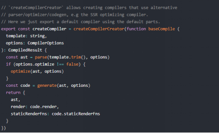

- createCompiler 方法实际上是通过调用 createCompilerCreator 方法返回的，该方法传入的参数是一个函数，真正的编译过程都在这个 baseCompile 函数里执行，那么 createCompilerCreator 又是什么呢，它的定义在 src/compiler/create-compiler.js 中：

-  

- 可以看到该方法返回了一个 createCompiler 的函数，它接收一个 baseOptions 的参数，返回的是一个对象，包括 compile 方法属性和 compileToFunctions 属性，这个 compileToFunctions 对应的就是 $mount 函数调用的 compileToFunctions 方法，它是调用 createCompileToFunctionFn 方法的返回值，我们接下来看一下 createCompileToFunctionFn 方法，它的定义在 src/compiler/to-function/js 中：

- 至此我们总算找到了 compileToFunctions 的最终定义，它接收 3 个参数、编译模板 template，编译配置 options 和 Vue 实例 vm。核心的编译过程就一行代码：

-  

- compile 函数在执行 createCompileToFunctionFn 的时候作为参数传入，它是 createCompiler 函数中定义的 compile 函数，如下：

- compile 函数执行的逻辑是先处理配置参数，真正执行编译过程就一行代码：

-  

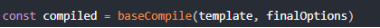

### 执行

- 在 src/compiler/index.js 中：

-  

- 主要就是执行了如下几个逻辑：

- 解析模板字符串生成 AST

-  

- 优化语法树

-  

- 生成代码

-  

### 总结

- 编译入口逻辑之所以这么绕，是因为 Vue.js 在不同的平台下都会有编译的过程，因此编译过程中的依赖的配置 baseOptions 会有所不同。而编译过程会多次执行，但这同一个平台下每一次的编译过程配置又是相同的，为了不让这些配置在每次编译过程都通过参数传入，Vue.js 利用了函数柯里化的技巧很好的实现了 baseOptions 的参数保留。同样，Vue.js 也是利用函数柯里化技巧把基础的编译过程函数抽出来，通过 createCompilerCreator(baseCompile) 的方式把真正编译的过程和其它逻辑如对编译配置处理、缓存处理等剥离开，这样的设计还是非常巧妙的。

## parse

### parse

- 编译过程首先就是对模板做解析，生成 AST，它是一种抽象语法树，是对源代码的抽象语法结构的树状表现形式。在很多编译技术中，如 babel 编译 ES6 的代码都会先生成 AST。

- 为了直观地演示 parse 的过程，我们先来看一个例子

-  

-  

### 整体流程

- 首先来看一下 parse 的定义，在 src/compiler/parser/index.js 中：

-  

- parse 函数的代码很长，贴一遍对同学的理解没有好处，我先把它拆成伪代码的形式，方便同学们对整体流程先有一个大致的了解。接下来我们就来分解分析每段伪代码的作用。

- 从 options 中获取方法和配置

- parse 函数的输入是 template 和 options，输出是 AST 的根节点。template 就是我们的模板字符串，而 options 实际上是和平台相关的一些配置，它的定义在 src/platforms/web/compiler/options 中：

•

-  

- 解析 HTML 模板

- 对于 template 模板的解析主要是通过 parseHTML 函数，它的定义在 src/compiler/parser/html-parser 中：

-  

- 由于 parseHTML 的逻辑也非常复杂，因此我也用了伪代码的方式表达，整体来说它的逻辑就是循环解析 template ，用正则做各种匹配，对于不同情况分别进行不同的处理，直到整个 template 被解析完毕。 在匹配的过程中会利用 advance 函数不断前进整个模板字符串，直到字符串末尾。

-  

- 为了更加直观地说明 advance 的作用，可以通过一副图表示：

-  

- 调用 advance 函数：

-  

-  

- 匹配的过程中主要利用了正则表达式，如下：

-  

- 通过这些正则表达式，我们可以匹配注释节点、文档类型节点、开始闭合标签等。

- 注释节点、文档类型节点

- 对于注释节点和文档类型节点的匹配，如果匹配到我们仅仅做的是做前进即可。

- 对于注释和条件注释节点，前进至它们的末尾位置；对于文档类型节点，则前进它自身长度的距离。

-  

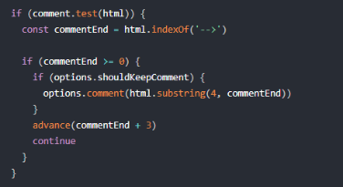

-  

- 开始标签

- 解析开始标签：

-  

- 首先通过 parseStartTag 解析开始标签：

-  

- 对于开始标签，除了标签名之外，还有一些标签相关的属性。

- 函数先通过正则表达式 startTagOpen 匹配到开始标签，然后定义了 match 对象，接着循环去匹配开始标签中的属性并添加到 match.attrs 中，直到匹配的开始标签的闭合符结束。

- 如果匹配到闭合符，则获取一元斜线符，前进到闭合符尾，并把当前索引赋值给 match.end。

- parseStartTag 对开始标签解析拿到 match 后，紧接着会执行 handleStartTag 对 match 做处理：

- handleStartTag 的核心逻辑很简单，先判断开始标签是否是一元标签，类似 ``、` ` 这样，接着对 match.attrs 遍历并做了一些处理

- 最后判断如果非一元标签，则往 stack 里 push 一个对象，并且把 tagName 赋值给 lastTag。

- 最后调用了 options.start 回调函数，并传入一些参数

- 代码

-  

- 闭合标签

- 解析闭合标签

-  

- 先通过正则 endTag 匹配到闭合标签，然后前进到闭合标签末尾，然后执行 parseEndTag 方法对闭合标签做解析。

-  

- parseEndTag 的核心逻辑很简单，在介绍之前我们回顾一下在执行 handleStartTag 的时候，对于非一元标签（有 endTag）我们都把它构造成一个对象压入到 stack 中，如图所示：

-  

- 那么对于闭合标签的解析，就是倒序 stack，找到第一个和当前 endTag 匹配的元素。如果是正常的标签匹配，那么 stack 的最后一个元素应该和当前的 endTag 匹配，但是考虑到如下错误情况：

-  

- 这个时候当 endTag 为 `
` 的时候，从 stack 尾部找到的标签是 ``，就不能匹配，因此这种情况会报警告。匹配后把栈到 pos 位置的都弹出，并从 stack 尾部拿到 lastTag。

- 最后调用了 options.end 回调函数，并传入一些参数，这个回调函数的作用稍后我会详细介绍。

- 文本

- 文本解析

-  

- 接下来判断 textEnd 是否大于等于 0 的，满足则说明到从当前位置到 textEnd 位置都是文本，并且如果 < 是纯文本中的字符，就继续找到真正的文本结束的位置，然后前进到结束的位置。

- 再继续判断 textEnd 小于 0 的情况，则说明整个 template 解析完毕了，把剩余的 html 都赋值给了 text。

- 最后调用了 options.chars 回调函数，并传 text 参数

- 因此，在循环解析整个 template 的过程中，会根据不同的情况，去执行不同的回调函数，下面我们来看看这些回调函数的作用。

- 处理开始标签

- 对应伪代码：

-  

- 当解析到开始标签的时候，最后会执行 start 回调函数，函数主要就做 3 件事情

- 创建 AST 元素

- 代码

-  

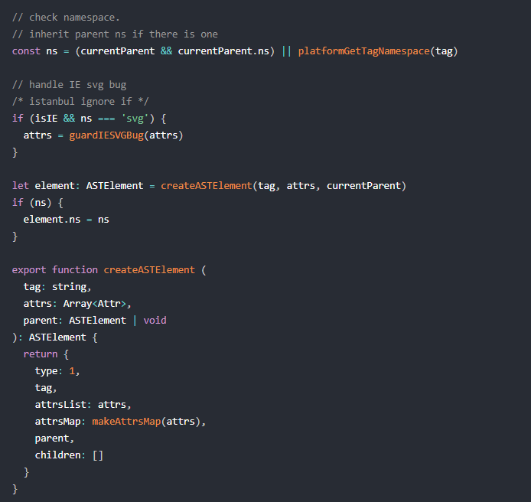

- 通过 createASTElement 方法去创建一个 AST 元素，并添加了 namespace。可以看到，每一个 AST 元素就是一个普通的 JavaScript 对象

- 其中，type 表示 AST 元素类型，tag 表示标签名，attrsList 表示属性列表，attrsMap 表示属性映射表，parent 表示父的 AST 元素，children 表示子 AST 元素集合。

- 处理 AST 元素

- 代码

-  

- 首先是对模块 preTransforms 的调用，其实所有模块的 preTransforms、 transforms 和 postTransforms 的定义都在 src/platforms/web/compiler/modules 目录中

- 接着判断 element 是否包含各种指令通过 processXXX 做相应的处理，处理的结果就是扩展 AST 元素的属性。

- 结合我们当前的例子，我们来看一下 processFor 和 processIf：

- processFor

- 代码

-  

- processFor 就是从元素中拿到 v-for 指令的内容，然后分别解析出 for、alias、iterator1、iterator2 等属性的值添加到 AST 的元素上。

- 就我们的示例 v-for="(item,index) in data" 而言，解析出的的 for 是 data，alias 是 item，iterator1 是 index，没有 iterator2。

- processIf

- 代码

-  

- processIf 就是从元素中拿 v-if 指令的内容，如果拿到则给 AST 元素添加 if 属性和 ifConditions 属性；

- 否则尝试拿 v-else 指令及 v-else-if 指令的内容，如果拿到则给 AST 元素分别添加 else 和 elseif 属性。

- AST 树管理

- 我们在处理开始标签的时候为每一个标签创建了一个 AST 元素，在不断解析模板创建 AST 元素的时候，我们也要为它们建立父子关系，就像 DOM 元素的父子关系那样。

-  

-  

- AST 树管理的目标是构建一颗 AST 树，本质上它要维护 root 根节点和当前父节点 currentParent。为了保证元素可以正确闭合，这里也利用了 stack 栈的数据结构，和我们之前解析模板时用到的 stack 类似。

- 当我们在处理开始标签的时候，判断如果有 currentParent，会把当前 AST 元素 push 到 currentParent.chilldren 中，同时把 AST 元素的 parent 指向 currentParent。

- 接着就是更新 currentParent 和 stack ，判断当前如果不是一个一元标签，我们要把它生成的 AST 元素 push 到 stack 中，并且把当前的 AST 元素赋值给 currentParent。

- stack 和 currentParent 除了在处理开始标签的时候会变化，在处理闭合标签的时候也会变化，因此整个 AST 树管理要结合闭合标签的处理逻辑看。

- 处理闭合标签

- 对应伪代码：

-  

- 当解析到闭合标签的时候，最后会执行 end 回调函数：

-  

- 首先处理了尾部空格的情况，然后把 stack 的元素弹一个出栈，并把 stack 最后一个元素赋值给 currentParent，这样就保证了当遇到闭合标签的时候，可以正确地更新 stack 的长度以及 currentParent 的值，这样就维护了整个 AST 树。

- 最后执行了 closeElement(element)：

-  

- closeElement 逻辑很简单，就是更新一下 inVPre 和 inPre 的状态，以及执行 postTransforms 函数，这些我们暂时都不必了解

- 处理文本内容

- 对应伪代码：

-  

- 除了处理开始标签和闭合标签，我们还会在解析模板的过程中去处理一些文本内容：

-  

- 文本构造的 AST 元素有 2 种类型，一种是有表达式的，type 为 2，一种是纯文本，type 为 3。

- 在我们的例子中，文本就是 :，是个表达式，通过执行 parseText(text, delimiters) 对文本解析，它的定义在 src/compiler/parser/text-parser.js 中：

-  

- parseText 首先根据分隔符（默认是 {{}}）构造了文本匹配的正则表达式，然后再循环匹配文本，遇到普通文本就 push 到 rawTokens 和 tokens 中，如果是表达式就转换成 _s(${exp}) push 到 tokens 中，以及转换成 {@binding:exp} push 到 rawTokens 中。

- 对于我们的例子 :，tokens 就是 [_s(item),'":"',_s(index)]；rawTokens 就是 [{'@binding':'item'},':',{'@binding':'index'}]。那么返回的对象如下：

-  

### 流程图

-

### 总结

- parse 的目标是把 template 模板字符串转换成 AST 树，它是一种用 JavaScript 对象的形式来描述整个模板。

- 那么整个 parse 的过程是利用正则表达式顺序解析模板，当解析到开始标签、闭合标签、文本的时候都会分别执行对应的回调函数，来达到构造 AST 树的目的。

- AST 元素节点总共有 3 种类型，type 为 1 表示是普通元素，为 2 表示是表达式，为 3 表示是纯文本。

## optimize

### optimize

- 当我们的模板 template 经过 parse 过程后，会输出生成 AST 树，那么接下来我们需要对这颗树做优化

- 为什么要有优化过程，因为我们知道 Vue 是数据驱动，是响应式的，但是我们的模板并不是所有数据都是响应式的，也有很多数据是首次渲染后就永远不会变化的，那么这部分数据生成的 DOM 也不会变化，我们可以在 patch 的过程跳过对他们的比对。

- 来看一下 optimize 方法的定义，在 src/compiler/optimizer.js 中：

-  

- 我们在编译阶段可以把一些 AST 节点优化成静态节点，所以整个 optimize 的过程实际上就干 2 件事情

- markStatic(root) 标记静态节点

- markStaticRoots(root, false) 标记静态根。

### 标记静态节点

- 代码

-  

•

- 首先执行 node.static = isStatic(node)

- isStatic 是对一个 AST 元素节点是否是静态的判断

- 如果是表达式，就是非静态；

- 如果是纯文本，就是静态；

- 对于一个普通元素，如果有 pre 属性，那么它使用了 v-pre 指令，是静态，否则要同时满足以下条件：

- 没有使用 v-if、v-for，

- 没有使用其它指令（不包括 v-once）

- 非内置组件

- 是平台保留的标签

- 非带有 v-for 的 template 标签的直接子节点

- 节点的所有属性的 key 都满足静态 key

- 这些都满足则这个 AST 节点是一个静态节点。

- 如果这个节点是一个普通元素，则遍历它的所有 children，递归执行 markStatic。因为所有的 elseif 和 else 节点都不在 children 中， 如果节点的 ifConditions 不为空，则遍历 ifConditions 拿到所有条件中的 block，也就是它们对应的 AST 节点，递归执行 markStatic。在这些递归过程中，一旦子节点有不是 static 的情况，则它的父节点的 static 均变成 false。

### 标记静态根

- 代码

-  

- markStaticRoots 第二个参数是 isInFor，对于已经是 static 的节点或者是 v-once 指令的节点，node.staticInFor = isInFor。 接着就是对于 staticRoot 的判断逻辑，从注释中我们可以看到，对于有资格成为 staticRoot 的节点，除了本身是一个静态节点外，必须满足拥有 children，并且 children 不能只是一个文本节点，不然的话把它标记成静态根节点的收益就很小了。

- 接下来和标记静态节点的逻辑一样，遍历 children 以及 ifConditions，递归执行 markStaticRoots。

### 结果

- 回归我们之前的例子，经过 optimize 后，AST 树变成了如下：

-  

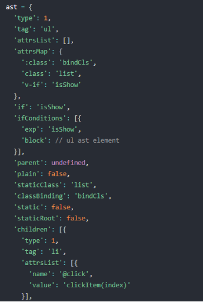

-  

- 我们发现每一个 AST 元素节点都多了 staic 属性，并且 type 为 1 的普通元素 AST 节点多了 staticRoot 属性。

### 总结

- 那么至此我们分析完了 optimize 的过程，就是深度遍历这个 AST 树，去检测它的每一颗子树是不是静态节点，如果是静态节点则它们生成 DOM 永远不需要改变，这对运行时对模板的更新起到极大的优化作用。

- 我们通过 optimize 我们把整个 AST 树中的每一个 AST 元素节点标记了 static 和 staticRoot，它会影响我们接下来执行代码生成的过程。

## codegen

### codegen

- 编译的最后一步就是把优化后的 AST 树转换成可执行的代码，这部分内容也比较多，我并不打算把所有的细节都讲了，了解整体流程即可。为了方便理解，我们还是用之前的例子：

-  

- 它经过编译，执行 const code = generate(ast, options)，生成的 render 代码串如下：

-  

- 这里的 _c 函数定义在 src/core/instance/render.js 中。

•

- 而 _l、_v 定义在 src/core/instance/render-helpers/index.js 中：

-  

- 顾名思义，_c 就是执行 createElement 去创建 VNode，而 _l 对应 renderList 渲染列表；_v 对应 createTextVNode 创建文本 VNode；_e 对于 createEmptyVNode创建空的 VNode。

- 在 compileToFunctions 中，会把这个 render 代码串转换成函数，它的定义在 src/compler/to-function.js 中：

-  

- 实际上就是把 render 代码串通过 new Function 的方式转换成可执行的函数，赋值给 vm.options.render，这样当组件通过 vm._render 的时候，就会执行这个 render 函数。

### generate

- 代码

•

- generate 函数的定义在 src/compiler/codegen/index.js 中：

-  

- generate 函数首先通过 genElement(ast, state) 生成 code，再把 code 用 with(this){return ${code}}} 包裹起来。这里的 state 是 CodegenState 的一个实例，稍后我们在用到它的时候会介绍它。先来看一下 genElement：

-  

- 基本就是判断当前 AST 元素节点的属性执行不同的代码生成函数，在我们的例子中，我们先了解一下 genFor 和 genIf

-  

### genIf

- 代码

-  

- genIf 主要是通过执行 genIfConditions，它是依次从 conditions 获取第一个 condition，然后通过对 condition.exp 去生成一段三元运算符的代码，: 后是递归调用 genIfConditions，这样如果有多个 conditions，就生成多层三元运算逻辑。这里我们暂时不考虑 v-once 的情况，所以 genTernaryExp 最终是调用了 genElement。

- 在我们的例子中，只有一个 condition，exp 为 isShow，因此生成如下伪代码：

-  

### genFor

- 代码

-  

- genFor 的逻辑很简单，首先 AST 元素节点中获取了和 for 相关的一些属性，然后返回了一个代码字符串。

- 在我们的例子中，exp 是 data，alias 是 item，iterator1 ，因此生成如下伪代码：

-  

### genData & genChildren

- 再次回顾我们的例子，它的最外层是 ul，首先执行 genIf，它最终调用了 genElement(el, state) 去生成子节点，注意，这里的 el 仍然指向的是 ul 对应的 AST 节点，但是此时的 el.ifProcessed 为 true，所以命中最后一个 else 逻辑：

-  

- 这里我们只关注 2 个逻辑，genData 和 genChildren：

- genData

- 代码

-  

-  

-  

- genData 函数就是根据 AST 元素节点的属性构造出一个 data 对象字符串，这个在后面创建 VNode 的时候的时候会作为参数传入。

- 之前我们提到了 CodegenState 的实例 state，这里有一段关于 state 的逻辑：

•

- state.dataGenFns 的初始化在它的构造器中。

-  

- 实际上就是获取所有 modules 中的 genData 函数，其中，class module 和 style module 定义了 genData 函数。比如定义在 src/platforms/web/compiler/modules/class.js 中的 genData 方法：

-  

- 在我们的例子中，ul AST 元素节点定义了 el.staticClass 和 el.classBinding，因此最终生成的 data 字符串如下：

-  

- genChildren

- 接下来我们再来看一下 genChildren，它的定义在 src/compiler/codegen/index.js 中：

-  

- 在我们的例子中，li AST 元素节点是 ul AST 元素节点的 children 之一，满足 (children.length === 1 && el.for && el.tag !== 'template' && el.tag !== 'slot') 条件，因此通过 genElement(el, state) 生成 li AST元素节点的代码，也就回到了我们之前调用 genFor 生成的代码，把它们拼在一起生成的伪代码如下：

-  

- 在我们的例子中，在执行 genElememt(el, state) 的时候，el 还是 li AST 元素节点，el.forProcessed 已为 true，所以会继续执行 genData 和 genChildren 的逻辑。由于 el.events 不为空，在执行 genData 的时候，会执行 如下逻辑：

-  

- genHandlers 的定义在 src/compiler/codegen/events.js 中：

-  

- genHandler 的逻辑就不介绍了，很大部分都是对修饰符 modifier 的处理，感兴趣同学可以自己看，对于我们的例子，它最终 genData 生成的 data 字符串如下：

-  

- genChildren 的时候，会执行到如下逻辑：

-  

- genChildren 的就是遍历 children，然后执行 genNode 方法，根据不同的 type 执行具体的方法。在我们的例子中，li AST 元素节点的 children 是 type 为 2 的表达式 AST 元素节点，那么会执行到 genText(node) 逻辑。

-  

- 因此在我们的例子中，genChildren 生成的代码串如下：

-  

- 和之前拼在一起，最终生成的 code 如下：

-  

### 总结

- 这一节通过例子配合解析，我们对从 ast -> code 这一步有了一些了解，编译后生成的代码就是在运行时执行的代码。由于 genCode 的内容有很多，所以我对大家的建议是没必要把所有的细节都一次性看完，我们应该根据具体一个 case，走完一条主线即可。

# **第六章：扩展**

## 介绍

### 详细讲解了 event、v-model、slot、keep-alive、transition、transition-group 等常用功能的原理实现，该章节作为一个可扩展章节，未来会分析更多 Vue 提供的特性

## event

### event

- 我们平时开发工作中，处理组件间的通讯，原生的交互，都离不开事件。对于一个组件元素，我们不仅仅可以绑定原生的 DOM 事件，还可以绑定自定义事件，非常灵活和方便。那么接下来我们从源码角度来看看它的实现原理。  

- 为了更加直观，我们通过一个例子来分析它的实现：

-  

### 编译

- 先从编译阶段开始看起，在 parse 阶段，会执行 processAttrs 方法，它的定义在 src/compiler/parser/index.js 中：

-  

- 在对标签属性的处理过程中，判断如果是指令，首先通过 parseModifiers 解析出修饰符，然后判断如果事件的指令，则执行 addHandler(el, name, value, modifiers, false, warn) 方法，它的定义在 src/compiler/helpers.js 中：

-  

-  

- addHandler 函数看起来长，实际上就做了 3 件事情

- 首先根据 modifier 修饰符对事件名 name 做处理，

- 接着根据 modifier.native 判断是一个纯原生事件还是普通事件，分别对应 el.nativeEvents 和 el.events

- 最后按照 name 对事件做归类，并把回调函数的字符串保留到对应的事件中。

- 在我们的例子中，父组件的 child 节点生成的 el.events 和 el.nativeEvents 如下：

-  

- 子组件的 button 节点生成的 el.events 如下：

-  

- 然后在 codegen 的阶段，会在 genData 函数中根据 AST 元素节点上的 events 和 nativeEvents 生成 data 数据，它的定义在 src/compiler/codegen/index.js 中：

-  

- 对于这两个属性，会调用 genHandlers 函数，定义在 src/compiler/codegen/events.js 中：

- genHandlers 方法遍历事件对象 events，对同一个事件名称的事件调用 genHandler(name, events[name]) 方法，它的内容看起来多，但实际上逻辑很简单

- 首先先判断如果 handler 是一个数组，就遍历它然后递归调用 genHandler 方法并拼接结果

- 然后判断 hanlder.value 是一个函数的调用路径还是一个函数表达式

- 接着对 modifiers 做判断

- 对于没有 modifiers 的情况，就根据 handler.value 不同情况处理，要么直接返回，要么返回一个函数包裹的表达式；

- 对于有 modifiers 的情况，则对各种不同的 modifer 情况做不同处理，添加相应的代码串。

- 那么对于我们的例子而言，父组件生成的 data 串为：

-  

- 子组件生成的 data 串为：

-  

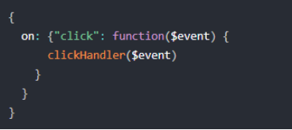

- 那么到这里，编译部分完了，接下来我们来看一下运行时部分是如何实现的。其实 Vue 的事件有 2 种，一种是原生 DOM 事件，一种是用户自定义事件，我们分别来看。

### DOM事件

- 还记得我们之前在 patch 的时候执行各种 module 的钩子函数吗，当时这部分是略过的，我们之前只分析了 DOM 是如何渲染的，而 DOM 元素相关的属性、样式、事件等都是通过这些 module 的钩子函数完成设置的。

- 所有和 web 相关的 module 都定义在 src/platforms/web/runtime/modules 目录下，我们这次只关注目录下的 events.js 即可。

- 在 patch 过程中的创建阶段和更新阶段都会执行 updateDOMListeners：

-  

- 首先获取 vnode.data.on，这就是我们之前的生成的 data 中对应的事件对象，target 是当前 vnode 对于的 DOM 对象，normalizeEvents 主要是对 v-model 相关的处理，我们之后分析 v-model 的时候会介绍，接着调用 updateListeners(on, oldOn, add, remove, vnode.context) 方法，它的定义在 src/core/vdom/helpers/update-listeners.js 中：

-  

- updateListeners 的逻辑很简单，遍历 on 去添加事件监听，遍历 oldOn 去移除事件监听，关于监听和移除事件的方法都是外部传入的，因为它既处理原生 DOM 事件的添加删除，也处理自定义事件的添加删除。

- 对于 on 的遍历，首先获得每一个事件名，然后做 normalizeEvent 的处理：

-  

- 根据我们的的事件名的一些特殊标识（之前在 addHandler 的时候添加上的）区分出这个事件是否有 once、capture、passive 等修饰符。

- 处理完事件名后，又对事件回调函数做处理，对于第一次，满足 isUndef(old) 并且 isUndef(cur.fns)，会执行 cur = on[name] = createFnInvoker(cur) 方法去创建一个回调函数，然后在执行 add(event.name, cur, event.once, event.capture, event.passive, event.params) 完成一次事件绑定。我们先看一下 createFnInvoker 的实现：

-  

- 这里定义了 invoker 方法并返回，由于一个事件可能会对应多个回调函数，所以这里做了数组的判断，多个回调函数就依次调用。注意最后的赋值逻辑， invoker.fns = fns，每一次执行 invoker 函数都是从 invoker.fns 里取执行的回调函数，回到 updateListeners，当我们第二次执行该函数的时候，判断如果 cur !== old，那么只需要更改 old.fns = cur 把之前绑定的 involer.fns 赋值为新的回调函数即可，并且 通过 on[name] = old 保留引用关系，这样就保证了事件回调只添加一次，之后仅仅去修改它的回调函数的引用。

- updateListeners 函数的最后遍历 oldOn 拿到事件名称，判断如果满足 isUndef(on[name])，则执行 remove(event.name, oldOn[name], event.capture) 去移除事件回调。

- 了解了 updateListeners 的实现后，我们来看一下在原生 DOM 事件中真正添加回调和移除回调函数的实现，它们的定义都在 src/platforms/web/runtime/modules/event.js 中：

-  

- add 和 remove 的逻辑很简单，就是实际上调用原生 addEventListener 和 removeEventListener，并根据参数传递一些配置，注意这里的 hanlder 会用 withMacroTask(hanlder) 包裹一下，它的定义在 src/core/util/next-tick.js 中：

-  

- 实际上就是强制在 DOM 事件的回调函数执行期间如果修改了数据，那么这些数据更改推入的队列会被当做 macroTask 在 nextTick 后执行

### 算定义事件

- 除了原生 DOM 事件，Vue 还支持了自定义事件，并且自定义事件只能作用在组件上，如果在组件上使用原生事件，需要加 .native 修饰符，普通元素上使用 .native 修饰符无效，接下来我们就来分析它的实现。

- 在 render 阶段，如果是一个组件节点，则通过 createComponent 创建一个组件 vnode，我们再来回顾这个方法，定义在 src/core/vdom/create-component.js 中：

-  

- 我们只关注事件相关的逻辑，可以看到，它把 data.on 赋值给了 listeners，把 data.nativeOn 赋值给了 data.on，这样所有的原生 DOM 事件处理跟我们刚才介绍的一样，它是在当前组件环境中处理的。而对于自定义事件，我们把 listeners 作为 vnode 的 componentOptions 传入，它是在子组件初始化阶段中处理的，所以它的处理环境是子组件。

- 然后在子组件的初始化的时候，会执行 initInternalComponent 方法，它的定义在 src/core/instance/init.js 中：

•

- 这里拿到了父组件传入的 listeners，然后在执行 initEvents 的过程中，会处理这个 listeners，定义在 src/core/instance/events.js 中：

-  

- 拿到 listeners 后，执行 updateComponentListeners(vm, listeners) 方法：

•

- updateListeners 我们之前介绍过，所以对于自定义事件和原生 DOM 事件处理的差异就在事件添加和删除的实现上，来看一下自定义事件 add 和 remove 的实现：

-  

- 实际上是利用 Vue 定义的事件中心，简单分析一下它的实现：

-  

-  

-  

-  

- 非常经典的事件中心的实现

- 把所有的事件用 vm._events 存储起来，当执行 vm.$on(event,fn) 的时候，按事件的名称 event 把回调函数 fn 存储起来 vm._events[event].push(fn)。

- 当执行 vm.$emit(event) 的时候，根据事件名 event 找到所有的回调函数 let cbs = vm._events[event]，然后遍历执行所有的回调函数。

- 当执行 vm.$off(event,fn) 的时候会移除指定事件名 event 和指定的 fn

- 当执行 vm.$once(event,fn) 的时候，内部就是执行 vm.$on，并且当回调函数执行一次后再通过 vm.$off 移除事件的回调，这样就确保了回调函数只执行一次。

- 需要注意的事一点，

- vm.$emit 是给当前的 vm 上派发的实例，之所以我们常用它做父子组件通讯，是因为它的回调函数的定义是在父组件中，

- ，对于我们这个例子而言，当子组件的 button 被点击了，它通过 this.$emit('select') 派发事件，那么子组件的实例就监听到了这个 select 事件，并执行它的回调函数——定义在父组件中的 selectHandler 方法，这样就相当于完成了一次父子组件的通讯。

### 总结

- Vue 支持 2 种事件类型，原生 DOM 事件和自定义事件，

- 它们主要的区别在于添加和删除事件的方式不一样，并且自定义事件的派发是往当前实例上派发，但是可以利用在父组件环境定义回调函数来实现父子组件的通讯。

- 另外要注意一点，只有组件节点才可以添加自定义事件，并且添加原生 DOM 事件需要使用 native 修饰符；

- 而普通元素使用 .native 修饰符是没有作用的，也只能添加原生 DOM 事件。

## v-model

### v-model

- 很多同学在理解 Vue 的时候都把 Vue 的数据响应原理理解为双向绑定，但实际上这是不准确的，我们之前提到的数据响应，都是通过数据的改变去驱动 DOM 视图的变化，而双向绑定除了数据驱动 DOM 外， DOM 的变化反过来影响数据，是一个双向关系，在 Vue 中，我们可以通过 v-model 来实现双向绑定。

- v-model 即可以作用在普通表单元素上，又可以作用在组件上，它其实是一个语法糖，接下来我们就来分析 v-model 的实现原理。

### 表单元素

- 为了更加直观，我们还是结合示例来分析:

-  

- 编译阶段分析

- parse 阶段

- v-model 被当做普通的指令解析到 el.directives 中

- codegen 阶段

- 执行 genData 的时候，会执行 const dirs = genDirectives(el, state)，它的定义在 src/compiler/codegen/index.js 中

-  

- genDrirectives 方法就是遍历 el.directives，然后获取每一个指令对应的方法 const gen: DirectiveFunction = state.directives[dir.name]，这个指令方法实际上是在实例化 CodegenState 的时候通过 option 传入的，这个 option 就是编译相关的配置，它在不同的平台下配置不同，在 web 环境下的定义在 src/platforms/web/compiler/options.js 下：

-  

- directives 定义在 src/platforms/web/compiler/directives/index.js 中：

-  

- 那么对于 v-model 而言，对应的 directive 函数是在 src/platforms/web/compiler/directives/model.js 中定义的 model 函数：

-  

- 也就是说我们执行 needRuntime = !!gen(el, dir, state.warn) 就是在执行 model 函数，它会根据 AST 元素节点的不同情况去执行不同的逻辑，对于我们这个 case 而言，它会命中 genDefaultModel(el, value, modifiers) 的逻辑

-  

- genDefaultModel 函数先处理了 modifiers，它的不同主要影响的是 event 和 valueExpression 的值，对于我们的例子，event 为 input，valueExpression 为 $event.target.value。然后去执行 genAssignmentCode 去生成代码，它的定义在 src/compiler/directives/model.js 中：

-  

- 该方法首先对 v-model 对应的 value 做了解析，它处理了非常多的情况，对我们的例子，value 就是 messgae，所以返回的 res.key 为 null，然后我们就得到 ${value}=${assignment}，也就是 message=$event.target.value。然后我们又命中了 needCompositionGuard 为 true 的逻辑，所以最终的 code 为 if($event.target.composing)return;message=$event.target.value。

- code 生成完后，又执行了 2 句非常关键的代码：

-  

- 这实际上就是 input 实现 v-model 的精髓，通过修改 AST 元素，给 el 添加一个 prop，相当于我们在 input 上动态绑定了 value，又给 el 添加了事件处理，相当于在 input 上绑定了 input 事件，其实转换成模板如下：

-  

- 其实就是动态绑定了 input 的 value 指向了 messgae 变量，并且在触发 input 事件的时候去动态把 message 设置为目标值，这样实际上就完成了数据双向绑定了，所以说 v-model 实际上就是语法糖。

- 再回到 genDirectives，它接下来的逻辑就是根据指令生成一些 data 的代码：

-  

- 最终生成的 render 代码如下：

-  

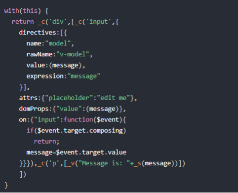

### 组件

- 为了更加直观，我们也是通过一个例子分析：

- 代码

-  

- 父组件引用 child 子组件的地方使用了 v-model 关联了数据 message；而子组件定义了一个 value 的 prop，并且在 input 事件的回调函数中，通过 this.$emit('input', e.target.value) 派发了一个事件，为了让 v-model 生效，这两点是必须的。

- 编译阶段

- 对于父组件而言，在编译阶段会解析 v-modle 指令，依然会执行 genData 函数中的 genDirectives 函数，接着执行 src/platforms/web/compiler/directives/model.js 中定义的 model 函数，并命中如下逻辑：

-  

- genComponentModel 函数定义在 src/compiler/directives/model.js 中：

-  

- genComponentModel 的逻辑很简单，对我们的例子而言，生成的 el.model 的值为：

-  

- 那么在 genDirectives 之后，genData 函数中有一段逻辑如下：

-  

- 那么父组件最终生成的 render 代码如下：

-  

- 创建子组件 vnode 阶段

- 然后在创建子组件 vnode 阶段，会执行 createComponent 函数，它的定义在 src/core/vdom/create-component.js 中：

-  

- 其中会对 data.model 的情况做处理，执行 transformModel(Ctor.options, data) 方法：

-  

- transformModel 逻辑很简单，给 data.props 添加 data.model.value，并且给data.on 添加 data.model.callback，对我们的例子而言，扩展结果如下：

-  

- 其实就相当于我们在这样编写父组件：

-  

- 子组件传递的 value 绑定到当前父组件的 message，同时监听自定义 input 事件，当子组件派发 input 事件的时候，父组件会在事件回调函数中修改 message 的值，同时 value 也会发生变化，子组件的 input 值被更新。

- 这就是典型的 Vue 的父子组件通讯模式，父组件通过 prop 把数据传递到子组件，子组件修改了数据后把改变通过 $emit 事件的方式通知父组件，所以说组件上的 v-model 也是一种语法糖。

- 另外我们注意到组件 v-model 的实现，子组件的 value prop 以及派发的 input 事件名是可配的，可以看到 transformModel 中对这部分的处理：

-  

- 也就是说可以在定义子组件的时候通过 model 选项配置子组件接收的 prop 名以及派发的事件名，举个例子：

-  

- 子组件修改了接收的 prop 名以及派发的事件名，然而这一切父组件作为调用方是不用关心的，这样做的好处是我们可以把 value 这个 prop 作为其它的用途

### 总结

- 那么至此，v-model 的实现就分析完了，我们了解到它是 Vue 双向绑定的真正实现，但本质上就是一种语法糖，它即可以支持原生表单元素，也可以支持自定义组件。在组件的实现中，我们是可以配置子组件接收的 prop 名称，以及派发的事件名称。

## slot

### 普通插槽

- 为了更加直观，我们还是通过一个例子来分析插槽的实现：

-  

- 这里我们定义了 AppLayout 子组件，它内部定义了 3 个插槽，2 个为具名插槽，一个 name 为 header，一个 name 为 footer，还有一个没有定义 name 的是默认插槽。 `<slot>` 和 `</slot>` 之前填写的内容为默认内容。我们的父组件注册和引用了 AppLayout 的组件，并在组件内部定义了一些元素，用来替换插槽，那么它最终生成的 DOM 如下：

-  

### 编译

- 我们知道编译是发生在调用 vm.$mount 的时候，所以编译的顺序是先编译父组件，再编译子组件。

- 首先编译父组件，在 parse 阶段，会执行 processSlot 处理 slot，它的定义在 src/compiler/parser/index.js 中：

-  

- 当解析到标签上有 slot 属性的时候，会给对应的 AST 元素节点添加 slotTarget 属性，然后在 codegen 阶段，在 genData 中会处理 slotTarget，相关代码在 src/compiler/codegen/index.js 中：

-  

- 会给 data 添加一个 slot 属性，并指向 slotTarget，之后会用到。在我们的例子中，父组件最终生成的代码如下：

-  

- 接下来编译子组件，同样在 parser 阶段会执行 processSlot 处理函数，它的定义在 src/compiler/parser/index.js 中：

-  

- 当遇到 slot 标签的时候会给对应的 AST 元素节点添加 slotName 属性，然后在 codegen 阶段，会判断如果当前 AST 元素节点是 slot 标签，则执行 genSlot 函数，它的定义在 src/compiler/codegen/index.js 中：

-  

- 我们先不考虑 slot 标签上有 attrs 以及 v-bind 的情况，那么它生成的代码实际上就只有：

-  

- 这里的 slotName 从 AST 元素节点对应的属性上取，默认是 default，而 children 对应的就是 slot 开始和闭合标签包裹的内容。来看一下我们例子的子组件最终生成的代码，如下：

-  

- 在编译章节我们了解到，_t 函数对应的就是 renderSlot 方法，它的定义在 src/core/instance/render-heplpers/render-slot.js 中：

-  

- render-slot 的参数 name 代表插槽名称 slotName，fallback 代表插槽的默认内容生成的 vnode 数组。先忽略 scoped-slot，只看默认插槽逻辑。

- 如果 this.$slot[name] 有值，就返回它对应的 vnode 数组，否则返回 fallback。那么这个 this.$slot 是哪里来的呢？我们知道子组件的 init 时机是在父组件执行 patch 过程的时候，那这个时候父组件已经编译完成了。并且子组件在 init 过程中会执行 initRender 函数，initRender 的时候获取到 vm.$slot，相关代码在 src/core/instance/render.js 中：

-  

- vm.$slots 是通过执行 resolveSlots(options._renderChildren, renderContext) 返回的，它的定义在 src/core/instance/render-helpers/resolve-slots.js 中：

-  

- resolveSlots 方法接收 2 个参数，第一个参数 chilren 对应的是父 vnode 的 children，在我们的例子中就是 `<app-layout>` 和 `</app-layout>` 包裹的内容。第二个参数 context 是父 vnode 的上下文，也就是父组件的 vm 实例。

- resolveSlots 函数的逻辑就是遍历 chilren，拿到每一个 child 的 data，然后通过 data.slot 获取到插槽名称，这个 slot 就是我们之前编译父组件在 codegen 阶段设置的 data.slot。接着以插槽名称为 key 把 child 添加到 slots 中，如果 data.slot 不存在，则是默认插槽的内容，则把对应的 child 添加到 slots.defaults 中。这样就获取到整个 slots，它是一个对象，key 是插槽名称，value 是一个 vnode 类型的数组，因为它可以有多个同名插槽。

- 这样我们就拿到了 vm.$slots 了，回到 renderSlot 函数，const slotNodes = this.$slots[name]，我们也就能根据插槽名称获取到对应的 vnode 数组了，这个数组里的 vnode 都是在父组件创建的，这样就实现了在父组替换子组件插槽的内容了。

- 对应的 slot 渲染成 vnodes，作为当前组件渲染 vnode 的 children，之后的渲染过程之前分析过，不再赘述。

- 我们知道在普通插槽中，父组件应用到子组件插槽里的数据都是绑定到父组件的，因为它渲染成 vnode 的时机的上下文是父组件的实例。但是在一些实际开发中，我们想通过子组件的一些数据来决定父组件实现插槽的逻辑，Vue 提供了另一种插槽——作用域插槽

### 作用域插槽

- 为了更加直观，我们也是通过一个例子来分析作用域插槽的实现：

-  

- 最终生成的 DOM 结构如下：

-  

- 我们可以看到子组件的 slot 标签多了 text 属性，以及 :msg 属性。父组件实现插槽的部分多了一个 template 标签，以及 scope-slot 属性，其实在 Vue 2.5+ 版本，scoped-slot 可以作用在普通元素上。这些就是作用域插槽和普通插槽在写法上的差别。

- 在编译阶段，仍然是先编译父组件，同样是通过 processSlot 函数去处理 scoped-slot，它的定义在在 src/compiler/parser/index.js 中：

-  

- 这块逻辑很简单，读取 scoped-slot 属性并赋值给当前 AST 元素节点的 slotScope 属性，接下来在构造 AST 树的时候，会执行以下逻辑：

-  

- 可以看到对于拥有 scopedSlot 属性的 AST 元素节点而言，是不会作为 children 添加到当前 AST 树中，而是存到父 AST 元素节点的 scopedSlots 属性上，它是一个对象，以插槽名称 name 为 key。

- 然后在 genData 的过程，会对 scopedSlots 做处理：

-  

- genScopedSlots 就是对 scopedSlots 对象遍历，执行 genScopedSlot，并把结果用逗号拼接，而 genScopedSlot 是先生成一段函数代码，并且函数的参数就是我们的 slotScope，也就是写在标签属性上的 scoped-slot 对应的值，然后再返回一个对象，key 为插槽名称，fn 为生成的函数代码。

- 对于我们这个例子而言，父组件最终生成的代码如下：

-  

- 可以看到它和普通插槽父组件编译结果的一个很明显的区别就是没有 children 了，data 部分多了一个对象，并且执行了 _u 方法，在编译章节我们了解到，_u 函数对的就是 resolveScopedSlots 方法，它的定义在 src/core/instance/render-heplpers/resolve-slots.js 中：

-  

- 其中，fns 是一个数组，每一个数组元素都有一个 key 和一个 fn，key 对应的是插槽的名称，fn 对应一个函数。整个逻辑就是遍历这个 fns 数组，生成一个对象，对象的 key 就是插槽名称，value 就是函数。这个函数的执行时机稍后我们会介绍。

- 接着我们再来看一下子组件的编译，和普通插槽的过程基本相同，唯一一点区别是在 genSlot 的时候：

-  

- 它会对 attrs 和 v-bind 做处理，对应到我们的例子，最终生成的代码如下：

-  

- _t 方法我们之前介绍过，对应的是 renderSlot 方法：

-  

- 我们只关注作用域插槽的逻辑，那么这个 this.$scopedSlots 又是在什么地方定义的呢，原来在子组件的渲染函数执行前，在 vm_render 方法内，有这么一段逻辑，定义在 src/core/instance/render.js 中：

-  

- 这个 _parentVNode.data.scopedSlots 对应的就是我们在父组件通过执行 resolveScopedSlots 返回的对象。所以回到 genSlot 函数，我们就可以通过插槽的名称拿到对应的 scopedSlotFn，然后把相关的数据扩展到 props 上，作为函数的参数传入，原来之前我们提到的函数这个时候执行，然后返回生成的 vnodes，为后续渲染节点用。

### 总结

- 普通插槽和作用域插槽的实现。它们有一个很大的差别是数据作用域，普通插槽是在父组件编译和渲染阶段生成 vnodes，所以数据的作用域是父组件实例，子组件渲染的时候直接拿到这些渲染好的 vnodes。

- 而对于作用域插槽，父组件在编译和渲染阶段并不会直接生成 vnodes，而是在父节点 vnode 的 data 中保留一个 scopedSlots 对象，存储着不同名称的插槽以及它们对应的渲染函数，只有在编译和渲染子组件阶段才会执行这个渲染函数生成 vnodes，由于是在子组件环境执行的，所以对应的数据作用域是子组件实例。

- 简单地说，两种插槽的目的都是让子组件 slot 占位符生成的内容由父组件来决定，但数据的作用域会根据它们 vnodes 渲染时机不同而不同。

## keep-alive

### 内置组件

- `<keep-alive>` 是 Vue 源码中实现的一个组件，也就是说 Vue 源码不仅实现了一套组件化的机制，也实现了一些内置组件，它的定义在 src/core/components/keep-alive.js 中：

-  

-  

- 可以看到 `<keep-alive>` 组件的实现也是一个对象，注意它有一个属性 abstract 为 true，是一个抽象组件，Vue 的文档没有提这个概念，实际上它在组件实例建立父子关系的时候会被忽略，发生在 initLifecycle 的过程中：

-  

- `<keep-alive>` 在 created 钩子里定义了 this.cache 和 this.keys，本质上它就是去缓存已经创建过的 vnode。它的 props 定义了 include，exclude，它们可以字符串或者表达式

- include 表示只有匹配的组件会被缓存

- 而 exclude 表示任何匹配的组件都不会被缓存

- props 还定义了 max，它表示缓存的大小，因为我们是缓存的 vnode 对象，它也会持有 DOM，当我们缓存很多的时候，会比较占用内存，所以该配置允许我们指定缓存大小。

- `<keep-alive>` 直接实现了 render 函数，而不是我们常规模板的方式，执行 `<keep-alive>` 组件渲染的时候，就会执行到这个 render 函数，接下来我们分析一下它的实现。

- 首先获取第一个子元素的 vnode：

-  

- 由于我们也是在 `<keep-alive>` 标签内部写 DOM，所以可以先获取到它的默认插槽，然后再获取到它的第一个子节点。`<keep-alive>` 只处理第一个子元素，所以一般和它搭配使用的有 component 动态组件或者是 router-view，这点要牢记。

- 然后又判断了当前组件的名称和 include、exclude 的关系：

-  

- matches 的逻辑很简单，就是做匹配，分别处理了数组、字符串、正则表达式的情况，也就是说我们平时传的 include 和 exclude 可以是这三种类型的任意一种。并且我们的组件名如果满足了配置 include 且不匹配或者是配置了 exclude 且匹配，那么就直接返回这个组件的 vnode，否则的话走下一步缓存：

-  

- 这部分逻辑很简单，如果命中缓存，则直接从缓存中拿 vnode 的组件实例，并且重新调整了 key 的顺序放在了最后一个；否则把 vnode 设置进缓存，最后还有一个逻辑，如果配置了 max 并且缓存的长度超过了 this.max，还要从缓存中删除第一个：

-  

- 除了从缓存中删除外，还要判断如果要删除的缓存并的组件 tag 不是当前渲染组件 tag，也执行删除缓存的组件实例的 $destroy 方法。

- 最后设置 vnode.data.keepAlive = true ，这个作用稍后我们介绍。

- 注意，`<keep-alive>` 组件也是为观测 include 和 exclude 的变化，对缓存做处理：

-  

- 逻辑很简单，观测他们的变化执行 pruneCache 函数，其实就是对 cache 做遍历，发现缓存的节点名称和新的规则没有匹配上的时候，就把这个缓存节点从缓存中摘除

### 组件渲染

- 到此为止，我们只了解了 `<keep-alive>` 的组件实现，但并不知道它包裹的子组件渲染和普通组件有什么不一样的地方。我们关注 2 个方面，首次渲染和缓存渲染。同样为了更好地理解，我们也结合一个示例来分析：

-  

- 首次渲染

- 我们知道 Vue 的渲染最后都会到 patch 过程，而组件的 patch 过程会执行 createComponent 方法，它的定义在 src/core/vdom/patch.js 中：

-  

- createComponent 定义了 isReactivated 的变量，它是根据 vnode.componentInstance 以及 vnode.data.keepAlive 的判断

- 第一次渲染的时候，vnode.componentInstance 为 undefined，vnode.data.keepAlive 为 true，因为它的父组件 `<keep-alive>` 的 render 函数会先执行，那么该 vnode 缓存到内存中，并且设置 vnode.data.keepAlive 为 true，因此 isReactivated 为 false，那么走正常的 init 的钩子函数执行组件的 mount。当 vnode 已经执行完 patch 后，执行 initComponent 函数：

-  

- 这里会有 vnode.elm 缓存了 vnode 创建生成的 DOM 节点。所以对于首次渲染而言，除了在 `<keep-alive>` 中建立缓存，和普通组件渲染没什么区别。

- 所以对我们的例子，初始化渲染 A 组件以及第一次点击 switch 渲染 B 组件，都是首次渲染。

- 缓存渲染

- 当我们从 B 组件再次点击 switch 切换到 A 组件，就会命中缓存渲染。

- 我们之前分析过，当数据发送变化，在 patch 的过程中会执行 patchVnode 的逻辑，它会对比新旧 vnode 节点，甚至对比它们的子节点去做更新逻辑，但是对于组件 vnode 而言，是没有 children 的，那么对于 `<keep-alive>` 组件而言，如何更新它包裹的内容呢？

- 原来 patchVnode 在做各种 diff 之前，会先执行 prepatch 的钩子函数，它的定义在 src/core/vdom/create-component 中：

-  

- prepatch 核心逻辑就是执行 updateChildComponent 方法，它的定义在 src/core/instance/lifecycle.js 中：

-  

- updateChildComponent 方法主要是去更新组件实例的一些属性，这里我们重点关注一下 slot 部分，由于 `<keep-alive>` 组件本质上支持了 slot，所以它执行 prepatch 的时候，需要对自己的 children，也就是这些 slots 做重新解析，并触发 `<keep-alive>` 组件实例 $forceUpdate 逻辑，也就是重新执行 `<keep-alive>` 的 render 方法，这个时候如果它包裹的第一个组件 vnode 命中缓存，则直接返回缓存中的 vnode.componentInstance，在我们的例子中就是缓存的 A 组件，接着又会执行 patch 过程，再次执行到 createComponent 方法，我们再回顾一下：

-  

- 这个时候 isReactivated 为 true，并且在执行 init 钩子函数的时候不会再执行组件的 mount 过程了，相关逻辑在 src/core/vdom/create-component.js 中：

-  

- 这也就是被 `<keep-alive>` 包裹的组件在有缓存的时候就不会在执行组件的 created、mounted 等钩子函数的原因了。回到 createComponent 方法，在 isReactivated 为 true 的情况下会执行 reactivateComponent 方法

-  

- 前面部分的逻辑是解决对 reactived 组件 transition 动画不触发的问题，可以先不关注，最后通过执行 insert(parentElm, vnode.elm, refElm) 就把缓存的 DOM 对象直接插入到目标元素中，这样就完成了在数据更新的情况下的渲染过程。

### 生命周期

- 之前我们提到，组件一旦被 `<keep-alive>` 缓存，那么再次渲染的时候就不会执行 created、mounted 等钩子函数，但是我们很多业务场景都是希望在我们被缓存的组件再次被渲染的时候做一些事情，好在 Vue 提供了 activated 钩子函数，它的执行时机是 `<keep-alive>` 包裹的组件渲染的时候，接下来我们从源码角度来分析一下它的实现原理。

- 在渲染的最后一步，会执行 invokeInsertHook(vnode, insertedVnodeQueue, isInitialPatch) 函数执行 vnode 的 insert 钩子函数，它的定义在 src/core/vdom/create-component.js 中：

-  

- 这里判断如果是被 `<keep-alive>` 包裹的组件已经 mounted，那么则执行 queueActivatedComponent(componentInstance) ，否则执行 activateChildComponent(componentInstance, true)。

- 我们先分析非 mounted 的情况，activateChildComponent 的定义在 src/core/instance/lifecycle.js 中：

-  

- 可以看到这里就是执行组件的 acitvated 钩子函数，并且递归去执行它的所有子组件的 activated 钩子函数。

- 那么再看 queueActivatedComponent 的逻辑，它定义在 src/core/observer/scheduler.js 中：

-  

- 这个逻辑很简单，把当前 vm 实例添加到 activatedChildren 数组中，等所有的渲染完毕，在 nextTick后会执行 flushSchedulerQueue，这个时候就会执行：

-  

- 也就是遍历所有的 activatedChildren，执行 activateChildComponent 方法，通过队列调的方式就是把整个 activated 时机延后了。

- 有 activated 钩子函数，也就有对应的 deactivated 钩子函数，它是发生在 vnode 的 destory 钩子函数，定义在 src/core/vdom/create-component.js 中：

-  

- 对于 `<keep-alive>` 包裹的组件而言，它会执行 deactivateChildComponent(componentInstance, true) 方法，定义在 src/core/instance/lifecycle.js 中：

-  

- 和 activateChildComponent 方法类似，就是执行组件的 deacitvated 钩子函数，并且递归去执行它的所有子组件的 deactivated 钩子函数。

### 总结

- 我们知道了 `<keep-alive>` 组件是一个抽象组件，它的实现通过自定义 render 函数并且利用了插槽，并且知道了 `<keep-alive>` 缓存 vnode，了解组件包裹的子元素——也就是插槽是如何做更新的。

- 且在 patch 过程中对于已缓存的组件不会执行 mounted，所以不会有一般的组件的生命周期函数但是又提供了 activated 和 deactivated 钩子函数。另外我们还知道了 `<keep-alive>` 的 props 除了 include 和 exclude 还有文档中没有提到的 max，它能控制我们缓存的个数。

## transition

###  transition

- `<transition>` 组件，我们可以利用它配合一些 CSS3 样式很方便地实现过渡动画，也可以利用它配合 JavaScript 的钩子函数实现过渡动画，在下列情形中，可以给任何元素和组件添加 entering/leaving 过渡：

- 条件渲染 (使用 v-if)

- 条件展示 (使用 v-show)

- 动态组件

- 组件根节点

- 那么举一个最简单的实例，如下：

-  

-  

### 内置组件

- `<transition>` 组件和 `<keep-alive>` 组件一样，都是 Vue 的内置组件，而 `<transition>` 的定义在 src/platforms/web/runtime/component/transtion.js

-  

-  

- `<transition>` 组件和 `<keep-alive>` 组件有几点实现类似，同样是抽象组件，同样直接实现 render 函数，同样利用了默认插槽。`<transition>` 组件非常灵活，支持的 props 非常多：

-  

- 这些配置我们稍后会分析它们的作用，`<transition>` 组件另一个重要的就是 render 函数的实现，render 函数主要作用就是渲染生成 vnode，下面来看一下这部分的逻辑。

- 处理 children

- 先从默认插槽中获取 `<transition>` 包裹的子节点，并且判断了子节点的长度，如果长度为 0，则直接返回，否则判断长度如果大于 1，也会在开发环境报警告，因为 `<transition>` 组件是只能包裹一个子节点的。

-  

- 处理 model

- 过渡组件的对 mode 的支持只有 2 种，in-out 或者是 out-in。

-  

- 获取 rawChild & child

- rawChild 就是第一个子节点 vnode，接着判断当前 `<transition>` 如果是组件根节点并且外面包裹该组件的容器也是 `<transition>` 的时候要跳过

-  

- 来看一下 hasParentTransition 的实现：

-  

- 因为传入的是 this.$vnode，也就是 `<transition>` 组件的 占位 vnode，只有当它同时作为根 vnode，也就是 vm._vnode 的时候，它的 parent 才不会为空，并且判断 parent 也是 `<transition>` 组件，才返回 true，vnode.data.transition 我们稍后会介绍。

- getRealChild 的目的是获取组件的非抽象子节点，因为 `<transition>` 很可能会包裹一个 keep-alive，它的实现如下：

-  

- 会递归找到第一个非抽象组件的 vnode 并返回，在我们这个 case 下，rawChild === child。

- 处理 id & data

- 先根据 key 等一系列条件获取 id，接着从当前通过 extractTransitionData 组件实例上提取出过渡所需要的数据：

-  

- 首先是遍历 props 赋值到 data 中，接着是遍历所有父组件的事件也把事件回调赋值到 data 中。

-  

- 这样 child.data.transition 中就包含了过渡所需的一些数据，这些稍后都会用到，对于 child 如果使用了 v-show 指令，也会把 child.data.show 设置为 true，在我们的例子中，得到的 child.data 如下：

-  

### transition module

- 刚刚我们介绍完 `<transition>` 组件的实现，它的 render 阶段只获取了一些数据，并且返回了渲染的 vnode，并没有任何和动画相关，而动画相关的逻辑全部在 src/platforms/web/modules/transition.js 中：

-  

- 在之前介绍事件实现的章节中我们提到过在 vnode patch 的过程中，会执行很多钩子函数，那么对于过渡的实现，它只接收了 create 和 activate 2 个钩子函数，我们知道 create 钩子函数只有当节点的创建过程才会执行，而 remove 会在节点销毁的时候执行，这也就印证了 `<transition>` 必须要满足 v-if 、动态组件、组件根节点条件之一了，对于 v-show 在它的指令的钩子函数中也会执行相关逻辑

- 过渡动画提供了 2 个时机，一个是 create 和 activate 的时候提供了 entering 进入动画，一个是 remove 的时候提供了 leaving 离开动画，那么接下来我们就来分别去分析这两个过程。

### entering

- 整个 entering 过程的实现是 enter 函数：

-  

-  

-  

- enter 的代码很长，我们先分析其中的核心逻辑。

- 解析过渡数据

- 从 vnode.data.transition 中解析出过渡相关的一些数据，

-  

- resolveTransition 的定义在 src/platforms/web/transition-util.js 中：

-  

- resolveTransition 会通过 autoCssTransition 处理 name 属性，生成一个用来描述各个阶段的 Class 名称的对象，扩展到 def 中并返回给 data，这样我们就可以从 data 中获取到过渡相关的所有数据。

- 处理边界情况

- 这是为了处理当 `<transition>` 作为子组件的根节点，那么我们需要检查它的父组件作为 appear 的检查。isAppear 表示当前上下文实例还没有 mounted，第一次出现的时机。如果是第一次并且 `<transition>` 组件没有配置 appear 的话，直接返回

-  

- 定义过渡类名、钩子函数和其它配置

- 代码

-  

- 对于过渡类名方面

- startClass 定义进入过渡的开始状态，在元素被插入时生效，在下一个帧移除；

- activeClass 定义过渡的状态，在元素整个过渡过程中作用，在元素被插入时生效，在 transition/animation 完成之后移除；

- toClass 定义进入过渡的结束状态，在元素被插入一帧后生效 (与此同时 startClass 被删除)，在 `<transition>`/animation 完成之后移除。

- 对于过渡钩子函数方面

- beforeEnterHook 是过渡开始前执行的钩子函数

- enterHook 是在元素插入后或者是 v-show 显示切换后执行的钩子函数

- afterEnterHook 是在过渡动画执行完后的钩子函数。

- explicitEnterDuration 表示 enter 动画执行的时间。

- expectsCSS 表示过渡动画是受 CSS 的影响。

- cb 定义的是过渡完成执行的回调函数。

- 合并 insert 钩子函数

-  

- mergeVNodeHook 的定义在 src/core/vdom/helpers/merge-hook.js 中：

-  

- mergeVNodeHook 的逻辑很简单，就是把 hook 函数合并到 def.data.hook[hookey] 中，生成新的 invoker，createFnInvoker 方法我们在分析事件章节的时候已经介绍过了。

- 我们之前知道组件的 vnode 原本定义了 init、prepatch、insert、destroy 四个钩子函数，而 mergeVNodeHook 函数就是把一些新的钩子函数合并进来，例如在 `<transition>` 过程中合并的 insert 钩子函数，就会合并到组件 vnode 的 insert 钩子函数中，这样当组件插入后，就会执行我们定义的 enterHook 了。

- 开始执行过渡动画

- 首先执行 beforeEnterHook 钩子函数，把当前元素的 DOM 节点 el 传入，然后判断 expectsCSS，如果为 true 则表明希望用 CSS 来控制动画，那么会执行 addTransitionClass(el, startClass) 和 addTransitionClass(el, activeClass)

-  

- addTransitionClass的定义在 src/platforms/runtime/transition-util.js 中：

-  

- 其实非常简单，就是给当前 DOM 元素 el 添加样式 cls，所以这里添加了 startClass 和 activeClass，在我们的例子中就是给 p 标签添加了 fade-enter 和 fade-enter-active 2 个样式。

- 接下来执行了 nextFrame：

-  

- 它就是一个简单的 requestAnimationFrame 的实现，它的参数 fn 会在下一帧执行，因此下一帧执行了 removeTransitionClass(el, startClass)：

-  

- 把 startClass 移除，在我们的等例子中就是移除 fade-enter 样式。然后判断此时过渡没有被取消，则执行 addTransitionClass(el, toClass) 添加 toClass，在我们的例子中就是添加了 fade-enter-to。然后判断 !userWantsControl，也就是用户不通过 enterHook 钩子函数控制动画，这时候如果用户指定了 explicitEnterDuration，则延时这个时间执行 cb，否则通过 whenTransitionEnds(el, type, cb) 决定执行 cb 的时机：

-  

- whenTransitionEnds 的逻辑具体不深讲了，本质上就利用了过渡动画的结束事件来决定 cb 函数的执行。

- 最后再回到 cb 函数：

-  

- 其实很简单，执行了 removeTransitionClass(el, toClass) 和 removeTransitionClass(el, activeClass) 把 toClass 和 activeClass 移除，然后判断如果有没有取消，如果取消则移除 startClass 并执行 enterCancelledHook，否则执行 afterEnterHook(el)。

- 那么到这里，entering 的过程就介绍完了

### leaving

- 与 entering 相对的就是 leaving 阶段了，entering 主要发生在组件插入后，而 leaving 主要发生在组件销毁前。

-  

-  

-  

- 纵观 leave 的实现，和 enter 的实现几乎是一个镜像过程，不同的是从 data 中解析出来的是 leave 相关的样式类名和钩子函数。还有一点不同是可以配置 delayLeave，它是一个函数，可以延时执行 leave 的相关过渡动画，在 leave 动画执行完后，它会执行 rm 函数把节点从 DOM 中真正做移除

### 总结

- 那么到此为止基本的 `<transition>` 过渡的实现分析完毕了，总结起来，Vue 的过渡实现分为以下几个步骤：

- 自动嗅探目标元素是否应用了 CSS 过渡或动画，如果是，在恰当的时机添加/删除 CSS 类名。

- 如果过渡组件提供了 JavaScript 钩子函数，这些钩子函数将在恰当的时机被调用。

- 如果没有找到 JavaScript 钩子并且也没有检测到 CSS 过渡/动画，DOM 操作 (插入/删除) 在下一帧中立即执行。

- 所以真正执行动画的是我们写的 CSS 或者是 JavaScript 钩子函数，而 Vue 的 `<transition>` 只是帮我们很好地管理了这些 CSS 的添加/删除，以及钩子函数的执行时机。

## transition-group

### transition-group

- 前一节我们介绍了 `<transiiton>` 组件的实现原理，它只能针对单一元素实现过渡效果。我们做前端开发经常会遇到列表的需求，我们对列表元素进行添加和删除，有时候也希望有过渡效果，Vue.js 提供了 `<transition-group>` 组件，很好地帮助我们实现了列表的过渡效果。那么接下来我们就来分析一下它的实现原理。

- 为了更直观，我们也是通过一个示例来说明：

-  

-  

- 这个示例初始会展现 1-9 十个数字，当我们点击 Add 按钮时，会生成 nextNum 并随机在当前数列表中插入；当我们点击 Remove 按钮时，会随机删除掉一个数。我们会发现在数添加删除的过程中在列表中会有过渡动画，这就是 `<transition-group>` 组件配合我们定义的 CSS 产生的效果。

- 我们首先还是来分析 `<transtion-group>` 组件的实现，它的定义在 src/platforms/web/runtime/components/transitions.js 中：

-  

-  

-  

### render函数

- `<transition-group>` 组件也是由 render 函数渲染生成 vnode，接下来我们先分析 render 的实现。

- 定义一些变量

- 不同于 `<transition>` 组件，`<transition-group>` 组件非抽象组件，它会渲染成一个真实元素，默认 tag 是 span。

-  

- prevChildren 用来存储上一次的子节点；

- children 用来存储当前的子节点；

- rawChildren 表示 `<transtition-group>` 包裹的原始子节点；

- transtionData 是从 `<transtition-group>` 组件上提取出来的一些渲染数据，这点和 `<transition>` 组件的实现是一样的。

- 遍历 rawChidren，初始化 children

- 其实就是对 rawChildren 遍历，拿到每个 vnode，然后会判断每个 vnode 是否设置了 key，这个是 `<transition-group>` 对列表元素的要求。然后把 vnode 添加到 children 中，然后把刚刚提取的过渡数据 transitionData 添加的 vnode.data.transition 中，这点很关键，只有这样才能实现列表中单个元素的过渡动画。

-  

- 处理 prevChildren

- 当有 prevChildren 的时候，我们会对它做遍历，获取到每个 vnode，然后把 transitionData 赋值到 vnode.data.transition，这个是为了当它在 enter 和 leave 的钩子函数中有过渡动画，我们在上节介绍 transition 的实现中说过。接着又调用了原生 DOM 的 getBoundingClientRect 方法获取到原生 DOM 的位置信息，记录到 vnode.data.pos 中，然后判断一下 vnode.key 是否在 map 中，如果在则放入 kept 中，否则表示该节点已被删除，放入 removed 中，然后通过执行 h(tag, null, kept) 渲染后放入 this.kept 中，把 removed 用 this.removed 保存。最后整个 render 函数通过 h(tag, null, children) 生成渲染 vnode。

-  

- 如果 transition-group 只实现了这个 render 函数，那么每次插入和删除的元素的缓动动画是可以实现的，在我们的例子中，当新增一个元素，它的插入的过渡动画是有的，但是剩余元素平移的过渡效果是出不来的，所以接下来我们来分析 `<transition-group>` 组件是如何实现剩余元素平移的过渡效果的。

### move过渡实现

- 其实我们在实现元素的插入和删除，无非就是操作数据，控制它们的添加和删除。比如我们新增数据的时候，会添加一条数据，除了重新执行 render 函数渲染新的节点外，还要触发 updated 钩子函数，接着我们就来分析 updated 钩子函数的实现。

- 判断子元素是否定义 move 相关样式

- 核心就是 hasMove 的判断，首先克隆一个 DOM 节点，然后为了避免影响，移除它的所有其他的过渡 Class；接着添加了 moveClass 样式，设置 display 为 none，添加到组件根节点上；接下来通过 getTransitionInfo 获取它的一些缓动相关的信息，这个函数在上一节我们也介绍过，然后从组件根节点上删除这个克隆节点，并通过判断 info.hasTransform 来判断 hasMove，在我们的例子中，该值为 true。

-  

- 子节点预处理

- 对 children 做了 3 轮循环，分别做了如下一些处理：

-  

-  

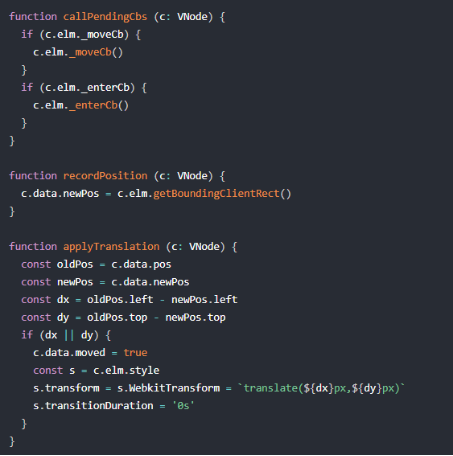

- callPendingCbs 方法是在前一个过渡动画没执行完又再次执行到该方法的时候，会提前执行 _moveCb 和 _enterCb。

- recordPosition 的作用是记录节点的新位置。

- applyTranslation 的作用是先计算节点新位置和旧位置的差值，如果差值不为 0，则说明这些节点是需要移动的，所以记录 vnode.data.moved 为 true，并且通过设置 transform 把需要移动的节点的位置又偏移到之前的旧位置，目的是为了做 move 缓动做准备。

- 遍历子元素实现 move 过渡

- 首先通过 document.body.offsetHeight 强制触发浏览器重绘，接着再次对 children 遍历，先给子节点添加 moveClass，在我们的例子中，moveClass 定义了 transition: all 1s; 缓动；接着把子节点的 style.transform 设置为空，由于我们前面把这些节点偏移到之前的旧位置，所以它就会从旧位置按照 1s 的缓动时间过渡偏移到它的当前目标位置，这样就实现了 move 的过渡动画。并且接下来会监听 transitionEndEvent 过渡结束的事件，做一些清理的操作。

-  

- 另外，由于虚拟 DOM 的子元素更新算法是不稳定的，它不能保证被移除元素的相对位置，所以我们强制 `<transition-group>` 组件更新子节点通过 2 个步骤

- 第一步我们移除需要移除的 vnode，同时触发它们的 leaving 过渡；

- 第二步我们需要把插入和移动的节点达到它们的最终态，同时还要保证移除的节点保留在应该的位置，而这个是通过 beforeMount 钩子函数来实现的：

-  

- 通过把 __patch__ 方法的第四个参数 removeOnly 设置为 true，这样在 updateChildren 阶段，是不会移动 vnode 节点的

### 总结

- `<transtion-group>` 组件的实现原理就介绍完毕了，它和 `<transition>` 组件相比，实现了列表的过渡，以及它会渲染成真实的元素。

- 当我们去修改列表的数据的时候，如果是添加或者删除数据，则会触发相应元素本身的过渡动画，这点和 `<transition>` 组件实现效果一样

- 除此之外 `<transtion-group>` 还实现了 move 的过渡效果，让我们的列表过渡动画更加丰富。

# **第七章：Vue-Router**

## 介绍

### 分析了 Vue-Router 的实现原理，从路由注册开始，分析了路由对象、matcher，并深入分析了整个路径切换的实现过程和细节

## Introduction

### Vue-Router 的能力十分强大，它支持 hash、history、abstract 3 种路由方式

### 提供了 `<router-link>` 和 `<router-view>` 2 种组件

### 基本使用例子

-

-

## 路由注册

### Vue.use

- Vue 提供了 Vue.use 的全局 API 来注册这些插件，所以我们先来分析一下它的实现原理，定义在 vue/src/core/global-api/use.js 中：

-  

- Vue.use 接受一个 plugin 参数，并且维护了一个 _installedPlugins 数组，它存储所有注册过的 plugin；

- 接着又会判断 plugin 有没有定义 install 方法，如果有的话则调用该方法，并且该方法执行的第一个参数是 Vue；

- 最后把 plugin 存储到 installedPlugins 中。

- 可以看到 Vue 提供的插件注册机制很简单，每个插件都需要实现一个静态的 install 方法，当我们执行 Vue.use 注册插件的时候，就会执行这个 install 方法，并且在这个 install 方法的第一个参数我们可以拿到 Vue 对象，这样的好处就是作为插件的编写方不需要再额外去import Vue 了

### 路由安装

- Vue-Router 的入口文件是 src/index.js，其中定义了 VueRouter 类，也实现了 install 的静态方法：VueRouter.install = install，它的定义在 src/install.js 中。

-  

- 当用户执行 Vue.use(VueRouter) 的时候，实际上就是在执行 install 函数，为了确保 install 逻辑只执行一次，用了 install.installed 变量做已安装的标志位。

- 另外用一个全局的 _Vue 来接收参数 Vue，因为作为 Vue 的插件对 Vue 对象是有依赖的，但又不能去单独去 import Vue，因为那样会增加包体积，所以就通过这种方式拿到 Vue 对象。

- Vue-Router 安装最重要的一步就是利用 Vue.mixin 去把 beforeCreate 和 destroyed 钩子函数注入到每一个组件中。Vue.mixin 的定义，在 vue/src/core/global-api/mixin.js 中：

-  

- 它的实现实际上非常简单，就是把要混入的对象通过 mergeOptions 合并到 Vue 的 options 中，由于每个组件的构造函数都会在 extend 阶段合并 Vue.options 到自身的 options 中，所以也就相当于每个组件都定义了 mixin 定义的选项。

- 回到 Vue-Router 的 install 方法，先看混入的 beforeCreate 钩子函数

- 对于根 Vue 实例而言，执行该钩子函数时定义了 this._routerRoot 表示它自身；

- this._router 表示 VueRouter 的实例 router，它是在 new Vue 的时候传入的；

- 另外执行了 this._router.init() 方法初始化 router

- 然后用 defineReactive 方法把 this._route 变成响应式对象

- 而对于子组件而言，由于组件是树状结构，在遍历组件树的过程中，它们在执行该钩子函数的时候 this._routerRoot 始终指向的离它最近的传入了 router 对象作为配置而实例化的父实例。

- 对于 beforeCreate 和 destroyed 钩子函数，它们都会执行 registerInstance 方法

- 接着给 Vue 原型上定义了 $router 和 $route 2 个属性的 get 方法，这就是为什么我们可以在组件实例上可以访问 this.$router 以及 this.$route

- 接着又通过 Vue.component 方法定义了全局的 `<router-link>` 和 `<router-view>` 2 个组件，这也是为什么我们在写模板的时候可以使用这两个标签

### 总结

- 我们分析了 Vue-Router 的安装过程

- Vue 编写插件的时候通常要提供静态的 install 方法，我们通过 Vue.use(plugin) 时候，就是在执行 install 方法。

- Vue-Router 的 install 方法会给每一个组件注入 beforeCreate 和 destoryed 钩子函数，在 beforeCreate 做一些私有属性定义和路由初始化工作

## VueRouter对象

### VueRouter 的实现是一个类，我们先对它做一个简单地分析，它的定义在 src/index.js 中

-

-

-

-

### VueRouter 定义了一些属性和方法，我们先从它的构造函数看，当我们执行 new VueRouter 的时候做了哪些事情

-

### 构造函数定义了一些属性

- 其中 this.app 表示根 Vue 实例

- this.apps 保存持有 $options.router 属性的 Vue 实例

- this.options 保存传入的路由配置

- this.beforeHooks、 this.resolveHooks、this.afterHooks 表示一些钩子函数

- this.matcher 表示路由匹配器

- this.fallback 表示在浏览器不支持 history.pushState 的情况下，根据传入的 fallback 配置参数，决定是否回退到hash模式

- this.mode 表示路由创建的模式

- this.history 表示路由历史的具体的实现实例，它是根据 this.mode 的不同实现不同，它有 History 基类，然后不同的 history 实现都是继承 History。

### 实例化 VueRouter 后会返回它的实例 router，我们在 new Vue 的时候会把 router 作为配置的属性传入，回顾一下上一节我们讲 beforeCreate 混入的时候有这么一段代码

-

### 所以组件在执行 beforeCreate 钩子函数的时候，如果传入了 router 实例，都会执行 router.init 方法

-

### init 的逻辑很简单

- 它传入的参数是 Vue 实例，然后存储到 this.apps 中；

- 只有根 Vue 实例会保存到 this.app 中，并且会拿到当前的 this.history，根据它的不同类型来执行不同逻辑

- 由于我们平时使用 hash 路由多一些，所以我们先看这部分逻辑，先定义了 setupHashListener 函数，

- 接着执行了 history.transitionTo 方法，它是定义在 History 基类中，代码在 src/history/base.js：

-  

- 我们先不着急去看 transitionTo 的具体实现，先看第一行代码，它调用了 this.router.match 函数：

-  

### 总结

- 大致对 VueRouter 类有了大致了解，知道了它的一些属性和方法

- 同时了解到在组件的初始化阶段，执行到 beforeCreate 钩子函数的时候会执行 router.init 方法

- 然后又会执行 history.transitionTo 方法做路由过渡，进而引出了 matcher 的概念

## matcher

### matcher

- matcher 相关的实现都在 src/create-matcher.js 中，我们先来看一下 matcher 的数据结构：

-  

- Matcher 返回了 2 个方法，match 和 addRoutes，在上一节我们接触到了 match 方法，顾名思义它是做匹配，那么匹配的是什么，在介绍之前，我们先了解路由中重要的 2 个概念，Loaction 和 Route，它们的数据结构定义在 flow/declarations.js 中。

- Location

- Vue-Router 中定义的 Location 数据结构和浏览器提供的 window.location 部分结构有点类似，它们都是对 url 的结构化描述。举个例子：/abc?foo=bar&baz=qux#hello，它的 path 是 /abc，query 是 {foo:'bar',baz:'qux'}。

-  

- Route

- Route 表示的是路由中的一条线路，它除了描述了类似 Loctaion 的 path、query、hash 这些概念，还有 matched 表示匹配到的所有的 RouteRecord

-  

### createMatcher

- 在了解了 Location 和 Route 后，我们来看一下 matcher 的创建过程：

-  

-  

- createMatcher 接收 2 个参数，一个是 router，它是我们 new VueRouter 返回的实例，一个是 routes，它是用户定义的路由配置，来看一下我们之前举的例子中的配置：

-  

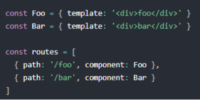

- createMathcer 首先执行的逻辑是 const { pathList, pathMap, nameMap } = createRouteMap(routes) 创建一个路由映射表，createRouteMap 的定义在 src/create-route-map 中：

-  

- createRouteMap 函数的目标是把用户的路由配置转换成一张路由映射表，它包含 3 个部分

- pathList 存储所有的 path

- pathMap 表示一个 path 到 RouteRecord 的映射关系

- nameMap 表示 name 到 RouteRecord 的映射关系

- 那么 RouteRecord 到底是什么，先来看一下它的数据结构：

-  

- 它的创建是通过遍历 routes 为每一个 route 执行 addRouteRecord 方法生成一条记录，来看一下它的定义：

-  

-  

- 我们只看几个关键逻辑，首先创建 RouteRecord 的代码如下：

-  

- 这里要注意几个点，

- path 是规范化后的路径，它会根据 parent 的 path 做计算；

- regex 是一个正则表达式的扩展，它利用了path-to-regexp 这个工具库，把 path 解析成一个正则表达式的扩展，举个例子：

-  

- components 是一个对象，通常我们在配置中写的 component 实际上这里会被转换成 {components: route.component}；

- instances 表示组件的实例，也是一个对象类型；

- parent 表示父的 RouteRecord，因为我们配置的时候有时候会配置子路由，所以整个 RouteRecord 也就是一个树型结构。

- 如果配置了 children，那么递归执行 addRouteRecord 方法，并把当前的 record 作为 parent 传入，通过这样的深度遍历，我们就可以拿到一个 route 下的完整记录。

-  

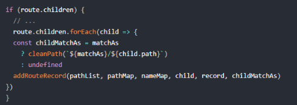

- 为 pathList 和 pathMap 各添加一条记录。

-  

- 如果我们在路由配置中配置了 name，则给 nameMap 添加一条记录。

- 由于 pathList、pathMap、nameMap 都是引用类型，所以在遍历整个 routes 过程中去执行 addRouteRecord 方法，会不断给他们添加数据。那么经过整个 createRouteMap 方法的执行，我们得到的就是 pathList、pathMap 和 nameMap。

- 其中 pathList 是为了记录路由配置中的所有 path

- 而 pathMap 和 nameMap 都是为了通过 path 和 name 能快速查到对应的 RouteRecord。

- 再回到 createMatcher 函数，接下来就定义了一系列方法，最后返回了一个对象。

-  

- 也就是说，matcher 是一个对象，它对外暴露了 match 和 addRoutes 方法

### addRoutes

- addRoutes 方法的作用是动态添加路由配置，因为在实际开发中有些场景是不能提前把路由写死的，需要根据一些条件动态添加路由，所以 Vue-Router 也提供了这一接口

-  

- addRoutes 的方法十分简单，再次调用 createRouteMap 即可，传入新的 routes 配置，由于 pathList、pathMap、nameMap 都是引用类型，执行 addRoutes 后会修改它们的值。

### match

- 代码

-  

- match 方法返回的是一个路径，它的作用是根据传入的 raw 和当前的路径 currentRoute 计算出一个新的路径并返回。match 方法接收 3 个参数

- 其中 raw 是 RawLocation 类型，它可以是一个 url 字符串，也可以是一个 Location 对象；

- currentRoute 是 Route 类型，它表示当前的路径；

- redirectedFrom 和重定向相关

- 首先执行了 normalizeLocation，它的定义在 src/util/location.js 中：

-  

- normalizeLocation 方法的作用是根据 raw，current 计算出新的 location，它主要处理了 raw 的两种情况

- 一种是有 params 且没有 path，

- 对于第一种情况，如果 current 有 name，则计算出的 location 也有 name。

- 一种是有 path 的

- 计算出新的 location 后，对 location 的 name 和 path 的两种情况做了处理。

- name

- 有 name 的情况下就根据 nameMap 匹配到 record，它就是一个 RouterRecord 对象，如果 record 不存在，则匹配失败，返回一个空路径；

- 然后拿到 record 对应的 paramNames，再对比 currentRoute 中的 params，把交集部分的 params 添加到 location 中

- 然后在通过 fillParams 方法根据 record.path 和 location.path 计算出 location.path

- 最后调用 _createRoute(record, location, redirectedFrom) 去生成一条新路径，该方法我们之后会介绍。

- path

- 通过 name 我们可以很快的找到 record，但是通过 path 并不能，因为我们计算后的 location.path 是一个真实路径

- 而 record 中的 path 可能会有 param，因此需要对所有的 pathList 做顺序遍历

- 然后通过 matchRoute 方法根据 record.regex、location.path、location.params 匹配

- 如果匹配到则也通过 _createRoute(record, location, redirectedFrom) 去生成一条新路径。

- 因为是顺序遍历，所以我们书写路由配置要注意路径的顺序，因为写在前面的会优先尝试匹配。

- 最后我们来看一下 _createRoute 的实现

-  

- 我们先不考虑 record.redirect 和 record.matchAs 的情况，最终会调用 createRoute 方法，它的定义在 src/uitl/route.js 中：

-  

- createRoute 可以根据 record 和 location 创建出来，最终返回的是一条 Route 路径

- 在 Vue-Router 中，所有的 Route 最终都会通过 createRoute 函数创建，并且它最后是不可以被外部修改的。

- Route 对象中有一个非常重要属性是 matched，它通过 formatMatch(record) 计算而来：

-  

- 可以看它是通过 record 循环向上找 parent，直到找到最外层，并把所有的 record 都 push 到一个数组中，最终返回的就是 record 的数组，它记录了一条线路上的所有 record。matched 属性非常有用，它为之后渲染组件提供了依据。

### 总结

- 那么到此，matcher 相关的主流程的分析就结束了，我们了解了 Location、Route、RouteRecord 等概念。并通过 matcher 的 match 方法，我们会找到匹配的路径 Route，这个对 Route 的切换，组件的渲染都有非常重要的指导意义。下一节我们会回到 transitionTo 方法，看一看路径的切换都做了哪些事情。

## 路径切换

### 路径切换

- history.transitionTo 是 Vue-Router 中非常重要的方法，当我们切换路由线路的时候，就会执行到该方法，

- 前一节我们分析了 matcher 的相关实现，知道它是如何找到匹配的新线路，那么匹配到新线路后又做了哪些事情，接下来我们来完整分析一下 transitionTo 的实现，它的定义在 src/history/base.js 中：

-  

- transitionTo 首先根据目标 location 和当前路径 this.current 执行 this.router.match 方法去匹配到目标的路径。这里 this.current 是 history 维护的当前路径，它的初始值是在 history 的构造函数中初始化的：

-  

- START 的定义在 src/util/route.js 中：

-  

- 这样就创建了一个初始的 Route，而 transitionTo 实际上也就是在切换 this.current

- 拿到新的路径后，那么接下来就会执行 confirmTransition 方法去做真正的切换，由于这个过程可能有一些异步的操作（如异步组件），所以整个 confirmTransition API 设计成带有成功回调函数和失败回调函数，先来看一下它的定义：

-  

-  

- 首先定义了 abort 函数，然后判断如果满足计算后的 route 和 current 是相同路径的话，则直接调用 this.ensureUrl 和 abort

- 接着又根据 current.matched 和 route.matched 执行了 resolveQueue 方法解析出 3 个队列：

-  

- 因为 route.matched 是一个 RouteRecord 的数组，由于路径是由 current 变向 route，那么就遍历对比 2 边的 RouteRecord，找到一个不一样的位置 i

- 那么 next 中从 0 到 i 的 RouteRecord 是两边都一样，则为 updated 的部分；

- 从 i 到最后的 RouteRecord 是 next 独有的，为 activated 的部分；

- 而 current 中从 i 到最后的 RouteRecord 则没有了，为 deactivated 的部分。

- 拿到 updated、activated、deactivated 3 个 ReouteRecord 数组后，接下来就是路径变换后的一个重要部分，执行一系列的钩子函数。

### 导航守卫

- 官方的说法叫导航守卫，实际上就是发生在路由路径切换的时候，执行的一系列钩子函数。

- 我们先从整体上看一下这些钩子函数执行的逻辑

- 首先构造一个队列 queue，它实际上是一个数组；

- 然后再定义一个迭代器函数 iterator；

- 最后再执行 runQueue 方法来执行这个队列。

- 我们先来看一下 runQueue 的定义，在 src/util/async.js 中：

-  

- 这是一个非常经典的异步函数队列化执行的模式

- queue 是一个 NavigationGuard 类型的数组，我们定义了 step 函数，每次根据 index 从 queue 中取一个 guard，然后执行 fn 函数，并且把 guard 作为参数传入，第二个参数是一个函数，当这个函数执行的时候再递归执行 step 函数，前进到下一个，注意这里的 fn 就是我们刚才的 iterator 函数，那么我们再回到 iterator 函数的定义：

-  

- iterator 函数逻辑很简单，它就是去执行每一个 导航守卫 hook，并传入 route、current 和匿名函数，这些参数对应文档中的 to、from、next，当执行了匿名函数，会根据一些条件执行 abort 或 next，只有执行 next 的时候，才会前进到下一个导航守卫钩子函数中，这也就是为什么官方文档会说只有执行 next 方法来 resolve 这个钩子函数。

- 那么最后我们来看 queue 是怎么构造的：

-  

- 按照顺序如下：

- 在失活的组件里调用离开守卫。

- 第一步是通过执行 extractLeaveGuards(deactivated)，先来看一下 extractLeaveGuards 的定义：

-  

- 它内部调用了 extractGuards 的通用方法，可以从 RouteRecord 数组中提取各个阶段的守卫：

-  

- 这里用到了 flatMapComponents 方法去从 records 中获取所有的导航，它的定义在 src/util/resolve-components.js 中：

-  

- flatMapComponents 的作用就是返回一个数组，数组的元素是从 matched 里获取到所有组件的 key，然后返回 fn 函数执行的结果，flatten 作用是把二维数组拍平成一维数组。

- 那么对于 extractGuards 中 flatMapComponents 的调用，执行每个 fn 的时候，通过 extractGuard(def, name) 获取到组件中对应 name 的导航守卫：

-  

- 获取到 guard 后，还会调用 bind 方法把组件的实例 instance 作为函数执行的上下文绑定到 guard 上，bind 方法的对应的是 bindGuard：

-  

- 那么对于 extractLeaveGuards(deactivated) 而言，获取到的就是所有失活组件中定义的 beforeRouteLeave 钩子函数。

- 调用全局的 beforeEach 守卫。

- 第二步是 this.router.beforeHooks，在我们的 VueRouter 类中定义了 beforeEach 方法，在 src/index.js 中：

-  

- 当用户使用 router.beforeEach 注册了一个全局守卫，就会往 router.beforeHooks 添加一个钩子函数，这样 this.router.beforeHooks 获取的就是用户注册的全局 beforeEach 守卫。

- 在重用的组件里调用 beforeRouteUpdate 守卫

- 第三步执行了 extractUpdateHooks(updated)，来看一下 extractUpdateHooks 的定义：

-  

- 和 extractLeaveGuards(deactivated) 类似，extractUpdateHooks(updated) 获取到的就是所有重用的组件中定义的 beforeRouteUpdate 钩子函数。

- 在激活的路由配置里调用 beforeEnter。

- 第四步是执行 activated.map(m => m.beforeEnter)，获取的是在激活的路由配置中定义的 beforeEnter 函数。

- 解析异步路由组件。

- 第五步是执行 resolveAsyncComponents(activated) 解析异步组件，先来看一下 resolveAsyncComponents 的定义，在 src/util/resolve-components.js 中：

-  

- resolveAsyncComponents 返回的是一个导航守卫函数，有标准的 to、from、next 参数。它的内部实现很简单，利用了 flatMapComponents 方法从 matched 中获取到每个组件的定义，判断如果是异步组件，则执行异步组件加载逻辑，这块和我们之前分析 Vue 加载异步组件很类似，加载成功后会执行 match.components[key] = resolvedDef 把解析好的异步组件放到对应的 components 上，并且执行 next 函数。

- 这样在 resolveAsyncComponents(activated) 解析完所有激活的异步组件后，我们就可以拿到这一次所有激活的组件。这样我们在做完这 5 步后又做了一些事情：

-  

- 在被激活的组件里调用 beforeRouteEnter。

- extractEnterGuards 函数的实现也是利用了 extractGuards 方法提取组件中的 beforeRouteEnter 导航钩子函数，和之前不同的是 bind 方法的不同。

-  

- 文档中特意强调了 beforeRouteEnter 钩子函数中是拿不到组件实例的，因为当守卫执行前，组件实例还没被创建

- 但是我们可以通过传一个回调给 next 来访问组件实例。在导航被确认的时候执行回调，并且把组件实例作为回调方法的参数：

-  

- 来看一下这是怎么实现的。

- 在 bindEnterGuard 函数中，返回的是 routeEnterGuard 函数，所以在执行 iterator 中的 hook 函数的时候，就相当于执行 routeEnterGuard 函数，那么就会执行我们定义的导航守卫 guard 函数，并且当这个回调函数执行的时候，首先执行 next 函数 rersolve 当前导航钩子，然后把回调函数的参数，它也是一个回调函数用 cbs 收集起来，其实就是收集到外面定义的 postEnterCbs 中，然后在最后会执行：

-  

- 在根路由组件重新渲染后，遍历 postEnterCbs 执行回调，每一个回调执行的时候，其实是执行 poll(cb, match.instances, key, isValid) 方法，因为考虑到一些了路由组件被套 transition 組件在一些缓动模式下不一定能拿到实例，所以用一个轮询方法不断去判断，直到能获取到组件实例，再去调用 cb，并把组件实例作为参数传入，这就是我们在回调函数中能拿到组件实例的原因。

- 调用全局的 beforeResolve 守卫。

- 第七步是获取 this.router.resolveHooks，这个和 this.router.beforeHooks 的获取类似，在我们的 VueRouter 类中定义了 beforeResolve 方法：

-  

- 当用户使用 router.beforeResolve 注册了一个全局守卫，就会往 router.resolveHooks 添加一个钩子函数，这样 this.router.resolveHooks 获取的就是用户注册的全局 beforeResolve 守卫。

- 调用全局的 afterEach 钩子。

- 第八步是在最后执行了 onComplete(route) 后，会执行 this.updateRoute(route) 方法：

-  

- 同样在我们的 VueRouter 类中定义了 afterEach 方法：

-  

- 当用户使用 router.afterEach 注册了一个全局守卫，就会往 router.afterHooks 添加一个钩子函数，这样 this.router.afterHooks 获取的就是用户注册的全局 afterHooks 守卫。

- 我们知道路由切换除了执行这些钩子函数，从表象上有 2 个地方会发生变化，一个是 url 发生变化，一个是组件发生变化。接下来我们分别介绍这两块的实现原理。

### url

- 当我们点击 router-link 的时候，实际上最终会执行 router.push，如下：

-  

- this.history.push 函数，这个函数是子类实现的，不同模式下该函数的实现略有不同，我们来看一下平时使用比较多的 hash 模式该函数的实现，在 src/history/hash.js 中：

-  

- push 函数会先执行 this.transitionTo 做路径切换，在切换完成的回调函数中，执行 pushHash 函数：

-  

- supportsPushState 的定义在 src/util/push-state.js 中：

-  

- 如果支持的话，则获取当前完整的 url，执行 pushState 方法：

-  

- pushState 会调用浏览器原生的 history 的 pushState 接口或者 replaceState 接口，更新浏览器的 url 地址，并把当前 url 压入历史栈中。

- 然后在 history 的初始化中，会设置一个监听器，监听历史栈的变化：

-  

- 当点击浏览器返回按钮的时候，如果已经有 url 被压入历史栈，则会触发 popstate 事件，然后拿到当前要跳转的 hash，执行 transtionTo 方法做一次路径转换。

- 同学们在使用 Vue-Router 开发项目的时候，打开调试页面 http://localhost:8080 后会自动把 url 修改为 http://localhost:8080/#/，这是怎么做到呢？原来在实例化 HashHistory 的时候，构造函数会执行 ensureSlash() 方法：

-  

- 这个时候 path 为空，所以执行 replaceHash('/' + path)，然后内部会执行一次 getUrl，计算出来的新的 url 为 http://localhost:8080/#/，最终会执行 pushState(url, true)，这就是 url 会改变的原因

### 组件

- router-view

- 路由最终的渲染离不开组件，Vue-Router 内置了 `<router-view>` 组件，它的定义在 src/components/view.js 中。

-  

-  

- `<router-view>` 是一个 functional 组件，它的渲染也是依赖 render 函数，那么 `<router-view>` 具体应该渲染什么组件呢，首先获取当前的路径：

-  

- 我们之前分析过，在 src/install.js 中，我们给 Vue 的原型上定义了 $route：

-  

- 然后在 VueRouter 的实例执行 router.init 方法的时候，会执行如下逻辑，定义在 src/index.js 中：

-  

- 而 history.listen 方法定义在 src/history/base.js 中：

-  

- 然后在 updateRoute 的时候执行 this.cb：

-  

- 也就是我们执行 transitionTo 方法最后执行 updateRoute 的时候会执行回调，然后会更新 this.apps 保存的组件实例的 _route 值，

- this.apps 数组保存的实例的特点都是在初始化的时候传入了 router 配置项，一般的场景数组只会保存根 Vue 实例，因为我们是在 new Vue 传入了 router 实例。

- $route 是定义在 Vue.prototype 上。每个组件实例访问 $route 属性，就是访问根实例的 _route，也就是当前的路由线路。

- `<router-view>` 是支持嵌套的，回到 render 函数，其中定义了 depth 的概念，它表示 `<router-view>` 嵌套的深度。每个 `<router-view>` 在渲染的时候，执行如下逻辑：

-  

- parent._routerRoot 表示的是根 Vue 实例，那么这个循环就是从当前的 `<router-view>` 的父节点向上找，一直找到根 Vue 实例，在这个过程，如果碰到了父节点也是 `<router-view>` 的时候，说明 `<router-view>` 有嵌套的情况，depth++。遍历完成后，根据当前线路匹配的路径和 depth 找到对应的 RouteRecord，进而找到该渲染的组件。

- 除了找到了应该渲染的组件，还定义了一个注册路由实例的方法：

-  

- 给 vnode 的 data 定义了 registerRouteInstance 方法，在 src/install.js 中，我们会调用该方法去注册路由的实例：

-  

- 在混入的 beforeCreate 钩子函数中，会执行 registerInstance 方法，进而执行 render 函数中定义的 registerRouteInstance 方法，从而给 matched.instances[name] 赋值当前组件的 vm 实例。

- render 函数的最后根据 component 渲染出对应的组件 vonde：

-  

- 那么当我们执行 transitionTo 来更改路由线路后，组件是如何重新渲染的呢？在我们混入的 beforeCreate 钩子函数中有这么一段逻辑：

-  

- 由于我们把根 Vue 实例的 _route 属性定义成响应式的，我们在每个 `<router-view>` 执行 render 函数的时候，都会访问 parent.$route，如我们之前分析会访问 this._routerRoot._route，触发了它的 getter，相当于 `<router-view>` 对它有依赖，然后再执行完 transitionTo 后，修改 app._route 的时候，又触发了setter，因此会通知 `<router-view>` 的渲染 watcher 更新，重新渲染组件。

- router-link

- Vue-Router 还内置了另一个组件 `<router-link>`， 它支持用户在具有路由功能的应用中（点击）导航。 通过 to 属性指定目标地址，默认渲染成带有正确链接的 `<a>` 标签，可以通过配置 tag 属性生成别的标签。另外，当目标路由成功激活时，链接元素自动设置一个表示激活的 CSS 类名。

- `<router-link>` 比起写死的 `<a href="...">` 会好一些，理由如下：

- 无论是 HTML5 history 模式还是 hash 模式，它的表现行为一致，所以，当你要切换路由模式，或者在 IE9 降级使用 hash 模式，无须作任何变动。

- 在 HTML5 history 模式下，router-link 会守卫点击事件，让浏览器不再重新加载页面。

- 当你在 HTML5 history 模式下使用 base 选项之后，所有的 to 属性都不需要写（基路径）了。

- 那么接下来我们就来分析它的实现，它的定义在 src/components/link.js 中：

-  

-  

- `<router-link>` 标签的渲染也是基于 render 函数，它首先做了路由解析：

-  

- router.resolve 是 VueRouter 的实例方法，它的定义在 src/index.js 中：

-  

- 它先规范生成目标 location，再根据 location 和 match 通过 this.match 方法计算生成目标路径 route，然后再根据 base、fullPath 和 this.mode 通过 createHref 方法计算出最终跳转的 href。

- 解析完 router 获得目标 location、route、href 后，接下来对 exactActiveClass 和 activeClass 做处理，当配置 exact 为 true 的时候，只有当目标路径和当前路径完全匹配的时候，会添加 exactActiveClass；而当目标路径包含当前路径的时候，会添加 activeClass。

- 接着创建了一个守卫函数 ：

-  

- 最终会监听点击事件或者其它可以通过 prop 传入的事件类型，执行 hanlder 函数，最终执行 router.push 或者 router.replace 函数，它们的定义在 src/index.js 中：

-  

- 实际上就是执行了 history 的 push 和 replace 方法做路由跳转。

- 最后判断当前 tag 是否是 `<a>` 标签，`<router-link>` 默认会渲染成 `<a>` 标签，当然我们也可以修改 tag 的 prop 渲染成其他节点，这种情况下会尝试找它子元素的 `<a>` 标签，如果有则把事件绑定到 `<a>` 标签上并添加 href 属性，否则绑定到外层元素本身。

### 总结

- 路由始终会维护当前的线路，路由切换的时候会把当前线路切换到目标线路，切换过程中会执行一系列的导航守卫钩子函数，会更改 url，同样也会渲染对应的组件，切换完毕后会把目标线路更新替换当前线路，这样就会作为下一次的路径切换的依据。

# **第八章：Vuex**

## 介绍

### 分析了 Vuex 的实现原理，深入分析了它的初始化过程，常用 API 以及插件部分的实现

## Introduction

### 什么是“状态管理模式”

- Vuex 是一个专为 Vue.js 应用程序开发的状态管理模式。它采用集中式存储管理应用的所有组件的状态，并以相应的规则保证状态以一种可预测的方式发生变化。

- 让我们从一个简单的 Vue 计数应用开始：

-  

- 这个状态自管理应用包含以下几个部分：

- state，驱动应用的数据源；

- view，以声明方式将 state 映射到视图；

- actions，响应在 view 上的用户输入导致的状态变化

- 以下是一个表示“单向数据流”理念的极简示意：

-  

- 但是，当我们的应用遇到多个组件共享状态时，单向数据流的简洁性很容易被破坏：

- 多个视图依赖于同一状态。

- 对于问题一，传参的方法对于多层嵌套的组件将会非常繁琐，并且对于兄弟组件间的状态传递无能为力。

- 来自不同视图的行为需要变更同一状态。

- 对于问题二，我们经常会采用父子组件直接引用或者通过事件来变更和同步状态的多份拷贝。以上的这些模式非常脆弱，通常会导致无法维护的代码。

- 因此，我们为什么不把组件的共享状态抽取出来，以一个全局单例模式管理呢？在这种模式下，我们的组件树构成了一个巨大的“视图”，不管在树的哪个位置，任何组件都能获取状态或者触发行为。

### Vuex核心思想

- Vuex 应用的核心就是 store（仓库）。“store”基本上就是一个容器，它包含着你的应用中大部分的状态 (state)。有些同学可能会问，那我定义一个全局对象，再去上层封装了一些数据存取的接口不也可以么？

- Vuex 和单纯的全局对象有以下两点不同：

- Vuex 的状态存储是响应式的。当 Vue 组件从 store 中读取状态的时候，若 store 中的状态发生变化，那么相应的组件也会相应地得到高效更新。

- 你不能直接改变 store 中的状态。改变 store 中的状态的唯一途径就是显式地提交 (commit) mutation。这样使得我们可以方便地跟踪每一个状态的变化，从而让我们能够实现一些工具帮助我们更好地了解我们的应用。

- 另外，通过定义和隔离状态管理中的各种概念并强制遵守一定的规则，我们的代码将会变得更结构化且易维护。

### 总结

-

## Vuex初始化

### 安装

- 当我们在代码中通过 import Vuex from 'vuex' 的时候，实际上引用的是一个对象，它的定义在 src/index.js 中：

-  

- 和 Vue-Router 一样，Vuex 也同样存在一个静态的 install 方法，它的定义在 src/store.js 中：

-  

- install 的逻辑很简单，把传入的 _Vue 赋值给 Vue 并执行了 applyMixin(Vue) 方法，它的定义在 src/mixin.js 中：

-  

- applyMixin 就是这个 export default function，它还兼容了 Vue 1.0 的版本，这里我们只关注 Vue 2.0 以上版本的逻辑，它其实就全局混入了一个 beforeCreate 钩子函数，

- 它的实现非常简单，就是把 options.store 保存在所有组件的 this.$store 中，这个 options.store 就是我们在实例化 Store 对象的实例，稍后我们会介绍，这也是为什么我们在组件中可以通过 this.$store 访问到这个实例

### Store实例化

- 我们在 import Vuex 之后，会实例化其中的 Store 对象，返回 store 实例并传入 new Vue 的 options 中，也就是我们刚才提到的 options.store

- 举个简单的例子，如下：

-  

- Store 对象的构造函数接收一个对象参数，它包含 actions、getters、state、mutations、modules 等 Vuex 的核心概念，它的定义在 src/store.js 中：

-  

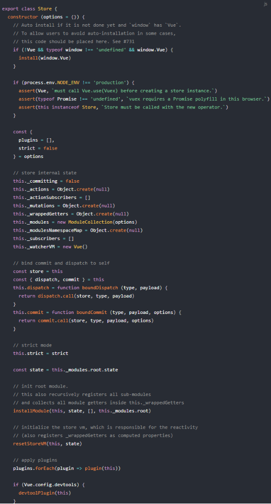

- 我们把 Store 的实例化过程拆成 3 个部分，分别是初始化模块，安装模块和初始化 store._vm，接下来我们来分析这 3 部分的实现。

- 初始化模块

- 在分析模块初始化之前，我们先来了解一下模块对于 Vuex 的意义：

- 由于使用单一状态树，应用的所有状态会集中到一个比较大的对象，当应用变得非常复杂时，store 对象就有可能变得相当臃肿。

- 为了解决以上问题，Vuex 允许我们将 store 分割成模块（module）。每个模块拥有自己的 state、mutation、action、getter，甚至是嵌套子模块——从上至下进行同样方式的分割：

-  

- 所以从数据结构上来看，模块的设计就是一个树型结构，store 本身可以理解为一个 root module，它下面的 modules 就是子模块，Vuex 需要完成这颗树的构建，构建过程的入口就是：

-  

- ModuleCollection 的定义在 src/module/module-collection.js 中：

-  

- ModuleCollection 实例化的过程就是执行了 register 方法， register 接收 3 个参数

- 其中 path 表示路径，因为我们整体目标是要构建一颗模块树，path 是在构建树的过程中维护的路径；

- rawModule 表示定义模块的原始配置；

- runtime 表示是否是一个运行时创建的模块。

- register 方法首先通过 const newModule = new Module(rawModule, runtime) 创建了一个 Module 的实例，Module 是用来描述单个模块的类，它的定义在 src/module/module.js 中：

-  

- 来看一下 Module 的构造函数，对于每个模块而言，this._rawModule 表示模块的配置，this._children 表示它的所有子模块，this.state 表示这个模块定义的 state。

- 回到 register，那么在实例化一个 Module 后，判断当前的 path 的长度如果为 0，则说明它是一个根模块，所以把 newModule 赋值给了 this.root，否则就需要建立父子关系了：

-  

- 我们先大体上了解它的逻辑：首先根据路径获取到父模块，然后再调用父模块的 addChild 方法建立父子关系。

- register 的最后一步，就是遍历当前模块定义中的所有 modules，根据 key 作为 path，递归调用 register 方法，这样我们再回过头看一下建立父子关系的逻辑，首先执行了 this.get(path.slice(0, -1) 方法：

-  

- 传入的 path 是它的父模块的 path，然后从根模块开始，通过 reduce 方法一层层去找到对应的模块，查找的过程中，执行的是 module.getChild(key) 方法：

-  

- 其实就是返回当前模块的 _children 中对应 key 的模块，那么每个模块的 _children 是如何添加的呢，是通过执行 parent.addChild(path[path.length - 1], newModule) 方法：

-  

- 所以说对于 root module 的下一层 modules 来说，它们的 parent 就是 root module，那么他们就会被添加的 root module 的 _children 中。每个子模块通过路径找到它的父模块，然后通过父模块的 addChild 方法建立父子关系，递归执行这样的过程，最终就建立一颗完整的模块树。

- 安装模块

- 初始化模块后，执行安装模块的相关逻辑，它的目标就是对模块中的 state、getters、mutations、actions 做初始化工作，它的入口代码是：

-  

- 来看一下 installModule 的定义：

-  

- installModule 方法支持 5 个参数

- store 表示 root store；

- state 表示 root state；

- path 表示模块的访问路径；

- module 表示当前的模块

- hot 表示是否是热更新。

- 接下来看函数逻辑，这里涉及到了命名空间的概念，默认情况下，模块内部的 action、mutation 和 getter 是注册在全局命名空间的——这样使得多个模块能够对同一 mutation 或 action 作出响应。

- 如果我们希望模块具有更高的封装度和复用性，可以通过添加 namespaced: true 的方式使其成为带命名空间的模块。当模块被注册后，它的所有 getter、action 及 mutation 都会自动根据模块注册的路径调整命名。例如：

-  

- 回到 installModule 方法，我们首先根据 path 获取 namespace：

-  

- getNamespace 的定义在 src/module/module-collection.js 中：

-  

- 从 root module 开始，通过 reduce 方法一层层找子模块，如果发现该模块配置了 namespaced 为 true，则把该模块的 key 拼到 namesapce 中，最终返回完整的 namespace 字符串

- 回到 installModule 方法，接下来把 namespace 对应的模块保存下来，为了方便以后能根据 namespace 查找模块：

-  

- 接下来判断非 root module 且非 hot 的情况执行一些逻辑，我们稍后再看。

- 接着是很重要的逻辑，构造了一个本地上下文环境：

-  

- 来看一下 makeLocalContext 实现：

•

- makeLocalContext 支持 3 个参数相关

- store 表示 root store；

- namespace 表示模块的命名空间

- path 表示模块的 path。

- 该方法定义了 local 对象，对于 dispatch 和 commit 方法

- 如果没有 namespace，它们就直接指向了 root store 的 dispatch 和 commit 方法

- 否则会创建方法，把 type 自动拼接上 namespace，然后执行 store 上对应的方法。

- 对于 getters 而言，如果没有 namespace，则直接返回 root store 的 getters，否则返回 makeLocalGetters(store, namespace) 的返回值：

-  

- makeLocalGetters 首先获取了 namespace 的长度，然后遍历 root store 下的所有 getters，先判断它的类型是否匹配 namespace，只有匹配的时候我们从 namespace 的位置截取后面的字符串得到 localType，接着用 Object.defineProperty 定义了 gettersProxy，获取 localType 实际上是访问了 store.getters[type]

- 回到 makeLocalContext 方法，再来看一下对 state 的实现，它的获取则是通过 getNestedState(store.state, path) 方法：

-  

- getNestedState 逻辑很简单，从 root state 开始，通过 path.reduce 方法一层层查找子模块 state，最终找到目标模块的 state。

- 那么构造完 local 上下文后，我们再回到 installModule 方法，接下来它就会遍历模块中定义的 mutations、actions、getters，分别执行它们的注册工作，它们的注册逻辑都大同小异。

- registerMutation

- 首先遍历模块中的 mutations 的定义，拿到每一个 mutation 和 key，并把 key 拼接上 namespace，然后执行 registerMutation 方法。该方法实际上就是给 root store 上的 _mutations[types] 添加 wrappedMutationHandler 方法，该方法的具体实现我们之后会提到。注意，同一 type 的 _mutations 可以对应多个方法。

-  

- registerAction

- 首先遍历模块中的 actions 的定义，拿到每一个 action 和 key，并判断 action.root，如果否的情况把 key 拼接上 namespace，然后执行 registerAction 方法。该方法实际上就是给 root store 上的 _actions[types] 添加 wrappedActionHandler 方法，该方法的具体实现我们之后会提到。注意，同一 type 的 _actions 可以对应多个方法。

-  

- registerGetter

- 首先遍历模块中的 getters 的定义，拿到每一个 getter 和 key，并把 key 拼接上 namespace，然后执行 registerGetter 方法。该方法实际上就是给 root store 上的 _wrappedGetters[key] 指定 wrappedGetter 方法，该方法的具体实现我们之后会提到。注意，同一 type 的 _wrappedGetters 只能定义一个。

-  

- 再回到 installModule 方法，最后一步就是遍历模块中的所有子 modules，递归执行 installModule 方法：

-  

- 之前我们忽略了非 root module 下的 state 初始化逻辑，现在来看一下：

-  

- 之前我们提到过 getNestedState 方法，它是从 root state 开始，一层层根据模块名能访问到对应 path 的 state，那么它每一层关系的建立实际上就是通过这段 state 的初始化逻辑。store._withCommit 方法我们之后再介绍。

- 所以 installModule 实际上就是完成了模块下的 state、getters、actions、mutations 的初始化工作，并且通过递归遍历的方式，就完成了所有子模块的安装工作。

- 初始化 store._vm

- Store 实例化的最后一步，就是执行初始化 store._vm 的逻辑，它的入口代码是：

•

- 来看一下 resetStoreVM 的定义：

-  

- resetStoreVM 的作用实际上是想建立 getters 和 state 的联系，因为从设计上 getters 的获取就依赖了 state ，并且希望它的依赖能被缓存起来，且只有当它的依赖值发生了改变才会被重新计算。因此这里利用了 Vue 中用 computed 计算属性来实现。

- resetStoreVM 首先遍历了 _wrappedGetters 获得每个 getter 的函数 fn 和 key，然后定义了 computed[key] = () => fn(store)。我们之前提到过 _wrappedGetters 的初始化过程，这里 fn(store) 相当于执行如下方法：

-  

- 返回的就是 rawGetter 的执行函数，rawGetter 就是用户定义的 getter 函数，它的前 2 个参数是 local state 和 local getters，后 2 个参数是 root state 和 root getters。

- 接着实例化一个 Vue 实例 store._vm，并把 computed 传入：

-  

- 我们发现 data 选项里定义了 $$state 属性，而我们访问 store.state 的时候，实际上会访问 Store 类上定义的 state 的 get 方法：

-  

- 它实际上就访问了 store._vm._data.$$state。那么 getters 和 state 是如何建立依赖逻辑的呢，我们再看这段代码逻辑：

-  

- 当我根据 key 访问 store.getters 的某一个 getter 的时候，实际上就是访问了 store._vm[key]，也就是 computed[key]，在执行 computed[key] 对应的函数的时候，会执行 rawGetter(local.state,...) 方法，那么就会访问到 store.state，进而访问到 store._vm._data.$$state，这样就建立了一个依赖关系。当 store.state 发生变化的时候，下一次再访问 store.getters 的时候会重新计算。

- 我们再来看一下 strict mode 的逻辑：

-  

- 当严格模式下，store._vm 会添加一个 wathcer 来观测 this._data.$$state 的变化，也就是当 store.state 被修改的时候, store._committing 必须为 true，否则在开发阶段会报警告。store._committing 默认值是 false，那么它什么时候会 true 呢，Store 定义了 _withCommit 实例方法：

-  

- 它就是对 fn 包装了一个环境，确保在 fn 中执行任何逻辑的时候 this._committing = true。所以外部任何非通过 Vuex 提供的接口直接操作修改 state 的行为都会在开发阶段触发警告。

### 总结

- 那么至此，Vuex 的初始化过程就分析完毕了，除了安装部分，我们重点分析了 Store 的实例化过程。

- 我们要把 store 想象成一个数据仓库，为了更方便的管理仓库，我们把一个大的 store 拆成一些 modules，整个 modules 是一个树型结构。

- 每个 module 又分别定义了 state，getters，mutations、actions，我们也通过递归遍历模块的方式都完成了它们的初始化。

- 为了 module 具有更高的封装度和复用性，还定义了 namespace 的概念。

- 最后我们还定义了一个内部的 Vue 实例，用来建立 state 到 getters 的联系

- 并且可以在严格模式下监测 state 的变化是不是来自外部，确保改变 state 的唯一途径就是显式地提交 mutation。

## API

### 数据获取

- Vuex 最终存储的数据是在 state 上的，我们之前分析过在 store.state 存储的是 root state，那么对于模块上的 state，假设我们有 2 个嵌套的 modules，它们的 key 分别为 a 和 b，我们可以通过 store.state.a.b.xxx 的方式去获取。它的实现是在发生在 installModule 的时候：

-  

- 在递归执行 installModule 的过程中，就完成了整个 state 的建设，这样我们就可以通过 module 名的 path 去访问到一个深层 module 的 state。

- 有些时候，我们获取的数据不仅仅是一个 state，而是由多个 state 计算而来，Vuex 提供了 getters，允许我们定义一个 getter 函数，如下：

-  

- 我们在 installModule 的过程中，递归执行了所有 getters 定义的注册，在之后的 resetStoreVM 过程中，执行了 store.getters 的初始化工作：

-  

- 在 installModule 的过程中，为建立了每个模块的上下文环境， 因此当我们访问 store.getters.xxx 的时候，实际上就是执行了 rawGetter(local.state,...)，rawGetter 就是我们定义的 getter 方法，这也就是为什么我们的 getter 函数支持这四个参数，并且除了全局的 state 和 getter 外，我们还可以访问到当前 module 下的 state 和 getter

### 数据存储

- Vuex 对数据存储的存储本质上就是对 state 做修改，并且只允许我们通过提交 mutaion 的形式去修改 state，mutation 是一个函数，如下：

-  

- mutations 的初始化也是在 installModule 的时候：

-  

- store 提供了commit 方法让我们提交一个 mutation：

-  

- 这里传入的 _type 就是 mutation 的 type，我们可以从 store._mutations 找到对应的函数数组，遍历它们执行获取到每个 handler 然后执行，实际上就是执行了 wrappedMutationHandler(playload)，接着会执行我们定义的 mutation 函数，并传入当前模块的 state，所以我们的 mutation 函数也就是对当前模块的 state 做修改。

- 需要注意的是， mutation 必须是同步函数，但是我们在开发实际项目中，经常会遇到要先去发送一个请求，然后根据请求的结果去修改 state，那么单纯只通过 mutation 是无法完成需求，因此 Vuex 又给我们设计了一个 action 的概念。

- action 类似于 mutation，不同在于 action 提交的是 mutation，而不是直接操作 state，并且它可以包含任意异步操作。例如：

-  

- actions 的初始化也是在 installModule 的时候：

-  

- store 提供了dispatch 方法让我们提交一个 action：

-  

- 这里传入的 _type 就是 action 的 type，我们可以从 store._actions 找到对应的函数数组，遍历它们执行获取到每个 handler 然后执行，实际上就是执行了 wrappedActionHandler(payload)，接着会执行我们定义的 action 函数，并传入一个对象，包含了当前模块下的 dispatch、commit、getters、state，以及全局的 rootState 和 rootGetters，所以我们定义的 action 函数能拿到当前模块下的 commit 方法。

- 因此 action 比我们自己写一个函数执行异步操作然后提交 muataion 的好处是在于它可以在参数中获取到当前模块的一些方法和状态，Vuex 帮我们做好了这些。

### 语法糖

- 我们知道 store 是 Store 对象的一个实例，它是一个原生的 Javascript 对象，我们可以在任意地方使用它们。但大部分的使用场景还是在组件中使用，那么我们之前介绍过，在 Vuex 安装阶段，它会往每一个组件实例上混入 beforeCreate 钩子函数，然后往组件实例上添加一个 $store 的实例，它指向的就是我们实例化的 store，因此我们可以在组件中访问到 store 的任何属性和方法。

- 比如我们在组件中访问 state：

-  

- 但是当一个组件需要获取多个状态时候，将这些状态都声明为计算属性会有些重复和冗余。同样这些问题也在存于 getter、mutation 和 action。

- 为了解决这个问题，Vuex 提供了一系列 mapXXX 辅助函数帮助我们实现在组件中可以很方便的注入 store 的属性和方法

- mapState

- 我们先来看一下 mapState 的用法：

-  

- 再来看一下 mapState 方法的定义，在 src/helpers.js 中：

-  

- 首先 mapState 是通过执行 normalizeNamespace 返回的函数，它接收 2 个参数，其中 namespace 表示命名空间，map 表示具体的对象，namespace 可不传，稍后我们来介绍 namespace 的作用。

- 当执行 mapState(map) 函数的时候，实际上就是执行 normalizeNamespace 包裹的函数，然后把 map 作为参数 states 传入。

- mapState 最终是要构造一个对象，每个对象的元素都是一个方法，因为这个对象是要扩展到组件的 computed 计算属性中的。函数首先执行 normalizeMap 方法，把这个 states 变成一个数组，数组的每个元素都是 {key, val} 的形式。接着再遍历这个数组，以 key 作为对象的 key，值为一个 mappedState 的函数，在这个函数的内部，获取到 $store.getters 和 $store.state，然后再判断数组的 val 如果是一个函数，执行该函数，传入 state 和 getters，否则直接访问 state[val]。

- 比起一个个手动声明计算属性，mapState 确实要方便许多，下面我们来看一下 namespace 的作用。

- 当我们想访问一个子模块的 state 的时候，我们可能需要这样访问：

-  

- 这样从写法上就很不友好，mapState 支持传入 namespace， 因此我们可以这么写：

-  

- 这样看起来就清爽许多。在 mapState 的实现中，如果有 namespace，则尝试去通过 getModuleByNamespace(this.$store, 'mapState', namespace) 对应的 module，然后把 state 和 getters 修改为 module 对应的 state 和 getters。

-  

- 我们在 Vuex 初始化执行 installModule 的过程中，初始化了这个映射表：

-  

- mapGetters

- 我们先来看一下 mapGetters 的用法：

-  

- 和 mapState 类似，mapGetters 是将 store 中的 getter 映射到局部计算属性，来看一下它的定义：

-  

- mapGetters 也同样支持 namespace，如果不写 namespace ，访问一个子 module 的属性需要写很长的 key，一旦我们使用了 namespace，就可以方便我们的书写，每个 mappedGetter 的实现实际上就是取 this.$store.getters[val]。

- mapMutations

- 我们可以在组件中使用 this.$store.commit('xxx') 提交 mutation，或者使用 mapMutations 辅助函数将组件中的 methods 映射为 store.commit 的调用。

- 我们先来看一下 mapMutations 的用法：

-  

- mapMutations 支持传入一个数组或者一个对象，目标都是组件中对应的 methods 映射为 store.commit 的调用。来看一下它的定义：

-  

- 可以看到 mappedMutation 同样支持了 namespace，并且支持了传入额外的参数 args，作为提交 mutation 的 payload，最终就是执行了 store.commit 方法，并且这个 commit 会根据传入的 namespace 映射到对应 module 的 commit 上。

- mapActions

- 我们可以在组件中使用 this.$store.dispatch('xxx') 提交 action，或者使用 mapActions 辅助函数将组件中的 methods 映射为 store.dispatch 的调用。

- mapActions 在用法上和 mapMutations 几乎一样，实现也很类似：

-  

- 和 mapMutations 的实现几乎一样，不同的是把 commit 方法换成了 dispatch。

### 动态更新模块

- 在 Vuex 初始化阶段我们构造了模块树，初始化了模块上各个部分。在有一些场景下，我们需要动态去注入一些新的模块，Vuex 提供了模块动态注册功能，在 store 上提供了一个 registerModule 的 API。

-  

- registerModule 支持传入一个 path 模块路径 和 rawModule 模块定义，首先执行 register 方法扩展我们的模块树，接着执行 installModule 去安装模块，最后执行 resetStoreVM 重新实例化 store._vm，并销毁旧的 store._vm。

- 相对的，有动态注册模块的需求就有动态卸载模块的需求，Vuex 提供了模块动态卸载功能，在 store 上提供了一个 unregisterModule 的 API。

-  

- unregisterModule 支持传入一个 path 模块路径，首先执行 unregister 方法去修剪我们的模块树：

-  

- 注意，这里只会移除我们运行时动态创建的模块。

- 接着会删除 state 在该路径下的引用，最后执行 resetStore 方法：

-  

- 该方法就是把 store 下的对应存储的 _actions、_mutations、_wrappedGetters 和 _modulesNamespaceMap 都清空，然后重新执行 installModule 安装所有模块以及 resetStoreVM 重置 store._vm。

### 总结

- 那么至此，Vuex 提供的一些常用 API 我们就分析完了，包括数据的存取、语法糖、模块的动态更新等。要理解 Vuex 提供这些 API 都是方便我们在对 store 做各种操作来完成各种能力，尤其是 mapXXX 的设计，让我们在使用 API 的时候更加方便，这也是我们今后在设计一些 JavaScript 库的时候，从 API 设计角度中应该学习的方向。

## 插件

### 插件

- Vuex 除了提供的存取能力，还提供了一种插件能力，让我们可以监控 store 的变化过程来做一些事情。

- Vuex 的 store 接受 plugins 选项，我们在实例化 Store 的时候可以传入插件，它是一个数组，然后在执行 Store 构造函数的时候，会执行这些插件：

-  

- 在我们实际项目中，我们用到的最多的就是 Vuex 内置的 Logger 插件，它能够帮我们追踪 state 变化，然后输出一些格式化日志。下面我们就来分析这个插件的实现。

### Logger插件

- Logger 插件的定义在 src/plugins/logger.js 中：

•

- 插件函数接收的参数是 store 实例，它执行了 store.subscribe 方法，先来看一下 subscribe 的定义：

-  

- subscribe 的逻辑很简单，就是往 this._subscribers 去添加一个函数，并返回一个 unsubscribe 的方法。

- 而我们在执行 store.commit 的方法的时候，会遍历 this._subscribers 执行它们对应的回调函数：

-  

- 回到我们的 Logger 函数，它相当于订阅了 mutation 的提交，它的 prevState 表示之前的 state，nextState 表示提交 mutation 后的 state，这两个 state 都需要执行 deepCopy 方法拷贝一份对象的副本，这样对他们的修改就不会影响原始 store.state。

- 接下来就构造一些格式化的消息，打印出一些时间消息 message， 之前的状态 prevState，对应的 mutation 操作 formattedMutation 以及下一个状态 nextState。

- 最后更新 prevState = nextState，为下一次提交 mutation 输出日志做准备。

### 总结

- 那么至此 Vuex 的插件分析就结束了，Vuex 从设计上支持了插件，让我们很好地从外部追踪 store 内部的变化，Logger 插件在我们的开发阶段也提供了很好地指引作用。当然我们也可以自己去实现 Vuex 的插件，来帮助我们实现一些特定的需求。

# **笔记**

##  函数柯里化

###  差异化部分只需要通过参数来区别，这里用到了一个函数柯里化的技巧，通过 createPatchFunction 把差异化参数提前固化，这样不用每次调用 patch 的时候都传递 nodeOps 和 modules 了，这种编程技巧也非常值得学习

## 合并配置

###  纵观一些库、框架的设计几乎都是类似的，自身定义了一些默认配置，同时又可以在初始化阶段传入一些定义配置，然后去 merge 默认配置，来达到定制化不同需求的目的。只不过在 Vue 的场景下，会对 merge 的过程做一些精细化控制，虽然我们在开发自己的 JSSDK 的时候并没有 Vue 这么复杂，但这个设计思想是值得我们借鉴的

## 观察者模式

### VUE所用的Watcher就是观察者模式

### 观察者模式

- 观察者模式：定义了对象之间 一对多 的依赖关系，它只有两个角色，分别是观察的目标对象 Subject 和观察者对象 Observer

- 当目标对象 Subject 的状态发生改变时，所有依赖它的观察者对象 Observer 都会得到响应

### 示例代码

-

-

### 场景

- 过年回家时可能会用到第三方抢票软件，那些软件会不停地检测是否有票，一旦检测到有剩余就立即锁定帮你购买。

- 抢票软件: Observer

- 车票: Subject

- 响应的结果: 锁定并购票

- 再比如经典的气象观测案例，气象局会追踪气压，温/湿度，卫星云图等参数，当这些参数变化时会将计算好的数据实时更新到各个网站

- 气象局: Observer

- 气象参数: Subject

- 响应的结果: 更新数据到各个网站

- Vue 的响应式依赖收集

- React 对应的状态管理库 MobX

###  特点

- 没有事件调度中心作为中介，只有两个角色，目标对象 Subject 和 Observer 都要去实现各自的方法（notify 和 update）

- 由于两个角色直接联系，所以耦合性会更强，且目标对象 Subject 更为主动，会自行对依赖进行收集和管理，所以这对那些依赖收集的场景更为适用

## 发布订阅模式

### VUE所用的事件中心（eventsMixin ）就是发布订阅模式

### 事件调度中心

- 订阅者向事件调度中心（PubSub）注册（subscribe）监听，当事件调度中心（PubSub）发布通知时（publish），订阅者的监听事件将会被触发。

### 示例代码

-

-

### 场景

- 比如： 定外卖、订牛奶、订报纸、网购、公众号订阅消息等等，这些都可以用发布订阅模式来设计。

- Vue 总线 Event Bus 中事件的注册和分发

- DOM 事件中的事件监听和回调

### 特点

- 订阅者和发布者之间本身是没有关系的，唯一把他们关联到一块的就是 事件调度中心 提供的发布和订阅事件，就好像是两个完全不相干的人一样，他们只是借助了这个事件调度中心 去完成一些事情，事件调度中心 在其中就相当于中介的影子

- 低耦合，适用于总线模块（如 EventBus ）

## 观察者模式和发布订阅模式的不同

### 发布订阅模式

-

### 观察者模式

-

### 在发布订阅模式中，发布者和订阅者不会直接联系，而是直接通过事件调度中心去通信

### 而观察者模式与发布订阅模式恰恰相反，区别在于，没有事件调度中心。观察者和观察的对象之间相互依赖，耦合在一起

### 你可以把发布订阅模式理解成解耦了的观察者模式（即观察者模式就是高度耦合的发布订阅模式）

### 观察者模式适用于内部元素关联性强、职责较单一的模块，而发布订阅更适合去做跨模块的通信

## 原型链继承

###  ue.extend 的作用就是构造一个 Vue 的子类，它使用一种非常经典的原型继承的方式把一个纯对象转换一个继承于 Vue 的构造器 Sub 并返回，然后对 Sub 这个对象本身扩展了一些属性

## 闭包

###  src/shared/util.js 中once 逻辑非常简单，传入一个函数，并返回一个新函数，它非常巧妙地利用闭包和一个标志位保证了它包装的函数只会执行一次

##  macro task 和 micro task

###  在浏览器环境中，常见的 macro task 有 setTimeout、MessageChannel、postMessage、setImmediate；常见的 micro task 有 MutationObsever 和 Promise.then

## 判断函数是原生

## VueRouter

### 异步队列执行

## JS 运行机制

###  JS 执行是单线程的，它是基于事件循环的。事件循环大致分为以下几个步骤

- （1）所有同步任务都在主线程上执行，形成一个执行栈（execution context stack）。

- （2）主线程之外，还存在一个"任务队列"（task queue）。只要异步任务有了运行结果，就在"任务队列"之中放置一个事件。

- （3）一旦"执行栈"中的所有同步任务执行完毕，系统就会读取"任务队列"，看看里面有哪些事件。那些对应的异步任务，于是结束等待状态，进入执行栈，开始执行。

- （4）主线程不断重复上面的第三步。

-

###  主线程的执行过程就是一个 tick，而所有的异步结果都是通过 “任务队列” 来调度。 消息队列中存放的是一个个的任务（task）。 规范中规定 task 分为两大类

- macro task

- 有 setTimeout、MessageChannel、postMessage、setImmediate；

- micro task

- MutationObsever 和 Promise.then。

- 关系

-  

`<!--EndFragment-->`